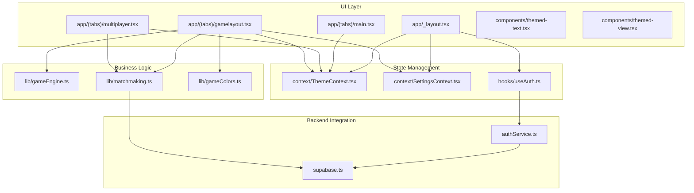
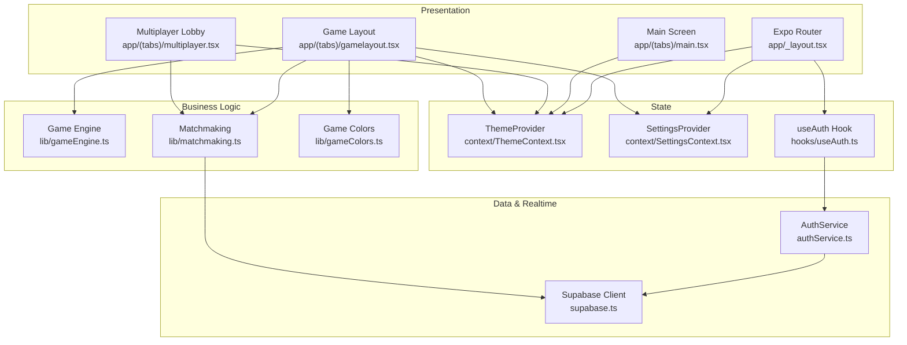
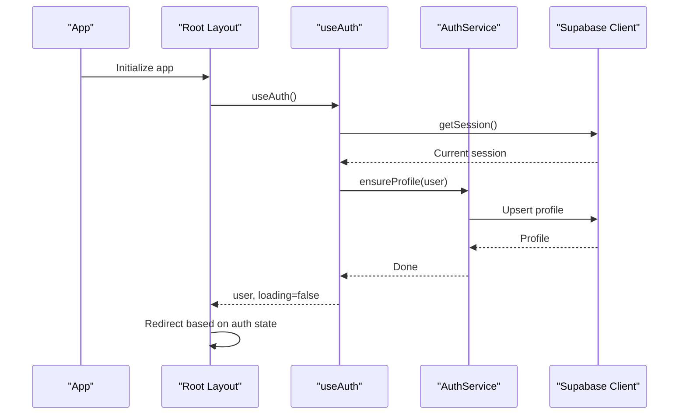
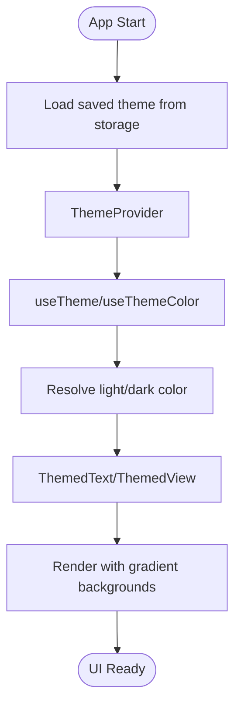
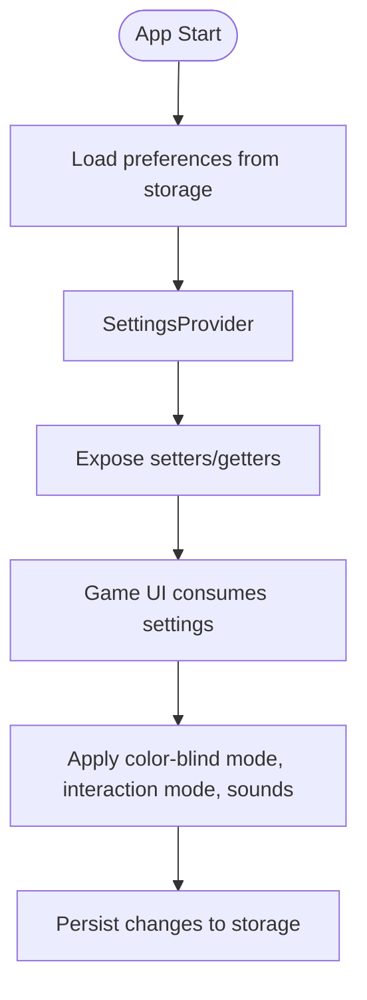
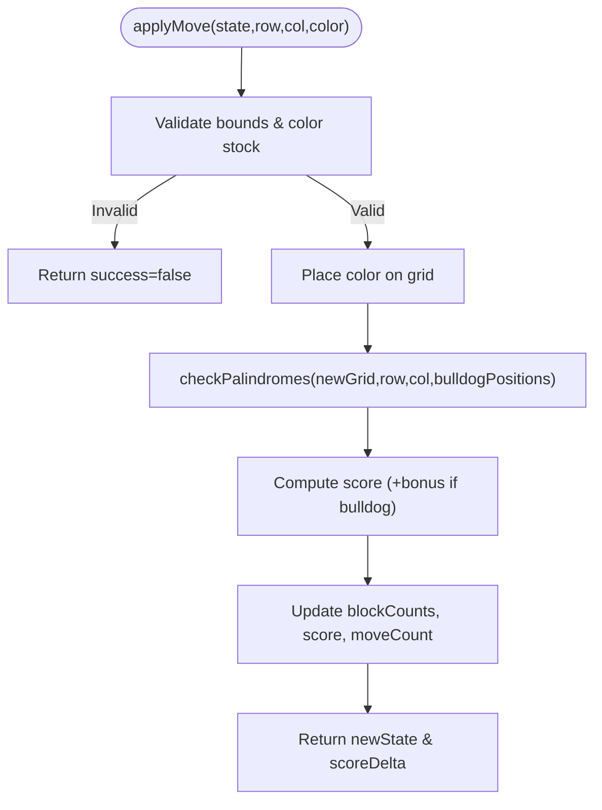
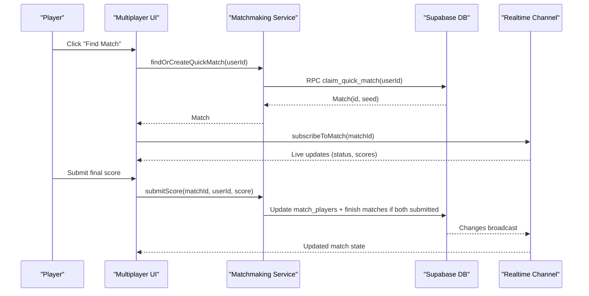
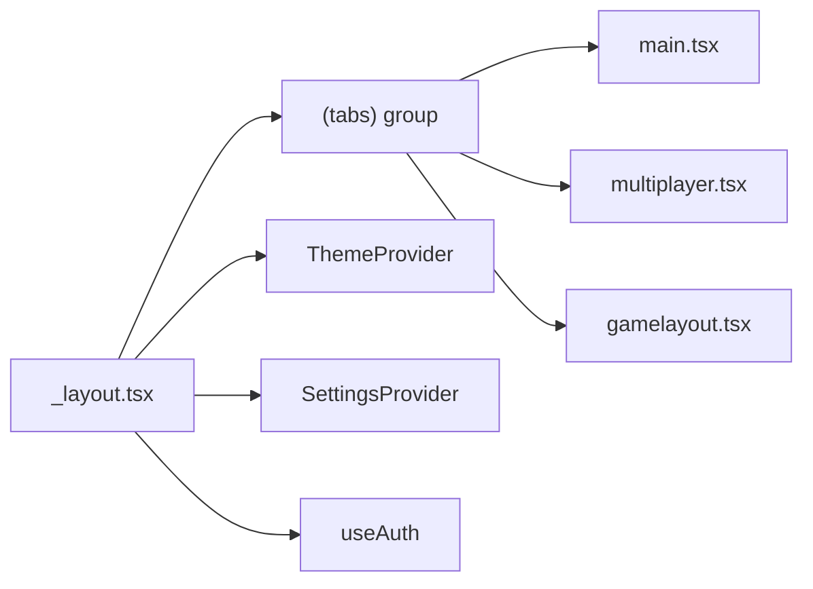
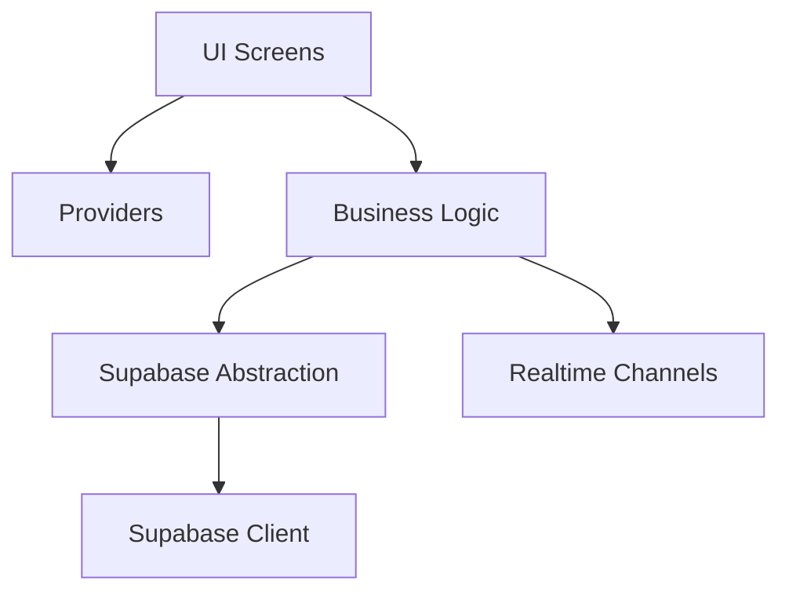

# Architecture Overview

<cite>
**Referenced Files in This Document**
- [package.json](file://package.json)
- [README.md](file://README.md)
- [app/_layout.tsx](file://app/_layout.tsx)
- [supabase.ts](file://supabase.ts)
- [authService.ts](file://authService.ts)
- [hooks/useAuth.ts](file://hooks/useAuth.ts)
- [context/ThemeContext.tsx](file://context/ThemeContext.tsx)
- [constants/theme.ts](file://constants/theme.ts)
- [hooks/use-theme-color.ts](file://hooks/use-theme-color.ts)
- [context/SettingsContext.tsx](file://context/SettingsContext.tsx)
- [lib/gameEngine.ts](file://lib/gameEngine.ts)
- [lib/matchmaking.ts](file://lib/matchmaking.ts)
- [lib/gameColors.ts](file://lib/gameColors.ts)
- [app/(tabs)/main.tsx](file://app/(tabs)/main.tsx)
- [app/(tabs)/multiplayer.tsx](file://app/(tabs)/multiplayer.tsx)
- [app/(tabs)/gamelayout.tsx](file://app/(tabs)/gamelayout.tsx)
- [components/themed-text.tsx](file://components/themed-text.tsx)
- [components/themed-view.tsx](file://components/themed-view.tsx)
</cite>

## Table of Contents
1. [Introduction](#introduction)
2. [Project Structure](#project-structure)
3. [Core Components](#core-components)
4. [Architecture Overview](#architecture-overview)
5. [Detailed Component Analysis](#detailed-component-analysis)
6. [Dependency Analysis](#dependency-analysis)
7. [Performance Considerations](#performance-considerations)
8. [Troubleshooting Guide](#troubleshooting-guide)
9. [Conclusion](#conclusion)

## Introduction
This document describes the Palindrome game system architecture. It covers the cross-platform React Native application built with Expo Router, the Supabase backend integration for authentication and real-time multiplayer, and the separation of concerns across UI, business logic, and data layers. It also documents the provider pattern for state management, theme system, authentication flow, real-time communication, and scalability/performance considerations.

## Project Structure
The project follows a file-based routing structure with feature-based organization:
- app: UI routes and layouts using Expo Router
- context: Provider-based global state (theme, settings)
- hooks: reusable React hooks (auth, theme color, sounds)
- lib: shared business logic (game engine, matchmaking)
- components: themed UI primitives
- constants: theme definitions
- supabase.ts: centralized Supabase client initialization
- authService.ts: authentication service abstraction
- screens: platform-specific splash screens
- assets/public: static assets and fonts

**Diagram sources**
- [app/_layout.tsx](file://app/_layout.tsx#L1-L126)
- [context/ThemeContext.tsx](file://context/ThemeContext.tsx#L1-L124)
- [context/SettingsContext.tsx](file://context/SettingsContext.tsx#L1-L187)
- [hooks/useAuth.ts](file://hooks/useAuth.ts#L1-L51)
- [lib/gameEngine.ts](file://lib/gameEngine.ts#L1-L284)
- [lib/matchmaking.ts](file://lib/matchmaking.ts#L1-L542)
- [lib/gameColors.ts](file://lib/gameColors.ts#L1-L93)
- [supabase.ts](file://supabase.ts#L1-L75)
- [authService.ts](file://authService.ts#L1-L560)
- [app/(tabs)/main.tsx](file://app/(tabs)/main.tsx#L1-L800)
- [app/(tabs)/multiplayer.tsx](file://app/(tabs)/multiplayer.tsx#L1-L342)
- [app/(tabs)/gamelayout.tsx](file://app/(tabs)/gamelayout.tsx#L1-L800)
- [components/themed-text.tsx](file://components/themed-text.tsx#L1-L61)
- [components/themed-view.tsx](file://components/themed-view.tsx#L1-L15)

**Section sources**
- [package.json](file://package.json#L1-L68)
- [README.md](file://README.md#L1-L59)
- [app/_layout.tsx](file://app/_layout.tsx#L1-L126)

## Core Components
- Authentication and session management via Supabase with a dedicated service wrapper
- Provider pattern for theme and settings state
- Shared game engine and deterministic state machine for single-player and multiplayer
- Matchmaking service for quick match, invite codes, and real-time updates
- Themed UI primitives and color utilities for consistent cross-platform styling

**Section sources**
- [authService.ts](file://authService.ts#L1-L560)
- [hooks/useAuth.ts](file://hooks/useAuth.ts#L1-L51)
- [context/ThemeContext.tsx](file://context/ThemeContext.tsx#L1-L124)
- [context/SettingsContext.tsx](file://context/SettingsContext.tsx#L1-L187)
- [lib/gameEngine.ts](file://lib/gameEngine.ts#L1-L284)
- [lib/matchmaking.ts](file://lib/matchmaking.ts#L1-L542)
- [components/themed-text.tsx](file://components/themed-text.tsx#L1-L61)
- [components/themed-view.tsx](file://components/themed-view.tsx#L1-L15)

## Architecture Overview
The system is layered:
- Presentation: Expo Router routes and themed UI components
- State: Providers for theme and settings
- Business Logic: Game engine and matchmaking
- Data Access: Supabase client with persisted auth sessions
- Real-time: Supabase Realtime channels for multiplayer updates

**Diagram sources**
- [app/_layout.tsx](file://app/_layout.tsx#L1-L126)
- [context/ThemeContext.tsx](file://context/ThemeContext.tsx#L1-L124)
- [context/SettingsContext.tsx](file://context/SettingsContext.tsx#L1-L187)
- [hooks/useAuth.ts](file://hooks/useAuth.ts#L1-L51)
- [lib/gameEngine.ts](file://lib/gameEngine.ts#L1-L284)
- [lib/matchmaking.ts](file://lib/matchmaking.ts#L1-L542)
- [lib/gameColors.ts](file://lib/gameColors.ts#L1-L93)
- [supabase.ts](file://supabase.ts#L1-L75)
- [authService.ts](file://authService.ts#L1-L560)
- [app/(tabs)/main.tsx](file://app/(tabs)/main.tsx#L1-L800)
- [app/(tabs)/multiplayer.tsx](file://app/(tabs)/multiplayer.tsx#L1-L342)
- [app/(tabs)/gamelayout.tsx](file://app/(tabs)/gamelayout.tsx#L1-L800)

## Detailed Component Analysis

### Authentication and Session Management
- Centralized Supabase client with platform-aware storage and persisted sessions
- AuthService encapsulates OAuth flows (Google, Apple), password, magic links, and profile management
- useAuth hook subscribes to auth state changes and exposes user/loading state
- Route guards redirect unauthenticated users away from protected routes

**Diagram sources**
- [app/_layout.tsx](file://app/_layout.tsx#L56-L87)
- [hooks/useAuth.ts](file://hooks/useAuth.ts#L1-L51)
- [authService.ts](file://authService.ts#L360-L382)
- [authService.ts](file://authService.ts#L428-L468)
- [supabase.ts](file://supabase.ts#L42-L74)

**Section sources**
- [supabase.ts](file://supabase.ts#L1-L75)
- [authService.ts](file://authService.ts#L1-L560)
- [hooks/useAuth.ts](file://hooks/useAuth.ts#L1-L51)
- [app/_layout.tsx](file://app/_layout.tsx#L56-L87)

### Theme System and Cross-Platform Styling
- ThemeContext provides theme state and toggles with persistent storage
- useThemeColor resolves themed colors from props or defaults
- constants/theme defines platform-specific fonts and base colors
- ThemedText and ThemedView consume theme context for consistent styling
- Linear gradients and platform splash screens support visual polish

**Diagram sources**
- [context/ThemeContext.tsx](file://context/ThemeContext.tsx#L74-L108)
- [hooks/use-theme-color.ts](file://hooks/use-theme-color.ts#L1-L32)
- [constants/theme.ts](file://constants/theme.ts#L1-L54)
- [components/themed-text.tsx](file://components/themed-text.tsx#L1-L61)
- [components/themed-view.tsx](file://components/themed-view.tsx#L1-L15)
- [app/_layout.tsx](file://app/_layout.tsx#L36-L54)

**Section sources**
- [context/ThemeContext.tsx](file://context/ThemeContext.tsx#L1-L124)
- [hooks/use-theme-color.ts](file://hooks/use-theme-color.ts#L1-L32)
- [constants/theme.ts](file://constants/theme.ts#L1-L54)
- [components/themed-text.tsx](file://components/themed-text.tsx#L1-L61)
- [components/themed-view.tsx](file://components/themed-view.tsx#L1-L15)
- [app/_layout.tsx](file://app/_layout.tsx#L36-L54)

### Settings and Accessibility
- SettingsProvider persists user preferences (sound, haptics, color-blind mode, interaction mode, custom colors)
- Defaults and validation ensure robustness across sessions
- Custom game block gradients are derived from HSL utilities

**Diagram sources**
- [context/SettingsContext.tsx](file://context/SettingsContext.tsx#L49-L177)
- [lib/gameColors.ts](file://lib/gameColors.ts#L1-L93)
- [app/(tabs)/gamelayout.tsx](file://app/(tabs)/gamelayout.tsx#L465-L602)

**Section sources**
- [context/SettingsContext.tsx](file://context/SettingsContext.tsx#L1-L187)
- [lib/gameColors.ts](file://lib/gameColors.ts#L1-L93)
- [app/(tabs)/gamelayout.tsx](file://app/(tabs)/gamelayout.tsx#L465-L602)

### Game Engine and Deterministic State
- Immutable state machine for grid, block counts, score, and bulldog positions
- Move validation, palindrome detection, and scoring logic are pure functions
- Seeded RNG ensures identical initial states across platforms for multiplayer fairness

**Diagram sources**
- [lib/gameEngine.ts](file://lib/gameEngine.ts#L167-L219)
- [lib/gameEngine.ts](file://lib/gameEngine.ts#L106-L161)

**Section sources**
- [lib/gameEngine.ts](file://lib/gameEngine.ts#L1-L284)

### Matchmaking and Real-Time Multiplayer
- Quick match via atomic database RPC; invite-based matches with unique codes
- Realtime subscriptions to matches and match_players tables; fallback polling for reliability
- Live score updates and final score submission with winner determination
- Rematch requests and creation of new matches

**Diagram sources**
- [lib/matchmaking.ts](file://lib/matchmaking.ts#L58-L66)
- [lib/matchmaking.ts](file://lib/matchmaking.ts#L204-L247)
- [lib/matchmaking.ts](file://lib/matchmaking.ts#L271-L327)
- [app/(tabs)/multiplayer.tsx](file://app/(tabs)/multiplayer.tsx#L74-L92)
- [app/(tabs)/gamelayout.tsx](file://app/(tabs)/gamelayout.tsx#L760-L779)

**Section sources**
- [lib/matchmaking.ts](file://lib/matchmaking.ts#L1-L542)
- [app/(tabs)/multiplayer.tsx](file://app/(tabs)/multiplayer.tsx#L1-L342)
- [app/(tabs)/gamelayout.tsx](file://app/(tabs)/gamelayout.tsx#L734-L779)

### Navigation and Routing
- Expo Router file-based routing with nested groups and shared layout
- Root layout applies theme gradients, font loading, splash screen, and auth redirects
- Tab screens for main menu, multiplayer lobby, and game layout

**Diagram sources**
- [app/_layout.tsx](file://app/_layout.tsx#L1-L126)
- [app/(tabs)/main.tsx](file://app/(tabs)/main.tsx#L1-L800)
- [app/(tabs)/multiplayer.tsx](file://app/(tabs)/multiplayer.tsx#L1-L342)
- [app/(tabs)/gamelayout.tsx](file://app/(tabs)/gamelayout.tsx#L1-L800)

**Section sources**
- [app/_layout.tsx](file://app/_layout.tsx#L1-L126)
- [app/(tabs)/main.tsx](file://app/(tabs)/main.tsx#L1-L800)
- [app/(tabs)/multiplayer.tsx](file://app/(tabs)/multiplayer.tsx#L1-L342)
- [app/(tabs)/gamelayout.tsx](file://app/(tabs)/gamelayout.tsx#L1-L800)

## Dependency Analysis
- UI depends on providers and hooks for state
- Business logic is isolated in lib modules and imported by UI
- Supabase client is injected via a factory with platform-specific storage
- Realtime subscriptions are scoped per feature (matchmaking)

**Diagram sources**
- [supabase.ts](file://supabase.ts#L42-L74)
- [lib/matchmaking.ts](file://lib/matchmaking.ts#L204-L247)
- [lib/gameEngine.ts](file://lib/gameEngine.ts#L1-L284)

**Section sources**
- [supabase.ts](file://supabase.ts#L1-L75)
- [lib/matchmaking.ts](file://lib/matchmaking.ts#L1-L542)
- [lib/gameEngine.ts](file://lib/gameEngine.ts#L1-L284)

## Performance Considerations
- Minimize re-renders by using memoization and refs for frequently changing state (e.g., timers, drag state)
- Persist settings and theme to avoid repeated IO on startup
- Use platform-aware splash and font loading to reduce perceived latency
- Offload heavy computations to worker threads if needed; current logic is pure and fast
- Debounce or throttle real-time updates where appropriate

## Troubleshooting Guide
- Authentication failures: Verify environment variables for Supabase URL and keys; check network connectivity and browser redirect URLs for OAuth
- Realtime subscription issues: The matchmaking service includes a polling fallback; monitor logs for channel subscription errors
- Theme not applying: Ensure ThemeProvider wraps the app and AsyncStorage is available on native; verify theme keys and color resolution
- Game state desync: Confirm deterministic seeding and that multiplayer initial state is derived from match seed

**Section sources**
- [README.md](file://README.md#L13-L26)
- [supabase.ts](file://supabase.ts#L51-L55)
- [lib/matchmaking.ts](file://lib/matchmaking.ts#L491-L511)
- [context/ThemeContext.tsx](file://context/ThemeContext.tsx#L77-L89)
- [lib/gameEngine.ts](file://lib/gameEngine.ts#L60-L100)

## Conclusion
The Palindrome system combines a clean provider-based state model, a robust Supabase backend, and a shared game engine to deliver a consistent cross-platform experience. The architecture emphasizes separation of concerns, real-time multiplayer synchronization, and a scalable theme/settings system. By keeping business logic pure and centralized, the system remains maintainable and extensible for future enhancements.