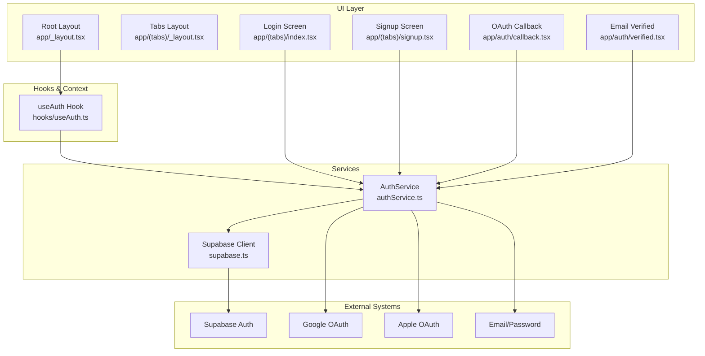
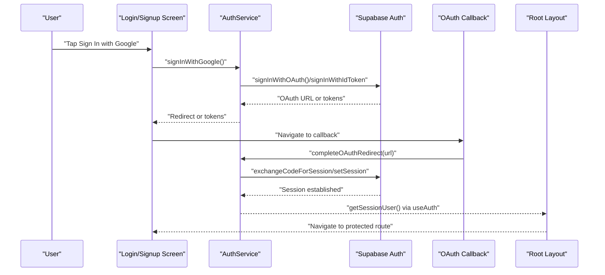
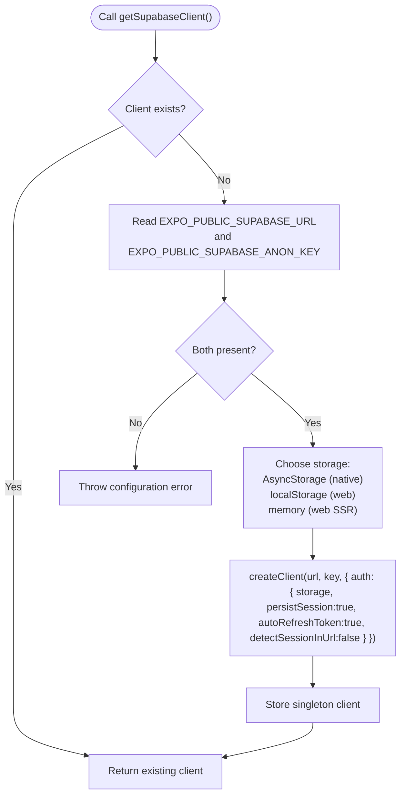
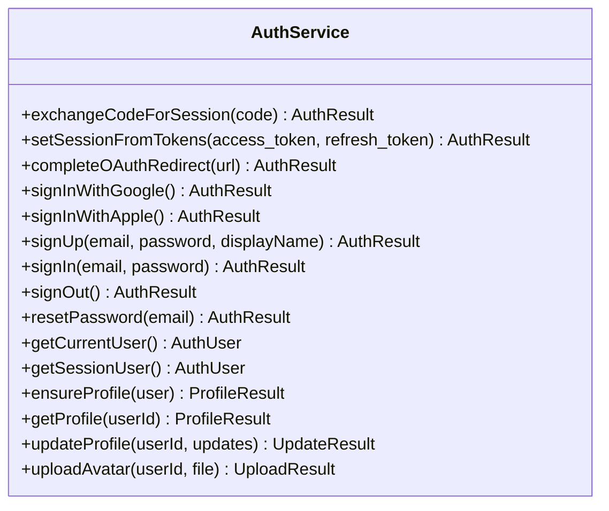
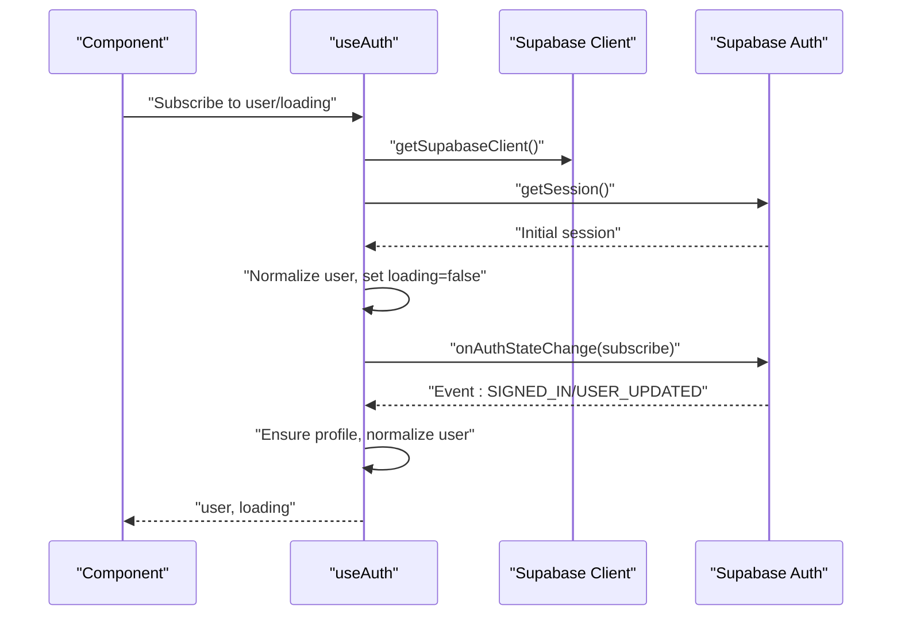
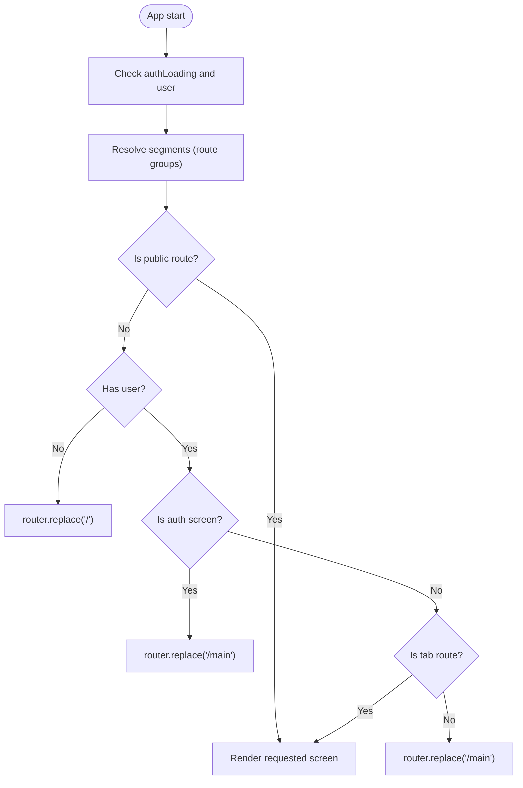
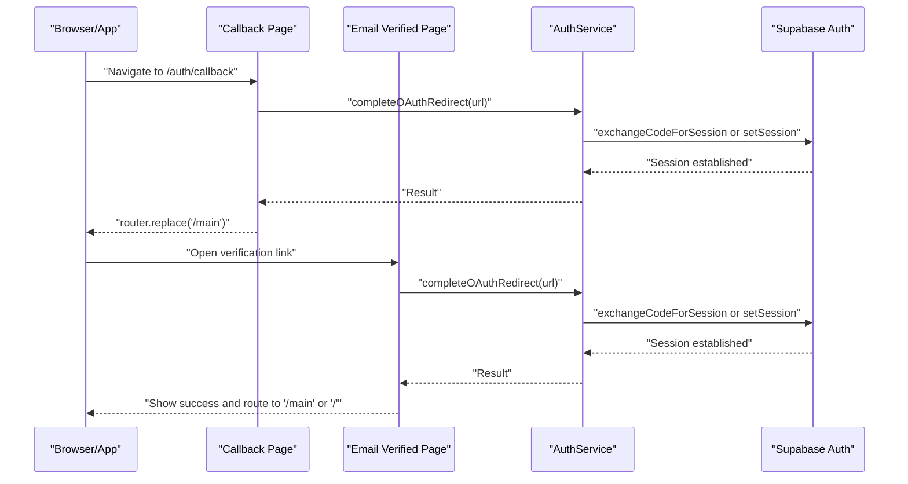
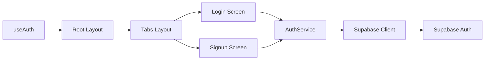
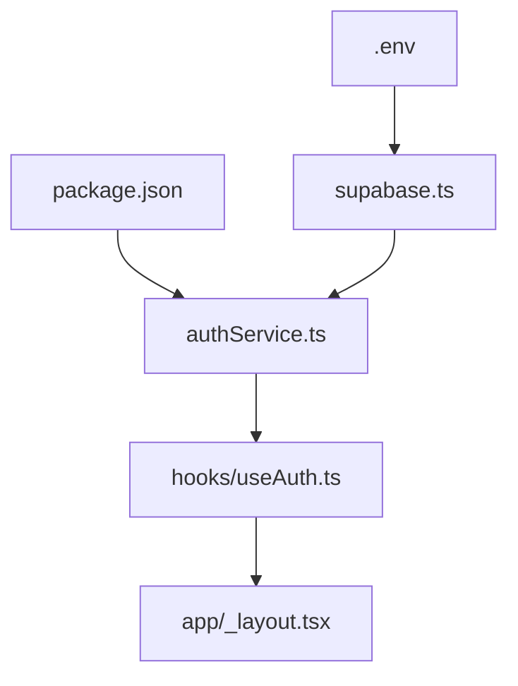

# Authentication Architecture

<cite>
**Referenced Files in This Document**
- [supabase.ts](file://supabase.ts)
- [authService.ts](file://authService.ts)
- [useAuth.ts](file://hooks/useAuth.ts)
- [app/_layout.tsx](file://app/_layout.tsx)
- [app/(tabs)/_layout.tsx](file://app/(tabs)/_layout.tsx)
- [app/(tabs)/index.tsx](file://app/(tabs)/index.tsx)
- [app/(tabs)/signup.tsx](file://app/(tabs)/signup.tsx)
- [app/auth/callback.tsx](file://app/auth/callback.tsx)
- [app/auth/verified.tsx](file://app/auth/verified.tsx)
- [.env](file://.env)
- [package.json](file://package.json)
- [utils/authErrors.ts](file://utils/authErrors.ts)
</cite>

## Table of Contents
1. [Introduction](#introduction)
2. [Project Structure](#project-structure)
3. [Core Components](#core-components)
4. [Architecture Overview](#architecture-overview)
5. [Detailed Component Analysis](#detailed-component-analysis)
6. [Dependency Analysis](#dependency-analysis)
7. [Performance Considerations](#performance-considerations)
8. [Troubleshooting Guide](#troubleshooting-guide)
9. [Conclusion](#conclusion)

## Introduction
This document describes the authentication architecture for the Palindrome game system. It focuses on the Supabase Auth integration, multi-provider support (Google, Apple, Email/Password), session management, and the useAuth hook pattern. It explains how authentication state flows through the component tree, how protected routes are enforced, and how token management and user verification are handled across platforms.

## Project Structure
Authentication spans several layers:
- Supabase client initialization and platform-aware storage
- A cohesive AuthService wrapper around Supabase Auth APIs
- A React hook (useAuth) that exposes normalized user state and loading
- Route guards in the root layout that redirect based on authentication state
- Provider-specific screens for OAuth callbacks and email verification
- Environment configuration and dependency declarations

**Diagram sources**
- [app/_layout.tsx](file://app/_layout.tsx#L56-L87)
- [hooks/useAuth.ts](file://hooks/useAuth.ts#L5-L49)
- [authService.ts](file://authService.ts#L61-L560)
- [supabase.ts](file://supabase.ts#L42-L74)
- [app/(tabs)/index.tsx](file://app/(tabs)/index.tsx#L33-L107)
- [app/(tabs)/signup.tsx](file://app/(tabs)/signup.tsx#L32-L78)
- [app/auth/callback.tsx](file://app/auth/callback.tsx#L7-L53)
- [app/auth/verified.tsx](file://app/auth/verified.tsx#L10-L77)

**Section sources**
- [supabase.ts](file://supabase.ts#L1-L75)
- [authService.ts](file://authService.ts#L1-L560)
- [hooks/useAuth.ts](file://hooks/useAuth.ts#L1-L51)
- [app/_layout.tsx](file://app/_layout.tsx#L56-L87)
- [app/(tabs)/_layout.tsx](file://app/(tabs)/_layout.tsx#L1-L13)
- [app/(tabs)/index.tsx](file://app/(tabs)/index.tsx#L23-L107)
- [app/(tabs)/signup.tsx](file://app/(tabs)/signup.tsx#L20-L78)
- [app/auth/callback.tsx](file://app/auth/callback.tsx#L1-L81)
- [app/auth/verified.tsx](file://app/auth/verified.tsx#L1-L196)
- [.env](file://.env#L1-L14)
- [package.json](file://package.json#L13-L56)

## Core Components
- Supabase client initialization with platform-aware storage and automatic token refresh
- AuthService encapsulating provider-specific flows and session management
- useAuth hook subscribing to Supabase Auth state changes and exposing normalized user state
- Root layout route guards enforcing authentication-based navigation
- OAuth callback and email verification handlers completing redirects and session establishment

**Section sources**
- [supabase.ts](file://supabase.ts#L42-L74)
- [authService.ts](file://authService.ts#L61-L560)
- [hooks/useAuth.ts](file://hooks/useAuth.ts#L5-L49)
- [app/_layout.tsx](file://app/_layout.tsx#L56-L87)
- [app/auth/callback.tsx](file://app/auth/callback.tsx#L7-L53)
- [app/auth/verified.tsx](file://app/auth/verified.tsx#L10-L77)

## Architecture Overview
The authentication architecture follows a layered approach:
- UI triggers authentication actions via AuthService methods
- AuthService delegates to Supabase Auth for provider flows and session management
- useAuth listens to Supabase Auth state changes and normalizes user data
- Root layout enforces protected routes based on authentication state
- OAuth callbacks and email verification pages finalize session establishment

**Diagram sources**
- [app/(tabs)/index.tsx](file://app/(tabs)/index.tsx#L77-L91)
- [authService.ts](file://authService.ts#L113-L179)
- [app/auth/callback.tsx](file://app/auth/callback.tsx#L22-L52)
- [authService.ts](file://authService.ts#L94-L111)
- [hooks/useAuth.ts](file://hooks/useAuth.ts#L13-L21)
- [app/_layout.tsx](file://app/_layout.tsx#L80-L86)

## Detailed Component Analysis

### Supabase Client Initialization
- Creates a singleton Supabase client configured with:
  - Platform-aware storage (AsyncStorage on native, localStorage on web, fallback memory store)
  - Persistent sessions enabled
  - Automatic token refresh
  - Disabled detection of session in URL for security
- Throws if required environment variables are missing

**Diagram sources**
- [supabase.ts](file://supabase.ts#L42-L74)

**Section sources**
- [supabase.ts](file://supabase.ts#L1-L75)
- [.env](file://.env#L8-L12)

### AuthService: Provider Support and Session Management
- Normalizes user shape to include id, email, and displayName
- Supports:
  - Google OAuth/Web: Uses Supabase OAuth with a redirect URL
  - Google Native: Uses Google Sign-In SDK to obtain an ID token and signs in via Supabase
  - Apple OAuth/Web: Uses Supabase OAuth with appropriate scopes and parameters
  - Apple Native (iOS): Uses Expo Apple Authentication to obtain an identity token
  - Apple Native (Android): Uses OAuth with AuthSession and handles deep links
  - Email/Password: Sign up, sign in, and password reset
- Handles OAuth redirect completion by parsing URL fragments and query parameters
- Ensures user profiles exist and caches them locally for performance

**Diagram sources**
- [authService.ts](file://authService.ts#L61-L560)

**Section sources**
- [authService.ts](file://authService.ts#L13-L560)
- [utils/authErrors.ts](file://utils/authErrors.ts#L1-L13)

### useAuth Hook Pattern and Authentication State Flow
- Initializes Supabase client and loads initial session
- Subscribes to Supabase Auth state changes and normalizes user data
- Ensures profile creation/update upon sign-in or user update events
- Returns user and loading state for consumers

**Diagram sources**
- [hooks/useAuth.ts](file://hooks/useAuth.ts#L5-L49)
- [authService.ts](file://authService.ts#L428-L468)

**Section sources**
- [hooks/useAuth.ts](file://hooks/useAuth.ts#L1-L51)
- [authService.ts](file://authService.ts#L13-L37)

### Protected Route Handling
- Root layout enforces navigation rules:
  - Public routes: login/signup and auth pages
  - Non-authenticated users are redirected to login
  - Authenticated users on login/signup are redirected to main
  - Other non-tab routes are redirected to main after authentication resolves

**Diagram sources**
- [app/_layout.tsx](file://app/_layout.tsx#L56-L87)

**Section sources**
- [app/_layout.tsx](file://app/_layout.tsx#L56-L87)

### OAuth Callback and Email Verification
- OAuth callback page parses redirect URL and completes session establishment
- Email verification page handles verification links and optional OAuth payload
- Both pages route to protected areas upon successful completion

**Diagram sources**
- [app/auth/callback.tsx](file://app/auth/callback.tsx#L7-L53)
- [app/auth/verified.tsx](file://app/auth/verified.tsx#L10-L77)
- [authService.ts](file://authService.ts#L94-L111)

**Section sources**
- [app/auth/callback.tsx](file://app/auth/callback.tsx#L1-L81)
- [app/auth/verified.tsx](file://app/auth/verified.tsx#L1-L196)
- [authService.ts](file://authService.ts#L94-L111)

### Authentication State Propagation Through the Component Tree
- Root layout consumes useAuth to gate navigation
- Tabs layout renders protected content once authenticated
- Login and signup screens trigger AuthService methods and navigate on success
- Error messages are mapped to friendly user-facing strings

**Diagram sources**
- [hooks/useAuth.ts](file://hooks/useAuth.ts#L5-L49)
- [app/_layout.tsx](file://app/_layout.tsx#L56-L87)
- [app/(tabs)/_layout.tsx](file://app/(tabs)/_layout.tsx#L1-L13)
- [app/(tabs)/index.tsx](file://app/(tabs)/index.tsx#L33-L107)
- [app/(tabs)/signup.tsx](file://app/(tabs)/signup.tsx#L32-L78)
- [authService.ts](file://authService.ts#L61-L560)
- [supabase.ts](file://supabase.ts#L42-L74)

**Section sources**
- [hooks/useAuth.ts](file://hooks/useAuth.ts#L1-L51)
- [app/_layout.tsx](file://app/_layout.tsx#L56-L87)
- [app/(tabs)/_layout.tsx](file://app/(tabs)/_layout.tsx#L1-L13)
- [app/(tabs)/index.tsx](file://app/(tabs)/index.tsx#L23-L107)
- [app/(tabs)/signup.tsx](file://app/(tabs)/signup.tsx#L20-L78)
- [utils/authErrors.ts](file://utils/authErrors.ts#L1-L13)

## Dependency Analysis
- Supabase client depends on environment variables for configuration
- AuthService depends on Supabase client and provider SDKs (Google Sign-In, Apple Authentication, Web Browser)
- UI screens depend on AuthService for authentication actions
- Root layout depends on useAuth for navigation decisions

**Diagram sources**
- [.env](file://.env#L8-L12)
- [package.json](file://package.json#L13-L56)
- [supabase.ts](file://supabase.ts#L42-L74)
- [authService.ts](file://authService.ts#L1-L12)
- [hooks/useAuth.ts](file://hooks/useAuth.ts#L1-L3)
- [app/_layout.tsx](file://app/_layout.tsx#L3-L58)

**Section sources**
- [.env](file://.env#L1-L14)
- [package.json](file://package.json#L13-L56)
- [supabase.ts](file://supabase.ts#L1-L75)
- [authService.ts](file://authService.ts#L1-L12)
- [hooks/useAuth.ts](file://hooks/useAuth.ts#L1-L3)
- [app/_layout.tsx](file://app/_layout.tsx#L3-L58)

## Performance Considerations
- Local session retrieval avoids server round-trips during initial load
- Profile caching reduces repeated database queries for user metadata
- Automatic token refresh minimizes manual refresh logic and improves reliability
- Platform-specific storage ensures optimal persistence without cross-platform overhead

[No sources needed since this section provides general guidance]

## Troubleshooting Guide
Common issues and strategies:
- Missing Supabase configuration: Verify environment variables are present and correctly named
- OAuth failures: Inspect error messages returned by AuthService and provider SDKs
- Invalid or revoked refresh tokens: AuthService clears sessions on invalid refresh token errors
- Friendly error messages: Use the mapping utility to present user-friendly messages for common error codes

**Section sources**
- [supabase.ts](file://supabase.ts#L51-L55)
- [authService.ts](file://authService.ts#L344-L351)
- [authService.ts](file://authService.ts#L367-L374)
- [utils/authErrors.ts](file://utils/authErrors.ts#L1-L13)

## Conclusion
The Palindrome authentication system leverages Supabase Auth with a clean abstraction layer (AuthService) and a predictable React hook (useAuth). It supports multiple providers, manages sessions robustly, and enforces protected routing at the root layout level. The design balances platform-specific capabilities with cross-platform consistency, while providing clear error handling and user feedback.