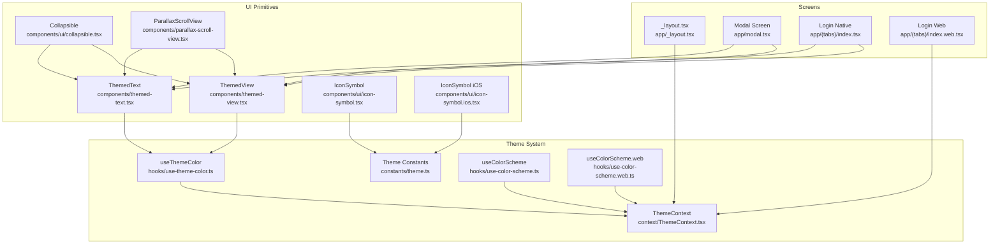
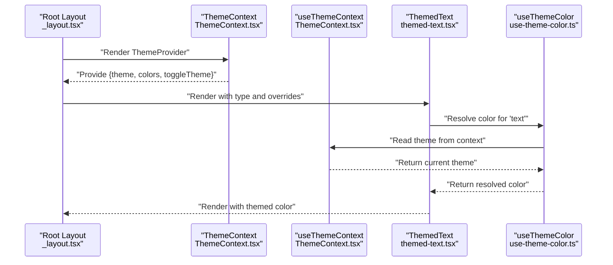
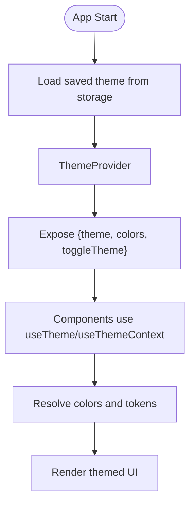
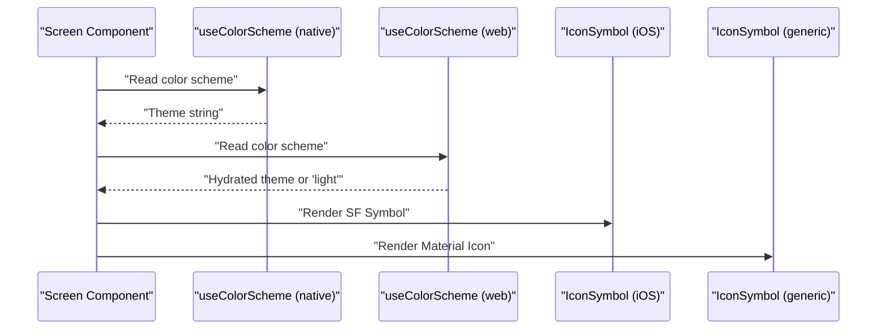
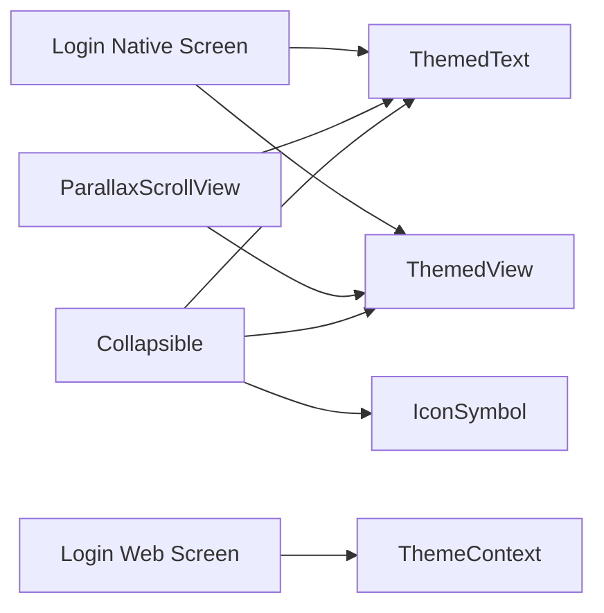
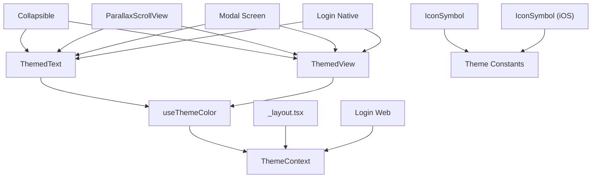

# Component Architecture

<cite>
**Referenced Files in This Document**
- [themed-text.tsx](file://components/themed-text.tsx)
- [themed-view.tsx](file://components/themed-view.tsx)
- [theme.ts](file://constants/theme.ts)
- [ThemeContext.tsx](file://context/ThemeContext.tsx)
- [use-theme-color.ts](file://hooks/use-theme-color.ts)
- [use-color-scheme.ts](file://hooks/use-color-scheme.ts)
- [use-color-scheme.web.ts](file://hooks/use-color-scheme.web.ts)
- [collapsible.tsx](file://components/ui/collapsible.tsx)
- [icon-symbol.tsx](file://components/ui/icon-symbol.tsx)
- [icon-symbol.ios.tsx](file://components/ui/icon-symbol.ios.tsx)
- [_layout.tsx](file://app/_layout.tsx)
- [modal.tsx](file://app/modal.tsx)
- [index.tsx](file://app/(tabs)/index.tsx)
- [index.web.tsx](file://app/(tabs)/index.web.tsx)
- [parallax-scroll-view.tsx](file://components/parallax-scroll-view.tsx)
- [hello-wave.tsx](file://components/hello-wave.tsx)
</cite>

## Table of Contents
1. [Introduction](#introduction)
2. [Project Structure](#project-structure)
3. [Core Components](#core-components)
4. [Architecture Overview](#architecture-overview)
5. [Detailed Component Analysis](#detailed-component-analysis)
6. [Dependency Analysis](#dependency-analysis)
7. [Performance Considerations](#performance-considerations)
8. [Accessibility Considerations](#accessibility-considerations)
9. [Testing Strategies](#testing-strategies)
10. [Troubleshooting Guide](#troubleshooting-guide)
11. [Conclusion](#conclusion)

## Introduction
This document describes the component architecture of the Palindrome game UI system with a focus on reusable themed components, design system patterns, and platform-specific adaptations. It explains how ThemedText and ThemedView enable consistent theming across light and dark modes, how platform-specific components adapt to web and native environments, and how higher-order components compose UI patterns. It also covers lifecycle management, performance optimization, accessibility, testing strategies, and documentation standards.

## Project Structure
The UI system is organized around:
- Themed primitive components under components/ for cross-platform reuse
- Theme definition and provider under constants/ and context/
- Hooks for theme-aware logic under hooks/
- Platform-specific adaptations via .web.ts and .ios.ts suffixed files
- Example screens demonstrating component usage under app/



**Diagram sources**
- [themed-text.tsx](file://components/themed-text.tsx#L1-L61)
- [themed-view.tsx](file://components/themed-view.tsx#L1-L15)
- [icon-symbol.tsx](file://components/ui/icon-symbol.tsx#L1-L42)
- [icon-symbol.ios.tsx](file://components/ui/icon-symbol.ios.tsx#L1-L33)
- [collapsible.tsx](file://components/ui/collapsible.tsx#L1-L46)
- [parallax-scroll-view.tsx](file://components/parallax-scroll-view.tsx#L1-L80)
- [ThemeContext.tsx](file://context/ThemeContext.tsx#L1-L124)
- [theme.ts](file://constants/theme.ts#L1-L54)
- [use-theme-color.ts](file://hooks/use-theme-color.ts#L1-L32)
- [use-color-scheme.ts](file://hooks/use-color-scheme.ts#L1-L8)
- [use-color-scheme.web.ts](file://hooks/use-color-scheme.web.ts#L1-L22)
- [_layout.tsx](file://app/_layout.tsx#L1-L126)
- [modal.tsx](file://app/modal.tsx#L1-L30)
- [index.tsx](file://app/(tabs)/index.tsx#L1-L479)
- [index.web.tsx](file://app/(tabs)/index.web.tsx#L1-L504)

**Section sources**
- [_layout.tsx](file://app/_layout.tsx#L108-L118)
- [ThemeContext.tsx](file://context/ThemeContext.tsx#L74-L108)

## Core Components
This section documents the foundational themed primitives and their roles in the design system.

- ThemedText
  - Purpose: Provides text with theme-aware color and built-in typographic variants.
  - Props pattern: Extends TextProps with optional lightColor/darkColor overrides and a type selector for semantic sizing and weight.
  - Theming: Resolves color via useThemeColor, applying either prop-provided or theme-defined palette entries.
  - Variants: default, title, defaultSemiBold, subtitle, link with distinct font sizes and weights.
  - Usage: Preferred for all textual content to ensure consistent theming.

- ThemedView
  - Purpose: Provides theme-aware background color for containers and layouts.
  - Props pattern: Extends ViewProps with optional lightColor/darkColor overrides.
  - Theming: Uses useThemeColor to resolve background color from the current theme.
  - Usage: Wrap content areas, cards, and surfaces to maintain consistent backgrounds.

- IconSymbol
  - Purpose: Cross-platform icon component that uses SF Symbols on iOS and Material Icons on Android/web.
  - Platform adaptation: Two implementations exist (.ios.tsx and a generic .tsx) to select the appropriate runtime.
  - Mapping: Maintains a mapping table to translate SF Symbol names to Material Icons equivalents.

- Collapsible
  - Purpose: A foldable section with animated chevron indicator and themed content area.
  - Composition: Uses ThemedView and ThemedText, plus IconSymbol and theme colors from constants/theme.
  - Interaction: Toggles open/close state and rotates the chevron accordingly.

- ParallaxScrollView
  - Purpose: Scroll container with animated parallax header and themed content area.
  - Composition: Uses ThemedView and ThemedText, along with Reanimated for scroll-driven animations.
  - Theming: Resolves background color via useThemeColor and respects color scheme.

**Section sources**
- [themed-text.tsx](file://components/themed-text.tsx#L5-L34)
- [themed-view.tsx](file://components/themed-view.tsx#L5-L14)
- [icon-symbol.tsx](file://components/ui/icon-symbol.tsx#L16-L41)
- [icon-symbol.ios.tsx](file://components/ui/icon-symbol.ios.tsx#L4-L31)
- [collapsible.tsx](file://components/ui/collapsible.tsx#L10-L32)
- [parallax-scroll-view.tsx](file://components/parallax-scroll-view.tsx#L21-L62)

## Architecture Overview
The UI architecture centers on a ThemeContext provider that supplies theme state and colors. ThemedText and ThemedView consume theme tokens through useThemeColor, ensuring consistent color application across components. Platform-specific hooks and components adapt behavior and visuals for web and native.



**Diagram sources**
- [_layout.tsx](file://app/_layout.tsx#L108-L118)
- [ThemeContext.tsx](file://context/ThemeContext.tsx#L74-L108)
- [use-theme-color.ts](file://hooks/use-theme-color.ts#L19-L31)
- [themed-text.tsx](file://components/themed-text.tsx#L11-L34)

## Detailed Component Analysis

### ThemedText and ThemedView: Design System Primitives
These components encapsulate color resolution and typography to enforce a consistent design language.

```mermaid
classDiagram
class ThemedText {
+props : TextProps
+lightColor? : string
+darkColor? : string
+type : "default"|"title"|"defaultSemiBold"|"subtitle"|"link"
+render() : ReactNode
}
class ThemedView {
+props : ViewProps
+lightColor? : string
+darkColor? : string
+render() : ReactNode
}
class useThemeColor {
+props : {light? : string; dark? : string}
+colorName : keyof Colors
+invoke() : string
}
ThemedText --> useThemeColor : "resolves color"
ThemedView --> useThemeColor : "resolves background"
```

**Diagram sources**
- [themed-text.tsx](file://components/themed-text.tsx#L11-L34)
- [themed-view.tsx](file://components/themed-view.tsx#L10-L14)
- [use-theme-color.ts](file://hooks/use-theme-color.ts#L19-L31)

**Section sources**
- [themed-text.tsx](file://components/themed-text.tsx#L5-L60)
- [themed-view.tsx](file://components/themed-view.tsx#L5-L14)
- [use-theme-color.ts](file://hooks/use-theme-color.ts#L3-L31)

### ThemeContext and Theme Constants
ThemeContext manages persistent theme selection and exposes a rich color palette. Theme constants define platform-specific font families and fallback colors.



**Diagram sources**
- [ThemeContext.tsx](file://context/ThemeContext.tsx#L77-L99)
- [ThemeContext.tsx](file://context/ThemeContext.tsx#L110-L124)
- [theme.ts](file://constants/theme.ts#L30-L53)

**Section sources**
- [ThemeContext.tsx](file://context/ThemeContext.tsx#L30-L101)
- [theme.ts](file://constants/theme.ts#L11-L53)

### Platform-Specific Adaptations
- useColorScheme
  - Native: Returns the current theme string directly from ThemeContext.
  - Web: Hydrates client-side after SSR and falls back to 'light' during hydration.
- IconSymbol
  - iOS: Uses expo-symbols SymbolView for native vector rendering.
  - Generic: Uses MaterialIcons for Android and web, with a mapping table for SF Symbol names.



**Diagram sources**
- [use-color-scheme.ts](file://hooks/use-color-scheme.ts#L4-L7)
- [use-color-scheme.web.ts](file://hooks/use-color-scheme.web.ts#L7-L21)
- [icon-symbol.ios.tsx](file://components/ui/icon-symbol.ios.tsx#L4-L31)
- [icon-symbol.tsx](file://components/ui/icon-symbol.tsx#L28-L41)

**Section sources**
- [use-color-scheme.ts](file://hooks/use-color-scheme.ts#L4-L7)
- [use-color-scheme.web.ts](file://hooks/use-color-scheme.web.ts#L7-L21)
- [icon-symbol.ios.tsx](file://components/ui/icon-symbol.ios.tsx#L4-L31)
- [icon-symbol.tsx](file://components/ui/icon-symbol.tsx#L16-L41)

### Component Composition Patterns
- Collapsible composes ThemedView, ThemedText, IconSymbol, and theme colors to present expandable sections.
- ParallaxScrollView composes ThemedView and ThemedText with Reanimated to create immersive scrolling experiences.
- Screens demonstrate composition of themed primitives with platform-specific styling and navigation.



**Diagram sources**
- [collapsible.tsx](file://components/ui/collapsible.tsx#L10-L32)
- [parallax-scroll-view.tsx](file://components/parallax-scroll-view.tsx#L21-L62)
- [index.tsx](file://app/(tabs)/index.tsx#L23-L358)
- [index.web.tsx](file://app/(tabs)/index.web.tsx#L8-L503)

**Section sources**
- [collapsible.tsx](file://components/ui/collapsible.tsx#L10-L46)
- [parallax-scroll-view.tsx](file://components/parallax-scroll-view.tsx#L21-L80)
- [index.tsx](file://app/(tabs)/index.tsx#L23-L358)
- [index.web.tsx](file://app/(tabs)/index.web.tsx#L8-L503)

### Example Screens: Themed Usage Patterns
- Modal Screen: Demonstrates ThemedText and ThemedView usage for a simple modal layout.
- Login Screens (Native/Web): Show how themed tokens are applied to forms, buttons, and gradients while adapting to platform capabilities.

**Section sources**
- [modal.tsx](file://app/modal.tsx#L7-L15)
- [index.tsx](file://app/(tabs)/index.tsx#L109-L358)
- [index.web.tsx](file://app/(tabs)/index.web.tsx#L133-L503)

## Dependency Analysis
The following diagram shows key dependencies among themed components, hooks, and screens.



**Diagram sources**
- [themed-text.tsx](file://components/themed-text.tsx#L11-L34)
- [themed-view.tsx](file://components/themed-view.tsx#L10-L14)
- [use-theme-color.ts](file://hooks/use-theme-color.ts#L19-L31)
- [ThemeContext.tsx](file://context/ThemeContext.tsx#L74-L108)
- [icon-symbol.tsx](file://components/ui/icon-symbol.tsx#L28-L41)
- [icon-symbol.ios.tsx](file://components/ui/icon-symbol.ios.tsx#L4-L31)
- [collapsible.tsx](file://components/ui/collapsible.tsx#L10-L32)
- [parallax-scroll-view.tsx](file://components/parallax-scroll-view.tsx#L21-L62)
- [_layout.tsx](file://app/_layout.tsx#L108-L118)
- [modal.tsx](file://app/modal.tsx#L7-L15)
- [index.tsx](file://app/(tabs)/index.tsx#L23-L358)
- [index.web.tsx](file://app/(tabs)/index.web.tsx#L8-L503)

**Section sources**
- [ThemeContext.tsx](file://context/ThemeContext.tsx#L74-L108)
- [use-theme-color.ts](file://hooks/use-theme-color.ts#L19-L31)
- [themed-text.tsx](file://components/themed-text.tsx#L11-L34)
- [themed-view.tsx](file://components/themed-view.tsx#L10-L14)

## Performance Considerations
- Theme resolution
  - Keep color computations minimal by resolving once per component render and avoiding unnecessary recomputation.
  - Prefer useThemeColor for color derivation to centralize theme logic.
- Animated components
  - ParallaxScrollView leverages Reanimated’s useAnimatedRef and useAnimatedStyle to compute transforms efficiently on the UI thread.
- Platform-specific rendering
  - Use .ios.tsx and .web.tsx to avoid runtime branching in hot paths.
- Fonts and assets
  - Preload fonts and assets during splash to reduce layout shifts and improve perceived performance.
- Conditional rendering
  - Avoid heavy computations inside render loops; memoize derived values when possible.

[No sources needed since this section provides general guidance]

## Accessibility Considerations
- Contrast and readability
  - Ensure sufficient contrast between text and background using theme tokens.
- Focus and keyboard navigation
  - Provide visible focus indicators for interactive elements (buttons, inputs).
- Touch targets and spacing
  - Maintain adequate hit areas and spacing for mobile touch interaction.
- Semantic structure
  - Use appropriate heading levels and labels for form controls.
- Dynamic type and scaling
  - Respect system font scaling and avoid fixed pixel sizes where possible.

[No sources needed since this section provides general guidance]

## Testing Strategies
- Unit tests for hooks
  - Test useThemeColor with mocked ThemeContext to verify color resolution for both themes.
  - Test useColorScheme on web to confirm hydration behavior.
- Component snapshot tests
  - Snapshot test ThemedText and ThemedView in light and dark modes to detect unintended visual regressions.
- Platform-specific tests
  - Verify IconSymbol renders SF Symbols on iOS and Material Icons on web/native.
- Integration tests
  - Compose Collapsible and ParallaxScrollView in a mock layout to validate interaction and theming.
- Prop validation
  - Enforce required props and union types for component APIs (e.g., ThemedText.type).
- Documentation standards
  - Document component props, variants, and usage examples alongside tests.

[No sources needed since this section provides general guidance]

## Troubleshooting Guide
- Theme not updating
  - Ensure ThemeProvider wraps the app root and that components consume useTheme or useThemeContext.
- Incorrect colors on web
  - Confirm useColorScheme.web hydration and that theme tokens are applied consistently.
- Icons not rendering
  - Verify SF Symbol name mappings and that platform-specific IconSymbol is selected.
- Layout shifts during hydration
  - Preload fonts and assets during splash; defer heavy work until after hydration.

**Section sources**
- [_layout.tsx](file://app/_layout.tsx#L108-L118)
- [ThemeContext.tsx](file://context/ThemeContext.tsx#L77-L99)
- [use-color-scheme.web.ts](file://hooks/use-color-scheme.web.ts#L7-L21)
- [icon-symbol.tsx](file://components/ui/icon-symbol.tsx#L16-L41)

## Conclusion
The Palindrome UI system employs a robust, theme-centric design built on ThemedText and ThemedView. A centralized ThemeContext and useThemeColor hook ensure consistent color application across components. Platform-specific adaptations via .web.ts and .ios.ts files deliver optimal experiences on both web and native. Composition patterns demonstrated by Collapsible and ParallaxScrollView illustrate scalable UI construction. By following the documented patterns, lifecycle management, performance tips, accessibility guidelines, and testing strategies, teams can maintain a cohesive and extensible UI architecture.