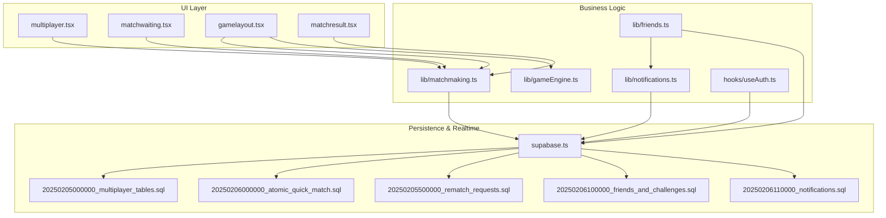
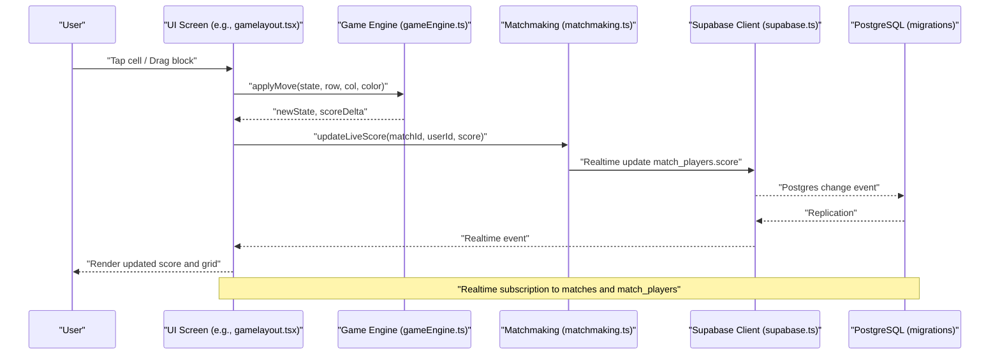
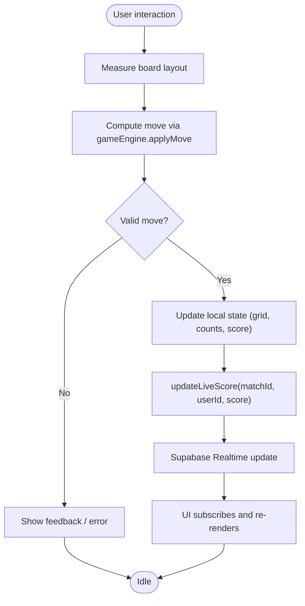
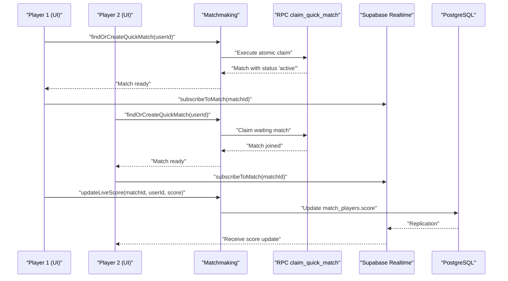
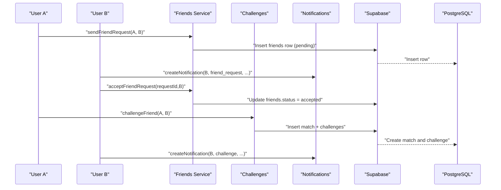
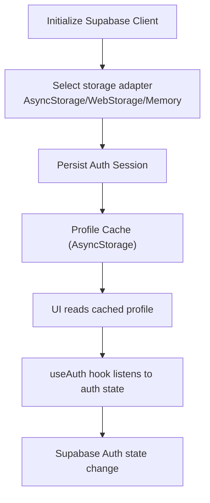
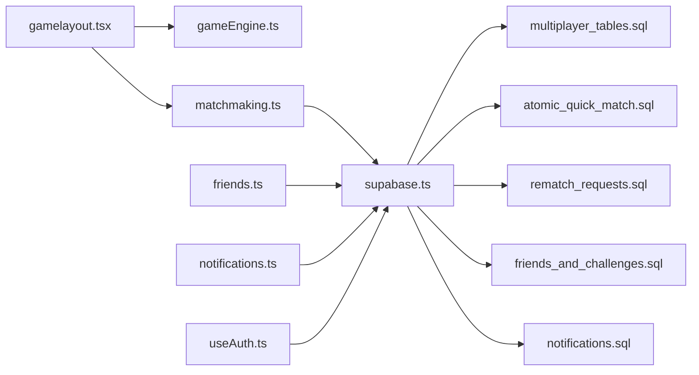

# Data Flow Patterns

<cite>
**Referenced Files in This Document**
- [supabase.ts](file://supabase.ts)
- [authService.ts](file://authService.ts)
- [gameEngine.ts](file://lib/gameEngine.ts)
- [matchmaking.ts](file://lib/matchmaking.ts)
- [friends.ts](file://lib/friends.ts)
- [notifications.ts](file://lib/notifications.ts)
- [gamelayout.tsx](file://app/(tabs)/gamelayout.tsx)
- [multiplayer.tsx](file://app/(tabs)/multiplayer.tsx)
- [matchwaiting.tsx](file://app/(tabs)/matchwaiting.tsx)
- [matchresult.tsx](file://app/(tabs)/matchresult.tsx)
- [useAuth.ts](file://hooks/useAuth.ts)
- [20250205000000_multiplayer_tables.sql](file://supabase/migrations/20250205000000_multiplayer_tables.sql)
- [20250206000000_atomic_quick_match.sql](file://supabase/migrations/20250206000000_atomic_quick_match.sql)
- [20250205500000_rematch_requests.sql](file://supabase/migrations/20250205500000_rematch_requests.sql)
- [20250206100000_friends_and_challenges.sql](file://supabase/migrations/20250206100000_friends_and_challenges.sql)
- [20250206110000_notifications.sql](file://supabase/migrations/20250206110000_notifications.sql)
</cite>

## Table of Contents
1. [Introduction](#introduction)
2. [Project Structure](#project-structure)
3. [Core Components](#core-components)
4. [Architecture Overview](#architecture-overview)
5. [Detailed Component Analysis](#detailed-component-analysis)
6. [Dependency Analysis](#dependency-analysis)
7. [Performance Considerations](#performance-considerations)
8. [Troubleshooting Guide](#troubleshooting-guide)
9. [Conclusion](#conclusion)

## Introduction
This document describes the data flow architecture for the Palindrome game system. It traces user interactions through business logic services to persistence layers, explains the game state flow from the shared game engine to UI components and Supabase real-time updates, and documents multiplayer synchronization patterns, social data flows, data transformations, caching strategies, and error handling mechanisms.

## Project Structure
The system is organized around:
- Shared business logic in lib/ (gameEngine, matchmaking, friends, notifications)
- Supabase client initialization and RLS policies in supabase.ts and migrations
- UI screens orchestrating user actions and real-time updates
- Authentication and profile caching in authService.ts and hooks/useAuth.ts

**Diagram sources**
- [multiplayer.tsx](file://app/(tabs)/multiplayer.tsx#L1-L342)
- [matchwaiting.tsx](file://app/(tabs)/matchwaiting.tsx#L1-L210)
- [gamelayout.tsx](file://app/(tabs)/gamelayout.tsx#L1-L800)
- [matchresult.tsx](file://app/(tabs)/matchresult.tsx#L1-L338)
- [gameEngine.ts](file://lib/gameEngine.ts#L1-L284)
- [matchmaking.ts](file://lib/matchmaking.ts#L1-L542)
- [friends.ts](file://lib/friends.ts#L1-L380)
- [notifications.ts](file://lib/notifications.ts#L1-L110)
- [useAuth.ts](file://hooks/useAuth.ts#L1-L51)
- [supabase.ts](file://supabase.ts#L1-L75)
- [20250205000000_multiplayer_tables.sql](file://supabase/migrations/20250205000000_multiplayer_tables.sql#L1-L84)
- [20250206000000_atomic_quick_match.sql](file://supabase/migrations/20250206000000_atomic_quick_match.sql#L1-L45)
- [20250205500000_rematch_requests.sql](file://supabase/migrations/20250205500000_rematch_requests.sql#L1-L37)
- [20250206100000_friends_and_challenges.sql](file://supabase/migrations/20250206100000_friends_and_challenges.sql#L1-L50)
- [20250206110000_notifications.sql](file://supabase/migrations/20250206110000_notifications.sql#L1-L28)

**Section sources**
- [supabase.ts](file://supabase.ts#L1-L75)
- [authService.ts](file://authService.ts#L1-L560)
- [gameEngine.ts](file://lib/gameEngine.ts#L1-L284)
- [matchmaking.ts](file://lib/matchmaking.ts#L1-L542)
- [friends.ts](file://lib/friends.ts#L1-L380)
- [notifications.ts](file://lib/notifications.ts#L1-L110)
- [gamelayout.tsx](file://app/(tabs)/gamelayout.tsx#L1-L800)
- [multiplayer.tsx](file://app/(tabs)/multiplayer.tsx#L1-L342)
- [matchwaiting.tsx](file://app/(tabs)/matchwaiting.tsx#L1-L210)
- [matchresult.tsx](file://app/(tabs)/matchresult.tsx#L1-L338)
- [useAuth.ts](file://hooks/useAuth.ts#L1-L51)
- [20250205000000_multiplayer_tables.sql](file://supabase/migrations/20250205000000_multiplayer_tables.sql#L1-L84)
- [20250206000000_atomic_quick_match.sql](file://supabase/migrations/20250206000000_atomic_quick_match.sql#L1-L45)
- [20250205500000_rematch_requests.sql](file://supabase/migrations/20250205500000_rematch_requests.sql#L1-L37)
- [20250206100000_friends_and_challenges.sql](file://supabase/migrations/20250206100000_friends_and_challenges.sql#L1-L50)
- [20250206110000_notifications.sql](file://supabase/migrations/20250206110000_notifications.sql#L1-L28)

## Core Components
- Supabase client initialization with platform-aware storage and persisted sessions.
- Shared game engine providing deterministic board state, move validation, palindrome detection, and scoring.
- Matchmaking service managing match lifecycle, real-time subscriptions, live score updates, and rematch requests.
- Social services for friends, challenges, and notifications.
- UI orchestration coordinating user actions, real-time updates, and navigation.

**Section sources**
- [supabase.ts](file://supabase.ts#L42-L74)
- [gameEngine.ts](file://lib/gameEngine.ts#L26-L100)
- [matchmaking.ts](file://lib/matchmaking.ts#L58-L66)
- [friends.ts](file://lib/friends.ts#L40-L67)
- [notifications.ts](file://lib/notifications.ts#L24-L43)

## Architecture Overview
The system follows a layered pattern:
- UI layer handles user interactions and renders state.
- Business logic layer encapsulates game rules and multiplayer coordination.
- Persistence layer stores structured data with Supabase and exposes real-time channels.
- Authentication layer integrates with Supabase Auth and caches profile data.

**Diagram sources**
- [gamelayout.tsx](file://app/(tabs)/gamelayout.tsx#L760-L779)
- [gameEngine.ts](file://lib/gameEngine.ts#L167-L219)
- [matchmaking.ts](file://lib/matchmaking.ts#L253-L266)
- [supabase.ts](file://supabase.ts#L42-L74)
- [20250205000000_multiplayer_tables.sql](file://supabase/migrations/20250205000000_multiplayer_tables.sql#L1-L84)

## Detailed Component Analysis

### Game State Flow: UI to Engine to Persistence
- UI initializes game state and board layout, measures board geometry, and coordinates drag-and-drop interactions.
- The shared game engine computes valid moves, detects palindromes, and updates state deterministically.
- Live score updates are persisted via Supabase Realtime; final scores are submitted upon match completion.

**Diagram sources**
- [gamelayout.tsx](file://app/(tabs)/gamelayout.tsx#L666-L731)
- [gameEngine.ts](file://lib/gameEngine.ts#L167-L219)
- [matchmaking.ts](file://lib/matchmaking.ts#L253-L266)

**Section sources**
- [gamelayout.tsx](file://app/(tabs)/gamelayout.tsx#L616-L731)
- [gameEngine.ts](file://lib/gameEngine.ts#L167-L219)
- [matchmaking.ts](file://lib/matchmaking.ts#L253-L266)

### Multiplayer Data Synchronization
- Quick match creation uses an atomic PostgreSQL function to avoid race conditions.
- Realtime subscriptions to matches and match_players propagate state changes instantly.
- Opponent presence and live scores are reflected in the UI; finishing conditions trigger match status transitions.

**Diagram sources**
- [matchmaking.ts](file://lib/matchmaking.ts#L58-L66)
- [20250206000000_atomic_quick_match.sql](file://supabase/migrations/20250206000000_atomic_quick_match.sql#L3-L42)
- [20250205000000_multiplayer_tables.sql](file://supabase/migrations/20250205000000_multiplayer_tables.sql#L1-L84)

**Section sources**
- [matchmaking.ts](file://lib/matchmaking.ts#L58-L66)
- [matchwaiting.tsx](file://app/(tabs)/matchwaiting.tsx#L33-L74)
- [matchresult.tsx](file://app/(tabs)/matchresult.tsx#L45-L91)
- [20250206000000_atomic_quick_match.sql](file://supabase/migrations/20250206000000_atomic_quick_match.sql#L1-L45)

### Social Data Flow: Friends, Challenges, Notifications
- Friend requests, acceptance, and friend lists are persisted and protected by Row Level Security.
- Challenges link a friend to a match; notifications are created and delivered to recipients.
- UI screens query recent matches and opponents to populate lists.

**Diagram sources**
- [friends.ts](file://lib/friends.ts#L40-L67)
- [friends.ts](file://lib/friends.ts#L167-L220)
- [notifications.ts](file://lib/notifications.ts#L88-L109)
- [20250206100000_friends_and_challenges.sql](file://supabase/migrations/20250206100000_friends_and_challenges.sql#L1-L50)
- [20250206110000_notifications.sql](file://supabase/migrations/20250206110000_notifications.sql#L1-L28)

**Section sources**
- [friends.ts](file://lib/friends.ts#L40-L67)
- [friends.ts](file://lib/friends.ts#L167-L220)
- [notifications.ts](file://lib/notifications.ts#L88-L109)
- [multiplayer.tsx](file://app/(tabs)/multiplayer.tsx#L31-L62)

### Data Transformation Pipeline and Caching Strategies
- Supabase client supports AsyncStorage on native and localStorage on web, enabling persisted sessions and token refresh.
- Profile caching is implemented in authService with AsyncStorage to reduce network calls and improve responsiveness.
- UI components rely on Supabase Auth state changes and local hooks to keep views synchronized.

**Diagram sources**
- [supabase.ts](file://supabase.ts#L42-L74)
- [authService.ts](file://authService.ts#L384-L426)
- [useAuth.ts](file://hooks/useAuth.ts#L5-L47)

**Section sources**
- [supabase.ts](file://supabase.ts#L42-L74)
- [authService.ts](file://authService.ts#L384-L426)
- [useAuth.ts](file://hooks/useAuth.ts#L5-L47)

### Offline-First and Consistency Approaches
- Deterministic game state via seeded initializations ensures consistent boards across clients.
- Realtime subscriptions combine with periodic polling for reliability; UI reflects local state while reconciling server updates.
- Row Level Security and foreign keys maintain referential integrity; atomic operations (RPC) prevent race conditions.

**Section sources**
- [gameEngine.ts](file://lib/gameEngine.ts#L60-L100)
- [matchmaking.ts](file://lib/matchmaking.ts#L470-L511)
- [20250205000000_multiplayer_tables.sql](file://supabase/migrations/20250205000000_multiplayer_tables.sql#L1-L84)
- [20250206000000_atomic_quick_match.sql](file://supabase/migrations/20250206000000_atomic_quick_match.sql#L1-L45)

## Dependency Analysis
The following diagram highlights key dependencies among components and their persistence contracts.

**Diagram sources**
- [gamelayout.tsx](file://app/(tabs)/gamelayout.tsx#L33-L33)
- [gameEngine.ts](file://lib/gameEngine.ts#L46-L46)
- [matchmaking.ts](file://lib/matchmaking.ts#L6-L7)
- [friends.ts](file://lib/friends.ts#L6-L8)
- [notifications.ts](file://lib/notifications.ts#L6-L6)
- [useAuth.ts](file://hooks/useAuth.ts#L1-L2)
- [supabase.ts](file://supabase.ts#L1-L7)
- [20250205000000_multiplayer_tables.sql](file://supabase/migrations/20250205000000_multiplayer_tables.sql#L1-L84)
- [20250206000000_atomic_quick_match.sql](file://supabase/migrations/20250206000000_atomic_quick_match.sql#L1-L45)
- [20250205500000_rematch_requests.sql](file://supabase/migrations/20250205500000_rematch_requests.sql#L1-L37)
- [20250206100000_friends_and_challenges.sql](file://supabase/migrations/20250206100000_friends_and_challenges.sql#L1-L50)
- [20250206110000_notifications.sql](file://supabase/migrations/20250206110000_notifications.sql#L1-L28)

**Section sources**
- [gamelayout.tsx](file://app/(tabs)/gamelayout.tsx#L33-L33)
- [matchmaking.ts](file://lib/matchmaking.ts#L6-L7)
- [friends.ts](file://lib/friends.ts#L6-L8)
- [notifications.ts](file://lib/notifications.ts#L6-L6)
- [useAuth.ts](file://hooks/useAuth.ts#L1-L2)
- [supabase.ts](file://supabase.ts#L1-L7)

## Performance Considerations
- Deterministic game state reduces recomputation and improves consistency across clients.
- Realtime subscriptions minimize polling overhead; fallback polling ensures resilience.
- Atomic operations (RPC) eliminate contention for quick match creation.
- Profile caching reduces repeated network calls and accelerates UI rendering.

[No sources needed since this section provides general guidance]

## Troubleshooting Guide
Common issues and remedies:
- Authentication session invalidation: The auth hook and client handle refresh token errors by signing out and clearing stale sessions.
- Realtime subscription failures: Fallback polling is used in matchmaking screens to ensure state convergence.
- Duplicate friend requests: Backend constraints prevent duplicates; UI surfaces appropriate errors.
- Notification delivery: Best-effort creation with graceful failure handling.

**Section sources**
- [useAuth.ts](file://hooks/useAuth.ts#L23-L46)
- [authService.ts](file://authService.ts#L344-L381)
- [matchmaking.ts](file://lib/matchmaking.ts#L470-L511)
- [friends.ts](file://lib/friends.ts#L51-L54)
- [notifications.ts](file://lib/notifications.ts#L107-L109)

## Conclusion
The Palindrome game system employs a clean separation of concerns: a shared game engine, robust multiplayer orchestration via Supabase Realtime, and social features integrated with notifications. Deterministic state, atomic operations, and caching strategies deliver a responsive, consistent experience across platforms. Realtime subscriptions, combined with fallback polling and RLS-protected tables, ensure reliable synchronization and data integrity.