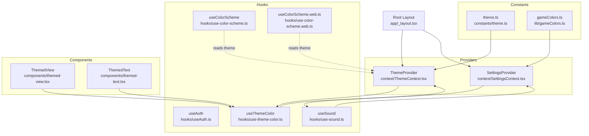
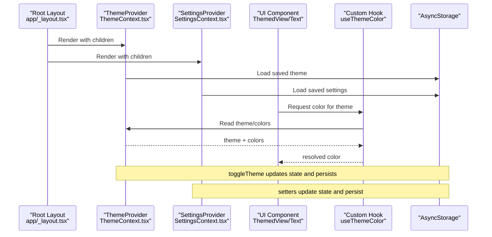
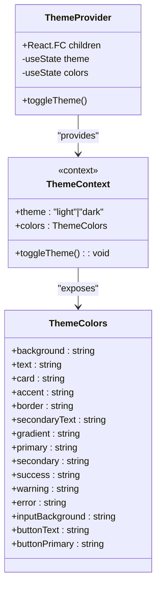
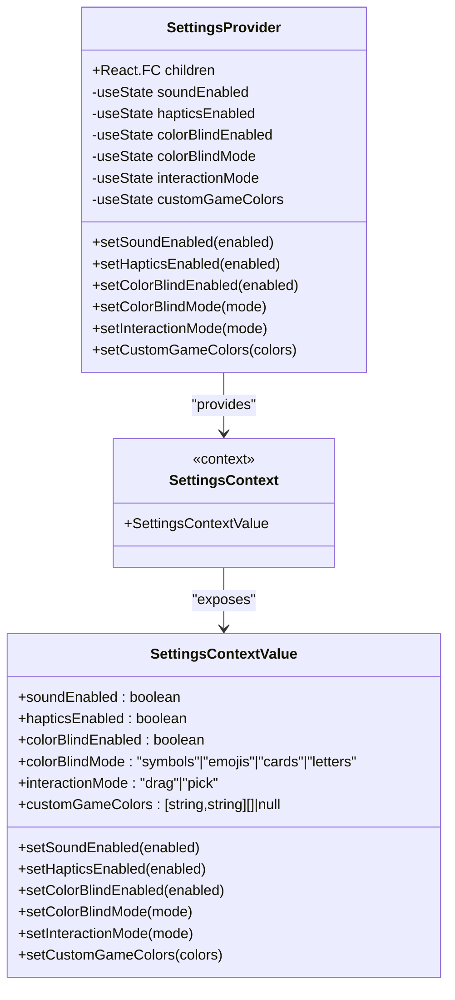
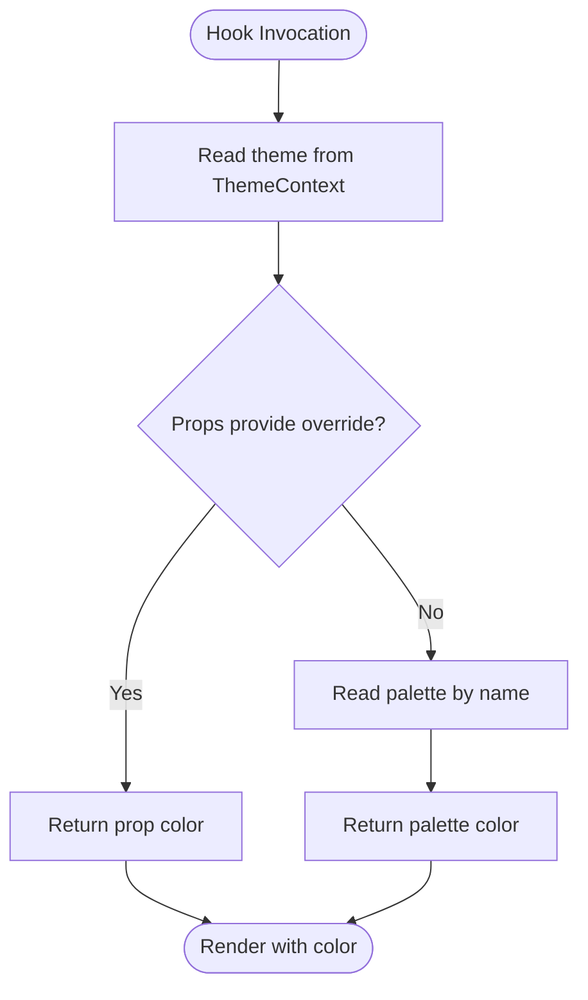
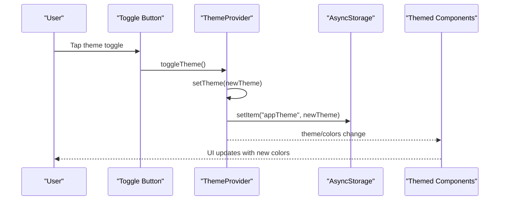
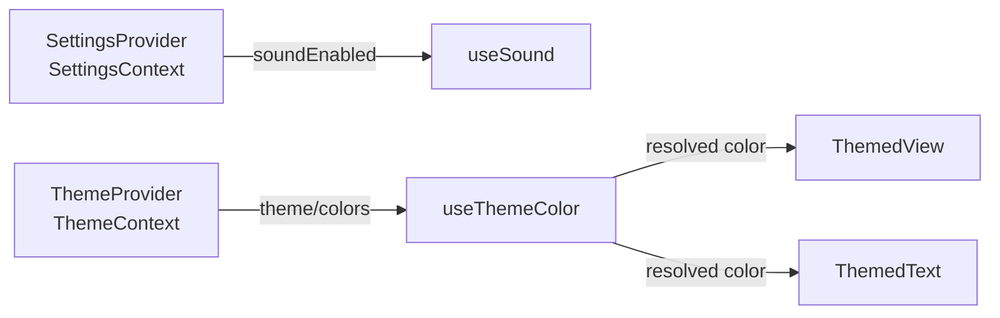
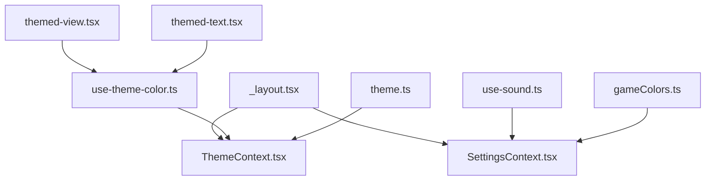

# State Management Architecture

<cite>
**Referenced Files in This Document**
- [ThemeContext.tsx](file://context/ThemeContext.tsx)
- [SettingsContext.tsx](file://context/SettingsContext.tsx)
- [useAuth.ts](file://hooks/useAuth.ts)
- [use-color-scheme.ts](file://hooks/use-color-scheme.ts)
- [use-color-scheme.web.ts](file://hooks/use-color-scheme.web.ts)
- [use-theme-color.ts](file://hooks/use-theme-color.ts)
- [_layout.tsx](file://app/_layout.tsx)
- [gamelayout.web.tsx](file://app/(tabs)/gamelayout.web.tsx)
- [themed-view.tsx](file://components/themed-view.tsx)
- [themed-text.tsx](file://components/themed-text.tsx)
- [theme.ts](file://constants/theme.ts)
- [gameColors.ts](file://lib/gameColors.ts)
- [use-sound.ts](file://hooks/use-sound.ts)
</cite>

## Table of Contents
1. [Introduction](#introduction)
2. [Project Structure](#project-structure)
3. [Core Components](#core-components)
4. [Architecture Overview](#architecture-overview)
5. [Detailed Component Analysis](#detailed-component-analysis)
6. [Dependency Analysis](#dependency-analysis)
7. [Performance Considerations](#performance-considerations)
8. [Troubleshooting Guide](#troubleshooting-guide)
9. [Conclusion](#conclusion)

## Introduction
This document explains the state management architecture of the Palindrome game with a focus on the provider pattern and custom hooks. It covers how ThemeProvider and SettingsProvider manage global application state, how custom hooks like useAuth, useColorScheme, and useThemeColor enable localized state management, and how state flows from providers to components. It also details persistence strategies, update patterns, cross-context interactions, performance considerations, and debugging approaches.

## Project Structure
The state management spans three layers:
- Providers: ThemeProvider and SettingsProvider wrap the app to supply global state.
- Hooks: Custom hooks encapsulate local state and derived logic for UI and auth.
- Components: Themed UI primitives consume theme and settings via hooks.

**Diagram sources**
- [ThemeContext.tsx](file://context/ThemeContext.tsx#L74-L124)
- [SettingsContext.tsx](file://context/SettingsContext.tsx#L49-L178)
- [useAuth.ts](file://hooks/useAuth.ts#L5-L51)
- [use-color-scheme.ts](file://hooks/use-color-scheme.ts#L4-L7)
- [use-color-scheme.web.ts](file://hooks/use-color-scheme.web.ts#L7-L22)
- [use-theme-color.ts](file://hooks/use-theme-color.ts#L19-L31)
- [_layout.tsx](file://app/_layout.tsx#L56-L119)
- [themed-view.tsx](file://components/themed-view.tsx#L10-L14)
- [themed-text.tsx](file://components/themed-text.tsx#L11-L34)
- [theme.ts](file://constants/theme.ts#L11-L28)
- [gameColors.ts](file://lib/gameColors.ts#L5-L13)
- [use-sound.ts](file://hooks/use-sound.ts#L29-L165)

**Section sources**
- [ThemeContext.tsx](file://context/ThemeContext.tsx#L1-L124)
- [SettingsContext.tsx](file://context/SettingsContext.tsx#L1-L187)
- [_layout.tsx](file://app/_layout.tsx#L1-L126)

## Core Components
- ThemeProvider: Manages theme selection and theme-dependent colors, persists theme preference, and exposes a toggle function.
- SettingsProvider: Manages accessibility and gameplay settings, persists them to storage, and exposes setters.
- useAuth: Encapsulates authentication state and subscription lifecycle.
- useColorScheme: Returns the current theme string for UI decisions.
- useThemeColor: Resolves a color for a component prop or a named palette based on the current theme.
- ThemedView and ThemedText: UI primitives that consume useThemeColor to render with appropriate colors.

**Section sources**
- [ThemeContext.tsx](file://context/ThemeContext.tsx#L74-L124)
- [SettingsContext.tsx](file://context/SettingsContext.tsx#L49-L178)
- [useAuth.ts](file://hooks/useAuth.ts#L5-L51)
- [use-color-scheme.ts](file://hooks/use-color-scheme.ts#L4-L7)
- [use-theme-color.ts](file://hooks/use-theme-color.ts#L19-L31)
- [themed-view.tsx](file://components/themed-view.tsx#L10-L14)
- [themed-text.tsx](file://components/themed-text.tsx#L11-L34)

## Architecture Overview
The app initializes providers at the root layout. ThemeProvider supplies theme and colors; SettingsProvider supplies user preferences. Components and hooks read from these contexts. Persistence is handled via asynchronous storage for both theme and settings.

**Diagram sources**
- [_layout.tsx](file://app/_layout.tsx#L108-L118)
- [ThemeContext.tsx](file://context/ThemeContext.tsx#L77-L99)
- [SettingsContext.tsx](file://context/SettingsContext.tsx#L57-L99)
- [use-theme-color.ts](file://hooks/use-theme-color.ts#L19-L31)

## Detailed Component Analysis

### ThemeProvider and ThemeContext
- Responsibilities:
  - Manage current theme and computed colors.
  - Persist theme to storage and hydrate on startup.
  - Expose a toggle function to switch themes.
- Data model:
  - Theme type with light/dark variants.
  - ThemeColors interface with semantic color names.
- Persistence:
  - Uses asynchronous storage to save and load the theme preference.
- Provider value:
  - Supplies theme, colors, and toggleTheme to consumers.

**Diagram sources**
- [ThemeContext.tsx](file://context/ThemeContext.tsx#L4-L28)
- [ThemeContext.tsx](file://context/ThemeContext.tsx#L74-L108)

**Section sources**
- [ThemeContext.tsx](file://context/ThemeContext.tsx#L74-L124)

### SettingsProvider and SettingsContext
- Responsibilities:
  - Manage sound, haptics, color-blind mode, interaction mode, and custom game block gradients.
  - Persist each setting independently and hydrate on startup.
  - Provide setters that update state and persist changes.
- Data model:
  - SettingsContextValue defines getters/setters for each preference.
  - Game color gradients are arrays of two-element tuples representing color stops.
- Persistence:
  - Uses asynchronous storage keys per setting; custom game colors are serialized as JSON.
- Memoization:
  - Uses useMemo to avoid recreating the provider value on every render.

**Diagram sources**
- [SettingsContext.tsx](file://context/SettingsContext.tsx#L8-L37)
- [SettingsContext.tsx](file://context/SettingsContext.tsx#L49-L178)
- [gameColors.ts](file://lib/gameColors.ts#L5-L13)

**Section sources**
- [SettingsContext.tsx](file://context/SettingsContext.tsx#L49-L187)
- [gameColors.ts](file://lib/gameColors.ts#L5-L13)

### Custom Hooks Architecture
- useAuth:
  - Manages logged-in user and loading state.
  - Subscribes to Supabase auth state changes and ensures user profiles.
  - Returns user and loading for downstream components.
- useColorScheme:
  - Reads the current theme string from ThemeContext.
  - Provides a platform-aware variant for web hydration.
- useThemeColor:
  - Resolves a color either from props (light/dark overrides) or from a built-in palette keyed by theme.
  - Used by ThemedView and ThemedText to compute styles.

**Diagram sources**
- [use-theme-color.ts](file://hooks/use-theme-color.ts#L19-L31)

**Section sources**
- [useAuth.ts](file://hooks/useAuth.ts#L5-L51)
- [use-color-scheme.ts](file://hooks/use-color-scheme.ts#L4-L7)
- [use-color-scheme.web.ts](file://hooks/use-color-scheme.web.ts#L7-L22)
- [use-theme-color.ts](file://hooks/use-theme-color.ts#L19-L31)

### State Flow: Theme Switching, Preferences, and UI
- Theme switching:
  - Toggle triggers state update and persists the new theme.
  - Components re-render with updated colors from ThemeContext.
- User preferences:
  - Settings setters update state and persist immediately.
  - Components consuming useSettings react to changes.
- UI state management:
  - ThemedView and ThemedText compute colors via useThemeColor, ensuring consistent theming across components.
  - Root layout applies a global gradient background based on theme.

**Diagram sources**
- [ThemeContext.tsx](file://context/ThemeContext.tsx#L91-L99)
- [themed-view.tsx](file://components/themed-view.tsx#L10-L14)
- [themed-text.tsx](file://components/themed-text.tsx#L11-L18)

**Section sources**
- [ThemeContext.tsx](file://context/ThemeContext.tsx#L91-L101)
- [themed-view.tsx](file://components/themed-view.tsx#L10-L14)
- [themed-text.tsx](file://components/themed-text.tsx#L11-L18)
- [_layout.tsx](file://app/_layout.tsx#L36-L54)

### Separation Between Global and Local State
- Global application state:
  - Managed by ThemeProvider and SettingsProvider.
  - Includes theme, colors, and user preferences.
- Component-local state:
  - Managed by individual components (e.g., visibility toggles, form inputs).
  - Not persisted to storage; only affects the component’s UI.
- Cross-context interactions:
  - useSound reads soundEnabled from SettingsContext to decide whether to play audio.
  - Themed components read theme from ThemeContext to compute colors.

**Diagram sources**
- [SettingsContext.tsx](file://context/SettingsContext.tsx#L159-L175)
- [use-sound.ts](file://hooks/use-sound.ts#L29-L135)
- [ThemeContext.tsx](file://context/ThemeContext.tsx#L101-L101)
- [use-theme-color.ts](file://hooks/use-theme-color.ts#L19-L31)
- [themed-view.tsx](file://components/themed-view.tsx#L10-L14)
- [themed-text.tsx](file://components/themed-text.tsx#L11-L18)

**Section sources**
- [use-sound.ts](file://hooks/use-sound.ts#L29-L135)
- [use-theme-color.ts](file://hooks/use-theme-color.ts#L19-L31)

## Dependency Analysis
- Provider initialization order:
  - ThemeProvider wraps the app.
  - SettingsProvider wraps children inside ThemeProvider.
- Hook dependencies:
  - useThemeColor depends on ThemeContext.
  - useSound depends on SettingsContext.
  - useAuth depends on Supabase client and service.
- Constants and libraries:
  - theme.ts provides baseline color tokens.
  - gameColors.ts provides default gradients and helpers for customizing game block colors.

**Diagram sources**
- [_layout.tsx](file://app/_layout.tsx#L108-L118)
- [ThemeContext.tsx](file://context/ThemeContext.tsx#L74-L108)
- [SettingsContext.tsx](file://context/SettingsContext.tsx#L49-L178)
- [use-theme-color.ts](file://hooks/use-theme-color.ts#L1-L31)
- [use-sound.ts](file://hooks/use-sound.ts#L1-L165)
- [themed-view.tsx](file://components/themed-view.tsx#L1-L15)
- [themed-text.tsx](file://components/themed-text.tsx#L1-L61)
- [theme.ts](file://constants/theme.ts#L11-L28)
- [gameColors.ts](file://lib/gameColors.ts#L5-L13)

**Section sources**
- [_layout.tsx](file://app/_layout.tsx#L108-L118)
- [ThemeContext.tsx](file://context/ThemeContext.tsx#L74-L108)
- [SettingsContext.tsx](file://context/SettingsContext.tsx#L49-L178)

## Performance Considerations
- Minimizing re-renders:
  - SettingsProvider uses useMemo to memoize the context value, preventing unnecessary re-renders of consumers.
- Asynchronous persistence:
  - Theme and settings updates are persisted asynchronously; consider batching multiple settings updates if needed.
- Conditional rendering:
  - Root layout defers navigation until auth and fonts are ready to avoid intermediate re-renders.
- Web vs native differences:
  - useColorScheme.web.ts hydrates client-side to support static rendering on web.
- Audio resources:
  - useSound lazily loads native audio players and cleans up on unmount to avoid leaks.

[No sources needed since this section provides general guidance]

## Troubleshooting Guide
- Theme not persisting:
  - Verify AsyncStorage keys and ensure toggleTheme writes to storage.
  - Confirm loadTheme runs on mount and handles invalid values gracefully.
- Settings not applying:
  - Ensure SettingsProvider is rendered after ThemeProvider at the root.
  - Confirm setters are called and AsyncStorage writes succeed.
- Colors not updating:
  - Check that components use useThemeColor and read from ThemeContext.
  - Verify theme value propagation from ThemeProvider.
- Auth state not updating:
  - Confirm useAuth subscribes to Supabase auth state changes and sets user/loading appropriately.
- Web hydration warnings:
  - useColorScheme.web.ts ensures a default theme during SSR and switches to actual scheme after hydration.

**Section sources**
- [ThemeContext.tsx](file://context/ThemeContext.tsx#L77-L99)
- [SettingsContext.tsx](file://context/SettingsContext.tsx#L57-L99)
- [use-theme-color.ts](file://hooks/use-theme-color.ts#L19-L31)
- [useAuth.ts](file://hooks/useAuth.ts#L5-L51)
- [use-color-scheme.web.ts](file://hooks/use-color-scheme.web.ts#L7-L22)

## Conclusion
The Palindrome game employs a clean provider pattern with ThemeProvider and SettingsProvider to centralize global state. Custom hooks encapsulate local concerns (authentication, color resolution, and sound playback) while maintaining predictable update flows and persistence. The architecture separates global state from component-local state, supports cross-context interactions, and offers practical performance and debugging strategies.