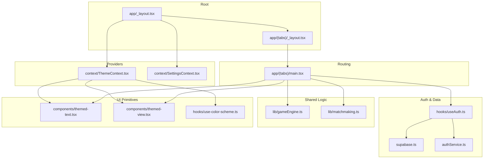
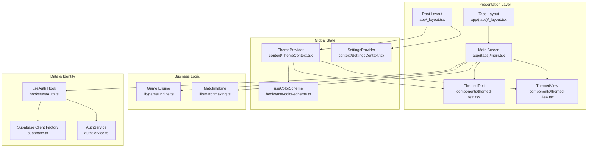
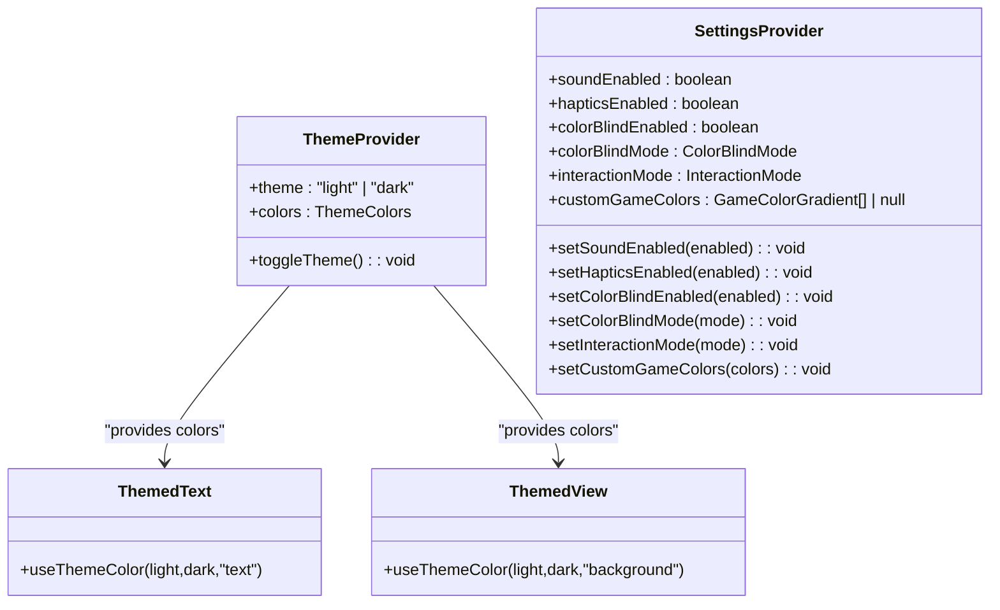
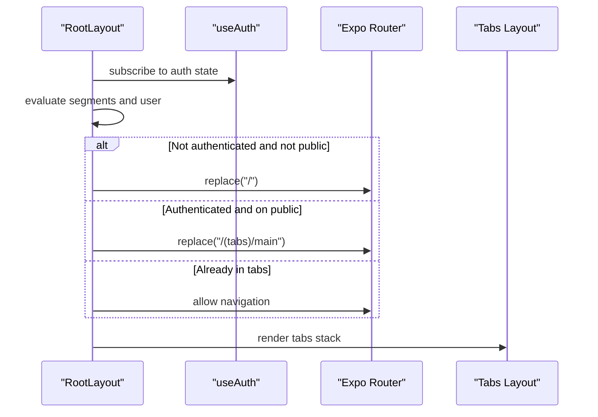
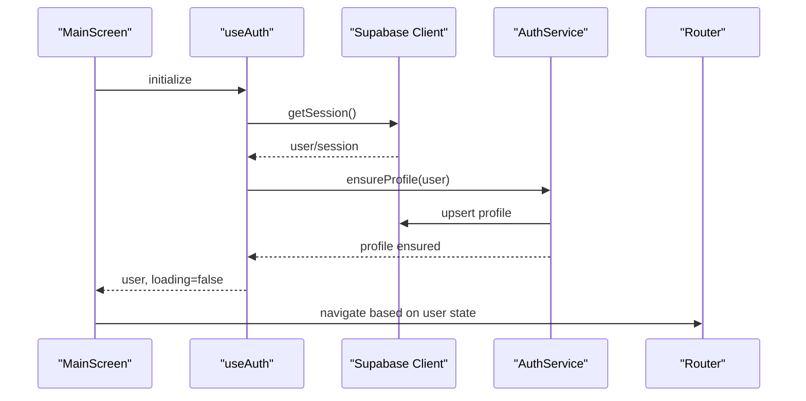
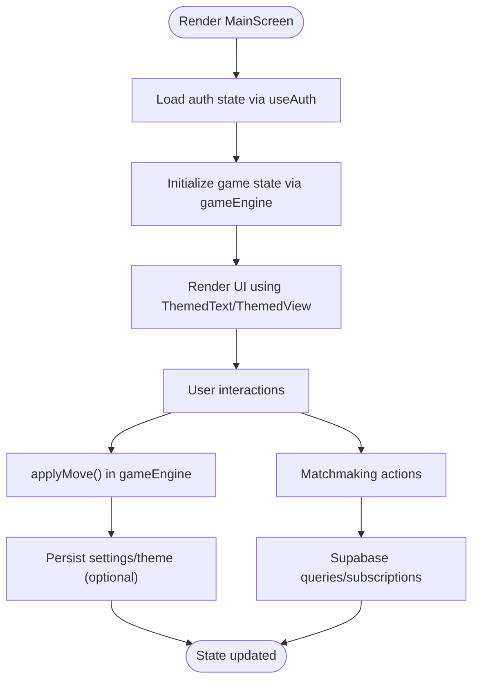
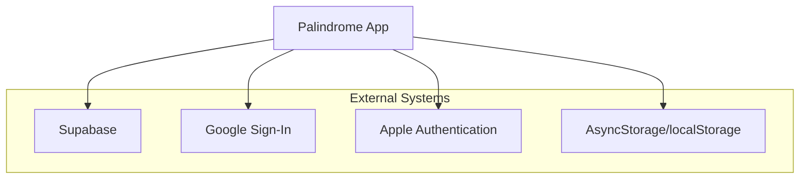
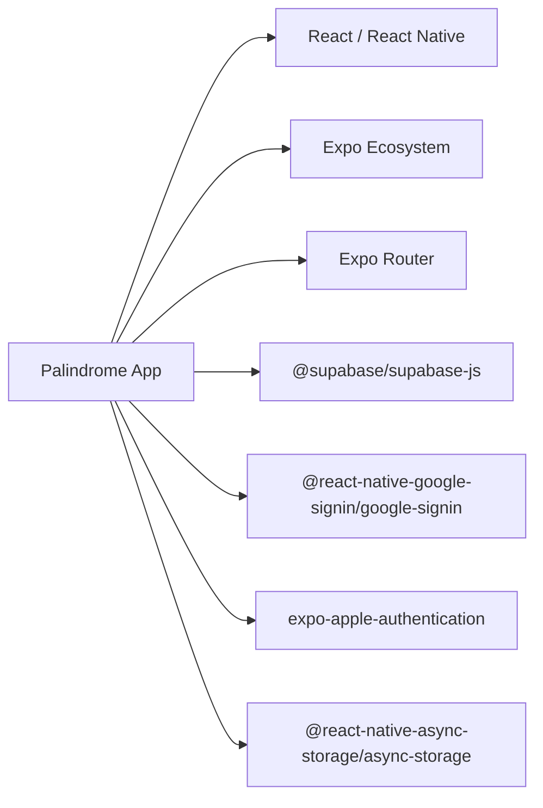

# System Architecture

<cite>
**Referenced Files in This Document**
- [package.json](file://package.json)
- [app/_layout.tsx](file://app/_layout.tsx)
- [app/(tabs)/_layout.tsx](file://app/(tabs)/_layout.tsx)
- [app/(tabs)/main.tsx](file://app/(tabs)/main.tsx)
- [context/ThemeContext.tsx](file://context/ThemeContext.tsx)
- [context/SettingsContext.tsx](file://context/SettingsContext.tsx)
- [hooks/useAuth.ts](file://hooks/useAuth.ts)
- [hooks/use-color-scheme.ts](file://hooks/use-color-scheme.ts)
- [supabase.ts](file://supabase.ts)
- [authService.ts](file://authService.ts)
- [constants/theme.ts](file://constants/theme.ts)
- [components/themed-text.tsx](file://components/themed-text.tsx)
- [components/themed-view.tsx](file://components/themed-view.tsx)
- [lib/gameEngine.ts](file://lib/gameEngine.ts)
- [lib/matchmaking.ts](file://lib/matchmaking.ts)
- [app.json](file://app.json)
</cite>

## Table of Contents
1. [Introduction](#introduction)
2. [Project Structure](#project-structure)
3. [Core Components](#core-components)
4. [Architecture Overview](#architecture-overview)
5. [Detailed Component Analysis](#detailed-component-analysis)
6. [Dependency Analysis](#dependency-analysis)
7. [Performance Considerations](#performance-considerations)
8. [Troubleshooting Guide](#troubleshooting-guide)
9. [Conclusion](#conclusion)

## Introduction
This document describes the system architecture of the Palindrome game. It covers the cross-platform design built with React Native and Expo Router, the provider pattern for global state, routing and navigation, separation of concerns between presentation, business logic, and data persistence, external integrations (Supabase, Google Sign-In, Apple Authentication), and platform-specific adaptations for iOS, Android, and Web. It also documents the global state management approach and how components interact through context providers.

## Project Structure
The project follows a conventional React Native + Expo structure with:
- Application entry via Expo Router under the app directory
- Providers for theme and settings at the root layout
- Feature-based routing under app/(tabs) for the main tabbed interface
- Business logic shared between platforms under lib
- Authentication and Supabase integration under dedicated modules
- Cross-platform UI primitives under components and hooks

**Diagram sources**
- [app/_layout.tsx](file://app/_layout.tsx#L1-L126)
- [app/(tabs)/_layout.tsx](file://app/(tabs)/_layout.tsx#L1-L13)
- [app/(tabs)/main.tsx](file://app/(tabs)/main.tsx#L1-L1019)
- [context/ThemeContext.tsx](file://context/ThemeContext.tsx#L1-L124)
- [context/SettingsContext.tsx](file://context/SettingsContext.tsx#L1-L187)
- [hooks/useAuth.ts](file://hooks/useAuth.ts#L1-L51)
- [supabase.ts](file://supabase.ts#L1-L75)
- [authService.ts](file://authService.ts#L1-L560)
- [lib/gameEngine.ts](file://lib/gameEngine.ts#L1-L284)
- [lib/matchmaking.ts](file://lib/matchmaking.ts#L1-L542)
- [components/themed-text.tsx](file://components/themed-text.tsx#L1-L61)
- [components/themed-view.tsx](file://components/themed-view.tsx#L1-L15)
- [hooks/use-color-scheme.ts](file://hooks/use-color-scheme.ts#L1-L8)

**Section sources**
- [package.json](file://package.json#L1-L68)
- [app/_layout.tsx](file://app/_layout.tsx#L1-L126)
- [app/(tabs)/_layout.tsx](file://app/(tabs)/_layout.tsx#L1-L13)
- [app.json](file://app.json#L1-L94)

## Core Components
- ThemeProvider and SettingsProvider: Global theme and user settings management with persistence.
- useAuth hook: Centralized authentication state and lifecycle using Supabase.
- Supabase client factory: Environment-aware client with platform-specific storage adapters.
- authService: OAuth flows for Google and Apple, session management, and profile operations.
- Routing: Expo Router Stack with protected routes and tab navigation.
- Shared game logic: Deterministic game engine and multiplayer matchmaking logic.
- UI primitives: ThemedText and ThemedView consume theme context for consistent styling.

**Section sources**
- [context/ThemeContext.tsx](file://context/ThemeContext.tsx#L1-L124)
- [context/SettingsContext.tsx](file://context/SettingsContext.tsx#L1-L187)
- [hooks/useAuth.ts](file://hooks/useAuth.ts#L1-L51)
- [supabase.ts](file://supabase.ts#L1-L75)
- [authService.ts](file://authService.ts#L1-L560)
- [app/_layout.tsx](file://app/_layout.tsx#L1-L126)
- [app/(tabs)/_layout.tsx](file://app/(tabs)/_layout.tsx#L1-L13)
- [lib/gameEngine.ts](file://lib/gameEngine.ts#L1-L284)
- [lib/matchmaking.ts](file://lib/matchmaking.ts#L1-L542)
- [components/themed-text.tsx](file://components/themed-text.tsx#L1-L61)
- [components/themed-view.tsx](file://components/themed-view.tsx#L1-L15)

## Architecture Overview
The system is a cross-platform React Native application using Expo Router for navigation. The root layout initializes providers for theme and settings, sets up the global gradient background, and enforces protected routes. Authentication state is derived from Supabase and used to redirect users appropriately. The tabs layout hosts the main application views. Shared business logic resides in lib modules for deterministic gameplay and multiplayer features. External dependencies include Supabase for authentication and real-time data, and Google Sign-In/Apple Authentication for identity.

**Diagram sources**
- [app/_layout.tsx](file://app/_layout.tsx#L1-L126)
- [app/(tabs)/_layout.tsx](file://app/(tabs)/_layout.tsx#L1-L13)
- [app/(tabs)/main.tsx](file://app/(tabs)/main.tsx#L1-L1019)
- [context/ThemeContext.tsx](file://context/ThemeContext.tsx#L1-L124)
- [context/SettingsContext.tsx](file://context/SettingsContext.tsx#L1-L187)
- [hooks/useAuth.ts](file://hooks/useAuth.ts#L1-L51)
- [supabase.ts](file://supabase.ts#L1-L75)
- [authService.ts](file://authService.ts#L1-L560)
- [lib/gameEngine.ts](file://lib/gameEngine.ts#L1-L284)
- [lib/matchmaking.ts](file://lib/matchmaking.ts#L1-L542)
- [components/themed-text.tsx](file://components/themed-text.tsx#L1-L61)
- [components/themed-view.tsx](file://components/themed-view.tsx#L1-L15)
- [hooks/use-color-scheme.ts](file://hooks/use-color-scheme.ts#L1-L8)

## Detailed Component Analysis

### Provider Pattern: ThemeProvider and SettingsProvider
- ThemeProvider manages light/dark theme selection, persists the preference, and exposes theme colors for UI components.
- SettingsProvider manages user preferences (sound, haptics, color-blind modes, interaction mode, custom game colors) and persists them to storage.
- Both providers wrap the app in app/_layout.tsx and expose hooks for consumption across the app.

**Diagram sources**
- [context/ThemeContext.tsx](file://context/ThemeContext.tsx#L1-L124)
- [context/SettingsContext.tsx](file://context/SettingsContext.tsx#L1-L187)
- [components/themed-text.tsx](file://components/themed-text.tsx#L1-L61)
- [components/themed-view.tsx](file://components/themed-view.tsx#L1-L15)

**Section sources**
- [context/ThemeContext.tsx](file://context/ThemeContext.tsx#L1-L124)
- [context/SettingsContext.tsx](file://context/SettingsContext.tsx#L1-L187)
- [hooks/use-color-scheme.ts](file://hooks/use-color-scheme.ts#L1-L8)
- [components/themed-text.tsx](file://components/themed-text.tsx#L1-L61)
- [components/themed-view.tsx](file://components/themed-view.tsx#L1-L15)

### Routing Architecture with Expo Router and Protected Routes
- Root layout configures fonts, splash screen, gradient background, and protected route logic using auth state.
- Tabs layout wraps child screens in a Stack with hidden headers.
- Navigation is programmatic via router methods in screens; protected routes redirect unauthenticated users to the login/signup route and authenticated users away from public routes.

**Diagram sources**
- [app/_layout.tsx](file://app/_layout.tsx#L56-L87)
- [hooks/useAuth.ts](file://hooks/useAuth.ts#L1-L51)
- [app/(tabs)/_layout.tsx](file://app/(tabs)/_layout.tsx#L1-L13)

**Section sources**
- [app/_layout.tsx](file://app/_layout.tsx#L1-L126)
- [hooks/useAuth.ts](file://hooks/useAuth.ts#L1-L51)
- [app/(tabs)/_layout.tsx](file://app/(tabs)/_layout.tsx#L1-L13)

### Authentication and Identity: Supabase, Google Sign-In, Apple Authentication
- Supabase client is created with environment variables and platform-specific storage adapters (AsyncStorage on native, localStorage on web, memory fallback otherwise).
- authService encapsulates OAuth flows for Google and Apple, handles redirects, exchanges codes for sessions, and manages user profiles.
- useAuth listens to Supabase auth state changes and ensures profile creation/update.

**Diagram sources**
- [hooks/useAuth.ts](file://hooks/useAuth.ts#L1-L51)
- [supabase.ts](file://supabase.ts#L1-L75)
- [authService.ts](file://authService.ts#L1-L560)
- [app/_layout.tsx](file://app/_layout.tsx#L56-L87)

**Section sources**
- [supabase.ts](file://supabase.ts#L1-L75)
- [authService.ts](file://authService.ts#L1-L560)
- [hooks/useAuth.ts](file://hooks/useAuth.ts#L1-L51)

### Separation of Concerns: Presentation, Business Logic, Data Persistence
- Presentation layer: Screens and UI primitives (ThemedText, ThemedView) consume theme and settings contexts.
- Business logic: lib/gameEngine.ts contains deterministic game mechanics; lib/matchmaking.ts encapsulates multiplayer logic and Supabase interactions.
- Data persistence: Theme and settings persisted via AsyncStorage; Supabase persists auth sessions and stores user data/profiles.

**Diagram sources**
- [app/(tabs)/main.tsx](file://app/(tabs)/main.tsx#L1-L1019)
- [lib/gameEngine.ts](file://lib/gameEngine.ts#L167-L219)
- [lib/matchmaking.ts](file://lib/matchmaking.ts#L58-L66)
- [context/SettingsContext.tsx](file://context/SettingsContext.tsx#L101-L157)
- [context/ThemeContext.tsx](file://context/ThemeContext.tsx#L77-L99)

**Section sources**
- [app/(tabs)/main.tsx](file://app/(tabs)/main.tsx#L1-L1019)
- [lib/gameEngine.ts](file://lib/gameEngine.ts#L1-L284)
- [lib/matchmaking.ts](file://lib/matchmaking.ts#L1-L542)
- [context/SettingsContext.tsx](file://context/SettingsContext.tsx#L1-L187)
- [context/ThemeContext.tsx](file://context/ThemeContext.tsx#L1-L124)

### System Boundaries and External Dependencies
- Supabase: Authentication, real-time subscriptions, database operations, storage uploads.
- Google Sign-In: Native OAuth flow for Android/iOS; web OAuth redirect flow.
- Apple Authentication: Native Apple login on iOS; OAuth fallback on web and Android.
- AsyncStorage/localStorage: Persistent storage for theme, settings, and auth sessions.
- Expo ecosystem: Router, navigation, fonts, splash, audio, haptics, web browser, and platform plugins.

**Diagram sources**
- [supabase.ts](file://supabase.ts#L1-L75)
- [authService.ts](file://authService.ts#L1-L560)
- [package.json](file://package.json#L13-L56)

**Section sources**
- [supabase.ts](file://supabase.ts#L1-L75)
- [authService.ts](file://authService.ts#L1-L560)
- [package.json](file://package.json#L13-L56)

### Platform-Specific Adaptations
- iOS: Uses Apple Authentication plugin, bundle identifiers, and permissions configured in app.json; supports table-top and edge-to-edge settings.
- Android: Configured with Google Services, permissions for audio recording, adaptive icons, and edge-to-edge support.
- Web: Uses localStorage for auth persistence, custom font injection, and splash screen tailored for web.

**Section sources**
- [app.json](file://app.json#L11-L40)
- [app/_layout.tsx](file://app/_layout.tsx#L11-L26)

## Dependency Analysis
The app depends on React Native and Expo ecosystem packages, with Supabase for backend services and Google/Apple for identity. The routing and navigation are handled by Expo Router. UI primitives depend on theme context for colors and typography.

**Diagram sources**
- [package.json](file://package.json#L13-L56)

**Section sources**
- [package.json](file://package.json#L13-L56)

## Performance Considerations
- Use memoization and stable callbacks to avoid unnecessary re-renders in screens and providers.
- Defer heavy computations off the UI thread and leverage native drivers for animations.
- Minimize real-time subscriptions to only what is needed and unsubscribe promptly.
- Persist settings and theme efficiently to reduce startup overhead.
- Keep shared logic pure and deterministic to enable predictable caching and testing.

## Troubleshooting Guide
- Authentication issues: Verify environment variables for Supabase and OAuth providers; ensure proper redirect URIs; confirm platform-specific configurations.
- Supabase client initialization: Confirm environment variables are present and storage adapter matches platform.
- Protected routes: Ensure auth state is loaded before navigation decisions; verify router.replace calls align with expected segments.
- Theme/settings persistence: Validate AsyncStorage/localStorage availability and keys; handle parsing errors gracefully.
- Real-time updates: Confirm channel subscriptions are established and cleaned up; use polling fallbacks when necessary.

**Section sources**
- [supabase.ts](file://supabase.ts#L42-L75)
- [authService.ts](file://authService.ts#L113-L179)
- [app/_layout.tsx](file://app/_layout.tsx#L72-L87)
- [context/ThemeContext.tsx](file://context/ThemeContext.tsx#L77-L99)
- [context/SettingsContext.tsx](file://context/SettingsContext.tsx#L57-L99)

## Conclusion
The Palindrome game employs a clean separation of concerns with a strong provider pattern for theme and settings, robust authentication via Supabase and OAuth providers, and a deterministic shared game engine. Expo Router provides a structured routing model with protected routes, while platform-specific adaptations ensure optimal experiences across iOS, Android, and Web. The architecture balances maintainability, scalability, and cross-platform consistency.