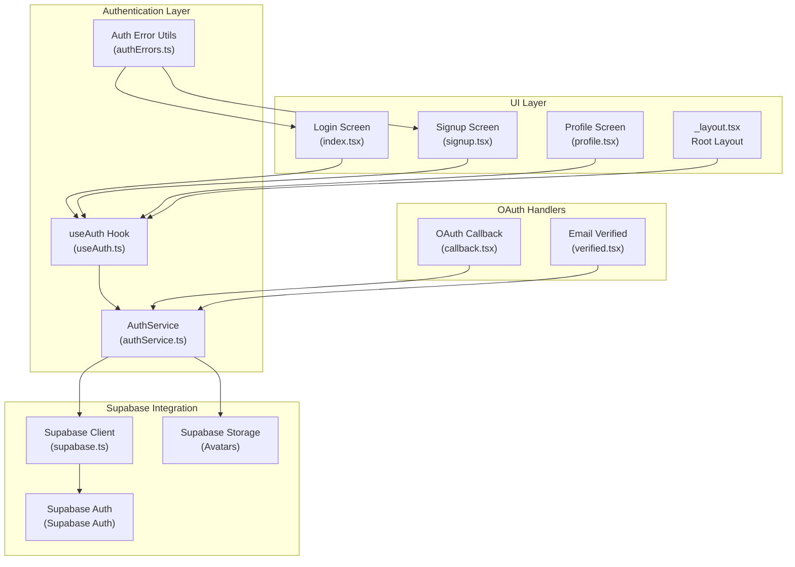
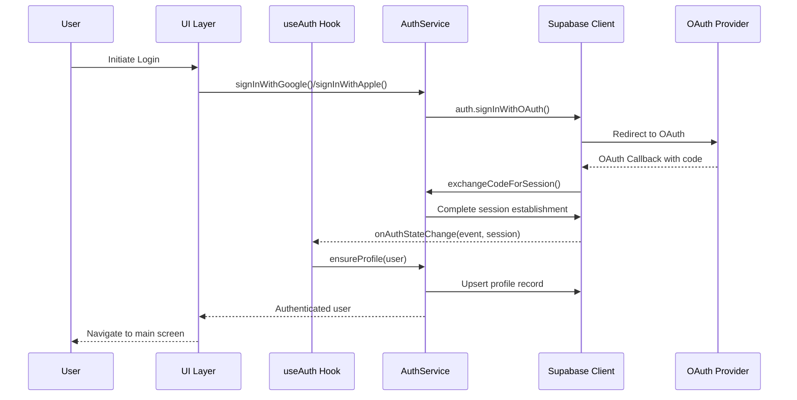
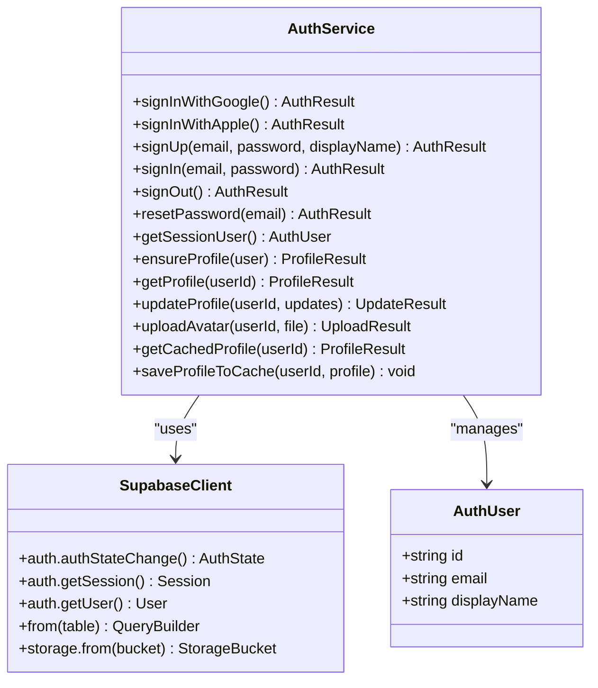
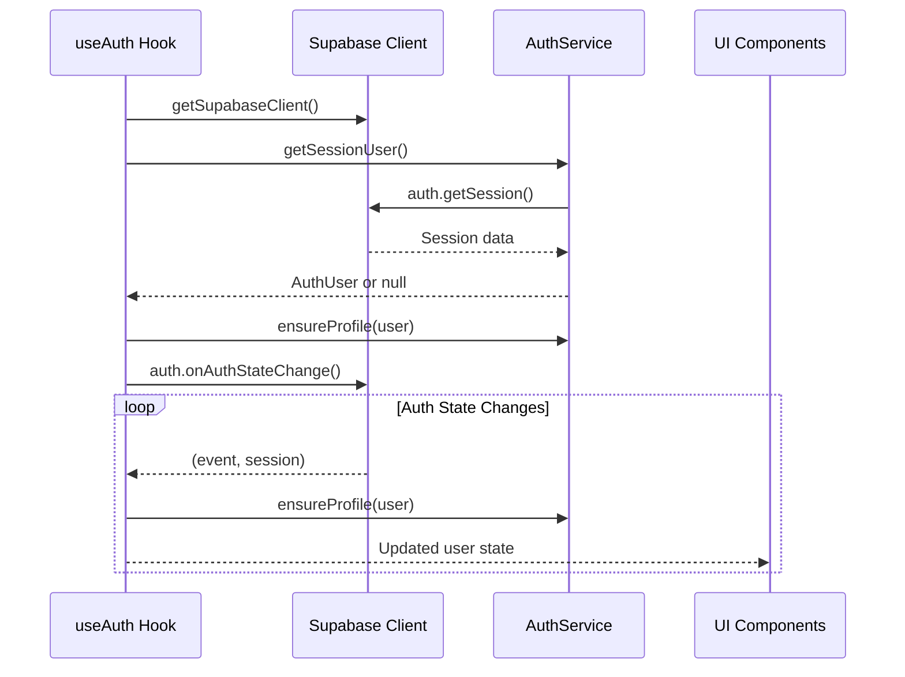
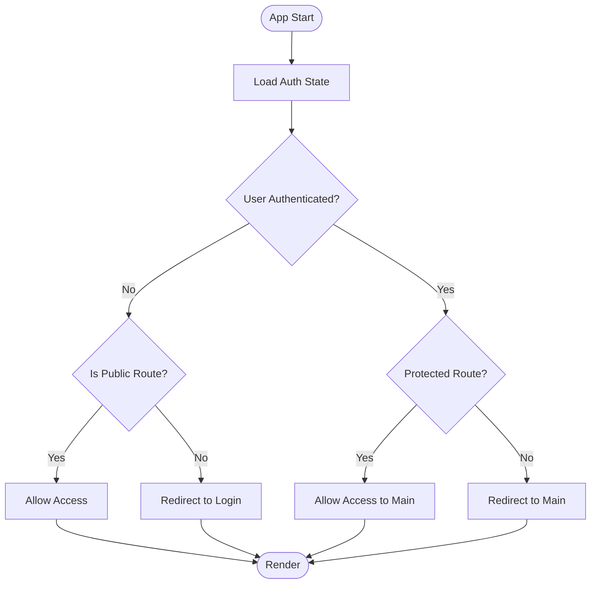
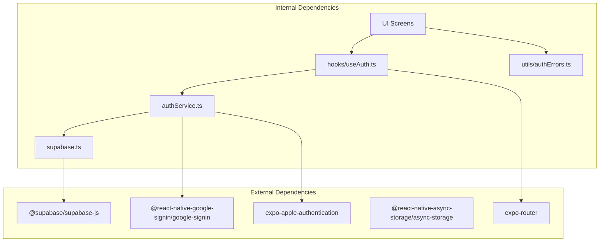

# Authentication System

<cite>
**Referenced Files in This Document**
- [authService.ts](file://authService.ts)
- [useAuth.ts](file://hooks/useAuth.ts)
- [supabase.ts](file://supabase.ts)
- [authErrors.ts](file://utils/authErrors.ts)
- [callback.tsx](file://app/auth/callback.tsx)
- [verified.tsx](file://app/auth/verified.tsx)
- [_layout.tsx](file://app/_layout.tsx)
- [index.tsx](file://app/(tabs)/index.tsx)
- [signup.tsx](file://app/(tabs)/signup.tsx)
- [profile.tsx](file://app/(tabs)/profile.tsx)
- [init_profiles.sql](file://supabase/migrations/20240127000000_init_profiles.sql)
</cite>

## Table of Contents
1. [Introduction](#introduction)
2. [Project Structure](#project-structure)
3. [Core Components](#core-components)
4. [Architecture Overview](#architecture-overview)
5. [Detailed Component Analysis](#detailed-component-analysis)
6. [Dependency Analysis](#dependency-analysis)
7. [Performance Considerations](#performance-considerations)
8. [Security Considerations](#security-considerations)
9. [Troubleshooting Guide](#troubleshooting-guide)
10. [Conclusion](#conclusion)

## Introduction
This document provides comprehensive documentation for the Palindrome game's authentication system. It covers the multi-provider authentication implementation supporting Google, Apple, and Email/Password authentication methods. The system integrates with Supabase Auth for secure authentication, session management, and user profile handling. It also documents the useAuth hook implementation, authentication guards, protected route handling, error handling strategies, and security considerations including password policies, email verification, and account recovery procedures.

## Project Structure
The authentication system spans several key areas:
- Authentication service layer encapsulating all authentication logic
- React hooks for state management and lifecycle handling
- Supabase client configuration for secure storage and session persistence
- Route guards and protected routing for navigation control
- OAuth callback and verification handlers for email/password flows
- Profile management with caching and avatar uploads

**Diagram sources**
- [index.tsx](file://app/(tabs)/index.tsx#L1-L479)
- [signup.tsx](file://app/(tabs)/signup.tsx#L1-L507)
- [profile.tsx](file://app/(tabs)/profile.tsx#L61-L143)
- [useAuth.ts](file://hooks/useAuth.ts#L1-L51)
- [authService.ts](file://authService.ts#L1-L560)
- [supabase.ts](file://supabase.ts#L1-L75)
- [callback.tsx](file://app/auth/callback.tsx#L1-L81)
- [verified.tsx](file://app/auth/verified.tsx#L1-L196)

**Section sources**
- [authService.ts](file://authService.ts#L1-L560)
- [useAuth.ts](file://hooks/useAuth.ts#L1-L51)
- [supabase.ts](file://supabase.ts#L1-L75)
- [callback.tsx](file://app/auth/callback.tsx#L1-L81)
- [verified.tsx](file://app/auth/verified.tsx#L1-L196)
- [_layout.tsx](file://app/_layout.tsx#L1-L126)

## Core Components
The authentication system consists of several core components working together:

### Authentication Service (AuthService)
The central authentication service provides:
- Multi-provider authentication support (Google, Apple, Email/Password)
- Session management and persistence
- User profile creation and caching
- Avatar upload and management
- OAuth redirect handling and completion
- Password reset functionality

### Authentication Hook (useAuth)
Provides reactive authentication state:
- Automatic session restoration on app startup
- Real-time auth state monitoring via Supabase
- User profile synchronization
- Loading state management

### Supabase Client Configuration
Handles secure storage and session persistence:
- Platform-specific storage implementations
- Automatic token refresh and session persistence
- Environment variable configuration
- Cross-platform compatibility (Web/Native)

**Section sources**
- [authService.ts](file://authService.ts#L61-L560)
- [useAuth.ts](file://hooks/useAuth.ts#L5-L50)
- [supabase.ts](file://supabase.ts#L42-L75)

## Architecture Overview
The authentication system follows a layered architecture with clear separation of concerns:

**Diagram sources**
- [authService.ts](file://authService.ts#L113-L179)
- [authService.ts](file://authService.ts#L181-L274)
- [useAuth.ts](file://hooks/useAuth.ts#L23-L41)
- [callback.tsx](file://app/auth/callback.tsx#L42-L47)

The architecture ensures:
- **Decoupled Providers**: Each authentication method is isolated and configurable
- **Centralized State Management**: Single source of truth for user authentication state
- **Automatic Session Persistence**: Sessions persist across app restarts
- **Real-time State Updates**: Instant propagation of authentication changes

## Detailed Component Analysis

### Authentication Service Implementation
The AuthService class provides comprehensive authentication capabilities:

#### Multi-Provider Support
The service supports three distinct authentication methods:

**Google Authentication**
- Web: Uses Supabase OAuth with automatic redirect handling
- Native: Integrates with Google Sign-In SDK for native platforms
- Token-based authentication with proper error handling

**Apple Authentication**
- Web: Standard OAuth flow with consent scope
- iOS: Native Apple Authentication with full name extraction
- Android: OAuth flow via WebBrowser for browser-based authentication

**Email/Password Authentication**
- Standard username/password authentication
- Built-in password reset functionality
- Email verification integration

#### Session Management
The service implements robust session management:
- Local session restoration without network calls
- Automatic session validation and cleanup
- Token refresh handling
- Graceful degradation for invalid sessions

#### Profile Management
Comprehensive user profile handling:
- Automatic profile creation on first login
- Caching mechanism for improved performance
- Avatar upload and management
- Real-time profile synchronization

**Diagram sources**
- [authService.ts](file://authService.ts#L61-L560)
- [supabase.ts](file://supabase.ts#L42-L75)

**Section sources**
- [authService.ts](file://authService.ts#L113-L274)
- [authService.ts](file://authService.ts#L360-L468)
- [authService.ts](file://authService.ts#L499-L559)

### Authentication Hook Implementation
The useAuth hook provides reactive authentication state:

**Diagram sources**
- [useAuth.ts](file://hooks/useAuth.ts#L9-L47)

The hook implements:
- **Automatic Initialization**: Restores session on component mount
- **Real-time Updates**: Subscribes to auth state changes
- **Memory Management**: Proper cleanup of subscriptions
- **Loading States**: Handles authentication loading states

**Section sources**
- [useAuth.ts](file://hooks/useAuth.ts#L5-L50)

### Supabase Client Configuration
The Supabase client handles secure storage and session persistence:

#### Platform-Specific Storage
- **Web**: Uses localStorage with fallback to memory storage
- **Native**: Uses AsyncStorage for persistent storage
- **Universal**: Abstracts storage interface for cross-platform compatibility

#### Session Persistence
- **Automatic Refresh**: Configured auto-refresh for tokens
- **Session Detection**: Detects sessions in URL for OAuth flows
- **Environment Configuration**: Reads from environment variables

**Section sources**
- [supabase.ts](file://supabase.ts#L42-L75)

### OAuth Callback and Verification Handlers
The system includes dedicated handlers for OAuth flows:

#### OAuth Callback Handler
Processes OAuth redirects and completes authentication:
- Parses OAuth URLs from both web and native contexts
- Handles error scenarios gracefully
- Completes session establishment with Supabase

#### Email Verification Handler
Manages email verification flows:
- Detects verification links in URLs
- Handles both verification and OAuth completion
- Provides user-friendly feedback

**Section sources**
- [callback.tsx](file://app/auth/callback.tsx#L12-L53)
- [verified.tsx](file://app/auth/verified.tsx#L44-L77)

### Protected Route Handling
The root layout implements authentication guards:

**Diagram sources**
- [_layout.tsx](file://app/_layout.tsx#L72-L87)

**Section sources**
- [_layout.tsx](file://app/_layout.tsx#L56-L87)

### Error Handling and User Experience
The system implements comprehensive error handling:

#### Friendly Error Messages
Localized error messages for common authentication issues:
- Invalid credentials
- Unverified email accounts
- Existing user accounts
- Weak password violations
- Rate limiting

#### User-Friendly Feedback
- Consistent error display across all authentication screens
- Contextual help for common issues
- Graceful degradation for network failures

**Section sources**
- [authErrors.ts](file://utils/authErrors.ts#L1-L13)
- [index.tsx](file://app/(tabs)/index.tsx#L45-L50)
- [signup.tsx](file://app/(tabs)/signup.tsx#L53-L58)

## Dependency Analysis
The authentication system has well-defined dependencies:

**Diagram sources**
- [authService.ts](file://authService.ts#L1-L11)
- [useAuth.ts](file://hooks/useAuth.ts#L1-L3)
- [supabase.ts](file://supabase.ts#L1-L5)

**Section sources**
- [authService.ts](file://authService.ts#L1-L11)
- [useAuth.ts](file://hooks/useAuth.ts#L1-L3)
- [supabase.ts](file://supabase.ts#L1-L5)

## Performance Considerations
The authentication system implements several performance optimizations:

### Caching Strategy
- **Profile Caching**: Async storage caching for user profiles
- **Session Restoration**: Fast local session restoration
- **Optimistic Updates**: Immediate UI updates with background sync

### Network Efficiency
- **Selective Fetching**: Only fetches necessary user data
- **Batch Operations**: Groups related operations when possible
- **Connection Pooling**: Reuses Supabase client instances

### Memory Management
- **Proper Cleanup**: Unsubscribes from auth state changes
- **Resource Cleanup**: Manages native module resources properly
- **Memory Leaks Prevention**: Uses proper React lifecycle management

## Security Considerations
The authentication system implements multiple security measures:

### Token Management
- **Secure Storage**: Platform-specific secure storage for tokens
- **Automatic Refresh**: Configured auto-refresh for tokens
- **Session Validation**: Validates sessions on app startup

### Password Policies
- **Server-Side Enforcement**: Supabase handles password strength
- **Rate Limiting**: Built-in rate limiting for authentication attempts
- **Account Lockout**: Configurable account lockout mechanisms

### Email Verification
- **Automatic Verification**: Email verification during registration
- **Resend Capability**: Ability to resend verification emails
- **Verification Links**: Secure verification link handling

### OAuth Security
- **State Parameters**: Proper OAuth state parameter handling
- **PKCE Support**: Proof Key for Code Exchange for enhanced security
- **Redirect URI Validation**: Validates OAuth redirect URIs

### Data Protection
- **Profile Privacy**: Controlled access to user profile data
- **Avatar Security**: Secure avatar upload and access control
- **Audit Logging**: Tracks authentication events for security monitoring

**Section sources**
- [supabase.ts](file://supabase.ts#L64-L71)
- [init_profiles.sql](file://supabase/migrations/20240127000000_init_profiles.sql#L48-L60)

## Troubleshooting Guide

### Common Authentication Issues

#### Google Sign-In Problems
**Issue**: Google Sign-In fails on native platforms
**Solution**: 
- Verify Google Play Services availability
- Check Google Services configuration
- Ensure proper OAuth client ID setup

**Issue**: Google OAuth callback not working
**Solution**:
- Verify redirect URI configuration
- Check deep linking setup for native apps
- Ensure callback URL matches configured redirect

#### Apple Authentication Challenges
**Issue**: Apple Sign-In not working on iOS
**Solution**:
- Verify App Store Connect configuration
- Check bundle identifier setup
- Ensure proper capability configuration

**Issue**: Apple OAuth flow issues on web
**Solution**:
- Verify domain verification
- Check Safari authentication configuration
- Ensure proper redirect URI setup

#### Email/Password Issues
**Issue**: Email verification not received
**Solution**:
- Check spam/junk folder
- Verify email address format
- Resend verification email

**Issue**: Password reset not working
**Solution**:
- Verify email delivery
- Check rate limiting
- Ensure proper reset link handling

#### Session Management Problems
**Issue**: Users logged out unexpectedly
**Solution**:
- Check token expiration settings
- Verify session persistence
- Review refresh token handling

**Issue**: Session not restored on app restart
**Solution**:
- Verify AsyncStorage configuration
- Check platform-specific storage setup
- Review session validation logic

### Platform-Specific Issues

#### Web Platform
- **Browser Compatibility**: Ensure modern browser support
- **HTTPS Requirements**: OAuth requires HTTPS in production
- **Popup Blocking**: Handle popup blocking scenarios

#### Native Platforms
- **Google Play Services**: Required for Google Sign-In
- **Deep Linking**: Proper URI scheme configuration
- **Permissions**: Required permissions for authentication

### Debugging Tips
1. **Enable Supabase Debug Logs**: Check network requests and responses
2. **Monitor Auth State Changes**: Track authentication state transitions
3. **Check Environment Variables**: Verify Supabase configuration
4. **Review Console Logs**: Monitor authentication flow logs
5. **Test in Incognito Mode**: Isolate browser-specific issues

**Section sources**
- [authService.ts](file://authService.ts#L160-L175)
- [callback.tsx](file://app/auth/callback.tsx#L17-L20)
- [verified.tsx](file://app/auth/verified.tsx#L69-L75)

## Conclusion
The Palindrome game's authentication system provides a robust, secure, and user-friendly authentication experience across multiple platforms. The implementation successfully integrates Google, Apple, and Email/Password authentication methods while maintaining strong security practices and providing excellent user experience through real-time state management, comprehensive error handling, and intuitive UI flows.

Key strengths of the system include:
- **Multi-Provider Support**: Seamless integration of various authentication providers
- **Cross-Platform Compatibility**: Consistent behavior across web and native platforms
- **Security First Design**: Comprehensive security measures and best practices
- **Developer Experience**: Clean APIs and comprehensive error handling
- **Performance Optimization**: Efficient caching and session management

The system is well-structured, maintainable, and ready for production deployment with proper configuration and environment setup.