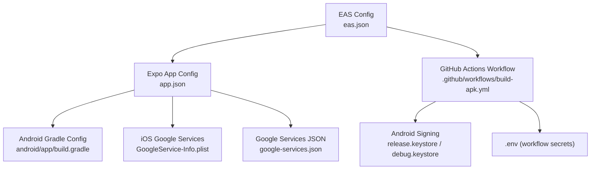
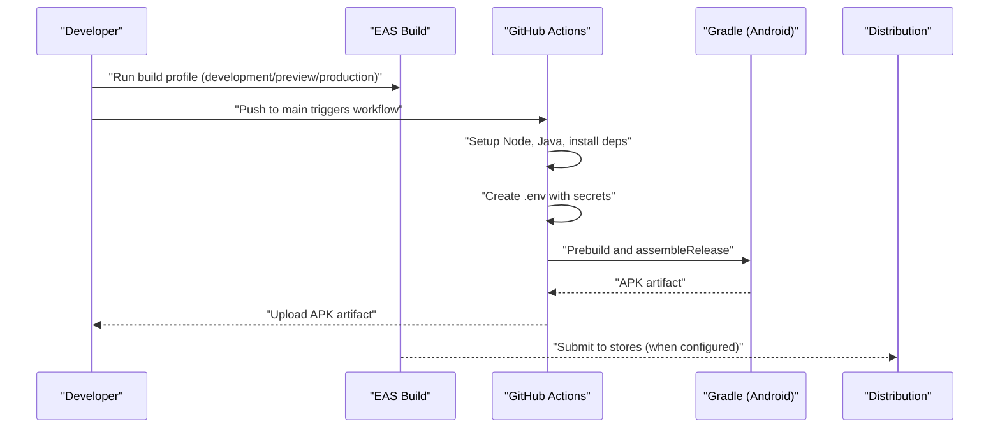
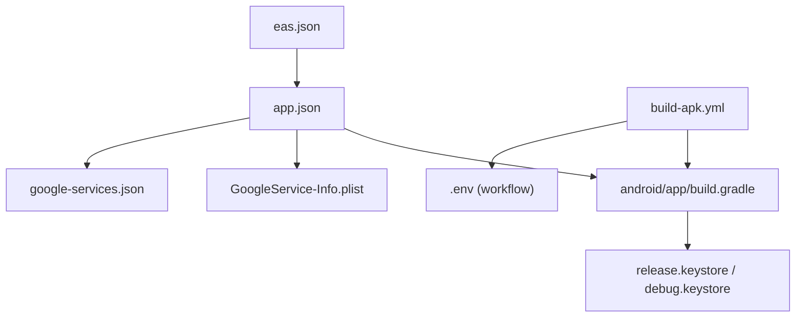

# Build and Deployment

<cite>
**Referenced Files in This Document**
- [eas.json](file://eas.json)
- [app.json](file://app.json)
- [package.json](file://package.json)
- [.github/workflows/build-apk.yml](file://.github/workflows/build-apk.yml)
- [.env](file://.env)
- [GoogleService-Info.plist](file://GoogleService-Info.plist)
- [google-services.json](file://google-services.json)
- [android/build.gradle](file://android/build.gradle)
- [android/gradle.properties](file://android/gradle.properties)
- [android/app/build.gradle](file://android/app/build.gradle)
- [android/settings.gradle](file://android/settings.gradle)
- [android/gradlew](file://android/gradlew)
- [android/app/debug.keystore](file://android/app/debug.keystore)
- [release.keystore](file://release.keystore)
</cite>

## Table of Contents
1. [Introduction](#introduction)
2. [Project Structure](#project-structure)
3. [Core Components](#core-components)
4. [Architecture Overview](#architecture-overview)
5. [Detailed Component Analysis](#detailed-component-analysis)
6. [Dependency Analysis](#dependency-analysis)
7. [Performance Considerations](#performance-considerations)
8. [Troubleshooting Guide](#troubleshooting-guide)
9. [Conclusion](#conclusion)
10. [Appendices](#appendices)

## Introduction
This document explains how to build and deploy the Palindrome application using Expo Application Services (EAS) and GitHub Actions. It covers EAS build profiles, environment variables, native Android APK builds, optional iOS distribution, CI/CD automation, code signing, distribution strategies, development workflows, and production best practices. It also provides troubleshooting guidance for common build and deployment issues.

## Project Structure
The repository integrates:
- EAS configuration for development, preview, and production builds
- Expo app configuration for Android and iOS identifiers, plugins, and metadata
- GitHub Actions workflow to automate Android APK builds
- Android Gradle configuration for signing, packaging, and build variants
- Firebase/Google Services configuration files for authentication and cloud features
- Environment variables for Supabase and Google client IDs

**Diagram sources**
- [eas.json](file://eas.json#L1-L25)
- [app.json](file://app.json#L1-L94)
- [android/app/build.gradle](file://android/app/build.gradle#L1-L184)
- [GoogleService-Info.plist](file://GoogleService-Info.plist#L1-L32)
- [.github/workflows/build-apk.yml](file://.github/workflows/build-apk.yml#L1-L75)
- [release.keystore](file://release.keystore)
- [android/app/debug.keystore](file://android/app/debug.keystore)
- [google-services.json](file://google-services.json#L1-L54)
- [.env](file://.env#L1-L14)

**Section sources**
- [eas.json](file://eas.json#L1-L25)
- [app.json](file://app.json#L1-L94)
- [.github/workflows/build-apk.yml](file://.github/workflows/build-apk.yml#L1-L75)
- [android/app/build.gradle](file://android/app/build.gradle#L1-L184)
- [google-services.json](file://google-services.json#L1-L54)
- [GoogleService-Info.plist](file://GoogleService-Info.plist#L1-L32)
- [.env](file://.env#L1-L14)

## Core Components
- EAS build profiles define development, preview, and production configurations, including environment variables for preview and Android build type.
- Expo app configuration defines app identifiers, permissions, plugins, and metadata for Android and iOS.
- GitHub Actions workflow automates Android APK builds, environment injection, prebuild, keystore decoding, and artifact upload.
- Android Gradle configuration controls signing, minification, packaging, and resource crunching.
- Google Services configuration files integrate Firebase/Google authentication and cloud services.
- Environment variables supply Supabase and Google client IDs for runtime configuration.

**Section sources**
- [eas.json](file://eas.json#L5-L24)
- [app.json](file://app.json#L11-L34)
- [.github/workflows/build-apk.yml](file://.github/workflows/build-apk.yml#L31-L75)
- [android/gradle.properties](file://android/gradle.properties#L1-L68)
- [android/app/build.gradle](file://android/app/build.gradle#L100-L123)
- [google-services.json](file://google-services.json#L1-L54)
- [GoogleService-Info.plist](file://GoogleService-Info.plist#L1-L32)
- [.env](file://.env#L8-L12)

## Architecture Overview
The build and deployment pipeline connects developer actions to automated CI and EAS services.

**Diagram sources**
- [eas.json](file://eas.json#L5-L24)
- [.github/workflows/build-apk.yml](file://.github/workflows/build-apk.yml#L1-L75)
- [android/app/build.gradle](file://android/app/build.gradle#L108-L123)

## Detailed Component Analysis

### EAS Configuration
- CLI version requirement ensures compatibility with modern EAS tooling.
- Build profiles:
  - development: internal distribution with development client enabled.
  - preview: injects Supabase URL and anonymous key; Android build type set to APK.
  - production: placeholder for future store submission configuration.
- Submit profile: production placeholder for automated store submissions.

Best practices:
- Keep preview environment variables scoped to non-production keys.
- Use EAS Build to manage credentials and avoid committing secrets to the repository.

**Section sources**
- [eas.json](file://eas.json#L1-L25)

### Expo App Configuration (app.json)
- App identity:
  - iOS bundle identifier and Google Services file path.
  - Android package name and Google Services file path.
- Permissions and features:
  - Audio recording and audio modification permissions.
  - Edge-to-edge and predictive back gesture settings.
- Plugins and experiments:
  - Router, font loading, Apple Authentication, Google Sign-In, Splash Screen, Build Properties, Audio.
  - New architecture enabled and Kotlin version specified.
- Extra metadata:
  - EAS project ID for EAS-managed builds.

**Section sources**
- [app.json](file://app.json#L11-L34)
- [app.json](file://app.json#L46-L79)
- [app.json](file://app.json#L86-L91)

### GitHub Actions Workflow (Android APK)
- Triggers on pushes to main branch.
- Steps:
  - Checkout repository.
  - Setup Node.js 20.x and npm cache.
  - Setup Java 17 (Temurin).
  - Install dependencies with npm ci.
  - Create .env file with Supabase and Google client IDs.
  - Prebuild for Android platform.
  - Decode Android keystore from base64 secret if present.
  - Build release APK with optional keystore parameters.
  - Upload APK artifact.

Security and reliability:
- Keystore decoding is gated by presence of the base64 secret.
- JVM memory settings are increased for Gradle tasks.

**Section sources**
- [.github/workflows/build-apk.yml](file://.github/workflows/build-apk.yml#L1-L75)
- [.env](file://.env#L8-L12)

### Android Gradle Configuration
- Top-level buildscript includes Google Services, Android Gradle Plugin, and Kotlin.
- Project-wide repositories include Google and Maven Central.
- Root project plugins include Expo root project and React Native root project.
- Module-level configuration:
  - React Native and Hermes integration.
  - Debug and release signing configs; release defaults to debug keystore.
  - Packaging options and PNG crunching toggles.
  - Google Services plugin applied for Firebase integration.

Build properties:
- JVM args, parallel builds, AndroidX, architectures, new architecture, Hermes, edge-to-edge, and packaging options are tuned for performance and compatibility.

**Section sources**
- [android/build.gradle](file://android/build.gradle#L1-L26)
- [android/app/build.gradle](file://android/app/build.gradle#L100-L133)
- [android/gradle.properties](file://android/gradle.properties#L13-L68)

### Google Services Integration
- google-services.json:
  - Contains Android client info, OAuth clients, API keys, and service configuration.
  - Includes certificate hash for SHA-1 validation.
- GoogleService-Info.plist:
  - iOS bundle ID, API key, GCM sender ID, and Google app ID for Firebase.

Usage:
- Place these files in the appropriate project paths referenced by app.json and Gradle configuration.

**Section sources**
- [google-services.json](file://google-services.json#L1-L54)
- [GoogleService-Info.plist](file://GoogleService-Info.plist#L1-L32)

### Environment Management and Secrets
- Local .env:
  - Supabase URL and keys, Google web/native client IDs.
- Workflow .env creation:
  - Supabase and Google web client ID injected during CI.
- GitHub Actions secrets:
  - ANDROID_KEYSTORE_BASE64, ANDROID_KEYSTORE_PASSWORD, ANDROID_KEY_ALIAS, ANDROID_KEY_PASSWORD.

Recommendations:
- Store keystore securely and avoid committing binaries.
- Use repository secrets for sensitive values.
- Keep environment variables minimal and scoped to required features.

**Section sources**
- [.env](file://.env#L8-L12)
- [.github/workflows/build-apk.yml](file://.github/workflows/build-apk.yml#L31-L50)
- [.github/workflows/build-apk.yml](file://.github/workflows/build-apk.yml#L40-L68)

### Code Signing and Distribution
- Debug keystore:
  - Included under android/app/debug.keystore for local development.
- Release keystore:
  - Provided as release.keystore; decoded from base64 in CI when available.
- Android signing in Gradle:
  - Debug signing config is default for release builds.
  - CI passes keystore path and passwords via Gradle project properties.

Distribution strategies:
- Internal testing: development profile with internal distribution.
- Preview builds: preview profile with environment variables and APK output.
- Production: configure EAS submit profile and store credentials for App Store Connect and Google Play Console.

**Section sources**
- [android/app/debug.keystore](file://android/app/debug.keystore)
- [release.keystore](file://release.keystore)
- [android/app/build.gradle](file://android/app/build.gradle#L100-L123)
- [.github/workflows/build-apk.yml](file://.github/workflows/build-apk.yml#L40-L68)

### Development Build Process and Hot Reloading
- Scripts:
  - start, android, ios, web, lint.
- Development client:
  - EAS development profile enables development client for quick iteration.
- Hot reloading:
  - Expo CLI supports fast refresh and live reload during development.

**Section sources**
- [package.json](file://package.json#L5-L12)
- [eas.json](file://eas.json#L6-L9)

### iOS Distribution (Conceptual)
- app.json references iOS Google Services file and bundle identifier.
- Configure EAS submit profile and Apple credentials for TestFlight/App Store.
- Ensure InfoPlist settings and permissions align with Apple guidelines.

[No sources needed since this section does not analyze specific files]

## Dependency Analysis
The build pipeline depends on coordinated configuration across EAS, Expo, Gradle, and GitHub Actions.

**Diagram sources**
- [eas.json](file://eas.json#L1-L25)
- [app.json](file://app.json#L11-L34)
- [android/app/build.gradle](file://android/app/build.gradle#L100-L133)
- [GoogleService-Info.plist](file://GoogleService-Info.plist#L1-L32)
- [.github/workflows/build-apk.yml](file://.github/workflows/build-apk.yml#L1-L75)
- [google-services.json](file://google-services.json#L1-L54)

**Section sources**
- [eas.json](file://eas.json#L1-L25)
- [app.json](file://app.json#L11-L34)
- [android/app/build.gradle](file://android/app/build.gradle#L100-L133)
- [.github/workflows/build-apk.yml](file://.github/workflows/build-apk.yml#L1-L75)

## Performance Considerations
- Gradle JVM args and parallel builds improve build throughput.
- PNG crunching and resource shrinking reduce APK size in release builds.
- New architecture and Hermes are enabled for improved performance and startup speed.
- Packaging options and legacy packaging toggles balance compatibility and size.

[No sources needed since this section provides general guidance]

## Troubleshooting Guide
Common issues and resolutions:

- Missing or invalid keystore in CI:
  - Symptom: Build falls back to debug keystore; Google Sign-In may fail if SHA-1 is not whitelisted.
  - Resolution: Ensure ANDROID_KEYSTORE_BASE64 secret exists and is valid; confirm keystore password and alias secrets.

- Environment variables not applied:
  - Symptom: Preview build uses default values or fails at runtime.
  - Resolution: Verify EAS preview env variables and workflow-created .env entries; ensure keys match expected runtime variables.

- Gradle memory errors:
  - Symptom: OutOfMemoryError during assembleRelease.
  - Resolution: Increase JVM args via org.gradle.jvmargs in gradle.properties or pass ORG_GRADLE_PROJECT_jvmargs in CI.

- Duplicate native libraries or packaging conflicts:
  - Symptom: Packaging errors or runtime crashes.
  - Resolution: Review packagingOptions pickFirsts and excludes; align with project’s native dependencies.

- SHA-1 mismatch for Google Sign-In:
  - Symptom: Authentication failures on Android.
  - Resolution: Ensure google-services.json certificate hash matches the signing certificate used in release builds.

- EAS build failures:
  - Symptom: Build job exits early or cannot resolve dependencies.
  - Resolution: Confirm EAS CLI version, prebuild succeeds, and required secrets are present; check logs for missing environment variables.

**Section sources**
- [.github/workflows/build-apk.yml](file://.github/workflows/build-apk.yml#L40-L68)
- [android/gradle.properties](file://android/gradle.properties#L13-L13)
- [android/app/build.gradle](file://android/app/build.gradle#L124-L133)
- [google-services.json](file://google-services.json#L20-L22)
- [eas.json](file://eas.json#L11-L14)

## Conclusion
The Palindrome application leverages EAS for streamlined builds and GitHub Actions for automated Android APK generation. Proper environment management, secure keystore handling, and aligned Gradle configuration ensure reliable development and production deployments. Extend the configuration to support iOS distribution and production store submissions as the project evolves.

## Appendices

### Appendix A: EAS Build Profiles Summary
- development: internal distribution with development client.
- preview: environment variables for Supabase and Android APK build.
- production: placeholder for store submission.

**Section sources**
- [eas.json](file://eas.json#L5-L24)

### Appendix B: Android Build Types and Signing
- Debug signing config included; release defaults to debug signing.
- Optional release keystore integration via CI secrets.

**Section sources**
- [android/app/build.gradle](file://android/app/build.gradle#L100-L123)
- [.github/workflows/build-apk.yml](file://.github/workflows/build-apk.yml#L40-L68)

### Appendix C: Environment Variables Reference
- Supabase URL and keys.
- Google web and native client IDs.

**Section sources**
- [.env](file://.env#L8-L12)
- [eas.json](file://eas.json#L11-L14)