# Database Schema

<cite>
**Referenced Files in This Document**
- [20240127000000_init_profiles.sql](file://supabase/migrations/20240127000000_init_profiles.sql)
- [20250205000000_multiplayer_tables.sql](file://supabase/migrations/20250205000000_multiplayer_tables.sql)
- [20250205100000_fix_match_players_rls_recursion.sql](file://supabase/migrations/20250205100000_fix_match_players_rls_recursion.sql)
- [20250205200000_fix_matches_insert_rls.sql](file://supabase/migrations/20250205200000_fix_matches_insert_rls.sql)
- [20250205300000_allow_join_by_invite_code.sql](file://supabase/migrations/20250205300000_allow_join_by_invite_code.sql)
- [20250205400000_abandoned_match_cancel.sql](file://supabase/migrations/20250205400000_abandoned_match_cancel.sql)
- [20250205500000_rematch_requests.sql](file://supabase/migrations/20250205500000_rematch_requests.sql)
- [20250206000000_atomic_quick_match.sql](file://supabase/migrations/20250206000000_atomic_quick_match.sql)
- [20250206100000_friends_and_challenges.sql](file://supabase/migrations/20250206100000_friends_and_challenges.sql)
- [20250206110000_notifications.sql](file://supabase/migrations/20250206110000_notifications.sql)
- [supabase.ts](file://supabase.ts)
- [.env](file://.env)
- [notifications.ts](file://lib/notifications.ts)
- [friends.ts](file://lib/friends.ts)
- [matchmaking.ts](file://lib/matchmaking.ts)
</cite>

## Table of Contents
1. [Introduction](#introduction)
2. [Project Structure](#project-structure)
3. [Core Components](#core-components)
4. [Architecture Overview](#architecture-overview)
5. [Detailed Component Analysis](#detailed-component-analysis)
6. [Dependency Analysis](#dependency-analysis)
7. [Performance Considerations](#performance-considerations)
8. [Troubleshooting Guide](#troubleshooting-guide)
9. [Conclusion](#conclusion)
10. [Appendices](#appendices)

## Introduction
This document provides comprehensive database schema documentation for the Palindrome Supabase implementation. It covers the complete table structure for profiles, matches, match_players, friends, challenges, rematch_requests, and notifications. It explains relationships, foreign keys, indexing strategies, row-level security (RLS) policies, migration management, schema evolution, data integrity constraints, Supabase configuration, authentication integration, real-time subscriptions, validation rules, and performance optimization. It also outlines common data access patterns and how they integrate with the application’s service layer.

## Project Structure
The database schema is managed via Supabase migrations under the migrations directory. The client-side Supabase configuration and authentication integration are centralized in a dedicated module. Application services consume the database through Supabase queries and real-time subscriptions.

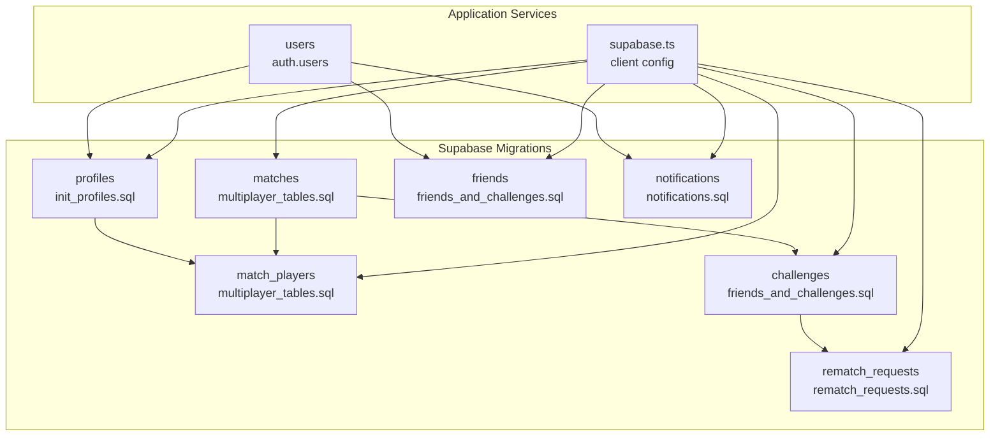

**Diagram sources**
- [20240127000000_init_profiles.sql](file://supabase/migrations/20240127000000_init_profiles.sql#L1-L61)
- [20250205000000_multiplayer_tables.sql](file://supabase/migrations/20250205000000_multiplayer_tables.sql#L1-L84)
- [20250206100000_friends_and_challenges.sql](file://supabase/migrations/20250206100000_friends_and_challenges.sql#L1-L50)
- [20250205500000_rematch_requests.sql](file://supabase/migrations/20250205500000_rematch_requests.sql#L1-L37)
- [20250206110000_notifications.sql](file://supabase/migrations/20250206110000_notifications.sql#L1-L28)
- [supabase.ts](file://supabase.ts#L1-L75)

**Section sources**
- [20240127000000_init_profiles.sql](file://supabase/migrations/20240127000000_init_profiles.sql#L1-L61)
- [20250205000000_multiplayer_tables.sql](file://supabase/migrations/20250205000000_multiplayer_tables.sql#L1-L84)
- [20250206100000_friends_and_challenges.sql](file://supabase/migrations/20250206100000_friends_and_challenges.sql#L1-L50)
- [20250205500000_rematch_requests.sql](file://supabase/migrations/20250205500000_rematch_requests.sql#L1-L37)
- [20250206110000_notifications.sql](file://supabase/migrations/20250206110000_notifications.sql#L1-L28)
- [supabase.ts](file://supabase.ts#L1-L75)

## Core Components
- Profiles: User metadata and avatar storage integration.
- Matches: Game sessions with lifecycle and timing controls.
- Match Players: Per-match participant records with scores and submission tracking.
- Friends: Bidirectional friendship requests with acceptance workflow.
- Challenges: Invite-based match invitations between users.
- Rematch Requests: Post-match request mechanism with acceptance/decline.
- Notifications: User-targeted alerts for friend requests, challenges, and app updates.

**Section sources**
- [20240127000000_init_profiles.sql](file://supabase/migrations/20240127000000_init_profiles.sql#L1-L61)
- [20250205000000_multiplayer_tables.sql](file://supabase/migrations/20250205000000_multiplayer_tables.sql#L1-L84)
- [20250206100000_friends_and_challenges.sql](file://supabase/migrations/20250206100000_friends_and_challenges.sql#L1-L50)
- [20250205500000_rematch_requests.sql](file://supabase/migrations/20250205500000_rematch_requests.sql#L1-L37)
- [20250206110000_notifications.sql](file://supabase/migrations/20250206110000_notifications.sql#L1-L28)

## Architecture Overview
The database enforces strict access control via RLS and exposes tables to the client through Supabase Auth and real-time. Application services encapsulate CRUD and real-time subscription logic, ensuring consistent data access patterns.

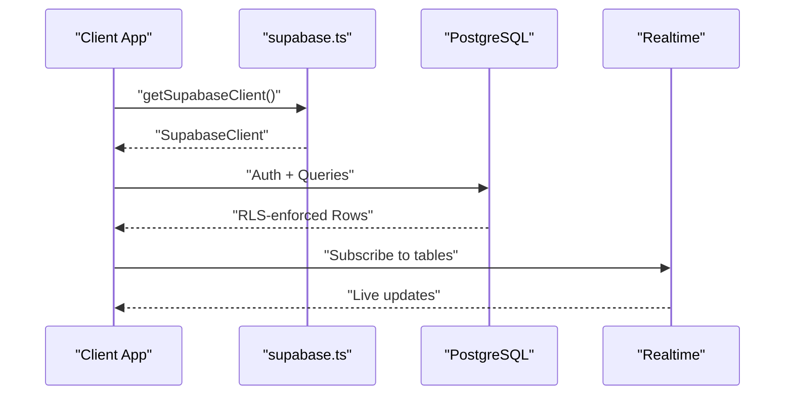

**Diagram sources**
- [supabase.ts](file://supabase.ts#L42-L74)
- [20250205000000_multiplayer_tables.sql](file://supabase/migrations/20250205000000_multiplayer_tables.sql#L83-L84)
- [20250206110000_notifications.sql](file://supabase/migrations/20250206110000_notifications.sql#L1-L28)

## Detailed Component Analysis

### Profiles
- Purpose: Store user public profile data linked to Supabase Auth users.
- Key constraints:
  - Primary key: user UUID referencing auth.users with cascade delete.
  - Username length check.
- RLS:
  - Selectable by everyone.
  - Insert/update restricted to the owning user.
- Storage:
  - Avatar bucket created and exposed via policies.
- Trigger:
  - Automatically inserts a profile row when a new user registers.

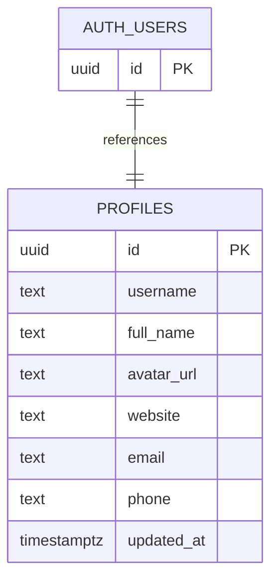

**Diagram sources**
- [20240127000000_init_profiles.sql](file://supabase/migrations/20240127000000_init_profiles.sql#L2-L13)
- [20240127000000_init_profiles.sql](file://supabase/migrations/20240127000000_init_profiles.sql#L28-L46)

**Section sources**
- [20240127000000_init_profiles.sql](file://supabase/migrations/20240127000000_init_profiles.sql#L1-L61)

### Matches
- Purpose: Represent asynchronous race-style game sessions.
- Lifecycle:
  - Statuses: waiting, active, finished, cancelled.
  - Modes: race (single mode defined).
  - Timing: time_limit_seconds, optional invite_code for private matches.
- Integrity:
  - Unique invite_code.
  - Created_by tracks initial creator for access control.
- RLS:
  - Select: participants, creator, or any authenticated user when status = waiting.
  - Insert: authenticated users.
  - Update: participants or creator.
- Background maintenance:
  - pg_cron scheduled job cancels abandoned matches after 60 seconds if less than two players.

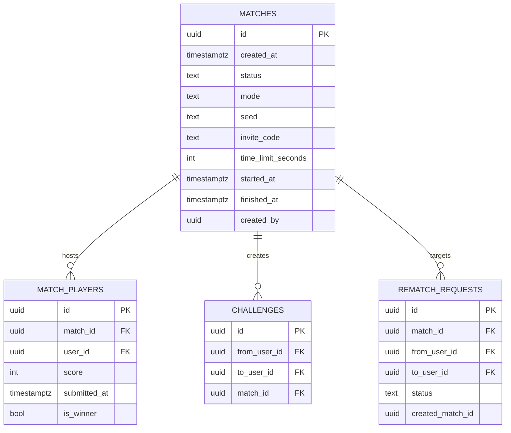

**Diagram sources**
- [20250205000000_multiplayer_tables.sql](file://supabase/migrations/20250205000000_multiplayer_tables.sql#L3-L13)
- [20250205200000_fix_matches_insert_rls.sql](file://supabase/migrations/20250205200000_fix_matches_insert_rls.sql#L4-L19)
- [20250205400000_abandoned_match_cancel.sql](file://supabase/migrations/20250205400000_abandoned_match_cancel.sql#L5-L10)
- [20250206100000_friends_and_challenges.sql](file://supabase/migrations/20250206100000_friends_and_challenges.sql#L28-L35)
- [20250205500000_rematch_requests.sql](file://supabase/migrations/20250205500000_rematch_requests.sql#L4-L12)

**Section sources**
- [20250205000000_multiplayer_tables.sql](file://supabase/migrations/20250205000000_multiplayer_tables.sql#L1-L84)
- [20250205200000_fix_matches_insert_rls.sql](file://supabase/migrations/20250205200000_fix_matches_insert_rls.sql#L1-L29)
- [20250205300000_allow_join_by_invite_code.sql](file://supabase/migrations/20250205300000_allow_join_by_invite_code.sql#L1-L14)
- [20250205400000_abandoned_match_cancel.sql](file://supabase/migrations/20250205400000_abandoned_match_cancel.sql#L1-L31)

### Match Players
- Purpose: Track per-user participation in matches, scores, and submission state.
- Constraints:
  - Unique composite key on (match_id, user_id).
  - Foreign keys to matches and auth.users with cascade delete.
- RLS:
  - Select: users participating in the same match.
  - Insert: user can add themselves.
  - Update/Delete: user can only modify/delete their own row.

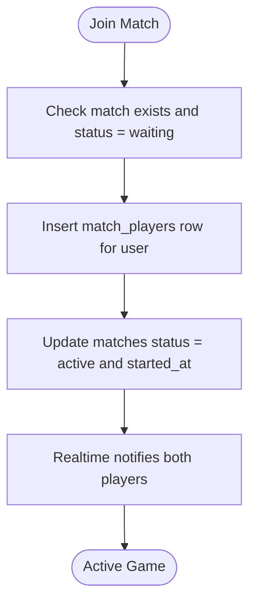

**Diagram sources**
- [20250205000000_multiplayer_tables.sql](file://supabase/migrations/20250205000000_multiplayer_tables.sql#L15-L23)
- [20250205000000_multiplayer_tables.sql](file://supabase/migrations/20250205000000_multiplayer_tables.sql#L68-L81)

**Section sources**
- [20250205000000_multiplayer_tables.sql](file://supabase/migrations/20250205000000_multiplayer_tables.sql#L1-L84)

### Friends
- Purpose: Manage friend requests and accepted friendships.
- Constraints:
  - Unique constraint on (user_id, friend_id).
  - Self-friendship prohibited via check constraint.
- RLS:
  - Select: either party of the friendship.
  - Insert: requesting user.
  - Update: recipient can accept.

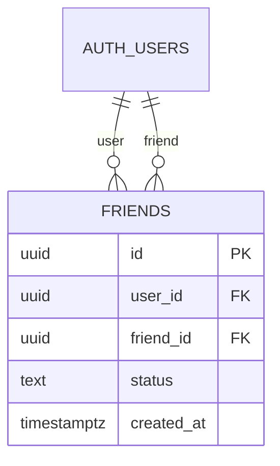

**Diagram sources**
- [20250206100000_friends_and_challenges.sql](file://supabase/migrations/20250206100000_friends_and_challenges.sql#L3-L11)

**Section sources**
- [20250206100000_friends_and_challenges.sql](file://supabase/migrations/20250206100000_friends_and_challenges.sql#L1-L50)

### Challenges
- Purpose: Invite a friend to a match; links to a created match record.
- Constraints:
  - From/to users must be distinct.
  - References to auth.users and matches.
- RLS:
  - Select: either party.
  - Insert: initiating user.
  - Update: recipient can accept/decline.

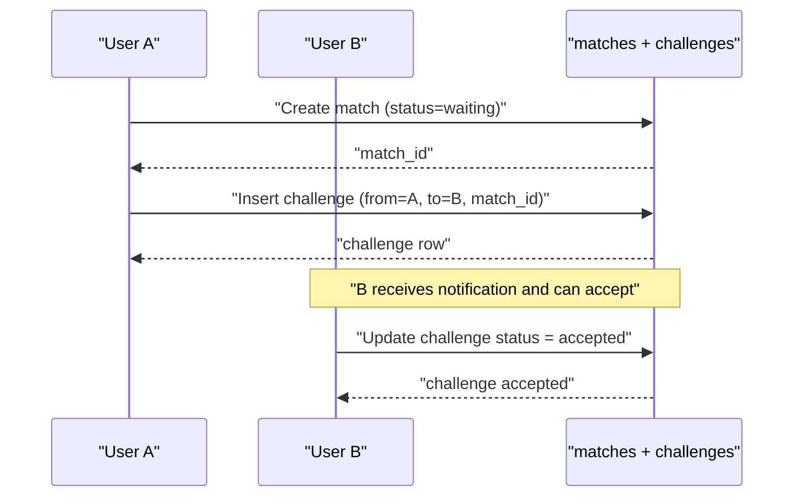

**Diagram sources**
- [20250206100000_friends_and_challenges.sql](file://supabase/migrations/20250206100000_friends_and_challenges.sql#L28-L35)

**Section sources**
- [20250206100000_friends_and_challenges.sql](file://supabase/migrations/20250206100000_friends_and_challenges.sql#L1-L50)

### Rematch Requests
- Purpose: Allow post-match requests for a new game with the same opponent.
- Constraints:
  - Composite foreign keys to matches and auth.users.
  - Optional linkage to a newly created match.
- RLS:
  - Select: involved users.
  - Insert: initiating user.
  - Update: recipient can accept/decline.

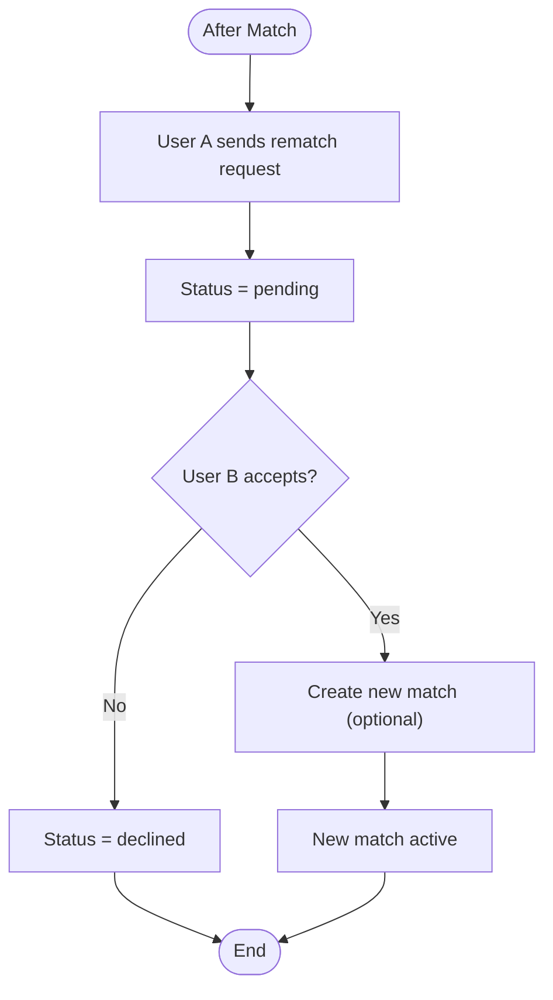

**Diagram sources**
- [20250205500000_rematch_requests.sql](file://supabase/migrations/20250205500000_rematch_requests.sql#L4-L12)
- [20250205500000_rematch_requests.sql](file://supabase/migrations/20250205500000_rematch_requests.sql#L19-L34)

**Section sources**
- [20250205500000_rematch_requests.sql](file://supabase/migrations/20250205500000_rematch_requests.sql#L1-L37)

### Notifications
- Purpose: Deliver user-specific notifications for friend requests, challenges, and app updates.
- Constraints:
  - Type constrained to a fixed set.
  - JSONB data payload with defaults.
- RLS:
  - Select/update: user_id equals authenticated user.
  - Insert: authenticated users.

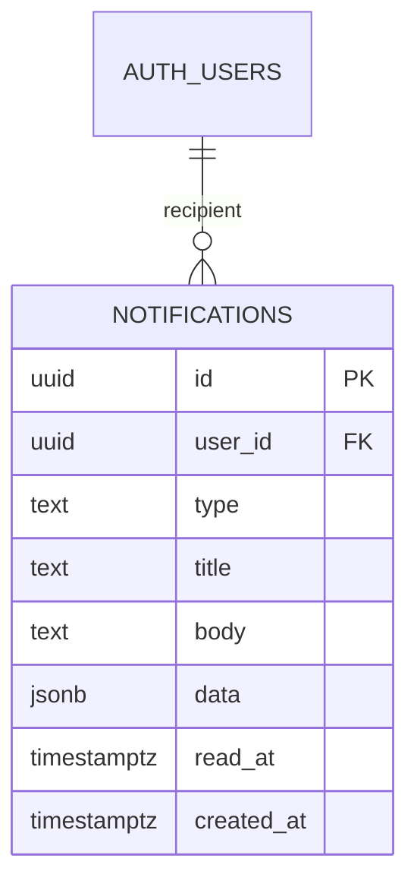

**Diagram sources**
- [20250206110000_notifications.sql](file://supabase/migrations/20250206110000_notifications.sql#L3-L12)

**Section sources**
- [20250206110000_notifications.sql](file://supabase/migrations/20250206110000_notifications.sql#L1-L28)

## Dependency Analysis
- Authentication dependency: All tables reference auth.users except storage.objects for avatars.
- RLS dependency chain: Policies depend on auth.uid() and helper functions to prevent recursion.
- Realtime dependency: Supabase Realtime publishes selected tables; clients subscribe to channels.
- Migration dependency: Later migrations refine earlier policies and add features (e.g., created_by, pg_cron, rematch_requests).

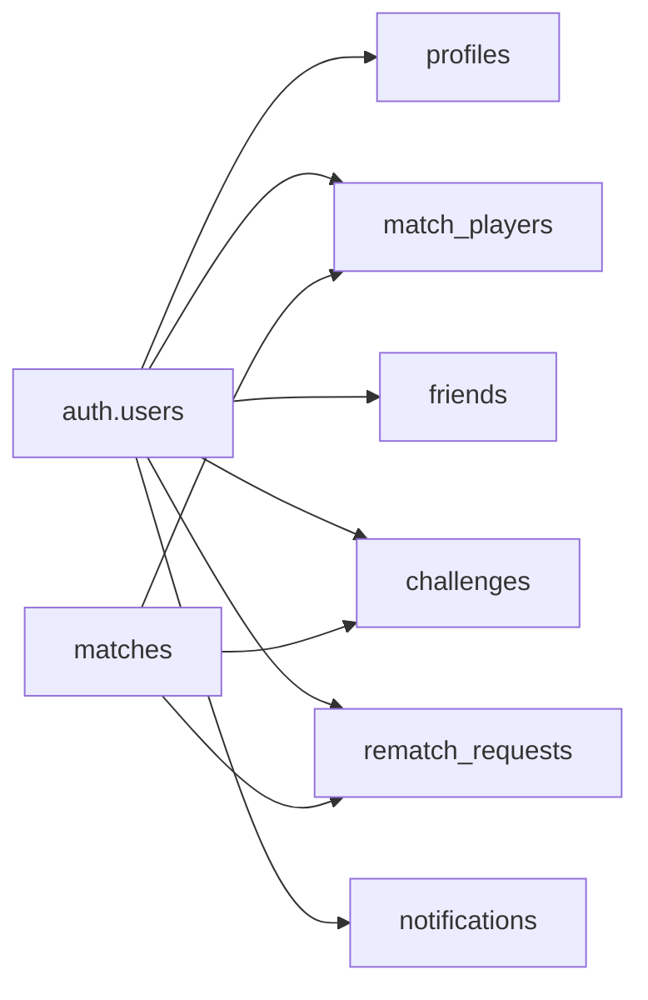

**Diagram sources**
- [20240127000000_init_profiles.sql](file://supabase/migrations/20240127000000_init_profiles.sql#L3-L3)
- [20250205000000_multiplayer_tables.sql](file://supabase/migrations/20250205000000_multiplayer_tables.sql#L17-L18)
- [20250206100000_friends_and_challenges.sql](file://supabase/migrations/20250206100000_friends_and_challenges.sql#L5-L6)
- [20250206110000_notifications.sql](file://supabase/migrations/20250206110000_notifications.sql#L5-L5)

**Section sources**
- [20240127000000_init_profiles.sql](file://supabase/migrations/20240127000000_init_profiles.sql#L1-L61)
- [20250205000000_multiplayer_tables.sql](file://supabase/migrations/20250205000000_multiplayer_tables.sql#L1-L84)
- [20250206100000_friends_and_challenges.sql](file://supabase/migrations/20250206100000_friends_and_challenges.sql#L1-L50)
- [20250205500000_rematch_requests.sql](file://supabase/migrations/20250205500000_rematch_requests.sql#L1-L37)
- [20250206110000_notifications.sql](file://supabase/migrations/20250206110000_notifications.sql#L1-L28)

## Performance Considerations
- Indexing strategies:
  - match_players: match_id, user_id (for participant queries and joins).
  - matches: status with invite_code null for quick-match lookups; invite_code not null for invite-based lookups.
  - friends: user_id, friend_id, status=pending for efficient request retrieval.
  - challenges: to_user_id, match_id for recipient and match-centric queries.
  - notifications: user_id, user_id with read_at=null, created_at descending for unread counts and timelines.
- Concurrency control:
  - Atomic quick match RPC serializes joining/waiting match selection and insertion.
- Background jobs:
  - pg_cron cancels abandoned matches to free resources.
- Query patterns:
  - Prefer selective filters with indexed columns.
  - Use LIMIT and ORDER BY created_at for paginated feeds.
  - Leverage real-time subscriptions to minimize polling.

**Section sources**
- [20250205000000_multiplayer_tables.sql](file://supabase/migrations/20250205000000_multiplayer_tables.sql#L25-L28)
- [20250206100000_friends_and_challenges.sql](file://supabase/migrations/20250206100000_friends_and_challenges.sql#L13-L15)
- [20250206110000_notifications.sql](file://supabase/migrations/20250206110000_notifications.sql#L14-L16)
- [20250206000000_atomic_quick_match.sql](file://supabase/migrations/20250206000000_atomic_quick_match.sql#L3-L44)
- [20250205400000_abandoned_match_cancel.sql](file://supabase/migrations/20250205400000_abandoned_match_cancel.sql#L18-L30)

## Troubleshooting Guide
- RLS recursion fix:
  - A SECURITY DEFINER helper function checks participation to avoid recursive policy evaluation.
- Insert-read consistency:
  - created_by column allows the creator to read a match immediately after insertion.
- Public read for waiting matches:
  - Any authenticated user can read waiting matches to support invite and quick-match flows.
- Abandoned match cleanup:
  - Scheduled pg_cron job updates stale matches to cancelled; verify job scheduling if not triggered.
- Realtime availability:
  - Ensure tables are included in the Supabase Realtime publication for live updates.

**Section sources**
- [20250205100000_fix_match_players_rls_recursion.sql](file://supabase/migrations/20250205100000_fix_match_players_rls_recursion.sql#L4-L35)
- [20250205200000_fix_matches_insert_rls.sql](file://supabase/migrations/20250205200000_fix_matches_insert_rls.sql#L4-L28)
- [20250205300000_allow_join_by_invite_code.sql](file://supabase/migrations/20250205300000_allow_join_by_invite_code.sql#L6-L13)
- [20250205400000_abandoned_match_cancel.sql](file://supabase/migrations/20250205400000_abandoned_match_cancel.sql#L18-L30)
- [20250205000000_multiplayer_tables.sql](file://supabase/migrations/20250205000000_multiplayer_tables.sql#L83-L84)

## Conclusion
The Palindrome database schema is designed around clear entity boundaries, robust RLS for data isolation, and pragmatic indexing to support real-time multiplayer flows. Migrations document a deliberate evolution toward atomic matchmaking, friend/challenge systems, and notification infrastructure. The Supabase client configuration and service-layer integrations provide a cohesive pattern for authentication, querying, and real-time updates.

## Appendices

### Supabase Configuration and Authentication Integration
- Client initialization:
  - Environment variables supply Supabase URL and anonymous/anon key.
  - Session persistence and token refresh are configured.
- Environment variables:
  - Supabase URL and keys are provided via environment configuration.

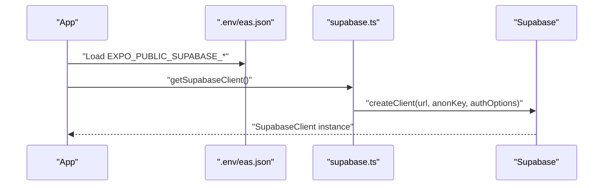

**Diagram sources**
- [.env](file://.env#L8-L12)
- [supabase.ts](file://supabase.ts#L42-L74)

**Section sources**
- [supabase.ts](file://supabase.ts#L1-L75)
- [.env](file://.env#L1-L14)

### Real-Time Subscription Setup
- Matches and match_players:
  - Subscribed via postgres_changes for status and score updates.
- Notifications:
  - Subscribed for user-specific updates.
- Rematch requests:
  - Should be included in Realtime publication for live acceptance/decline.

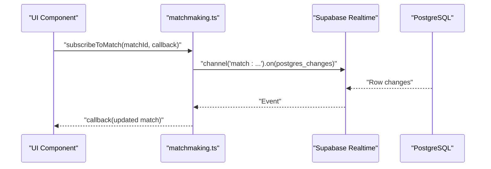

**Diagram sources**
- [matchmaking.ts](file://lib/matchmaking.ts#L204-L247)
- [20250205000000_multiplayer_tables.sql](file://supabase/migrations/20250205000000_multiplayer_tables.sql#L83-L84)
- [20250206110000_notifications.sql](file://supabase/migrations/20250206110000_notifications.sql#L1-L28)

**Section sources**
- [matchmaking.ts](file://lib/matchmaking.ts#L204-L247)
- [20250205000000_multiplayer_tables.sql](file://supabase/migrations/20250205000000_multiplayer_tables.sql#L83-L84)
- [20250206110000_notifications.sql](file://supabase/migrations/20250206110000_notifications.sql#L1-L28)

### Data Access Patterns and Service Layer Integration
- Notifications:
  - Fetch user notifications, unread counts, mark as read, and create notifications.
- Friends:
  - Retrieve pending requests, accepted friends, and decline requests.
- Matchmaking:
  - Atomic quick match claim, subscribe to match updates, update live scores, and submit final scores.

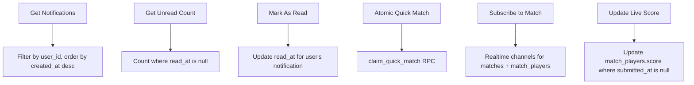

**Diagram sources**
- [notifications.ts](file://lib/notifications.ts#L24-L57)
- [friends.ts](file://lib/friends.ts#L86-L129)
- [20250206000000_atomic_quick_match.sql](file://supabase/migrations/20250206000000_atomic_quick_match.sql#L3-L44)
- [matchmaking.ts](file://lib/matchmaking.ts#L204-L276)

**Section sources**
- [notifications.ts](file://lib/notifications.ts#L1-L110)
- [friends.ts](file://lib/friends.ts#L86-L129)
- [matchmaking.ts](file://lib/matchmaking.ts#L158-L276)