# Game Engine Core

<cite>
**Referenced Files in This Document**
- [gameEngine.ts](file://lib/gameEngine.ts)
- [seededRandom.ts](file://lib/seededRandom.ts)
- [gameColors.ts](file://lib/gameColors.ts)
- [gamelayout.tsx](file://app/(tabs)/gamelayout.tsx)
- [gamelayout.web.tsx](file://app/(tabs)/gamelayout.web.tsx)
- [matchmaking.ts](file://lib/matchmaking.ts)
- [Multiplayer Integration Context Report.md](file://Multiplayer_Integration_Context_Report.md)
</cite>

## Table of Contents
1. [Introduction](#introduction)
2. [Project Structure](#project-structure)
3. [Core Components](#core-components)
4. [Architecture Overview](#architecture-overview)
5. [Detailed Component Analysis](#detailed-component-analysis)
6. [Dependency Analysis](#dependency-analysis)
7. [Performance Considerations](#performance-considerations)
8. [Troubleshooting Guide](#troubleshooting-guide)
9. [Conclusion](#conclusion)

## Introduction
This document describes the Palindrome game engine’s core logic and its integration with UI components and multiplayer systems. It covers palindrome detection algorithms, grid-based tile placement, scoring mechanics, hint generation, state management, move validation, turn-based mechanics, seeded randomization for deterministic puzzles, color-based tile representation, inventory management, and UI integration patterns. It also outlines performance optimization techniques and cross-platform considerations for consistent game logic execution.

## Project Structure
The game engine is implemented as a shared TypeScript module used by both native and web platforms. UI integration occurs in platform-specific screens that orchestrate user interactions, manage timers, and render visual feedback. Multiplayer support is implemented via a matchmaking service that coordinates asynchronous races with deterministic board initialization.

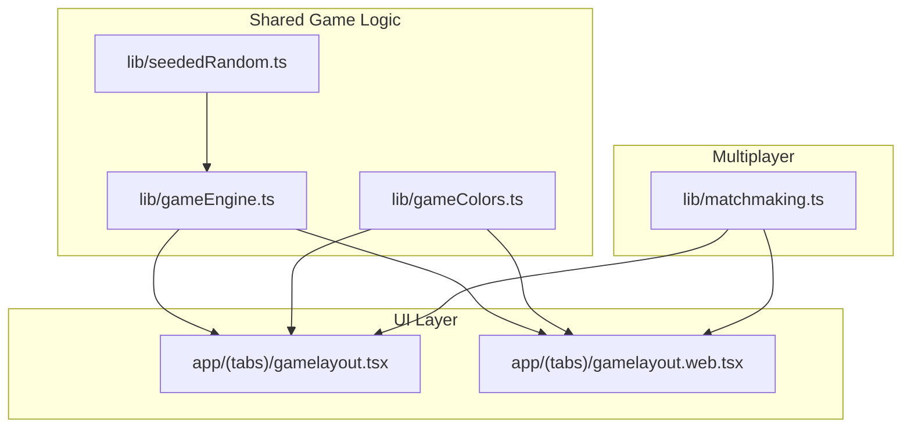

**Diagram sources**
- [gameEngine.ts](file://lib/gameEngine.ts#L1-L284)
- [seededRandom.ts](file://lib/seededRandom.ts#L1-L21)
- [gameColors.ts](file://lib/gameColors.ts#L1-L93)
- [gamelayout.tsx](file://app/(tabs)/gamelayout.tsx#L1-L200)
- [gamelayout.web.tsx](file://app/(tabs)/gamelayout.web.tsx#L796-L1215)
- [matchmaking.ts](file://lib/matchmaking.ts#L1-L542)

**Section sources**
- [gameEngine.ts](file://lib/gameEngine.ts#L1-L284)
- [seededRandom.ts](file://lib/seededRandom.ts#L1-L21)
- [gameColors.ts](file://lib/gameColors.ts#L1-L93)
- [gamelayout.tsx](file://app/(tabs)/gamelayout.tsx#L1-L200)
- [gamelayout.web.tsx](file://app/(tabs)/gamelayout.web.tsx#L796-L1215)
- [matchmaking.ts](file://lib/matchmaking.ts#L1-L542)

## Core Components
- Shared game engine: board initialization, move validation, palindrome scoring, hint generation, and state queries.
- Seeded random number generator: deterministic RNG for consistent puzzle creation across platforms.
- Color utilities: default gradients and conversions for tile rendering.
- UI integration: drag-and-drop, pick-and-place, feedback, timers, and multiplayer synchronization.
- Matchmaking: quick match, invite codes, real-time updates, and score submission.

Key exports and types:
- Constants: grid size, number of colors, default block counts, minimum palindrome length, bulldog bonus.
- Types: Grid, GameState, ScoringResult, HintMove.
- Functions: createInitialState, checkPalindromes, applyMove, findScoringMove, hasBlocksLeft, hasEmptyCell, canPlace.

**Section sources**
- [gameEngine.ts](file://lib/gameEngine.ts#L6-L32)
- [gameEngine.ts](file://lib/gameEngine.ts#L106-L161)
- [gameEngine.ts](file://lib/gameEngine.ts#L167-L219)
- [gameEngine.ts](file://lib/gameEngine.ts#L224-L249)
- [gameEngine.ts](file://lib/gameEngine.ts#L254-L283)

## Architecture Overview
The engine is designed as a pure, deterministic module consumed by UI layers. UI components translate user actions into validated moves, compute scores, and update state. Multiplayer logic initializes identical boards from a shared seed and synchronizes live scores via a backend.

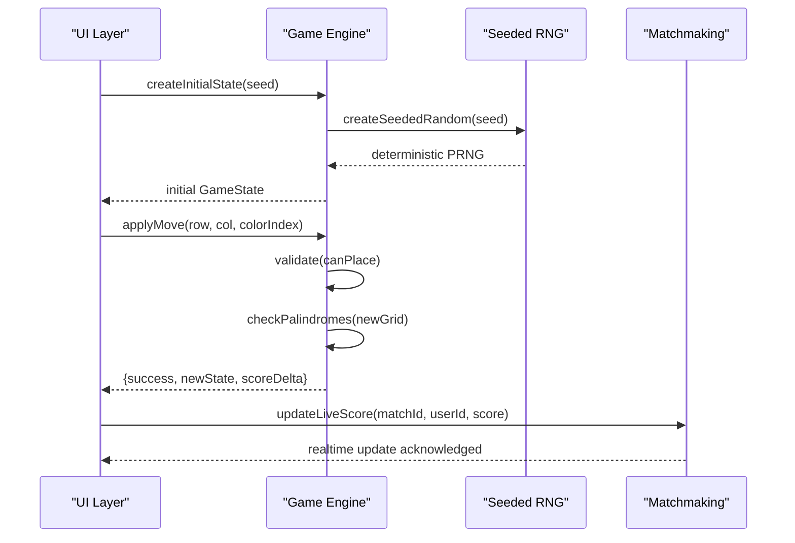

**Diagram sources**
- [gameEngine.ts](file://lib/gameEngine.ts#L60-L100)
- [gameEngine.ts](file://lib/gameEngine.ts#L167-L219)
- [seededRandom.ts](file://lib/seededRandom.ts#L9-L20)
- [matchmaking.ts](file://lib/matchmaking.ts#L253-L266)

**Section sources**
- [gameEngine.ts](file://lib/gameEngine.ts#L60-L100)
- [seededRandom.ts](file://lib/seededRandom.ts#L9-L20)
- [matchmaking.ts](file://lib/matchmaking.ts#L253-L266)

## Detailed Component Analysis

### Palindrome Detection and Scoring
- Scanning: For a placed tile, scan the row and column to find the maximal contiguous segment containing the new tile.
- Validation: A segment qualifies if its length meets the minimum threshold and reads the same forwards and backwards.
- Scoring: Base score equals segment length; if any tile in the segment is a bulldog, add a fixed bonus.
- UI feedback: Segment length is exposed to drive feedback messages and animations.

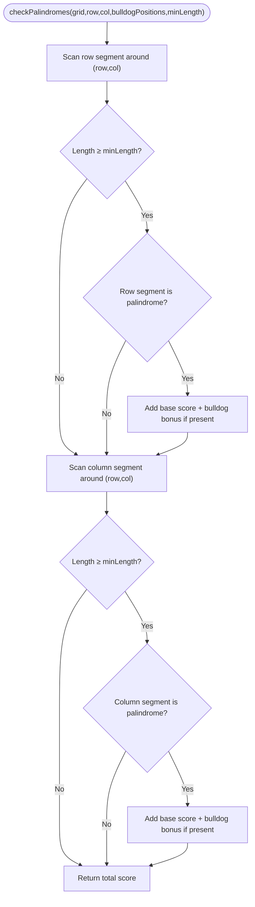

**Diagram sources**
- [gameEngine.ts](file://lib/gameEngine.ts#L106-L161)

**Section sources**
- [gameEngine.ts](file://lib/gameEngine.ts#L106-L161)

### Grid-Based Tile Placement and Move Validation
- Validation rules:
  - Cell must be within bounds.
  - Cell must be empty.
  - Color must be in stock (inventory > 0).
- Application:
  - Clone grid and place the tile.
  - Compute score delta via palindrome detection.
  - Update inventory, score, and move count.
  - Return success with new state and score delta.

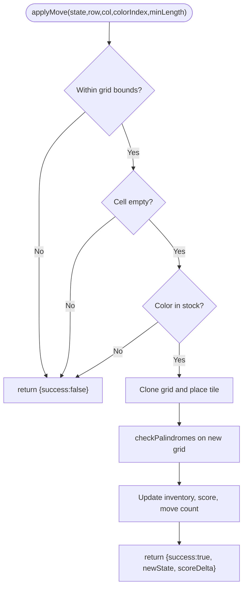

**Diagram sources**
- [gameEngine.ts](file://lib/gameEngine.ts#L167-L219)

**Section sources**
- [gameEngine.ts](file://lib/gameEngine.ts#L167-L219)
- [gameEngine.ts](file://lib/gameEngine.ts#L268-L283)

### Hint Generation
- Strategy: Iterate all empty cells and available colors, simulate placement, and check if it yields a score.
- Priority: Prefer shorter palindromes first, then longer ones.
- UI: Decrement hint count and highlight the suggested cell briefly.

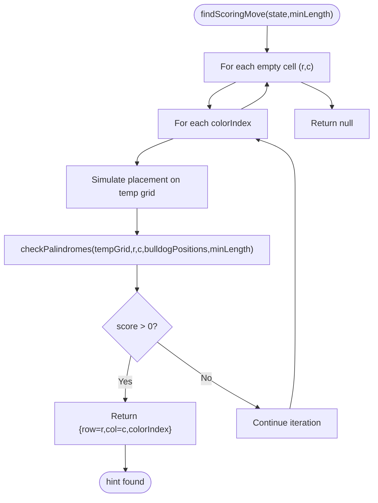

**Diagram sources**
- [gameEngine.ts](file://lib/gameEngine.ts#L224-L249)

**Section sources**
- [gameEngine.ts](file://lib/gameEngine.ts#L224-L249)

### Seeded Random Number Generation
- Purpose: Ensure identical board initialization across platforms and sessions.
- Algorithm: Deterministic PRNG seeded from a string hash, producing repeatable sequences of [0,1) values.

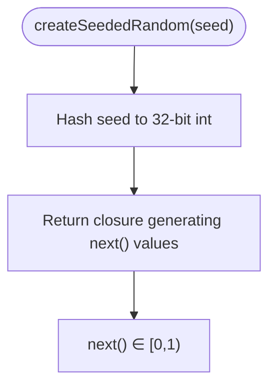

**Diagram sources**
- [seededRandom.ts](file://lib/seededRandom.ts#L9-L20)

**Section sources**
- [seededRandom.ts](file://lib/seededRandom.ts#L9-L20)

### Color-Based Tile Representation
- Defaults: Five predefined gradients for tiles.
- Utilities: Convert between hex and HSL, derive gradients from hues or hex, and normalize hex values.
- UI: Gradients rendered in UI components; color-blind modes overlay tokens or symbols.

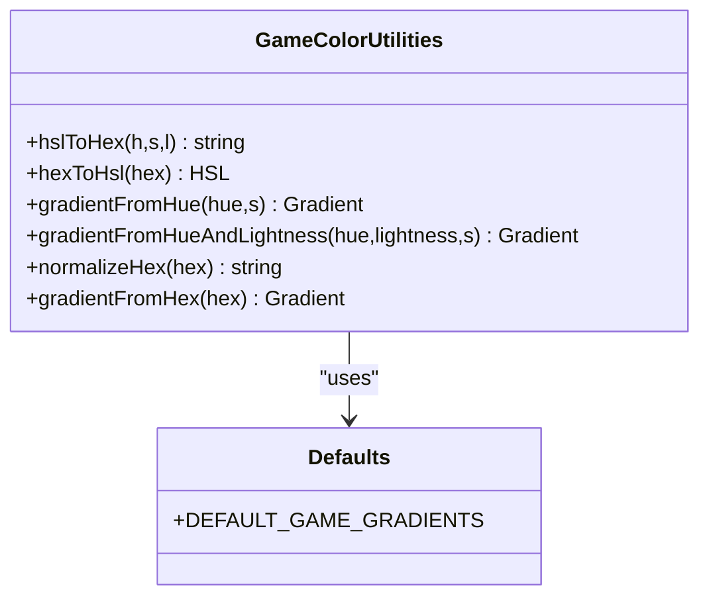

**Diagram sources**
- [gameColors.ts](file://lib/gameColors.ts#L1-L93)

**Section sources**
- [gameColors.ts](file://lib/gameColors.ts#L1-L93)

### Game State Management and Inventory
- State fields: grid, blockCounts, score, bulldogPositions, moveCount.
- Queries: hasBlocksLeft, hasEmptyCell.
- Inventory: Tracks remaining tiles per color; applying a move decrements the chosen color’s count.

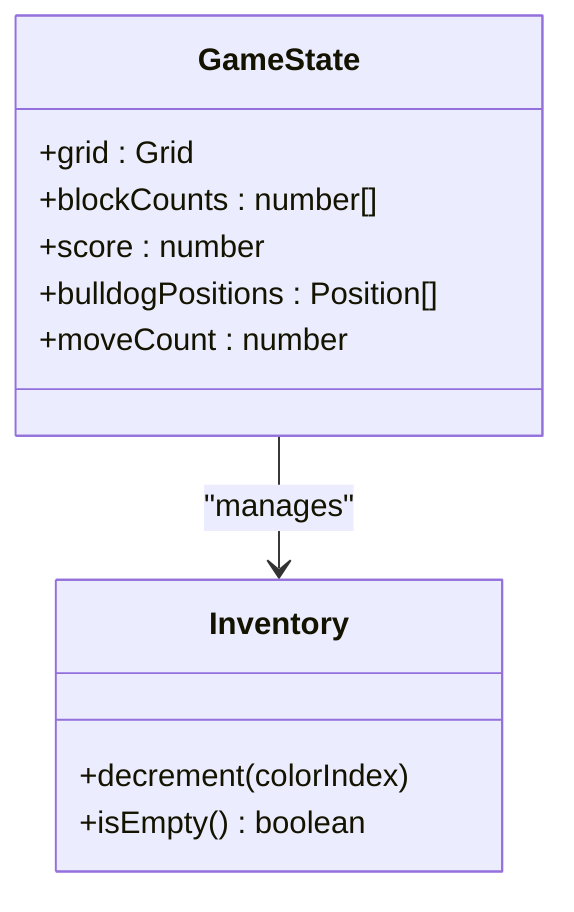

**Diagram sources**
- [gameEngine.ts](file://lib/gameEngine.ts#L26-L32)
- [gameEngine.ts](file://lib/gameEngine.ts#L254-L263)

**Section sources**
- [gameEngine.ts](file://lib/gameEngine.ts#L26-L32)
- [gameEngine.ts](file://lib/gameEngine.ts#L254-L263)

### UI Integration Patterns
- Drag-and-drop: Extract grid coordinates from touch points, validate drops, and animate feedback.
- Pick-and-place: Select color, choose target cell, and place tile with validation.
- Feedback: Visual and haptic feedback based on segment length; live score updates in multiplayer.
- Timers: First-move timeout and total game duration; auto-submit on timeouts.

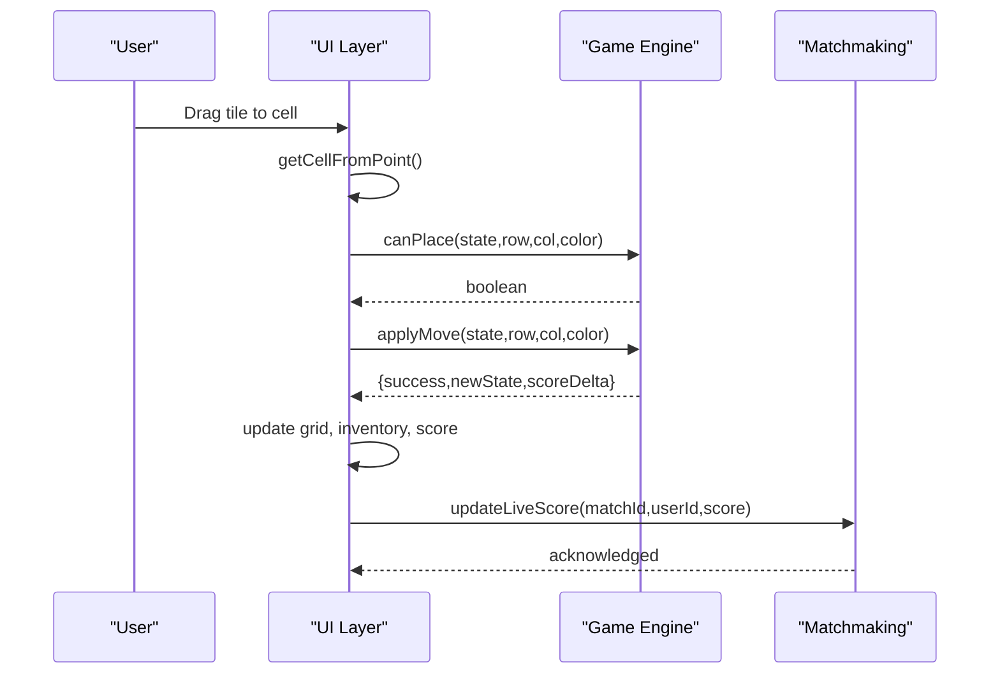

**Diagram sources**
- [gamelayout.tsx](file://app/(tabs)/gamelayout.tsx#L978-L1059)
- [gamelayout.tsx](file://app/(tabs)/gamelayout.tsx#L1061-L1079)
- [matchmaking.ts](file://lib/matchmaking.ts#L253-L266)

**Section sources**
- [gamelayout.tsx](file://app/(tabs)/gamelayout.tsx#L978-L1059)
- [gamelayout.tsx](file://app/(tabs)/gamelayout.tsx#L1061-L1079)
- [gamelayout.web.tsx](file://app/(tabs)/gamelayout.web.tsx#L1132-L1208)
- [matchmaking.ts](file://lib/matchmaking.ts#L253-L266)

### Multiplayer Mechanics
- Asynchronous race: Both players receive identical boards from the same seed; winner determined by score/time.
- Live updates: UI pushes live scores; backend persists and resolves match outcomes.
- Real-time subscriptions: UI listens for opponent progress and match status.

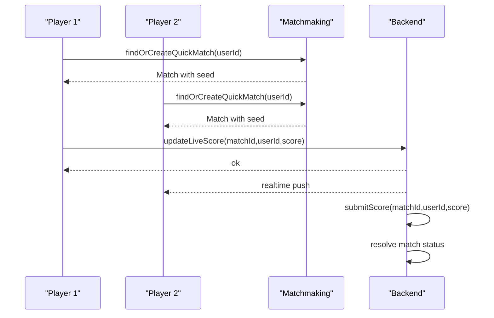

**Diagram sources**
- [matchmaking.ts](file://lib/matchmaking.ts#L58-L66)
- [matchmaking.ts](file://lib/matchmaking.ts#L253-L327)
- [Multiplayer Integration Context Report.md](file://Multiplayer_Integration_Context_Report.md#L88-L95)

**Section sources**
- [matchmaking.ts](file://lib/matchmaking.ts#L58-L66)
- [matchmaking.ts](file://lib/matchmaking.ts#L253-L327)
- [Multiplayer Integration Context Report.md](file://Multiplayer_Integration_Context_Report.md#L88-L95)

## Dependency Analysis
- gameEngine.ts depends on seededRandom.ts for deterministic initialization.
- UI layers depend on gameEngine.ts for state transitions and on gameColors.ts for rendering.
- matchmaking.ts integrates with UI to synchronize live scores and finalize matches.

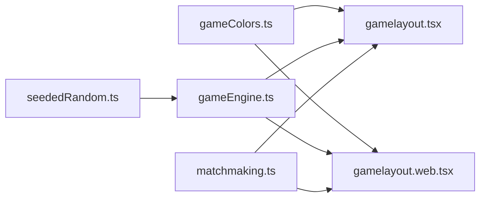

**Diagram sources**
- [gameEngine.ts](file://lib/gameEngine.ts#L46-L46)
- [seededRandom.ts](file://lib/seededRandom.ts#L9-L20)
- [gameColors.ts](file://lib/gameColors.ts#L1-L93)
- [gamelayout.tsx](file://app/(tabs)/gamelayout.tsx#L31-L32)
- [gamelayout.web.tsx](file://app/(tabs)/gamelayout.web.tsx#L796-L804)
- [matchmaking.ts](file://lib/matchmaking.ts#L1-L542)

**Section sources**
- [gameEngine.ts](file://lib/gameEngine.ts#L46-L46)
- [seededRandom.ts](file://lib/seededRandom.ts#L9-L20)
- [gameColors.ts](file://lib/gameColors.ts#L1-L93)
- [gamelayout.tsx](file://app/(tabs)/gamelayout.tsx#L31-L32)
- [gamelayout.web.tsx](file://app/(tabs)/gamelayout.web.tsx#L796-L804)
- [matchmaking.ts](file://lib/matchmaking.ts#L1-L542)

## Performance Considerations
- Palindrome scanning is O(N) per axis (row/column), with N bounded by grid size; acceptable for small grids.
- Minimizing allocations: clone grid and arrays only when necessary; reuse temporary structures in hot loops.
- UI responsiveness: keep heavy computations off the main thread; throttle drag updates; debounce real-time score updates.
- Memory: avoid retaining stale game states; clear timeouts and subscriptions on unmount.
- Cross-platform: ensure deterministic RNG and consistent coordinate mapping across platforms.

[No sources needed since this section provides general guidance]

## Troubleshooting Guide
- Invalid move errors: Verify bounds, emptiness, and inventory before applying moves.
- No scoring despite valid placement: Confirm palindrome detection scans both axes and respects minimum length.
- Hint not found: Remember that hints prefer shorter palindromes; consider lowering minimum length in simulation.
- Multiplayer desync: Ensure both clients use the same seed and that live score updates are sent after valid moves.

**Section sources**
- [gameEngine.ts](file://lib/gameEngine.ts#L178-L190)
- [gameEngine.ts](file://lib/gameEngine.ts#L224-L249)
- [gamelayout.tsx](file://app/(tabs)/gamelayout.tsx#L978-L1019)

## Conclusion
The Palindrome game engine provides a compact, deterministic core suitable for both single-player and asynchronous multiplayer modes. Its clean separation of concerns enables consistent behavior across platforms, while UI layers deliver responsive interactions and real-time feedback. By adhering to the outlined validation, scoring, and integration patterns, developers can extend functionality safely and efficiently.