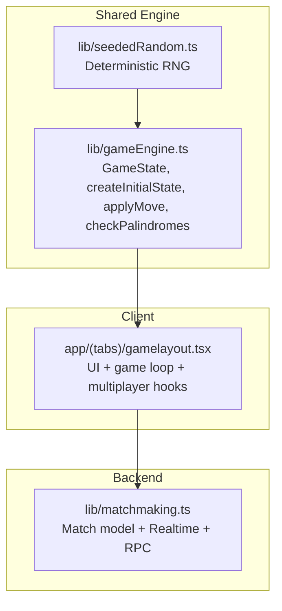
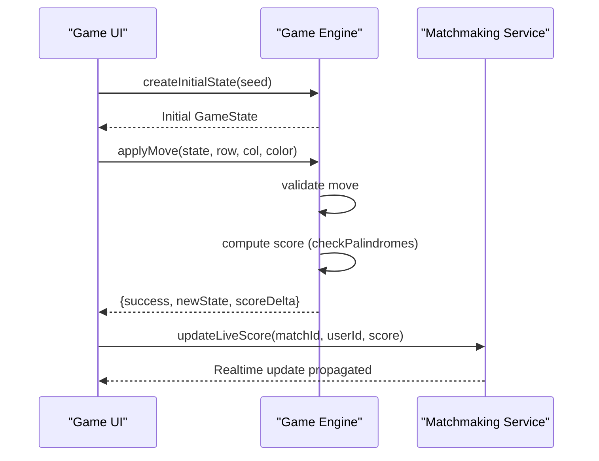
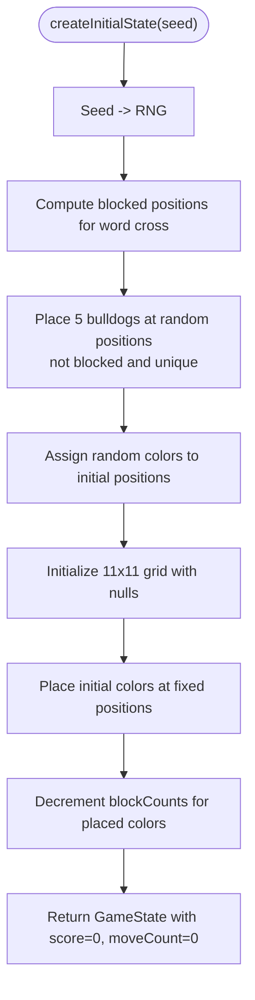
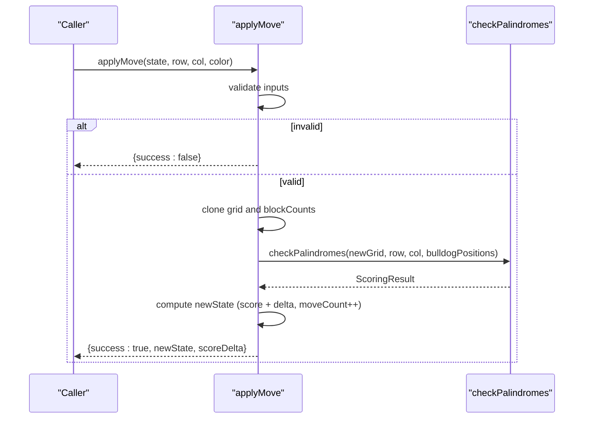
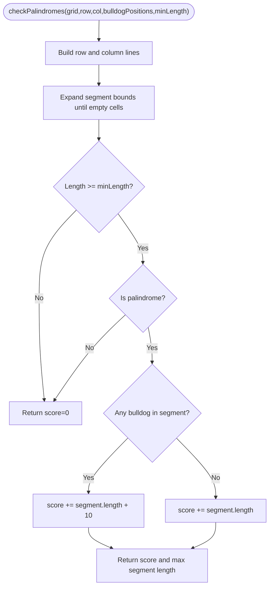
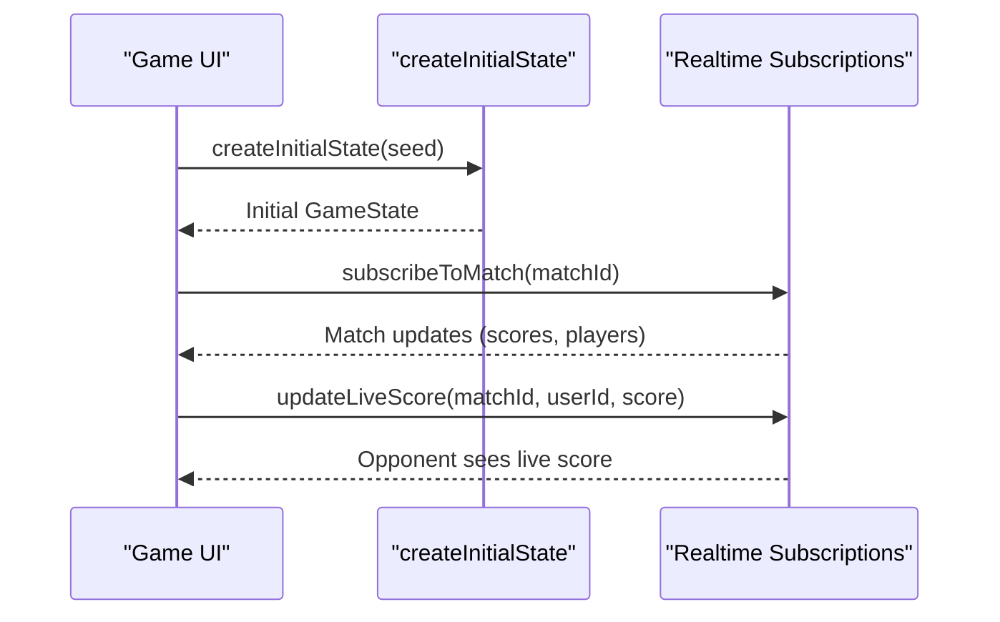
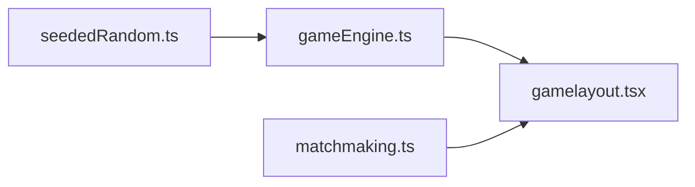

# Game State Management

<cite>
**Referenced Files in This Document**
- [gameEngine.ts](file://lib/gameEngine.ts)
- [seededRandom.ts](file://lib/seededRandom.ts)
- [gamelayout.tsx](file://app/(tabs)/gamelayout.tsx)
- [matchmaking.ts](file://lib/matchmaking.ts)
- [Multiplayer_Integration_Context_Report.md](file://Multiplayer_Integration_Context_Report.md)
</cite>

## Table of Contents
1. [Introduction](#introduction)
2. [Project Structure](#project-structure)
3. [Core Components](#core-components)
4. [Architecture Overview](#architecture-overview)
5. [Detailed Component Analysis](#detailed-component-analysis)
6. [Dependency Analysis](#dependency-analysis)
7. [Performance Considerations](#performance-considerations)
8. [Troubleshooting Guide](#troubleshooting-guide)
9. [Conclusion](#conclusion)
10. [Appendices](#appendices)

## Introduction
This document explains the game state management system for Palindrome, focusing on the shared game engine that powers both native and web clients. It covers the GameState interface, initialization via createInitialState, immutable state updates, move validation and transitions via applyMove, and considerations for multiplayer synchronization and state persistence. It also provides practical guidance for state snapshots, comparisons, and debugging.

## Project Structure
The state management spans a shared engine module and client integrations:
- Shared engine: defines GameState, initialization, move validation, scoring, and helpers
- Client integration: consumes the engine for UI rendering and multiplayer flows
- Multiplayer backend: stores match metadata, seeds, and move logs



**Diagram sources**
- [gameEngine.ts](file://lib/gameEngine.ts#L24-L100)
- [seededRandom.ts](file://lib/seededRandom.ts#L9-L20)
- [gamelayout.tsx](file://app/(tabs)/gamelayout.tsx#L31-L33)
- [matchmaking.ts](file://lib/matchmaking.ts#L21-L32)

**Section sources**
- [gameEngine.ts](file://lib/gameEngine.ts#L1-L100)
- [gamelayout.tsx](file://app/(tabs)/gamelayout.tsx#L31-L33)
- [matchmaking.ts](file://lib/matchmaking.ts#L1-L50)

## Core Components
- GameState: central state shape used across single-player and multiplayer modes
- createInitialState: deterministic initialization from a seed
- applyMove: pure validation and immutable state mutation
- checkPalindromes: scoring computation for row/column segments
- Helpers: canPlace, hasBlocksLeft, hasEmptyCell, findScoringMove

Key characteristics:
- Immutable updates: new arrays/objects are created for each mutation
- Deterministic randomness via seeded RNG for multiplayer fairness
- Scoring computed locally and server-side for authoritative results

**Section sources**
- [gameEngine.ts](file://lib/gameEngine.ts#L24-L32)
- [gameEngine.ts](file://lib/gameEngine.ts#L60-L100)
- [gameEngine.ts](file://lib/gameEngine.ts#L167-L219)
- [gameEngine.ts](file://lib/gameEngine.ts#L106-L161)
- [gameEngine.ts](file://lib/gameEngine.ts#L268-L283)

## Architecture Overview
The system follows a shared engine pattern:
- Single source of truth for game logic
- Clients import the engine to render UI and process moves
- Multiplayer uses a seed to initialize identical boards and a move log for reconciliation



**Diagram sources**
- [gameEngine.ts](file://lib/gameEngine.ts#L60-L100)
- [gameEngine.ts](file://lib/gameEngine.ts#L167-L219)
- [matchmaking.ts](file://lib/matchmaking.ts#L253-L266)

## Detailed Component Analysis

### GameState Interface
GameState encapsulates the entire game state:
- grid: 11x11 matrix of color indices or null
- blockCounts: per-color inventory counts
- score: accumulated score
- bulldogPositions: positions of special bonus tiles
- moveCount: number of moves played

```mermaid
classDiagram
class GameState {
+grid : Grid
+blockCounts : number[]
+score : number
+bulldogPositions : {row,col}[]
+moveCount : number
}
class Grid {
<<array>>
}
GameState --> Grid : "owns"
```

**Diagram sources**
- [gameEngine.ts](file://lib/gameEngine.ts#L24-L32)

**Section sources**
- [gameEngine.ts](file://lib/gameEngine.ts#L24-L32)

### State Initialization: createInitialState
Behavior:
- Deterministic bulldog placement using seeded RNG
- Pre-placed initial colors at fixed positions
- Inventory deduction for initial colors
- Zero score and zero move count



**Diagram sources**
- [gameEngine.ts](file://lib/gameEngine.ts#L60-L100)
- [seededRandom.ts](file://lib/seededRandom.ts#L9-L20)

**Section sources**
- [gameEngine.ts](file://lib/gameEngine.ts#L60-L100)
- [seededRandom.ts](file://lib/seededRandom.ts#L9-L20)

### State Mutation Pattern and applyMove
applyMove enforces validation and returns an immutable new state:
- Bounds check, cell empty, color in stock
- Creates new grid and blockCounts
- Computes score via checkPalindromes
- Updates score and moveCount



**Diagram sources**
- [gameEngine.ts](file://lib/gameEngine.ts#L167-L219)
- [gameEngine.ts](file://lib/gameEngine.ts#L106-L161)

**Section sources**
- [gameEngine.ts](file://lib/gameEngine.ts#L167-L219)
- [gameEngine.ts](file://lib/gameEngine.ts#L106-L161)

### Scoring Logic: checkPalindromes
- Checks row and column segments around the newly placed tile
- Computes segment length and palindrome validity
- Applies bulldog bonus if any bulldog tile is present in the segment
- Returns score and optional segment length for UI feedback



**Diagram sources**
- [gameEngine.ts](file://lib/gameEngine.ts#L106-L161)

**Section sources**
- [gameEngine.ts](file://lib/gameEngine.ts#L106-L161)

### Client Integration and Multiplayer Hooks
- The UI imports createInitialState and uses it to seed the board
- Realtime subscriptions keep the UI synchronized with match state
- Live score updates propagate via updateLiveScore



**Diagram sources**
- [gamelayout.tsx](file://app/(tabs)/gamelayout.tsx#L742-L758)
- [matchmaking.ts](file://lib/matchmaking.ts#L204-L247)
- [matchmaking.ts](file://lib/matchmaking.ts#L253-L266)

**Section sources**
- [gamelayout.tsx](file://app/(tabs)/gamelayout.tsx#L742-L758)
- [matchmaking.ts](file://lib/matchmaking.ts#L204-L247)
- [matchmaking.ts](file://lib/matchmaking.ts#L253-L266)

## Dependency Analysis
- gameEngine.ts depends on seededRandom.ts for deterministic RNG
- gamelayout.tsx imports createInitialState and uses it to initialize state
- matchmaking.ts provides match model and Realtime subscriptions used by the UI



**Diagram sources**
- [seededRandom.ts](file://lib/seededRandom.ts#L9-L20)
- [gameEngine.ts](file://lib/gameEngine.ts#L46-L46)
- [gamelayout.tsx](file://app/(tabs)/gamelayout.tsx#L31-L33)
- [matchmaking.ts](file://lib/matchmaking.ts#L6-L8)

**Section sources**
- [seededRandom.ts](file://lib/seededRandom.ts#L9-L20)
- [gameEngine.ts](file://lib/gameEngine.ts#L46-L46)
- [gamelayout.tsx](file://app/(tabs)/gamelayout.tsx#L31-L33)
- [matchmaking.ts](file://lib/matchmaking.ts#L6-L8)

## Performance Considerations
- Immutability: cloning grid and arrays is O(N^2) per move; acceptable for 11x11 grids
- Scoring: scanning row and column segments is O(N); bounded by grid size
- Deterministic RNG: negligible overhead; ensures reproducibility across platforms
- UI refs: gamelayout.tsx maintains refs to avoid stale closures during multiplayer flows

[No sources needed since this section provides general guidance]

## Troubleshooting Guide
Common issues and debugging techniques:
- State drift across platforms
  - Ensure both native and web import the shared engine module
  - Verify seed-based initialization produces identical boards
- Validation failures
  - Confirm applyMove guards against out-of-bounds, occupied cells, and empty inventories
- Score discrepancies
  - Compare ScoringResult from checkPalindromes on both clients
  - Cross-check bulldog positions and bonus logic
- Multiplayer desync
  - Use Realtime subscriptions to reconcile state
  - Maintain an append-only move log server-side for revalidation
- State snapshots and comparisons
  - Serialize GameState to JSON for logging and debugging
  - Compare grid matrices, blockCounts, score, bulldogPositions, and moveCount
  - Use deep equality checks for non-primitive fields

Practical tips:
- Log state before and after applyMove to trace mutations
- Snapshot state periodically to detect inconsistencies
- Use refs in UI to capture latest state during async operations

**Section sources**
- [gameEngine.ts](file://lib/gameEngine.ts#L167-L219)
- [gameEngine.ts](file://lib/gameEngine.ts#L106-L161)
- [gamelayout.tsx](file://app/(tabs)/gamelayout.tsx#L632-L664)
- [matchmaking.ts](file://lib/matchmaking.ts#L204-L247)

## Conclusion
The game state management system centers on a shared engine that guarantees deterministic initialization and immutable state updates. The applyMove function enforces validation and computes scores purely, enabling robust multiplayer flows with server-authoritative scoring and Realtime synchronization. Following the patterns outlined here ensures correctness, consistency, and scalability for both single-player and multiplayer modes.

[No sources needed since this section summarizes without analyzing specific files]

## Appendices

### State Persistence and Serialization for Multiplayer
- Match model includes seed, board, bulldog positions, players, scores, inventories, and status
- Use deterministic initialization to reconstruct identical boards
- Maintain an append-only move log for reconciliation and audit trails
- Serialize GameState for logging and debugging; compare snapshots to detect anomalies

**Section sources**
- [Multiplayer_Integration_Context_Report.md](file://Multiplayer_Integration_Context_Report.md#L142-L152)
- [matchmaking.ts](file://lib/matchmaking.ts#L21-L32)