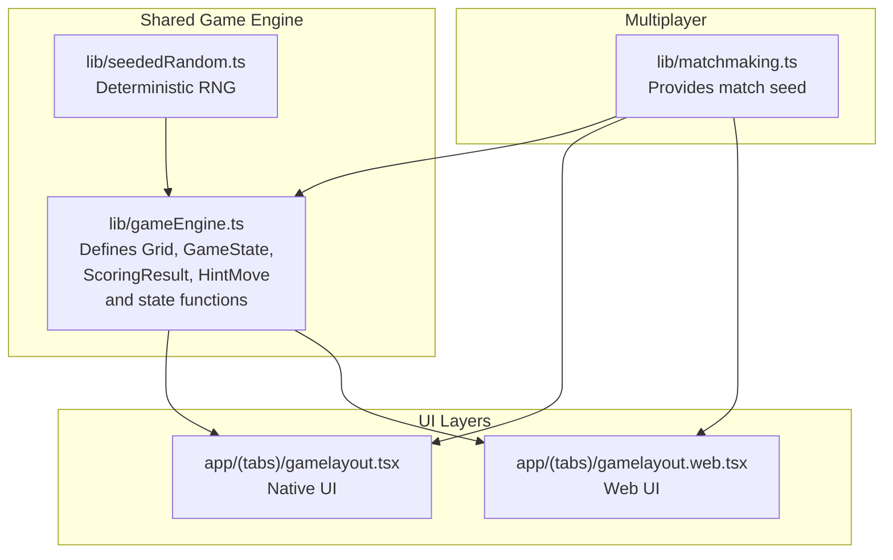
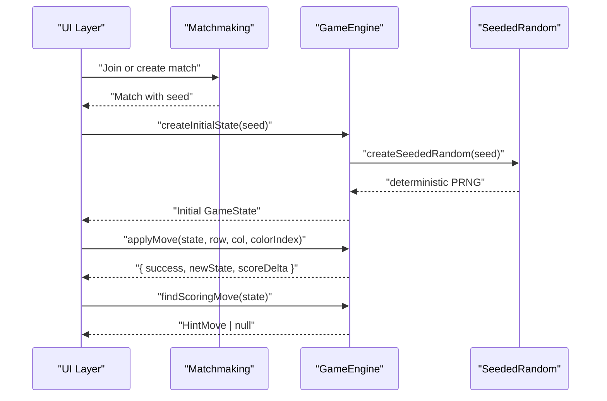
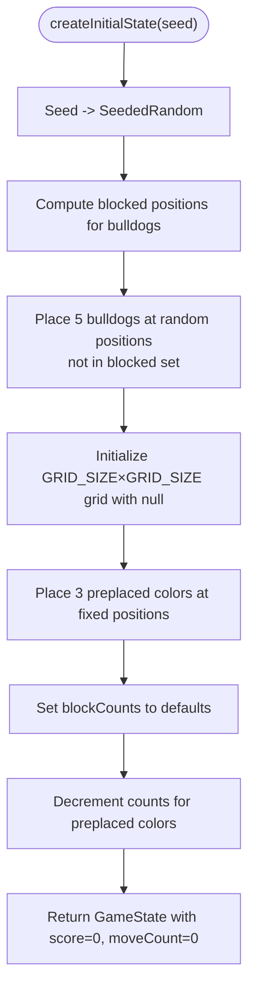
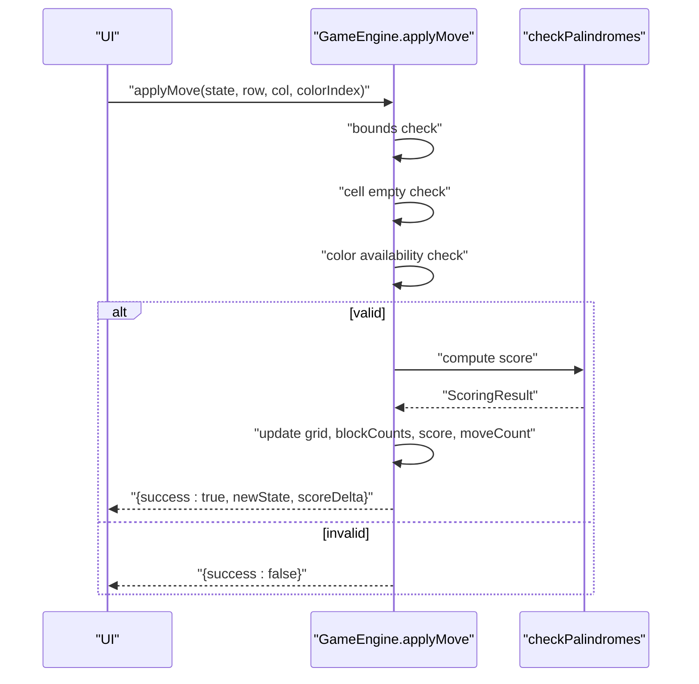
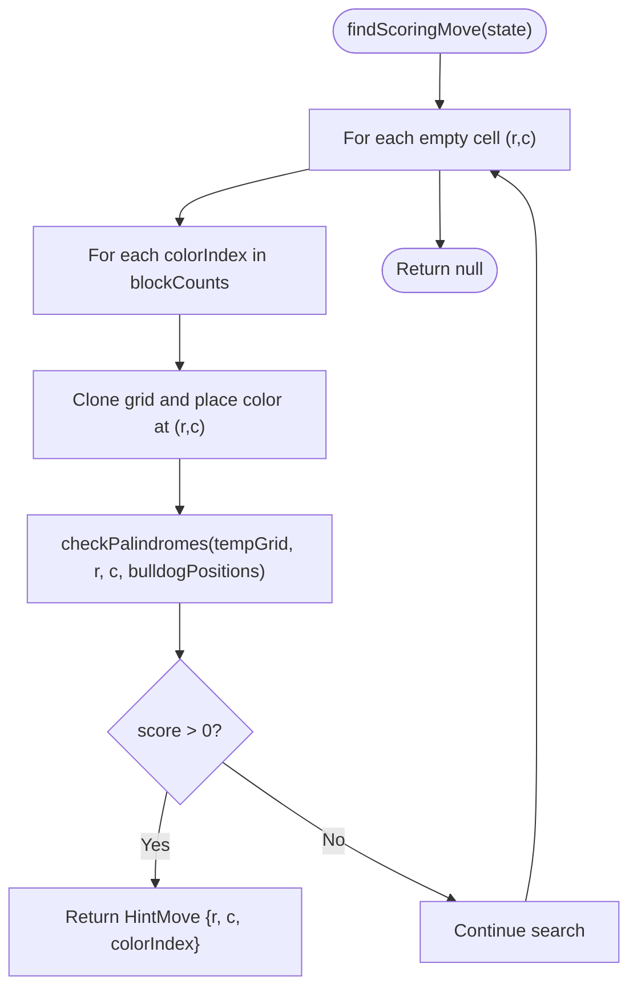
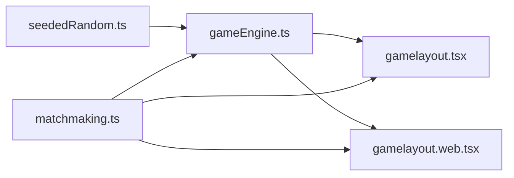

# Game State Structure

<cite>
**Referenced Files in This Document**
- [gameEngine.ts](file://lib/gameEngine.ts)
- [seededRandom.ts](file://lib/seededRandom.ts)
- [gamelayout.tsx](file://app/(tabs)/gamelayout.tsx)
- [gamelayout.web.tsx](file://app/(tabs)/gamelayout.web.tsx)
- [matchmaking.ts](file://lib/matchmaking.ts)
</cite>

## Table of Contents
1. [Introduction](#introduction)
2. [Project Structure](#project-structure)
3. [Core Components](#core-components)
4. [Architecture Overview](#architecture-overview)
5. [Detailed Component Analysis](#detailed-component-analysis)
6. [Dependency Analysis](#dependency-analysis)
7. [Performance Considerations](#performance-considerations)
8. [Troubleshooting Guide](#troubleshooting-guide)
9. [Conclusion](#conclusion)

## Introduction
This document explains the GameState interface and related data structures that define the core state of the Palindrome game. It covers the Grid type definition as a 2D array of numbers or null values representing the game board, the GameState interface properties, and the auxiliary interfaces used for move validation and hint generation. It also documents initialization patterns, property relationships, and data type constraints, with references to concrete implementation locations.

## Project Structure
The game state logic is centralized in a shared library module and consumed by both native and web UI layers. The relevant files are:
- lib/gameEngine.ts: Defines Grid, GameState, ScoringResult, HintMove, and core state functions
- lib/seededRandom.ts: Provides deterministic RNG used for deterministic board generation
- app/(tabs)/gamelayout.tsx and app/(tabs)/gamelayout.web.tsx: UI components that manage state references and invoke game logic
- lib/matchmaking.ts: Provides multiplayer context and seeds used to initialize deterministic game states



**Diagram sources**
- [gameEngine.ts](file://lib/gameEngine.ts#L1-L284)
- [seededRandom.ts](file://lib/seededRandom.ts#L1-L21)
- [gamelayout.tsx](file://app/(tabs)/gamelayout.tsx#L734-L743)
- [gamelayout.web.tsx](file://app/(tabs)/gamelayout.web.tsx#L762-L764)
- [matchmaking.ts](file://lib/matchmaking.ts#L1-L200)

**Section sources**
- [gameEngine.ts](file://lib/gameEngine.ts#L1-L284)
- [seededRandom.ts](file://lib/seededRandom.ts#L1-L21)
- [gamelayout.tsx](file://app/(tabs)/gamelayout.tsx#L734-L743)
- [gamelayout.web.tsx](file://app/(tabs)/gamelayout.web.tsx#L762-L764)
- [matchmaking.ts](file://lib/matchmaking.ts#L1-L200)

## Core Components
This section defines the core data structures and their roles in the game state.

- Grid
  - Type: 2D array of numbers or null
  - Purpose: Represents the game board. Each cell holds either a color index (number) or null (empty).
  - Dimensions: GRID_SIZE × GRID_SIZE (constant 11)
  - Constraints:
    - Row and column indices must be within [0, GRID_SIZE - 1]
    - Cell values are either null or a color index in [0, NUM_COLORS - 1]

- GameState
  - Properties:
    - grid: Grid — current board state
    - blockCounts: number[] — count of blocks available per color (length equals NUM_COLORS)
    - score: number — cumulative score
    - bulldogPositions: { row: number; col: number }[] — positions of bulldog tokens
    - moveCount: number — total moves made
  - Invariants:
    - blockCounts entries are non-negative integers
    - score is a non-negative integer
    - moveCount is a non-negative integer
    - grid dimensions match GRID_SIZE × GRID_SIZE

- ScoringResult
  - Properties:
    - score: number — total score computed for a move
    - segmentLength?: number — optional length of the longest palindrome segment that scored (for UI feedback)

- HintMove
  - Properties:
    - row: number — target row index
    - col: number — target column index
    - colorIndex: number — color to place at (row, col)

**Section sources**
- [gameEngine.ts](file://lib/gameEngine.ts#L6-L38)

## Architecture Overview
The game state is initialized deterministically using a seed (for multiplayer fairness), validated and mutated through pure functions, and rendered by UI components that keep references to the latest state.



**Diagram sources**
- [gamelayout.tsx](file://app/(tabs)/gamelayout.tsx#L734-L743)
- [gamelayout.web.tsx](file://app/(tabs)/gamelayout.web.tsx#L762-L764)
- [matchmaking.ts](file://lib/matchmaking.ts#L58-L66)
- [gameEngine.ts](file://lib/gameEngine.ts#L60-L100)
- [gameEngine.ts](file://lib/gameEngine.ts#L167-L219)
- [gameEngine.ts](file://lib/gameEngine.ts#L224-L249)
- [seededRandom.ts](file://lib/seededRandom.ts#L9-L20)

## Detailed Component Analysis

### Grid Type Definition
- Definition: Grid is a 2D array of (number | null) with dimensions GRID_SIZE × GRID_SIZE.
- Usage:
  - Initialized as an empty board filled with null values.
  - Updated by placing a color index into an empty cell.
- Access patterns:
  - Bounds-checked before read/write operations.
  - Used in palindrome detection along rows and columns.

```mermaid
classDiagram
class Grid {
<<type>>
"+(number | null)[][]"
}
class GameState {
"+grid : Grid"
"+blockCounts : number[]"
"+score : number"
"+bulldogPositions : {row,col}[]"
"+moveCount : number"
}
GameState --> Grid : "owns"
```

**Diagram sources**
- [gameEngine.ts](file://lib/gameEngine.ts#L24-L32)

**Section sources**
- [gameEngine.ts](file://lib/gameEngine.ts#L24-L32)

### GameState Interface Properties
- grid: Grid
  - Purpose: Current board representation
  - Constraints: Must be GRID_SIZE × GRID_SIZE; cells are null or color index
- blockCounts: number[]
  - Purpose: Remaining blocks per color
  - Constraints: Length equals NUM_COLORS; non-negative integers
- score: number
  - Purpose: Total accumulated score
  - Constraints: Non-negative integer
- bulldogPositions: { row: number; col: number }[]
  - Purpose: Positions of bulldog tokens affecting scoring
  - Constraints: Positions must be within board bounds and distinct
- moveCount: number
  - Purpose: Number of moves made
  - Constraints: Non-negative integer

Property relationships:
- Initial state: score = 0, moveCount = 0, blockCounts initialized to defaults minus any preplaced colors
- After a successful move: score increases by the computed score delta, blockCounts decremented for placed color, moveCount incremented

**Section sources**
- [gameEngine.ts](file://lib/gameEngine.ts#L26-L32)
- [gameEngine.ts](file://lib/gameEngine.ts#L93-L99)

### ScoringResult Interface
- score: number
  - Sum of points for all palindromic segments formed by the move
- segmentLength?: number
  - Optional indicator of the longest scoring segment length for UI feedback

Usage:
- Returned by checkPalindromes to inform applyMove of the score delta and optional segment length

**Section sources**
- [gameEngine.ts](file://lib/gameEngine.ts#L34-L38)
- [gameEngine.ts](file://lib/gameEngine.ts#L106-L161)

### HintMove Interface
- row: number
- col: number
- colorIndex: number
- Purpose: Represents a valid move that would score, used for hint generation

Usage:
- findScoringMove iterates empty cells and available colors to find the first scoring combination

**Section sources**
- [gameEngine.ts](file://lib/gameEngine.ts#L40-L44)
- [gameEngine.ts](file://lib/gameEngine.ts#L224-L249)

### State Initialization
Initialization is deterministic and performed by createInitialState(seed):
- Bulldog positions are randomly placed (subject to blocked positions) using a seeded RNG
- Initial colors are placed at fixed positions and subtracted from blockCounts
- Grid starts empty except for the three preplaced colors
- Block counts initialized to defaults minus preplaced colors
- Score and moveCount start at zero



**Diagram sources**
- [gameEngine.ts](file://lib/gameEngine.ts#L60-L100)
- [seededRandom.ts](file://lib/seededRandom.ts#L9-L20)

**Section sources**
- [gameEngine.ts](file://lib/gameEngine.ts#L60-L100)
- [seededRandom.ts](file://lib/seededRandom.ts#L9-L20)

### Move Validation and Application
- Validation checks:
  - Indices within bounds
  - Target cell is empty
  - Color index is valid and available in blockCounts
- Application updates:
  - Places color into grid
  - Computes score via checkPalindromes
  - Updates blockCounts and score
  - Increments moveCount



**Diagram sources**
- [gameEngine.ts](file://lib/gameEngine.ts#L167-L219)
- [gameEngine.ts](file://lib/gameEngine.ts#L106-L161)

**Section sources**
- [gameEngine.ts](file://lib/gameEngine.ts#L167-L219)
- [gameEngine.ts](file://lib/gameEngine.ts#L106-L161)

### Hint Generation
- findScoringMove performs a brute-force search:
  - Iterates all empty cells
  - For each cell, tries all available colors
  - Temporarily places color and checks if any palindrome scores
  - Returns the first scoring move as HintMove



**Diagram sources**
- [gameEngine.ts](file://lib/gameEngine.ts#L224-L249)
- [gameEngine.ts](file://lib/gameEngine.ts#L106-L161)

**Section sources**
- [gameEngine.ts](file://lib/gameEngine.ts#L224-L249)
- [gameEngine.ts](file://lib/gameEngine.ts#L106-L161)

### Property Access Patterns and Data Type Constraints
- Grid access:
  - Always check row/column bounds before accessing grid[row][col]
  - Treat null as empty and non-null as occupied
- Block counts:
  - Ensure colorIndex is within [0, NUM_COLORS - 1]
  - Decrement only when placing a block
- Score and moveCount:
  - Increment only after a successful move
  - Never negative
- Bulldog positions:
  - Must be within board bounds
  - No duplicates

Examples of state construction and property access are referenced below.

**Section sources**
- [gameEngine.ts](file://lib/gameEngine.ts#L178-L190)
- [gameEngine.ts](file://lib/gameEngine.ts#L206-L212)
- [gameEngine.ts](file://lib/gameEngine.ts#L268-L283)

## Dependency Analysis
The game engine depends on a seeded random number generator to ensure deterministic initialization. UI layers consume the engine functions and maintain references to the latest state for rendering and interaction.



**Diagram sources**
- [seededRandom.ts](file://lib/seededRandom.ts#L9-L20)
- [gameEngine.ts](file://lib/gameEngine.ts#L60-L100)
- [gamelayout.tsx](file://app/(tabs)/gamelayout.tsx#L734-L743)
- [gamelayout.web.tsx](file://app/(tabs)/gamelayout.web.tsx#L762-L764)
- [matchmaking.ts](file://lib/matchmaking.ts#L58-L66)

**Section sources**
- [seededRandom.ts](file://lib/seededRandom.ts#L9-L20)
- [gameEngine.ts](file://lib/gameEngine.ts#L60-L100)
- [gamelayout.tsx](file://app/(tabs)/gamelayout.tsx#L734-L743)
- [gamelayout.web.tsx](file://app/(tabs)/gamelayout.web.tsx#L762-L764)
- [matchmaking.ts](file://lib/matchmaking.ts#L58-L66)

## Performance Considerations
- Palindrome detection scans up to two lines per move (row and column). With GRID_SIZE = 11, this is constant-time per move.
- findScoringMove performs a worst-case search over all empty cells and colors; for large grids or many colors, consider caching or pruning strategies.
- State cloning (shallow copies of arrays) is O(GRID_SIZE^2) per move; consider immutable libraries if frequent deep cloning becomes a bottleneck.

## Troubleshooting Guide
Common issues and resolutions:
- Invalid move rejected:
  - Ensure row and col are within [0, GRID_SIZE - 1]
  - Ensure grid[row][col] is null
  - Ensure colorIndex is within [0, NUM_COLORS - 1] and blockCounts[colorIndex] > 0
- Score not updating:
  - Verify that checkPalindromes detects at least one palindrome segment of length ≥ MIN_PALINDROME_LENGTH
  - Confirm that bulldog bonus is considered when applicable
- Hint not found:
  - Remember that findScoringMove returns null if no scoring move exists
  - Consider lowering minLength temporarily for hint generation

**Section sources**
- [gameEngine.ts](file://lib/gameEngine.ts#L178-L190)
- [gameEngine.ts](file://lib/gameEngine.ts#L268-L283)
- [gameEngine.ts](file://lib/gameEngine.ts#L224-L249)

## Conclusion
The GameState interface and related types form a compact, deterministic state model for the Palindrome game. Grid represents the board, GameState encapsulates all mutable state, and ScoringResult and HintMove provide structured feedback and assistance. The shared game engine ensures consistent behavior across platforms, while UI layers manage rendering and user interaction around these core data structures.