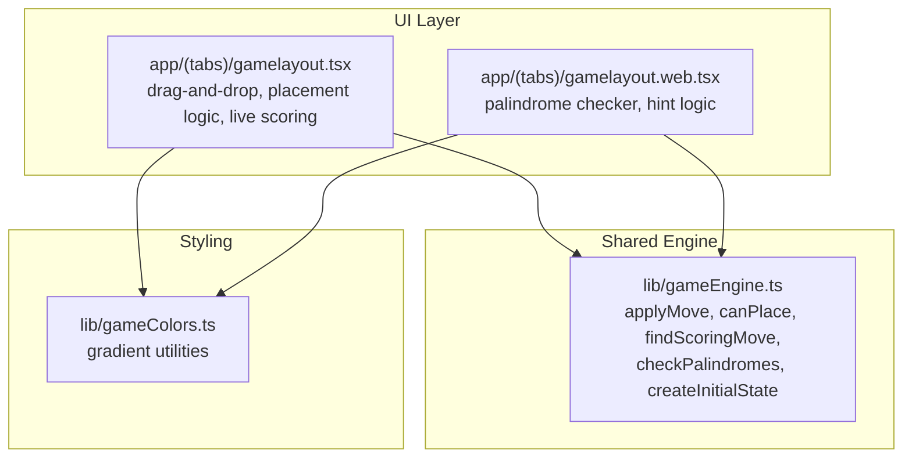
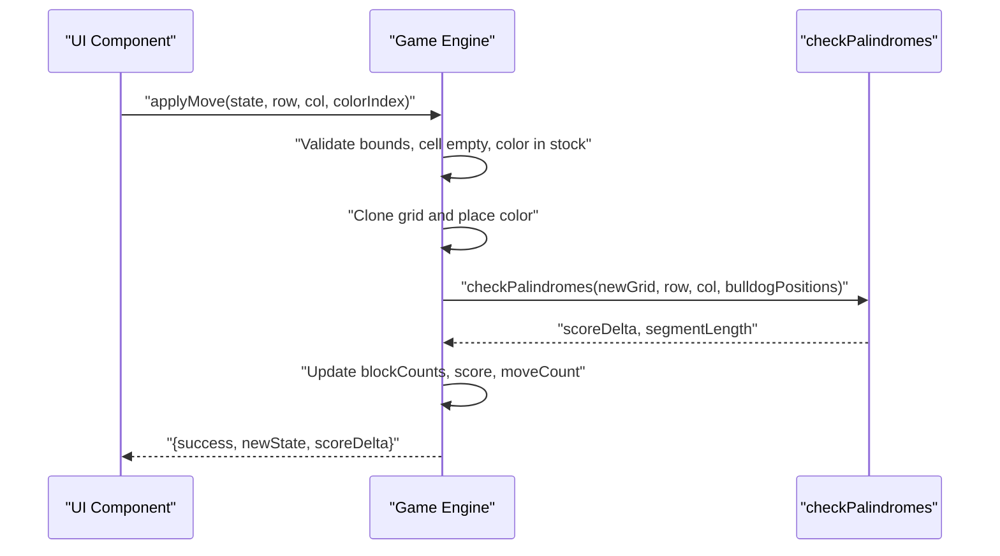
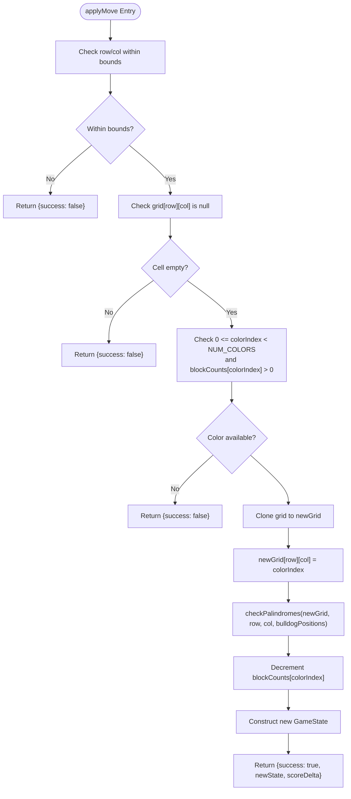
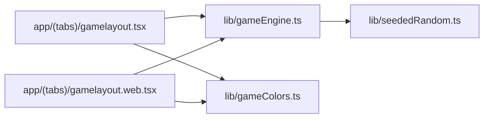

# Move Validation Mechanisms

<cite>
**Referenced Files in This Document**
- [gameEngine.ts](file://lib/gameEngine.ts)
- [gamelayout.tsx](file://app/(tabs)/gamelayout.tsx)
- [gamelayout.web.tsx](file://app/(tabs)/gamelayout.web.tsx)
- [gameColors.ts](file://lib/gameColors.ts)
</cite>

## Table of Contents
1. [Introduction](#introduction)
2. [Project Structure](#project-structure)
3. [Core Components](#core-components)
4. [Architecture Overview](#architecture-overview)
5. [Detailed Component Analysis](#detailed-component-analysis)
6. [Dependency Analysis](#dependency-analysis)
7. [Performance Considerations](#performance-considerations)
8. [Troubleshooting Guide](#troubleshooting-guide)
9. [Conclusion](#conclusion)

## Introduction
This document explains the move validation and state mutation mechanisms in the Palindrome game engine. It focuses on:
- Input validation and grid mutation patterns in applyMove
- Pre-validation via canPlace
- Hint generation via findScoringMove
- Row/column boundary checks, cell availability, and color inventory validation
- State transition logic, immutable state creation, and block count management
- Examples of successful and failed moves, validation error scenarios, and performance considerations for real-time validation

## Project Structure
The move validation logic is centralized in the shared game engine module and consumed by platform-specific UI components.

**Diagram sources**
- [gameEngine.ts](file://lib/gameEngine.ts#L167-L219)
- [gamelayout.tsx](file://app/(tabs)/gamelayout.tsx#L978-L1059)
- [gamelayout.web.tsx](file://app/(tabs)/gamelayout.web.tsx#L1099-L1215)
- [gameColors.ts](file://lib/gameColors.ts#L1-L93)

**Section sources**
- [gameEngine.ts](file://lib/gameEngine.ts#L1-L284)
- [gamelayout.tsx](file://app/(tabs)/gamelayout.tsx#L1-L200)

## Core Components
- applyMove: Validates inputs, mutates a new grid immutably, recomputes scores, and updates block counts.
- canPlace: Lightweight pre-check to determine if a move is allowed without recomputing scores.
- findScoringMove: Brute-force search to suggest a playable move that yields immediate scoring.
- checkPalindromes: Pure function that computes score deltas for rows/columns intersecting a placed tile.

Key constants and types:
- GRID_SIZE: 11
- NUM_COLORS: 5
- DEFAULT_BLOCK_COUNTS: [16, 16, 16, 16, 16]
- MIN_PALINDROME_LENGTH: 3
- GameState: grid, blockCounts, score, bulldogPositions, moveCount

**Section sources**
- [gameEngine.ts](file://lib/gameEngine.ts#L6-L32)
- [gameEngine.ts](file://lib/gameEngine.ts#L167-L219)
- [gameEngine.ts](file://lib/gameEngine.ts#L268-L283)
- [gameEngine.ts](file://lib/gameEngine.ts#L224-L249)
- [gameEngine.ts](file://lib/gameEngine.ts#L106-L161)

## Architecture Overview
The UI triggers placement actions. The engine validates and mutates state immutably, then returns a new GameState with updated score and block counts. Scoring is computed by scanning rows and columns around the newly placed tile.

**Diagram sources**
- [gameEngine.ts](file://lib/gameEngine.ts#L167-L219)
- [gameEngine.ts](file://lib/gameEngine.ts#L106-L161)

## Detailed Component Analysis

### applyMove: Validation, Mutation, and State Transition
Purpose:
- Enforce move validity
- Mutate a new grid immutably
- Recompute score and update block counts
- Return immutable new state and score delta

Validation steps:
- Boundary check: row and column must be within [0, GRID_SIZE)
- Cell availability: target cell must be null
- Color inventory: colorIndex must be within [0, NUM_COLORS) and blockCounts[colorIndex] > 0

Mutation pattern:
- Clone grid row-by-row to avoid mutating the original
- Place color at (row, col) in the new grid
- Compute score delta via checkPalindromes
- Decrement blockCounts[colorIndex]
- Construct new GameState with updated fields

State immutability:
- Original state remains unchanged
- New arrays are created for grid and blockCounts
- Score and moveCount are recomputed from previous values

State transition logic:
- grid: newGrid
- blockCounts: decremented for placed color
- score: previous score plus scoreDelta
- bulldogPositions: copied from previous state
- moveCount: incremented by 1

Return values:
- success: boolean indicating validity
- newState: new GameState if valid
- scoreDelta: numeric score change if valid

**Diagram sources**
- [gameEngine.ts](file://lib/gameEngine.ts#L167-L219)
- [gameEngine.ts](file://lib/gameEngine.ts#L106-L161)

**Section sources**
- [gameEngine.ts](file://lib/gameEngine.ts#L167-L219)

### canPlace: Pre-Validation Checks
Purpose:
- Fast pre-check to determine if a move is allowed before attempting placement
- Avoids cloning grids and recomputation

Checks performed:
- Boundary validation
- Cell availability
- Color inventory validation

Returns:
- true if valid
- false otherwise

Usage:
- UI often calls canPlace to enable/disable drop targets or highlight valid cells

**Section sources**
- [gameEngine.ts](file://lib/gameEngine.ts#L268-L283)

### findScoringMove: Hint Generation
Purpose:
- Suggest a playable move that immediately scores points
- Useful for hints and tutorial flows

Algorithm:
- Iterate all cells and colors
- For each candidate, temporarily place the color on a cloned grid
- Run checkPalindromes to see if it scores
- Return the first valid candidate found

Returns:
- HintMove { row, col, colorIndex } if found
- null if none

Note:
- The UI also implements a similar brute-force search locally for feedback and hints.

**Section sources**
- [gameEngine.ts](file://lib/gameEngine.ts#L224-L249)
- [gamelayout.web.tsx](file://app/(tabs)/gamelayout.web.tsx#L1210-L1215)
- [gamelayout.tsx](file://app/(tabs)/gamelayout.tsx#L946-L963)

### checkPalindromes: Scoring Logic
Purpose:
- Pure function that computes score for any palindrome segments formed by placing a tile
- Operates on a given grid and target position

Processing:
- Scan row and column through (row, col)
- Expand outward while encountering colored cells
- Check if the resulting segment is a palindrome of minimum length
- Sum lengths; add bonus if any segment cell overlaps with bulldog positions

Returns:
- ScoringResult with total score and optional segmentLength for UI feedback

**Section sources**
- [gameEngine.ts](file://lib/gameEngine.ts#L106-L161)

### State Transition and Immutability Patterns
- Immutable grid cloning: state.grid.map((r) => [...r])
- Immutable blockCounts cloning: [...state.blockCounts]
- New state constructed with updated fields
- No mutation of existing state objects

New grid creation patterns:
- Row-wise spread to create a shallow clone of each row
- Deep clone of grid is achieved by cloning each row

Block count management:
- Decrement only for the placed color
- Ensures non-negative counts via Math.max(0, ...)

**Section sources**
- [gameEngine.ts](file://lib/gameEngine.ts#L192-L212)
- [gameEngine.ts](file://lib/gameEngine.ts#L203-L204)

### Validation Criteria Summary
- Row/column boundaries: 0 <= row < GRID_SIZE and 0 <= col < GRID_SIZE
- Cell availability: grid[row][col] must be null
- Color inventory: 0 <= colorIndex < NUM_COLORS and blockCounts[colorIndex] > 0

**Section sources**
- [gameEngine.ts](file://lib/gameEngine.ts#L178-L190)
- [gameEngine.ts](file://lib/gameEngine.ts#L274-L282)

### Examples

#### Successful Move Attempt
- Input: state with empty cell at (r, c), available color at colorIndex
- Behavior: grid cloned, color placed, scoring computed, block count decremented, new state returned
- Outcome: success = true, newState reflects updated grid and score

**Section sources**
- [gameEngine.ts](file://lib/gameEngine.ts#L167-L219)

#### Failed Move Attempt: Out-of-Bounds
- Input: row or col outside [0, GRID_SIZE)
- Behavior: early return with success = false

**Section sources**
- [gameEngine.ts](file://lib/gameEngine.ts#L178-L180)

#### Failed Move Attempt: Occupied Cell
- Input: grid[row][col] is not null
- Behavior: early return with success = false

**Section sources**
- [gameEngine.ts](file://lib/gameEngine.ts#L181-L183)

#### Failed Move Attempt: Color Unavailable
- Input: colorIndex out of range or blockCounts[colorIndex] <= 0
- Behavior: early return with success = false

**Section sources**
- [gameEngine.ts](file://lib/gameEngine.ts#L184-L190)

#### Real-Time Validation Example (UI)
- The UI performs a dry-run scoring check against a temporary grid to decide whether to accept a drop
- If the attempted placement does not score and a forced move exists, the UI may penalize repeated invalid drops and offer hints

**Section sources**
- [gamelayout.tsx](file://app/(tabs)/gamelayout.tsx#L994-L1019)
- [gamelayout.web.tsx](file://app/(tabs)/gamelayout.web.tsx#L1132-L1208)

## Dependency Analysis
The UI components depend on the shared engine for validation and scoring. The engine depends on constants and helper utilities for deterministic initialization.

**Diagram sources**
- [gamelayout.tsx](file://app/(tabs)/gamelayout.tsx#L31-L33)
- [gamelayout.web.tsx](file://app/(tabs)/gamelayout.web.tsx#L1099-L1101)
- [gameEngine.ts](file://lib/gameEngine.ts#L46-L46)
- [gameColors.ts](file://lib/gameColors.ts#L1-L93)

**Section sources**
- [gamelayout.tsx](file://app/(tabs)/gamelayout.tsx#L31-L33)
- [gamelayout.web.tsx](file://app/(tabs)/gamelayout.web.tsx#L1099-L1101)
- [gameEngine.ts](file://lib/gameEngine.ts#L46-L46)

## Performance Considerations
- applyMove performs O(N) scans per row and column during checkPalindromes, where N = GRID_SIZE (constant 11). This is efficient for real-time validation.
- canPlace is O(1) and suitable for frequent UI checks (e.g., hover highlights).
- findScoringMove is O(R*C*NUM_COLORS*N) in the worst case, which is acceptable for occasional hint requests but should not be called continuously during gameplay.
- Immutable cloning is O(N^2) for the grid; however, it is bounded by the fixed GRID_SIZE and is amortized across moves.
- To optimize real-time validation:
  - Prefer canPlace for hover and drop target checks
  - Defer full scoring until after a confirmed placement
  - Cache intermediate results when feasible (e.g., keep a small lookup for recent segments)

[No sources needed since this section provides general guidance]

## Troubleshooting Guide
Common validation errors and their likely causes:
- Move rejected due to out-of-bounds coordinates: Verify row and col are within [0, GRID_SIZE).
- Move rejected because cell is occupied: Ensure the target cell is empty before placing.
- Move rejected due to unavailable color: Confirm blockCounts[colorIndex] > 0 before allowing placement.
- Hint returns null: Indicates no immediate-scoring move exists; consider lowering minLength or checking for forced moves.

Related UI behaviors:
- The UI may penalize repeated invalid placements by incrementing a wrong tries counter and offering hints after a threshold.
- Live scoring updates occur only when scoreDelta > 0.

**Section sources**
- [gameEngine.ts](file://lib/gameEngine.ts#L178-L190)
- [gamelayout.tsx](file://app/(tabs)/gamelayout.tsx#L994-L1019)
- [gamelayout.web.tsx](file://app/(tabs)/gamelayout.web.tsx#L1210-L1215)

## Conclusion
The move validation and state mutation pipeline ensures correctness and responsiveness:
- Pre-validation via canPlace enables smooth UI interactions
- applyMove enforces strict rules, mutates state immutably, and computes accurate scoring
- findScoringMove provides helpful hints by exploring candidate placements
- The system balances performance with correctness, supporting real-time gameplay and multiplayer scoring updates