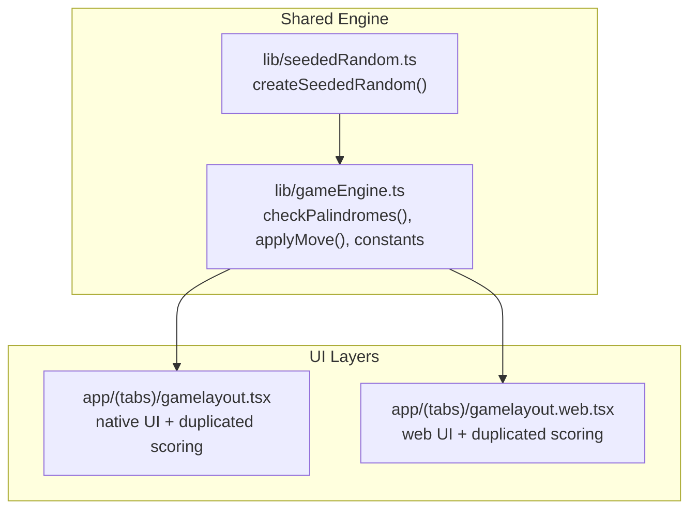
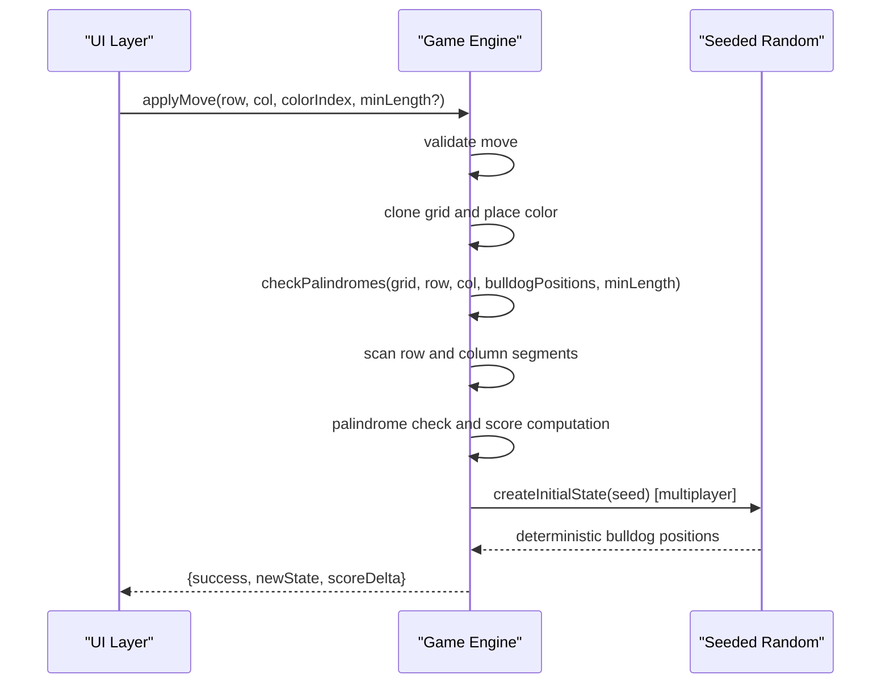
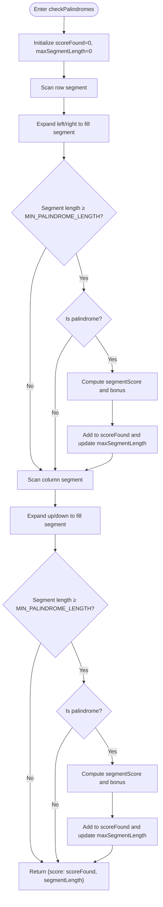
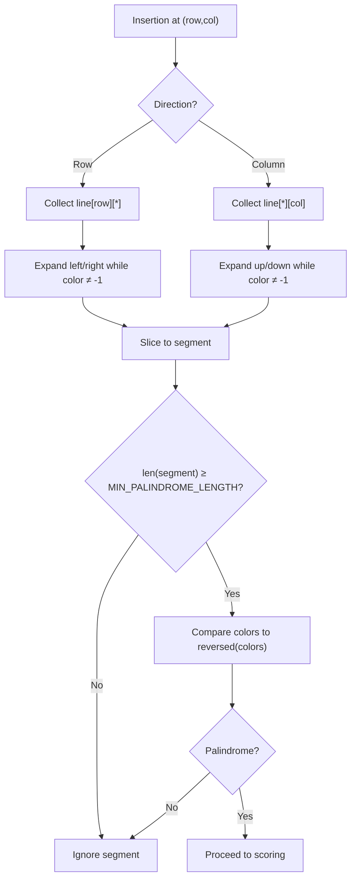
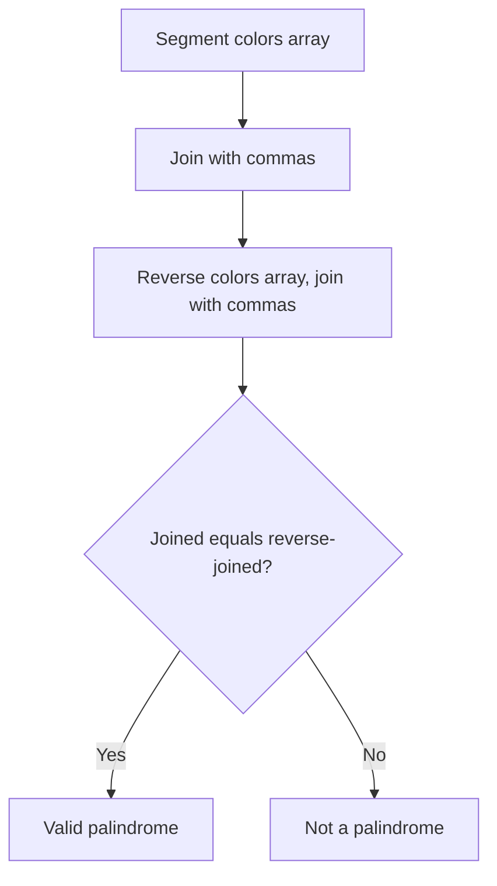
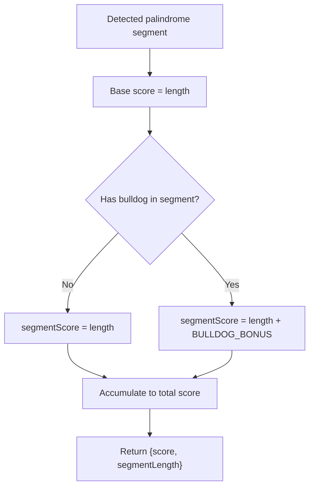
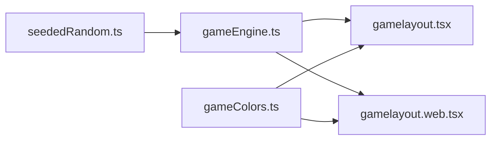

# Scoring Algorithm

<cite>
**Referenced Files in This Document**
- [gameEngine.ts](file://lib/gameEngine.ts)
- [gamelayout.tsx](file://app/(tabs)/gamelayout.tsx)
- [gamelayout.web.tsx](file://app/(tabs)/gamelayout.web.tsx)
- [seededRandom.ts](file://lib/seededRandom.ts)
- [gameColors.ts](file://lib/gameColors.ts)
</cite>

## Table of Contents
1. [Introduction](#introduction)
2. [Project Structure](#project-structure)
3. [Core Components](#core-components)
4. [Architecture Overview](#architecture-overview)
5. [Detailed Component Analysis](#detailed-component-analysis)
6. [Dependency Analysis](#dependency-analysis)
7. [Performance Considerations](#performance-considerations)
8. [Troubleshooting Guide](#troubleshooting-guide)
9. [Conclusion](#conclusion)

## Introduction
This document explains the palindrome detection and scoring system used in the Palindrome game. It focuses on the checkPalindromes function, the row and column scanning algorithms, palindrome validation logic, and the scoring methodology. It also documents constants such as MIN_PALINDROME_LENGTH and BULLDOG_BONUS, segment length tracking for UI feedback, and the bulldog position detection mechanism. Examples of scoring variations and edge cases are included to help developers and testers understand expected behavior.

## Project Structure
The scoring logic is implemented in a shared engine module and consumed by both the native and web game layouts. The native layout duplicates the core algorithm for parity, while the web layout mirrors the same logic. A seeded random generator ensures deterministic initialization for multiplayer.

**Diagram sources**
- [gameEngine.ts](file://lib/gameEngine.ts#L1-L284)
- [gamelayout.tsx](file://app/(tabs)/gamelayout.tsx#L879-L944)
- [gamelayout.web.tsx](file://app/(tabs)/gamelayout.web.tsx#L1137-L1208)
- [seededRandom.ts](file://lib/seededRandom.ts#L1-L21)

**Section sources**
- [gameEngine.ts](file://lib/gameEngine.ts#L1-L284)
- [gamelayout.tsx](file://app/(tabs)/gamelayout.tsx#L879-L944)
- [gamelayout.web.tsx](file://app/(tabs)/gamelayout.web.tsx#L1137-L1208)
- [seededRandom.ts](file://lib/seededRandom.ts#L1-L21)

## Core Components
- Constants and types
  - GRID_SIZE: 11
  - NUM_COLORS: 5
  - DEFAULT_BLOCK_COUNTS: [16, 16, 16, 16, 16]
  - MIN_PALINDROME_LENGTH: 3
  - BULLDOG_BONUS: 10
- ScoringResult: carries total score and optional segmentLength for UI feedback
- GameState: includes grid, blockCounts, score, bulldogPositions, moveCount
- Grid: 2D array of number or null

These definitions underpin the entire scoring pipeline and are used consistently across the engine and UI layers.

**Section sources**
- [gameEngine.ts](file://lib/gameEngine.ts#L6-L38)

## Architecture Overview
The scoring architecture separates concerns:
- Engine layer: pure functions for board initialization, move validation, and scoring
- UI layer: native and web share identical logic for palindrome detection and scoring
- Randomization: seeded RNG ensures deterministic board generation for multiplayer

**Diagram sources**
- [gameEngine.ts](file://lib/gameEngine.ts#L167-L219)
- [gameEngine.ts](file://lib/gameEngine.ts#L106-L161)
- [seededRandom.ts](file://lib/seededRandom.ts#L9-L20)

**Section sources**
- [gameEngine.ts](file://lib/gameEngine.ts#L106-L161)
- [gameEngine.ts](file://lib/gameEngine.ts#L167-L219)
- [seededRandom.ts](file://lib/seededRandom.ts#L9-L20)

## Detailed Component Analysis

### checkPalindromes Function
Purpose: Scan the row and column passing through a newly placed tile to detect palindromic segments, compute scores, and optionally report the longest segment length for UI feedback.

Key behaviors:
- Scans row and column around the insertion point
- Expands outward to capture maximal contiguous segments bounded by empty cells
- Validates minimum length via MIN_PALINDROME_LENGTH
- Checks palindrome property by comparing the color sequence to its reverse
- Applies BULLDOG_BONUS if any segment cell overlaps with a bulldog position
- Aggregates total score across both directions and tracks the maximum segment length

Scoring methodology:
- Base segmentScore equals segment length
- If any cell in the segment contains a bulldog, add BULLDOG_BONUS to segmentScore
- Accumulate total score across row and column checks
- Return ScoringResult with score and optional segmentLength

Edge cases handled:
- Segments shorter than MIN_PALINDROME_LENGTH are ignored
- Empty cells represented as -1 during scanning prevent crossing boundaries
- Bulldog overlap detection uses exact row/column matches

**Diagram sources**
- [gameEngine.ts](file://lib/gameEngine.ts#L106-L161)

**Section sources**
- [gameEngine.ts](file://lib/gameEngine.ts#L106-L161)

### Line Scanning Process
Two directional scans are performed per insertion:
- Row scan: collect all cells in the row at the insertion row, bounded by empty cells
- Column scan: collect all cells in the column at the insertion column, bounded by empty cells

Both scans:
- Expand from the insertion index until encountering an empty cell (-1)
- Extract the contiguous segment
- Enforce minimum length threshold
- Validate palindrome property by comparing the sequence to its reverse

**Diagram sources**
- [gameEngine.ts](file://lib/gameEngine.ts#L116-L152)

**Section sources**
- [gameEngine.ts](file://lib/gameEngine.ts#L116-L152)

### Palindrome Validation Logic
Validation is performed by converting the segment’s color indices into a comma-separated string and comparing it to the reverse of that string. This approach:
- Is order-sensitive and handles variable-length segments
- Treats empty cells as delimiters via the -1 marker
- Ensures robustness against partial segments and gaps

**Diagram sources**
- [gameEngine.ts](file://lib/gameEngine.ts#L137-L140)

**Section sources**
- [gameEngine.ts](file://lib/gameEngine.ts#L137-L140)

### Score Calculation Methodology
Scoring is computed per detected palindrome segment:
- segmentScore = segment.length
- If any cell in the segment overlaps with a bulldog position, add BULLDOG_BONUS to segmentScore
- Accumulate all segmentScore values across row and column checks
- Return total score and the maximum segment length observed

UI feedback:
- segmentLength is included in ScoringResult to drive feedback tiers (e.g., “GOOD”, “GREAT”, “AMAZING”, “LEGENDARY”)

**Diagram sources**
- [gameEngine.ts](file://lib/gameEngine.ts#L142-L149)

**Section sources**
- [gameEngine.ts](file://lib/gameEngine.ts#L142-L149)

### MIN_PALINDROME_LENGTH Constant
- Value: 3
- Purpose: Minimum number of tiles required to form a valid palindrome segment eligible for scoring
- Impact: Prevents trivial or overly small segments from contributing to score

**Section sources**
- [gameEngine.ts](file://lib/gameEngine.ts#L9-L9)

### BULLDOG_BONUS Scoring Modifier
- Value: 10
- Mechanism: Applied when any tile in a detected palindrome segment occupies the same position as a bulldog
- Effect: Increases segmentScore by 10 points for that segment

**Section sources**
- [gameEngine.ts](file://lib/gameEngine.ts#L10-L10)
- [gameEngine.ts](file://lib/gameEngine.ts#L143-L146)

### Segment Length Tracking for UI Feedback
- The engine tracks the maximum segment length among all detected palindromes
- This value is returned in ScoringResult.segmentLength to inform UI feedback messages and animations
- Typical thresholds:
  - 3 tiles: “GOOD”
  - 4 tiles: “GREAT”
  - 5 tiles: “AMAZING”
  - 6+ tiles: “LEGENDARY”

Note: The UI layers maintain their own feedback logic to align with the engine’s segmentLength reporting.

**Section sources**
- [gameEngine.ts](file://lib/gameEngine.ts#L34-L38)
- [gameEngine.ts](file://lib/gameEngine.ts#L157-L160)
- [gamelayout.tsx](file://app/(tabs)/gamelayout.tsx#L918-L936)
- [gamelayout.web.tsx](file://app/(tabs)/gamelayout.web.tsx#L1180-L1199)

### Color Array Comparison
- The engine converts each segment’s color indices into a comma-separated string
- It compares this string to the reverse of the same string to determine palindrome equality
- This method is order-dependent and robust for variable-length segments

**Section sources**
- [gameEngine.ts](file://lib/gameEngine.ts#L137-L140)

### Bulldog Position Detection
- Bulldog positions are tracked separately and checked against each cell in a detected segment
- If any segment cell matches a bulldog position, the BULLDOG_BONUS is applied to that segment’s score
- In the engine, this check occurs during scoring; in the UI layers, a similar check is performed locally for feedback

**Section sources**
- [gameEngine.ts](file://lib/gameEngine.ts#L143-L146)
- [gamelayout.tsx](file://app/(tabs)/gamelayout.tsx#L909-L913)
- [gamelayout.web.tsx](file://app/(tabs)/gamelayout.web.tsx#L1171-L1175)

### Examples and Edge Cases
- Example 1: A 3-tile palindrome in a row or column
  - Score: 3
  - No bulldog bonus
- Example 2: A 4-tile palindrome containing a bulldog
  - Score: 4 + 10 = 14
- Example 3: A 6-tile palindrome with no bulldog
  - Score: 6
- Example 4: A 5-tile palindrome with a bulldog
  - Score: 5 + 10 = 15
- Edge case 1: Partial segments shorter than MIN_PALINDROME_LENGTH are ignored
- Edge case 2: Empty cells act as boundaries; segments cannot span across empty spaces
- Edge case 3: A move that creates palindromes in both row and column accumulates both scores

**Section sources**
- [gameEngine.ts](file://lib/gameEngine.ts#L136-L151)
- [gamelayout.tsx](file://app/(tabs)/gamelayout.tsx#L918-L936)
- [gamelayout.web.tsx](file://app/(tabs)/gamelayout.web.tsx#L1180-L1199)

## Dependency Analysis
The engine module depends on a seeded random generator for deterministic initialization. The UI layers depend on the engine for scoring and on local logic for immediate feedback.

**Diagram sources**
- [seededRandom.ts](file://lib/seededRandom.ts#L9-L20)
- [gameEngine.ts](file://lib/gameEngine.ts#L46-L46)
- [gamelayout.tsx](file://app/(tabs)/gamelayout.tsx#L32-L32)
- [gamelayout.web.tsx](file://app/(tabs)/gamelayout.web.tsx#L31-L31)
- [gameColors.ts](file://lib/gameColors.ts#L1-L93)

**Section sources**
- [seededRandom.ts](file://lib/seededRandom.ts#L9-L20)
- [gameEngine.ts](file://lib/gameEngine.ts#L46-L46)
- [gamelayout.tsx](file://app/(tabs)/gamelayout.tsx#L32-L32)
- [gamelayout.web.tsx](file://app/(tabs)/gamelayout.web.tsx#L31-L31)
- [gameColors.ts](file://lib/gameColors.ts#L1-L93)

## Performance Considerations
- Scanning complexity: Each direction scans at most O(GRID_SIZE) cells; combined with palindrome comparison, the per-move complexity is O(GRID_SIZE^2) in the worst case due to potential nested loops across rows/columns. However, practical performance is efficient because:
  - Scans stop at empty cells
  - Palindrome check is linear in segment length
  - The engine operates on a fixed 11×11 grid
- Optimization opportunities:
  - Memoize segment boundaries when possible
  - Short-circuit palindrome checks early if mismatches are found
  - Avoid repeated cloning of the grid in hot paths by reusing temporary structures

[No sources needed since this section provides general guidance]

## Troubleshooting Guide
Common issues and resolutions:
- Move rejected due to invalid placement
  - Ensure the target cell is empty and the chosen color is in stock
  - Verify coordinates are within bounds
- No score despite forming a palindrome
  - Confirm the segment meets MIN_PALINDROME_LENGTH
  - Check that the segment is contiguous and not split by empty cells
- Bulldog bonus not applied
  - Verify that a bulldog occupies the exact cell position of a segment tile
- UI feedback mismatch
  - Ensure segmentLength is being passed from the engine to the UI
  - Confirm UI tiers align with the documented thresholds

**Section sources**
- [gameEngine.ts](file://lib/gameEngine.ts#L177-L190)
- [gameEngine.ts](file://lib/gameEngine.ts#L136-L151)
- [gamelayout.tsx](file://app/(tabs)/gamelayout.tsx#L918-L936)
- [gamelayout.web.tsx](file://app/(tabs)/gamelayout.web.tsx#L1180-L1199)

## Conclusion
The scoring system combines deterministic palindrome detection with a clear bonus mechanism and UI-aligned feedback. The engine enforces strict validation rules, while the UI layers mirror the logic to provide immediate feedback. Constants like MIN_PALINDROME_LENGTH and BULLDOG_BONUS define core gameplay balance, and segment length tracking enables rich, tiered feedback messages.