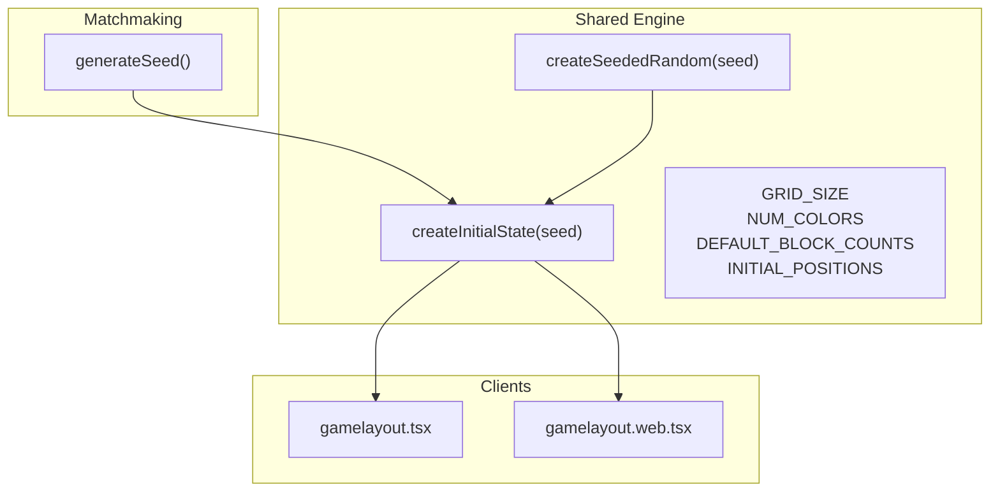
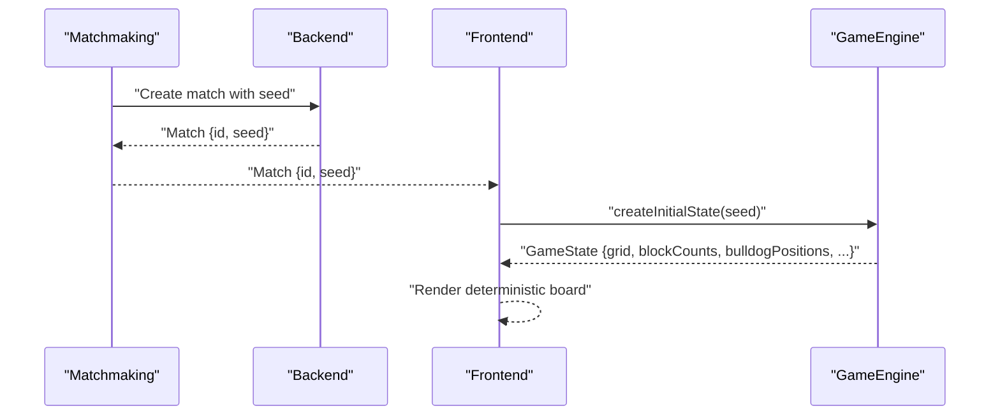
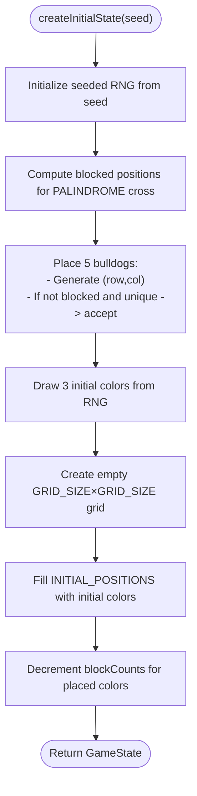
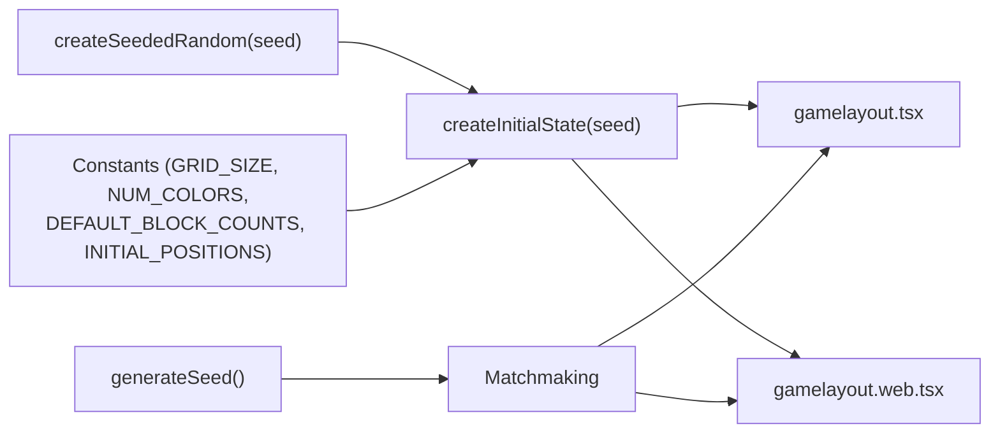

# State Initialization Process

<cite>
**Referenced Files in This Document**
- [seededRandom.ts](file://lib/seededRandom.ts)
- [gameEngine.ts](file://lib/gameEngine.ts)
- [gamelayout.tsx](file://app/(tabs)/gamelayout.tsx)
- [gamelayout.web.tsx](file://app/(tabs)/gamelayout.web.tsx)
- [matchmaking.ts](file://lib/matchmaking.ts)
- [Multiplayer Integration Context Report.md](file://Multiplayer_Integration_Context_Report.md)
</cite>

## Table of Contents
1. [Introduction](#introduction)
2. [Project Structure](#project-structure)
3. [Core Components](#core-components)
4. [Architecture Overview](#architecture-overview)
5. [Detailed Component Analysis](#detailed-component-analysis)
6. [Dependency Analysis](#dependency-analysis)
7. [Performance Considerations](#performance-considerations)
8. [Troubleshooting Guide](#troubleshooting-guide)
9. [Conclusion](#conclusion)

## Introduction
This document explains the deterministic state initialization process for the Palindrome game, focusing on how createInitialState produces identical game setups across platforms and multiplayer sessions. It details the seed-based initialization system, the bulldog position generation algorithm, blocked positions for the PALINDROME word placement, initial color distribution, and the random number generator used. It also covers the INITIAL_POSITIONS configuration, default block counts, and practical examples and debugging techniques for verifying state consistency.

## Project Structure
The initialization logic spans a small set of focused modules:
- A shared game engine module that defines constants, types, and the deterministic initialization routine
- A seeded random number generator that derives deterministic pseudo-random sequences from a string seed
- Platform-specific gameplay screens that consume the shared engine for single-player and multiplayer modes
- A matchmaking module that generates seeds and coordinates multiplayer sessions

**Diagram sources**
- [seededRandom.ts](file://lib/seededRandom.ts#L9-L20)
- [gameEngine.ts](file://lib/gameEngine.ts#L6-L22)
- [gameEngine.ts](file://lib/gameEngine.ts#L60-L100)
- [matchmaking.ts](file://lib/matchmaking.ts#L48-L52)
- [gamelayout.tsx](file://app/(tabs)/gamelayout.tsx#L743-L746)
- [gamelayout.web.tsx](file://app/(tabs)/gamelayout.web.tsx#L796-L838)

**Section sources**
- [seededRandom.ts](file://lib/seededRandom.ts#L1-L21)
- [gameEngine.ts](file://lib/gameEngine.ts#L1-L100)
- [matchmaking.ts](file://lib/matchmaking.ts#L48-L52)
- [gamelayout.tsx](file://app/(tabs)/gamelayout.tsx#L743-L746)
- [gamelayout.web.tsx](file://app/(tabs)/gamelayout.web.tsx#L796-L838)

## Core Components
- Seeded Random Number Generator: Provides a deterministic PRNG from a string seed, ensuring identical sequences across platforms and runs.
- Game Engine Constants and Types: Defines grid size, number of colors, default block counts, minimum palindrome length, and the fixed initial positions for pre-placed colors.
- Initial State Factory: Builds a GameState deterministically from a seed, including bulldog positions, initial color placements, and block inventory.

Key responsibilities:
- Deterministic initialization: createInitialState uses createSeededRandom to produce reproducible outcomes.
- Blocked positions: Bulldog positions avoid the PALINDROME word’s center cross.
- Initial color distribution: Three fixed positions are filled with colors drawn from the seeded RNG.
- Inventory setup: Block counts reflect the consumed initial colors.

**Section sources**
- [seededRandom.ts](file://lib/seededRandom.ts#L9-L20)
- [gameEngine.ts](file://lib/gameEngine.ts#L6-L22)
- [gameEngine.ts](file://lib/gameEngine.ts#L60-L100)

## Architecture Overview
The multiplayer-ready initialization pipeline:

**Diagram sources**
- [matchmaking.ts](file://lib/matchmaking.ts#L48-L52)
- [matchmaking.ts](file://lib/matchmaking.ts#L58-L66)
- [gamelayout.tsx](file://app/(tabs)/gamelayout.tsx#L743-L746)
- [gameEngine.ts](file://lib/gameEngine.ts#L60-L100)

## Detailed Component Analysis

### Seeded Random Number Generator
Purpose:
- Produce a deterministic sequence of pseudo-random numbers from a string seed.
- Enable identical game setups across platforms and sessions when the same seed is used.

Implementation highlights:
- Hashes the seed into an internal state using a multiplicative hashing scheme.
- Produces 32-bit unsigned integers and normalizes them to [0, 1) for use in selection logic.

Usage in initialization:
- The RNG is used to select bulldog positions and initial colors.

**Section sources**
- [seededRandom.ts](file://lib/seededRandom.ts#L9-L20)

### Bulldog Position Generation Algorithm
Goal:
- Place five bulldog tokens on the board such that none overlap and none appear on the PALINDROME word’s center cross.

Algorithm steps:
- Compute blocked positions for the center row and center column of the PALINDROME word.
- Loop until five valid positions are found:
  - Generate candidate coordinates using the seeded RNG scaled to grid size.
  - Reject if the position is blocked or already selected.
  - Accept otherwise.

Blocked positions:
- Derived from the center row/column and the length of the word, ensuring bulldogs never overlap the word placement area.

Validation:
- The algorithm guarantees exactly five positions and avoids duplicates.

**Section sources**
- [gameEngine.ts](file://lib/gameEngine.ts#L48-L55)
- [gameEngine.ts](file://lib/gameEngine.ts#L60-L76)

### Blocked Positions Calculation for PALINDROME Word Placement
Logic:
- Center row and center column define the cross.
- Half-word offset determines the span of the word along both axes.
- All such positions are added to a set of blocked coordinates.

Outcome:
- Bulldog placement and initial color placement avoid these coordinates.

**Section sources**
- [gameEngine.ts](file://lib/gameEngine.ts#L12-L15)
- [gameEngine.ts](file://lib/gameEngine.ts#L48-L54)

### Initial Color Distribution
Fixed initial positions:
- A constant array of three fixed board coordinates is used for pre-placement.

Process:
- For each fixed position, draw a color index from the seeded RNG.
- Initialize an empty grid and fill the fixed positions with the generated colors.
- Decrement the corresponding block counts for each color placed.

Result:
- The initial inventory reflects the consumed colors, starting each player with reduced stock for those colors.

**Section sources**
- [gameEngine.ts](file://lib/gameEngine.ts#L17-L22)
- [gameEngine.ts](file://lib/gameEngine.ts#L78-L91)

### Default Block Count Setup
Behavior:
- Start with equal block counts for all colors.
- Reduce counts by one for each of the three initial colors placed.

Outcome:
- Ensures balanced starting conditions while reflecting the consumed pieces.

**Section sources**
- [gameEngine.ts](file://lib/gameEngine.ts#L8-L8)
- [gameEngine.ts](file://lib/gameEngine.ts#L88-L91)

### INITIAL_POSITIONS Configuration
Details:
- Three fixed coordinates are used for pre-placement.
- These positions are platform-consistent and part of the shared engine.

Usage:
- Deterministically placed during initialization and mirrored in single-player UI logic.

**Section sources**
- [gameEngine.ts](file://lib/gameEngine.ts#L17-L22)
- [gamelayout.web.tsx](file://app/(tabs)/gamelayout.web.tsx#L809-L823)
- [gamelayout.tsx](file://app/(tabs)/gamelayout.tsx#L709-L730)

### createInitialState Function Flow

**Diagram sources**
- [gameEngine.ts](file://lib/gameEngine.ts#L60-L100)

**Section sources**
- [gameEngine.ts](file://lib/gameEngine.ts#L60-L100)

### Multiplayer Integration and Seed Usage
- Matchmaking generates a seed per match and stores it with the match record.
- Frontend retrieves the seed and calls createInitialState to build identical boards for both players.
- UI mirrors the deterministic initialization for single-player parity.

**Section sources**
- [matchmaking.ts](file://lib/matchmaking.ts#L48-L52)
- [gamelayout.tsx](file://app/(tabs)/gamelayout.tsx#L743-L746)
- [Multiplayer Integration Context Report.md](file://Multiplayer_Integration_Context_Report.md#L142-L152)

## Dependency Analysis

**Diagram sources**
- [seededRandom.ts](file://lib/seededRandom.ts#L9-L20)
- [gameEngine.ts](file://lib/gameEngine.ts#L6-L22)
- [gameEngine.ts](file://lib/gameEngine.ts#L60-L100)
- [matchmaking.ts](file://lib/matchmaking.ts#L48-L52)
- [gamelayout.tsx](file://app/(tabs)/gamelayout.tsx#L743-L746)
- [gamelayout.web.tsx](file://app/(tabs)/gamelayout.web.tsx#L796-L838)

**Section sources**
- [seededRandom.ts](file://lib/seededRandom.ts#L9-L20)
- [gameEngine.ts](file://lib/gameEngine.ts#L6-L22)
- [gameEngine.ts](file://lib/gameEngine.ts#L60-L100)
- [matchmaking.ts](file://lib/matchmaking.ts#L48-L52)
- [gamelayout.tsx](file://app/(tabs)/gamelayout.tsx#L743-L746)
- [gamelayout.web.tsx](file://app/(tabs)/gamelayout.web.tsx#L796-L838)

## Performance Considerations
- Seeded RNG cost: Constant-time per invocation; negligible overhead for initialization.
- Bulldog placement: Expected very few retries due to ample free space; worst-case linear in retry attempts but bounded.
- Grid operations: Single pass to initialize and fill; memory O(N^2) for the grid.
- Determinism: No cryptographic randomness; deterministic hashing ensures reproducibility without performance penalties.

## Troubleshooting Guide
Common verification techniques:
- Snapshot comparison:
  - Capture the resulting GameState after createInitialState for a given seed.
  - Compare grids, bulldog positions, and block counts across platforms and sessions.
- Seed impact:
  - Changing the seed should alter bulldog positions and initial colors.
  - Identical seeds must yield identical states.
- Debugging steps:
  - Log the seed value used for initialization.
  - Print the computed blocked positions and confirm they align with the center cross.
  - Verify that INITIAL_POSITIONS are filled deterministically.
  - Confirm blockCounts reflect the three placed colors.

Practical references:
- Single-player initialization mirrors the shared logic for pre-placed colors and inventory adjustments.
- Multiplayer initialization consumes the backend-provided seed to call createInitialState and populate UI state.

**Section sources**
- [gamelayout.web.tsx](file://app/(tabs)/gamelayout.web.tsx#L809-L829)
- [gamelayout.tsx](file://app/(tabs)/gamelayout.tsx#L709-L730)
- [gamelayout.tsx](file://app/(tabs)/gamelayout.tsx#L743-L746)

## Conclusion
The createInitialState function, powered by a seeded random number generator, establishes a fully deterministic game setup. This foundation enables identical boards across platforms and synchronized multiplayer sessions. The bulldog placement algorithm respects the PALINDROME word’s center cross, while the initial color distribution and block inventory reflect the pre-placed pieces. Together, these mechanisms provide a robust, verifiable, and fair initialization process suitable for both single-player and multiplayer contexts.