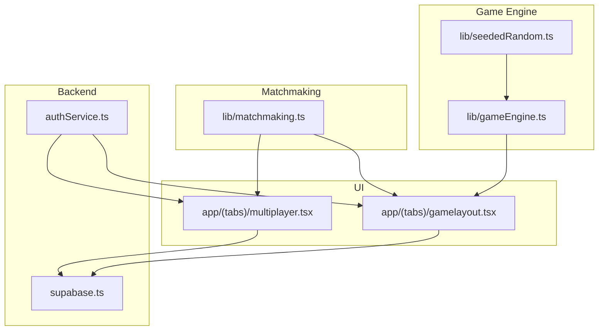
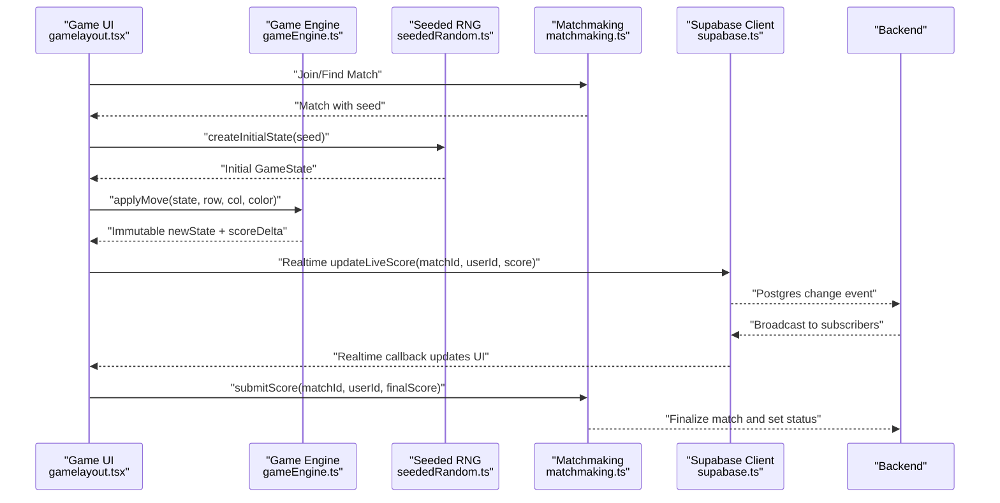
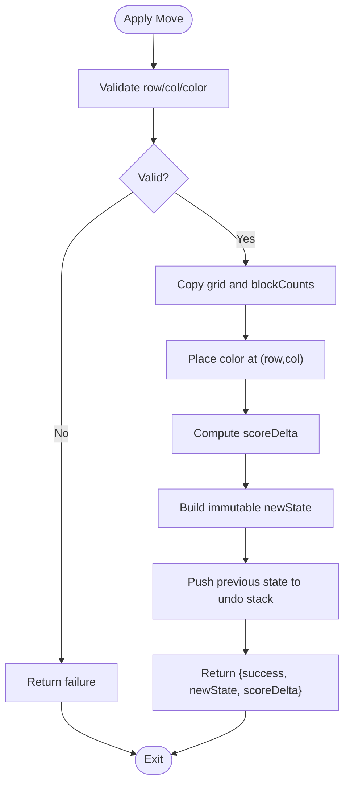
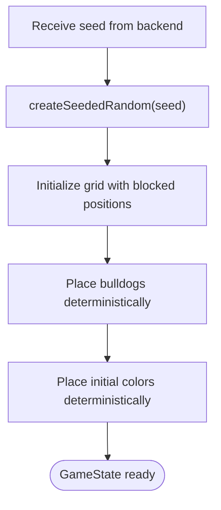
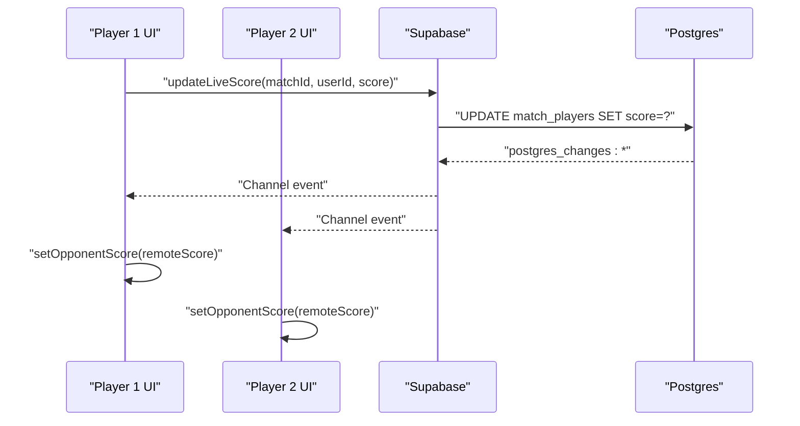
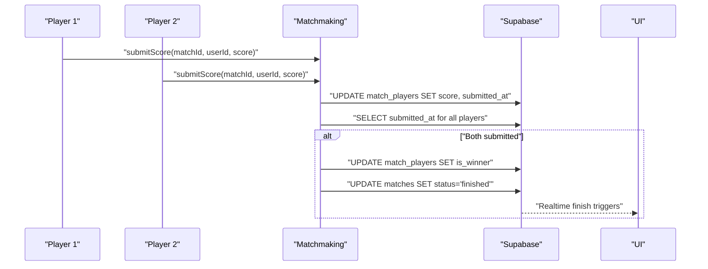
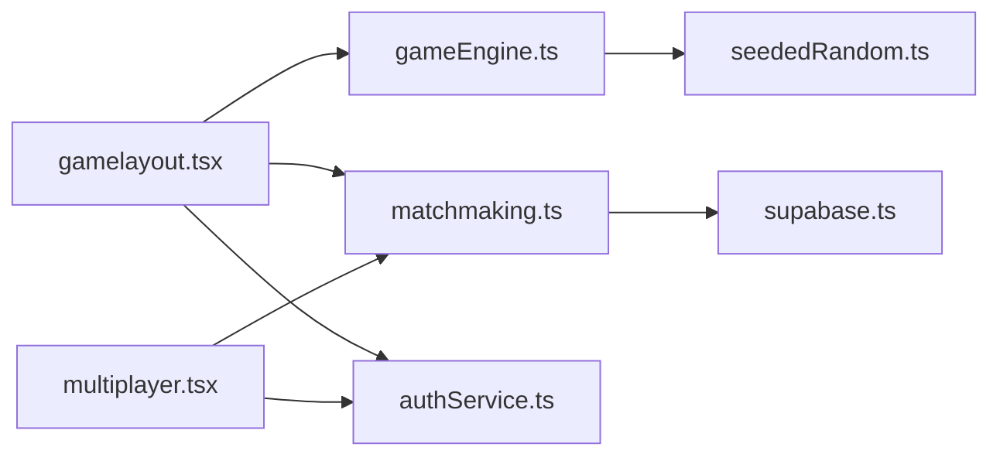

# State Persistence and Synchronization

<cite>
**Referenced Files in This Document**
- [gameEngine.ts](file://lib/gameEngine.ts)
- [seededRandom.ts](file://lib/seededRandom.ts)
- [matchmaking.ts](file://lib/matchmaking.ts)
- [gamelayout.tsx](file://app/(tabs)/gamelayout.tsx)
- [multiplayer.tsx](file://app/(tabs)/multiplayer.tsx)
- [supabase.ts](file://supabase.ts)
- [authService.ts](file://authService.ts)
- [Multiplayer_Integration_Context_Report.md](file://Multiplayer_Integration_Context_Report.md)
</cite>

## Table of Contents
1. [Introduction](#introduction)
2. [Project Structure](#project-structure)
3. [Core Components](#core-components)
4. [Architecture Overview](#architecture-overview)
5. [Detailed Component Analysis](#detailed-component-analysis)
6. [Dependency Analysis](#dependency-analysis)
7. [Performance Considerations](#performance-considerations)
8. [Troubleshooting Guide](#troubleshooting-guide)
9. [Conclusion](#conclusion)
10. [Appendices](#appendices)

## Introduction
This document explains how state is modeled, persisted, synchronized, and reconciled in a multiplayer-enabled version of the game. It covers:
- State serialization and transport for network transmission
- Change detection and reconciliation strategies
- Immutable update patterns and snapshotting for undo
- Diff algorithms and state restoration
- Relationship between state structure and multiplayer synchronization
- Examples of persistence formats, synchronization protocols, and debugging approaches

The goal is to help developers implement robust multiplayer state handling that remains consistent across clients and resilient to reconnection and out-of-order events.

## Project Structure
The state-related logic spans a small set of focused modules:
- Game engine defines the canonical state model and pure functions for validation and scoring
- Seeded random ensures deterministic initialization for multiplayer
- Matchmaking orchestrates match lifecycle, real-time subscriptions, and score submission
- UI screens coordinate state initialization, live updates, and timers
- Supabase client provides backend connectivity and persistence
- Authentication service supports user sessions and profile caching

**Diagram sources**
- [gameEngine.ts](file://lib/gameEngine.ts#L26-L32)
- [seededRandom.ts](file://lib/seededRandom.ts#L9-L20)
- [matchmaking.ts](file://lib/matchmaking.ts#L21-L32)
- [gamelayout.tsx](file://app/(tabs)/gamelayout.tsx#L31-L33)
- [multiplayer.tsx](file://app/(tabs)/multiplayer.tsx#L1-L17)
- [supabase.ts](file://supabase.ts#L42-L74)
- [authService.ts](file://authService.ts#L338-L382)

**Section sources**
- [gameEngine.ts](file://lib/gameEngine.ts#L1-L284)
- [seededRandom.ts](file://lib/seededRandom.ts#L1-L21)
- [matchmaking.ts](file://lib/matchmaking.ts#L1-L542)
- [gamelayout.tsx](file://app/(tabs)/gamelayout.tsx#L1-L200)
- [multiplayer.tsx](file://app/(tabs)/multiplayer.tsx#L1-L200)
- [supabase.ts](file://supabase.ts#L1-L75)
- [authService.ts](file://authService.ts#L1-L560)

## Core Components
- GameState model: grid, block counts, score, bulldog positions, move count
- Deterministic initialization via seeded random
- Immutable move application and scoring
- Real-time match updates and score submission
- UI-driven timers and state restoration on reconnect

Key responsibilities:
- Game engine: pure functions for validation, scoring, and move application
- Matchmaking: match lifecycle, real-time subscriptions, score submission
- UI: initialize state from match seed, render live scores, manage timers
- Backend: Supabase client and auth service for persistence and sessions

**Section sources**
- [gameEngine.ts](file://lib/gameEngine.ts#L26-L32)
- [seededRandom.ts](file://lib/seededRandom.ts#L9-L20)
- [matchmaking.ts](file://lib/matchmaking.ts#L21-L32)
- [gamelayout.tsx](file://app/(tabs)/gamelayout.tsx#L742-L758)

## Architecture Overview
The multiplayer flow centers on a deterministic shared state initialized from a server-provided seed. Clients apply moves locally using immutable updates, publish live scores, and reconcile state via periodic refetches and real-time channels.

**Diagram sources**
- [gamelayout.tsx](file://app/(tabs)/gamelayout.tsx#L742-L758)
- [gameEngine.ts](file://lib/gameEngine.ts#L167-L219)
- [seededRandom.ts](file://lib/seededRandom.ts#L9-L20)
- [matchmaking.ts](file://lib/matchmaking.ts#L253-L266)
- [supabase.ts](file://supabase.ts#L42-L74)

## Detailed Component Analysis

### State Model and Serialization
- GameState includes grid, blockCounts, score, bulldogPositions, moveCount
- Grid is a 2D array of nullable color indices
- Block counts track per-color inventory
- Bulldog positions are stored as row/column pairs
- Move count increments with each placement

Serialization for network transport:
- Use compact JSON representation of GameState
- Omit derived fields; transmit only grid, blockCounts, score, bulldogPositions, moveCount
- Seed is transmitted once to initialize both clients identically

Validation and immutability:
- applyMove returns a new state object without mutating inputs
- Grid and arrays are shallow-copied before mutation
- Scoring recomputes palindrome segments and bonuses

Undo and snapshots:
- Maintain a stack of previous GameState instances
- Pop to restore previous state
- Snapshot before applying a move; push to undo stack

Change detection:
- Compare serialized snapshots or compare key fields (score, moveCount, checksum of grid)
- Detect divergence by comparing remote vs local state

**Section sources**
- [gameEngine.ts](file://lib/gameEngine.ts#L26-L32)
- [gameEngine.ts](file://lib/gameEngine.ts#L167-L219)
- [gamelayout.tsx](file://app/(tabs)/gamelayout.tsx#L742-L758)

### Immutable Updates and Undo Snapshots
- applyMove constructs a new grid and blockCounts arrays
- Computes scoreDelta and returns immutable newState
- Maintain a history stack of GameState for undo

**Diagram sources**
- [gameEngine.ts](file://lib/gameEngine.ts#L167-L219)

**Section sources**
- [gameEngine.ts](file://lib/gameEngine.ts#L167-L219)

### Deterministic Initialization and Seed-Based Sync
- createInitialState uses a seeded PRNG to place bulldogs and initial colors
- Both clients initialize identical state from the same seed
- This eliminates logic drift across platforms

**Diagram sources**
- [seededRandom.ts](file://lib/seededRandom.ts#L9-L20)
- [gameEngine.ts](file://lib/gameEngine.ts#L60-L100)

**Section sources**
- [seededRandom.ts](file://lib/seededRandom.ts#L9-L20)
- [gameEngine.ts](file://lib/gameEngine.ts#L60-L100)

### Real-Time Synchronization and Live Scores
- UI subscribes to match and match_players changes
- updateLiveScore writes to match_players while submitted_at is null
- Realtime channels broadcast updates to opponents
- UI updates opponent score and profile asynchronously

**Diagram sources**
- [matchmaking.ts](file://lib/matchmaking.ts#L253-L266)
- [gamelayout.tsx](file://app/(tabs)/gamelayout.tsx#L760-L771)

**Section sources**
- [matchmaking.ts](file://lib/matchmaking.ts#L204-L247)
- [matchmaking.ts](file://lib/matchmaking.ts#L253-L266)
- [gamelayout.tsx](file://app/(tabs)/gamelayout.tsx#L760-L771)

### Final Score Submission and Match Termination
- submitScore sets submitted_at and final score
- On both players’ submissions, winner is computed and match marked finished
- UI reads final state and displays results

**Diagram sources**
- [matchmaking.ts](file://lib/matchmaking.ts#L271-L327)
- [gamelayout.tsx](file://app/(tabs)/gamelayout.tsx#L803-L845)

**Section sources**
- [matchmaking.ts](file://lib/matchmaking.ts#L271-L327)
- [gamelayout.tsx](file://app/(tabs)/gamelayout.tsx#L803-L845)

### Lobby and Recent Matches
- Multiplayer lobby lists recent matches and allows quick match
- UI fetches recent matches and resolves opponent names/profiles

**Section sources**
- [multiplayer.tsx](file://app/(tabs)/multiplayer.tsx#L31-L62)
- [multiplayer.tsx](file://app/(tabs)/multiplayer.tsx#L96-L120)

### Supabase Client and Authentication
- Supabase client configured with platform-aware storage for sessions
- Auth service manages sessions, profiles, and avatar uploads
- UI uses auth service to resolve current user and profiles

**Section sources**
- [supabase.ts](file://supabase.ts#L42-L74)
- [authService.ts](file://authService.ts#L338-L382)
- [authService.ts](file://authService.ts#L402-L426)

## Dependency Analysis
- UI depends on gameEngine for state transitions and seededRandom for deterministic initialization
- Matchmaking depends on Supabase client for real-time and database operations
- UI subscribes to matchmaking channels for live updates
- Auth service supports session and profile caching used by UI

**Diagram sources**
- [gamelayout.tsx](file://app/(tabs)/gamelayout.tsx#L31-L33)
- [matchmaking.ts](file://lib/matchmaking.ts#L6-L7)
- [supabase.ts](file://supabase.ts#L42-L74)
- [seededRandom.ts](file://lib/seededRandom.ts#L9-L20)
- [authService.ts](file://authService.ts#L1-L11)

**Section sources**
- [gamelayout.tsx](file://app/(tabs)/gamelayout.tsx#L31-L33)
- [matchmaking.ts](file://lib/matchmaking.ts#L6-L7)
- [supabase.ts](file://supabase.ts#L42-L74)

## Performance Considerations
- Prefer immutable updates to simplify change detection and enable efficient UI rendering
- Serialize only essential fields for network transport to reduce payload size
- Use checksums or compact diffs for frequent reconciliation messages
- Batch live score updates to minimize real-time traffic
- Cache user profiles locally to avoid repeated network calls

## Troubleshooting Guide
Common issues and remedies:
- Out-of-order events: rely on periodic refetch and real-time reconciliation
- Divergent state: compare serialized snapshots and revert to last known good state
- Reconnection: reinitialize from seed and replay minimal necessary state
- Score discrepancies: enforce server-authoritative scoring and validate moves server-side
- Session problems: clear stale sessions and re-authenticate if refresh tokens are invalid

Debugging tips:
- Log state transitions with move metadata (row, col, color, scoreDelta)
- Track timestamps for live score updates and final submissions
- Verify seed equality across clients before initializing state
- Inspect Supabase channel subscriptions and event filters

**Section sources**
- [matchmaking.ts](file://lib/matchmaking.ts#L470-L511)
- [authService.ts](file://authService.ts#L338-L382)

## Conclusion
A robust multiplayer state system combines deterministic initialization, immutable updates, and server-authoritative scoring with resilient real-time synchronization. By modeling state clearly, serializing minimally, and reconciling via snapshots and diffs, the system remains consistent across clients and tolerant of reconnection and out-of-order events.

## Appendices

### Example State Persistence Formats
- GameState JSON (compact):
  - grid: 2D array of nullable integers
  - blockCounts: array of 5 integers
  - score: integer
  - bulldogPositions: array of { row, col }
  - moveCount: integer
- Match metadata:
  - id, status, mode, seed, time_limit_seconds, started_at, finished_at
  - match_players: array of { user_id, score, submitted_at, is_winner }

**Section sources**
- [gameEngine.ts](file://lib/gameEngine.ts#L26-L32)
- [matchmaking.ts](file://lib/matchmaking.ts#L21-L32)

### Synchronization Protocols
- Realtime channels for match and match_players
- Append-only logs for future turn-based or aggressive modes
- Polling fallback for reliability

**Section sources**
- [matchmaking.ts](file://lib/matchmaking.ts#L204-L247)
- [matchmaking.ts](file://lib/matchmaking.ts#L470-L511)
- [Multiplayer_Integration_Context_Report.md](file://Multiplayer_Integration_Context_Report.md#L142-L195)