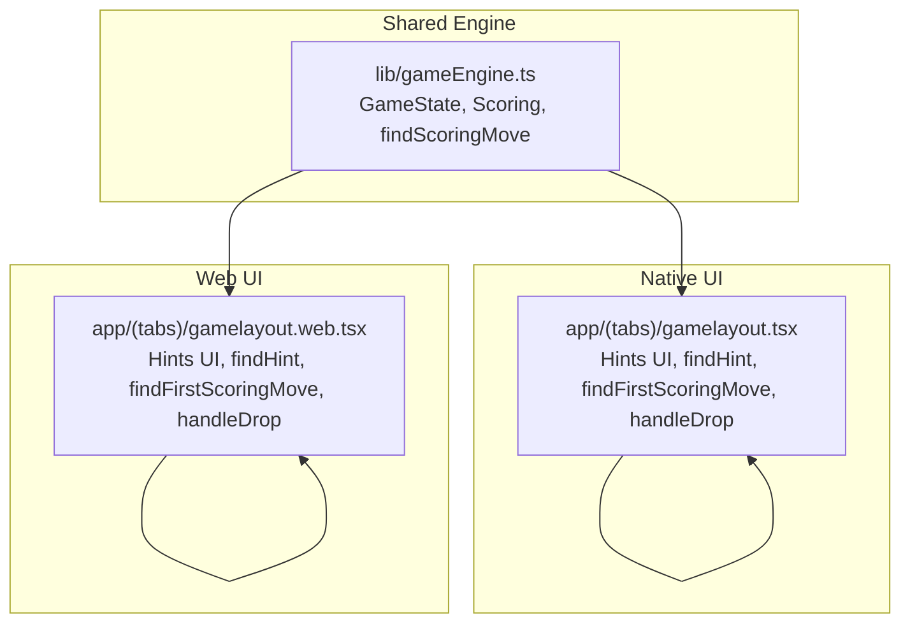
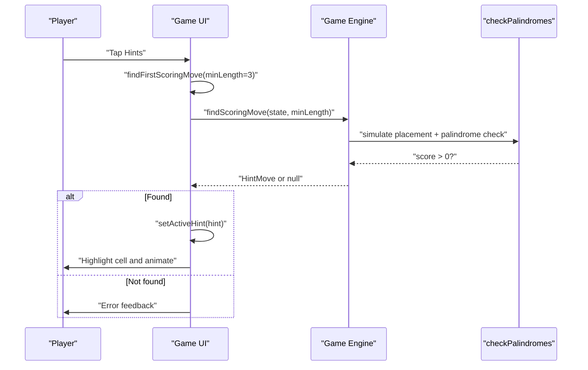
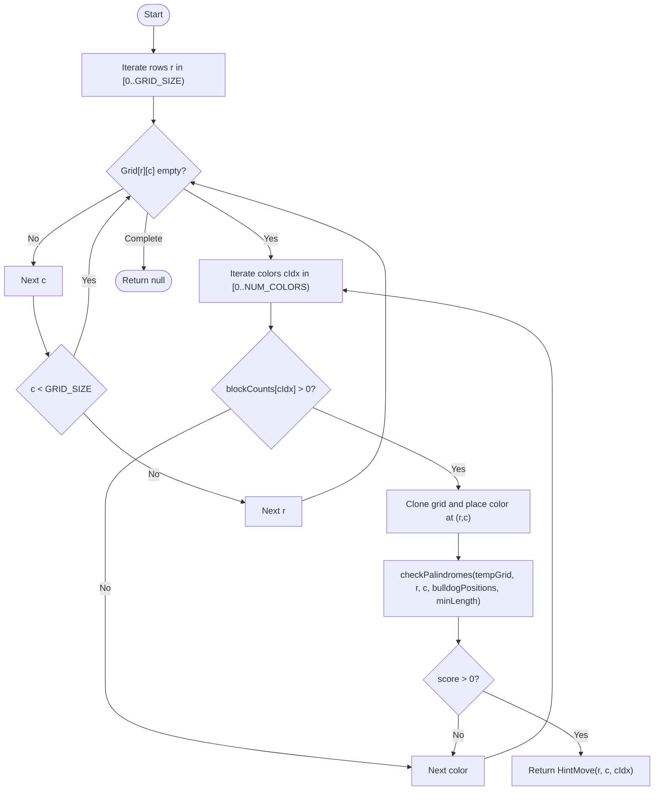
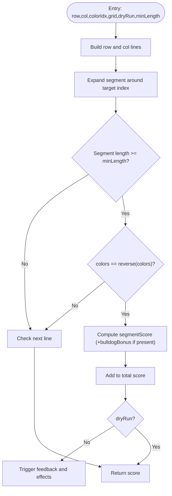
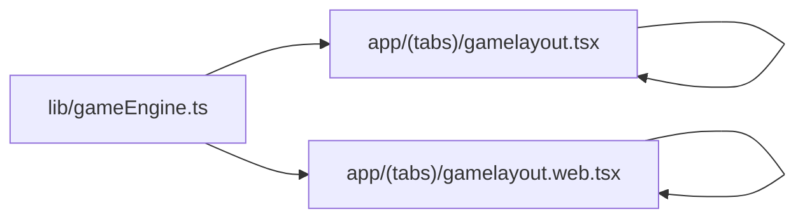

# Hint Generation System

<cite>
**Referenced Files in This Document**
- [gameEngine.ts](file://lib/gameEngine.ts)
- [gamelayout.tsx](file://app/(tabs)/gamelayout.tsx)
- [gamelayout.web.tsx](file://app/(tabs)/gamelayout.web.tsx)
</cite>

## Table of Contents
1. [Introduction](#introduction)
2. [Project Structure](#project-structure)
3. [Core Components](#core-components)
4. [Architecture Overview](#architecture-overview)
5. [Detailed Component Analysis](#detailed-component-analysis)
6. [Dependency Analysis](#dependency-analysis)
7. [Performance Considerations](#performance-considerations)
8. [Troubleshooting Guide](#troubleshooting-guide)
9. [Conclusion](#conclusion)

## Introduction
This document explains the hint generation and solution discovery system in Palindrome. It focuses on the findScoringMove algorithm that discovers valid moves capable of forming scoring palindromic segments, the brute-force search strategy, candidate evaluation, and the first-valid-move selection approach. It also covers computational complexity, optimization techniques for real-time hint delivery, caching strategies, and how the system integrates with user experience to improve accessibility.

## Project Structure
The hint system spans shared game logic and platform-specific UI implementations:
- Shared game engine: defines the board, scoring rules, and the findScoringMove algorithm
- Native UI: implements hint UI, hint consumption, and integration with move validation
- Web UI: mirrors the native behavior with web-specific drag-and-drop interactions

**Diagram sources**
- [gameEngine.ts](file://lib/gameEngine.ts#L26-L44)
- [gamelayout.tsx](file://app/(tabs)/gamelayout.tsx#L946-L976)
- [gamelayout.web.tsx](file://app/(tabs)/gamelayout.web.tsx#L1049-L1070)

**Section sources**
- [gameEngine.ts](file://lib/gameEngine.ts#L6-L10)
- [gamelayout.tsx](file://app/(tabs)/gamelayout.tsx#L465-L500)
- [gamelayout.web.tsx](file://app/(tabs)/gamelayout.web.tsx#L552-L590)

## Core Components
- findScoringMove (shared engine): Brute-force search across all empty cells and colors to find the first move that yields a positive score via palindrome detection.
- findFirstScoringMove (UI): Platform-specific wrapper that evaluates candidates using the shared scoring logic and returns the first valid hint.
- findHint (UI): Orchestrator that decrements hint count, highlights the discovered move, and triggers feedback.
- checkAndProcessPalindromes (UI): Evaluates rows/columns through a target cell to detect palindromic segments and compute scores.

Key behaviors:
- First-valid-move selection: The system returns immediately upon finding the first candidate that produces a score greater than zero.
- Candidate evaluation: Each candidate simulates placing a block and runs palindrome detection to compute potential score.
- Difficulty-aware search: The UI attempts longer segments first, falling back to shorter ones when needed.

**Section sources**
- [gameEngine.ts](file://lib/gameEngine.ts#L224-L249)
- [gamelayout.tsx](file://app/(tabs)/gamelayout.tsx#L946-L976)
- [gamelayout.web.tsx](file://app/(tabs)/gamelayout.web.tsx#L1049-L1070)

## Architecture Overview
The hint system follows a layered architecture:
- Shared engine encapsulates game rules and scoring
- UI layers (native/web) expose hint actions and integrate with move validation
- Real-time constraints require efficient hint computation and minimal UI blocking

**Diagram sources**
- [gamelayout.tsx](file://app/(tabs)/gamelayout.tsx#L965-L976)
- [gamelayout.web.tsx](file://app/(tabs)/gamelayout.web.tsx#L1049-L1070)
- [gameEngine.ts](file://lib/gameEngine.ts#L224-L249)

## Detailed Component Analysis

### findScoringMove (Shared Engine)
The shared engine’s findScoringMove performs a brute-force search across the board:
- Iterates over all empty cells (rows × columns)
- Iterates over available colors (limited by block counts)
- Simulates placing a block and checks for scoring palindromes
- Returns the first HintMove that yields a positive score

Algorithm characteristics:
- Input: GameState, optional minimum palindrome length
- Output: HintMove or null
- Evaluation: Each candidate triggers palindrome detection on a temporary grid

**Diagram sources**
- [gameEngine.ts](file://lib/gameEngine.ts#L224-L249)

**Section sources**
- [gameEngine.ts](file://lib/gameEngine.ts#L224-L249)

### findFirstScoringMove (Platform UI)
The platform-specific findFirstScoringMove mirrors the shared logic but operates on current UI state:
- Uses refs to access grid, counts, and grid size
- Calls checkAndProcessPalindromes with a dry-run flag to evaluate candidates
- Returns the first valid HintMove

Behavior:
- Attempts longer segments first (minLength=3), then falls back (minLength=2)
- Integrates with UI feedback and hint highlighting

**Section sources**
- [gamelayout.tsx](file://app/(tabs)/gamelayout.tsx#L946-L963)
- [gamelayout.web.tsx](file://app/(tabs)/gamelayout.web.tsx#L1210-L1218)

### findHint (Platform UI)
The findHint function orchestrates hint delivery:
- Decrements hint count
- Highlights the discovered move for a short duration
- Provides error feedback when no hint is available

Integration:
- Delegates to findFirstScoringMove for discovery
- Updates UI state and triggers animations

**Section sources**
- [gamelayout.tsx](file://app/(tabs)/gamelayout.tsx#L965-L976)
- [gamelayout.web.tsx](file://app/(tabs)/gamelayout.web.tsx#L1485-L1511)

### checkAndProcessPalindromes (Platform UI)
This function evaluates palindromic segments along the row and column passing through a given cell:
- Builds line arrays from the grid
- Expands around the target index to find the maximal segment
- Checks palindrome property and computes score
- Applies bulldog bonus when applicable

**Diagram sources**
- [gamelayout.tsx](file://app/(tabs)/gamelayout.tsx#L900-L944)
- [gamelayout.web.tsx](file://app/(tabs)/gamelayout.web.tsx#L1132-L1200)

**Section sources**
- [gamelayout.tsx](file://app/(tabs)/gamelayout.tsx#L900-L944)
- [gamelayout.web.tsx](file://app/(tabs)/gamelayout.web.tsx#L1132-L1200)

## Dependency Analysis
The hint system exhibits clear separation of concerns:
- Shared engine depends only on grid geometry and scoring rules
- UI layers depend on shared engine for correctness and on local state for performance
- No circular dependencies observed between engine and UI

**Diagram sources**
- [gameEngine.ts](file://lib/gameEngine.ts#L26-L44)
- [gamelayout.tsx](file://app/(tabs)/gamelayout.tsx#L946-L976)
- [gamelayout.web.tsx](file://app/(tabs)/gamelayout.web.tsx#L1049-L1070)

**Section sources**
- [gameEngine.ts](file://lib/gameEngine.ts#L26-L44)
- [gamelayout.tsx](file://app/(tabs)/gamelayout.tsx#L946-L976)
- [gamelayout.web.tsx](file://app/(tabs)/gamelayout.web.tsx#L1049-L1070)

## Performance Considerations
Current implementation characteristics:
- Complexity: O(R×C×K×(R+C)) per candidate, where R and C are grid dimensions, K is number of colors, and (R+C) reflects scanning row and column segments
- Practical complexity: O(N^2) for a fixed K, with early exit on first valid move
- Evaluation cost: Each candidate triggers palindrome detection across two lines

Optimization opportunities:
- Precompute segment boundaries: Cache segment expansion results for repeated evaluations
- Prune invalid placements: Skip colors with zero stock and occupied cells early
- Parallelization: Evaluate multiple candidates concurrently (with caution to avoid race conditions)
- Memoization: Cache checkPalindromes results keyed by grid state and target cell
- Heuristics: Prefer centers and intersections to increase hint likelihood

Real-time delivery tips:
- Debounce hint requests to avoid rapid successive computations
- Use requestAnimationFrame for UI updates after hint computation
- Limit fallback attempts to reduce latency under pressure

[No sources needed since this section provides general guidance]

## Troubleshooting Guide
Common issues and remedies:
- No hints available: The system plays error feedback and optionally flashes “no hints” indicator. Verify that the UI still has hints remaining and that the engine can discover a scoring move.
- Forced move enforcement: When a forced move exists, placing a block that does not score triggers a wrong-tries counter. After three consecutive failed attempts, the system reveals a hint automatically.
- Accessibility: Color-blind modes overlay tokens to aid identification of hint colors.

**Section sources**
- [gamelayout.tsx](file://app/(tabs)/gamelayout.tsx#L965-L976)
- [gamelayout.tsx](file://app/(tabs)/gamelayout.tsx#L994-L1018)
- [gamelayout.web.tsx](file://app/(tabs)/gamelayout.web.tsx#L1049-L1074)

## Conclusion
The hint generation system combines a robust brute-force search in the shared engine with platform-specific UI integration to deliver responsive hints. The first-valid-move strategy ensures low-latency hint delivery, while the dual-length search improves hint availability. With targeted optimizations—such as memoization, pruning, and parallelization—the system can maintain real-time responsiveness across devices and further enhance accessibility for diverse players.