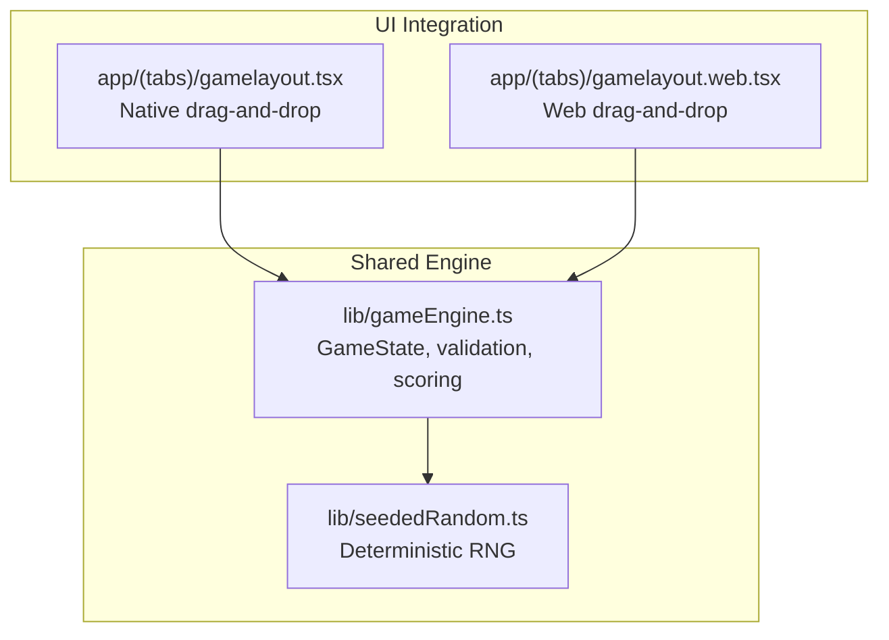
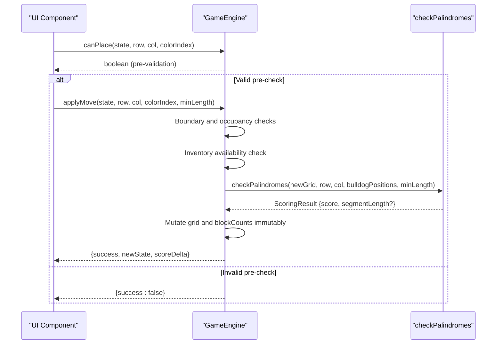
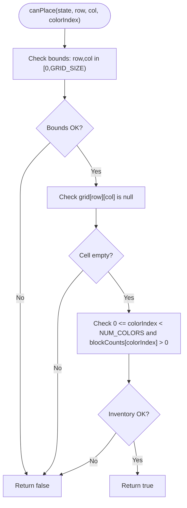
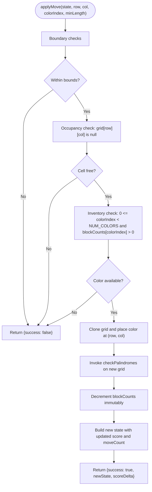
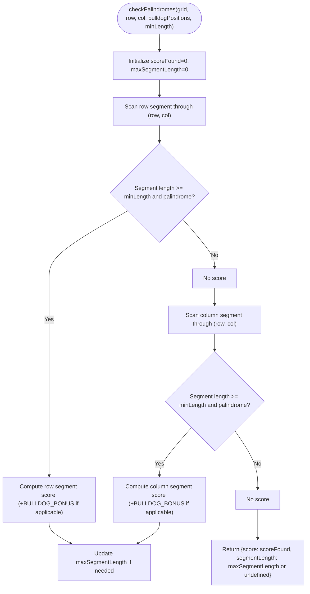
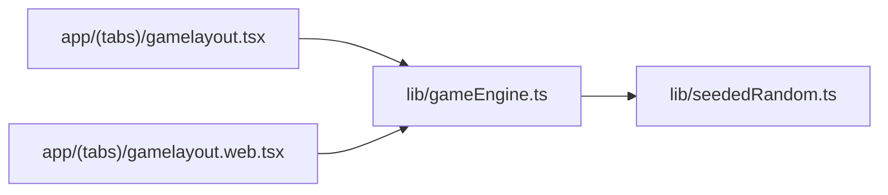

# Move Validation System

<cite>
**Referenced Files in This Document**
- [gameEngine.ts](file://lib/gameEngine.ts)
- [gamelayout.tsx](file://app/(tabs)/gamelayout.tsx)
- [gamelayout.web.tsx](file://app/(tabs)/gamelayout.web.tsx)
- [seededRandom.ts](file://lib/seededRandom.ts)
- [Multiplayer Integration Context Report](file://Multiplayer_Integration_Context_Report.md)
</cite>

## Table of Contents
1. [Introduction](#introduction)
2. [Project Structure](#project-structure)
3. [Core Components](#core-components)
4. [Architecture Overview](#architecture-overview)
5. [Detailed Component Analysis](#detailed-component-analysis)
6. [Dependency Analysis](#dependency-analysis)
7. [Performance Considerations](#performance-considerations)
8. [Troubleshooting Guide](#troubleshooting-guide)
9. [Conclusion](#conclusion)

## Introduction
This document provides a comprehensive guide to the move validation and execution system in the Palindrome game. It focuses on:
- Pre-validation via canPlace for boundary checks, occupancy verification, and inventory availability
- The applyMove pipeline that validates moves, mutates state immutably, and computes scoring deltas
- Validation criteria for row/column placement, color availability, and game rule enforcement
- Scoring computation, state immutability guarantees, and error handling strategies
- Performance optimization approaches for validation checks, batch validation for AI systems, and validation caching mechanisms

## Project Structure
The move validation system spans shared logic in the game engine and platform-specific UI integration:
- Shared validation and scoring logic resides in the game engine module
- UI components integrate validation with user interactions and provide additional pre-checks
- Deterministic initialization supports multiplayer fairness

**Diagram sources**
- [gameEngine.ts](file://lib/gameEngine.ts#L1-L284)
- [gamelayout.tsx](file://app/(tabs)/gamelayout.tsx#L68-L139)
- [gamelayout.web.tsx](file://app/(tabs)/gamelayout.web.tsx#L1018-L1063)
- [seededRandom.ts](file://lib/seededRandom.ts#L1-L21)

**Section sources**
- [gameEngine.ts](file://lib/gameEngine.ts#L1-L284)
- [gamelayout.tsx](file://app/(tabs)/gamelayout.tsx#L68-L139)
- [gamelayout.web.tsx](file://app/(tabs)/gamelayout.web.tsx#L1018-L1063)
- [seededRandom.ts](file://lib/seededRandom.ts#L1-L21)

## Core Components
- GameState: Immutable-like state container with grid, block inventory, score, bulldog positions, and move count
- Validation functions:
  - canPlace: Lightweight pre-validation for immediate UI feedback
  - applyMove: Full validation and state mutation pipeline
  - checkPalindromes: Row/column palindrome detection and scoring
- Deterministic initialization: Seeded RNG ensures identical board setups across platforms and sessions

Key constants and types:
- GRID_SIZE: 11
- NUM_COLORS: 5
- MIN_PALINDROME_LENGTH: 3
- BULLDOG_BONUS: 10

**Section sources**
- [gameEngine.ts](file://lib/gameEngine.ts#L6-L38)
- [gameEngine.ts](file://lib/gameEngine.ts#L106-L161)
- [gameEngine.ts](file://lib/gameEngine.ts#L167-L219)
- [gameEngine.ts](file://lib/gameEngine.ts#L268-L283)

## Architecture Overview
The validation and execution pipeline operates as follows:
- Pre-validation: canPlace quickly rejects invalid moves (boundary, occupancy, inventory)
- Execution: applyMove performs pre-checks, simulates placement, detects palindromes, updates state immutably, and returns a score delta
- Scoring: checkPalindromes scans row and column segments, validates palindrome property, applies bulldog bonus, and returns total score and optional segment length

**Diagram sources**
- [gameEngine.ts](file://lib/gameEngine.ts#L268-L283)
- [gameEngine.ts](file://lib/gameEngine.ts#L167-L219)
- [gameEngine.ts](file://lib/gameEngine.ts#L106-L161)

## Detailed Component Analysis

### canPlace: Pre-validation Checks
Purpose:
- Provide fast, immediate feedback to prevent unnecessary execution attempts
- Enforce boundary constraints, cell occupancy, and color inventory availability

Validation criteria:
- Boundary: row and column indices must be within [0, GRID_SIZE)
- Occupancy: target cell must be empty (null)
- Color availability: colorIndex must be within [0, NUM_COLORS) and blockCounts[colorIndex] > 0

Behavior:
- Returns false immediately upon encountering any violation
- Returns true only if all checks pass

Performance characteristics:
- O(1) time complexity
- Minimal memory overhead
- Suitable for frequent UI events (hover, drag preview)

**Diagram sources**
- [gameEngine.ts](file://lib/gameEngine.ts#L268-L283)

**Section sources**
- [gameEngine.ts](file://lib/gameEngine.ts#L268-L283)

### applyMove: Comprehensive Validation Pipeline and State Mutation
Purpose:
- Validate move, compute score delta, and produce a new immutable-like state

Pipeline stages:
1. Boundary and occupancy checks mirror canPlace but include minLength-aware context
2. Inventory check ensures the chosen color is available
3. Simulate placement by cloning grid and setting the new cell
4. Invoke checkPalindromes on the temporary grid to compute score
5. Decrement blockCounts immutably
6. Construct new state with updated score, move count, and immutable grid/blockCounts

Return value:
- success: boolean indicating whether the move was accepted
- newState: new GameState reflecting the validated move
- scoreDelta: computed score contribution from palindromes

Immutability:
- Grid and blockCounts are shallow-cloned arrays
- New state object replaces references rather than mutating existing ones
- Bulldog positions and move count are carried forward unchanged

Scoring result computation:
- checkPalindromes returns total score and optional segmentLength for UI feedback
- applyMove aggregates score and sets scoreDelta accordingly

**Diagram sources**
- [gameEngine.ts](file://lib/gameEngine.ts#L167-L219)
- [gameEngine.ts](file://lib/gameEngine.ts#L106-L161)

**Section sources**
- [gameEngine.ts](file://lib/gameEngine.ts#L167-L219)

### checkPalindromes: Row/Column Placement and Palindrome Scoring
Purpose:
- Detect palindromic segments along the row and column passing through the newly placed cell
- Compute score based on segment length and special bonuses

Algorithm:
- For row: collect non-null cells from the row containing the new cell, expand outward to find the maximal segment, validate palindrome property, and compute score
- For column: repeat the same process along the column
- Sum scores across both directions

Bonus mechanics:
- If any bulldog position lies within a scoring segment, add a fixed bonus to that segment’s score

Return value:
- score: total points from all detected palindromes
- segmentLength: maximum segment length found (used for UI feedback)

**Diagram sources**
- [gameEngine.ts](file://lib/gameEngine.ts#L106-L161)

**Section sources**
- [gameEngine.ts](file://lib/gameEngine.ts#L106-L161)

### UI Integration and Additional Pre-checks
While the core validation resides in the engine, UI components add complementary checks:
- Native gamelayout.tsx: boundary calculation for drag gestures and immediate rejection of invalid drops
- Web gamelayout.web.tsx: drag-and-drop data validation and forced-move enforcement logic

These checks complement engine-side validation by preventing invalid operations before they reach the engine.

**Section sources**
- [gamelayout.tsx](file://app/(tabs)/gamelayout.tsx#L98-L126)
- [gamelayout.web.tsx](file://app/(tabs)/gamelayout.web.tsx#L1018-L1063)

## Dependency Analysis
The system exhibits clean separation of concerns:
- UI components depend on the engine for authoritative validation and scoring
- Engine depends on seeded randomness for deterministic initialization
- No circular dependencies observed among core modules

**Diagram sources**
- [gamelayout.tsx](file://app/(tabs)/gamelayout.tsx#L68-L139)
- [gamelayout.web.tsx](file://app/(tabs)/gamelayout.web.tsx#L1018-L1063)
- [gameEngine.ts](file://lib/gameEngine.ts#L1-L284)
- [seededRandom.ts](file://lib/seededRandom.ts#L1-L21)

**Section sources**
- [gamelayout.tsx](file://app/(tabs)/gamelayout.tsx#L68-L139)
- [gamelayout.web.tsx](file://app/(tabs)/gamelayout.web.tsx#L1018-L1063)
- [gameEngine.ts](file://lib/gameEngine.ts#L1-L284)
- [seededRandom.ts](file://lib/seededRandom.ts#L1-L21)

## Performance Considerations
Current implementation characteristics:
- canPlace: O(1) checks; suitable for real-time UI feedback
- applyMove: O(R + C) per direction where R and C are row/column lengths; bounded by GRID_SIZE
- checkPalindromes: O(GRID_SIZE) scanning plus palindrome comparison; efficient for small grids

Optimization strategies:
- Batch validation for AI systems:
  - Precompute candidate segments for all empty cells and colors
  - Use memoization to avoid recomputing palindrome checks for unchanged regions
- Validation caching:
  - Cache checkPalindromes results keyed by grid hash or recent change coordinates
  - Invalidate cache entries near modified cells only
- Early exit patterns:
  - Stop palindrome expansion at boundaries or null cells
  - Short-circuit when segment length falls below minimum threshold
- Memory efficiency:
  - Clone only necessary grid slices during simulation
  - Reuse temporary arrays across validations when safe

[No sources needed since this section provides general guidance]

## Troubleshooting Guide
Common issues and remedies:
- Immediate rejection with success=false:
  - Verify that row and col are within [0, GRID_SIZE)
  - Confirm the target cell is empty
  - Ensure the chosen color exists and has inventory > 0
- Unexpected zero scoreDelta:
  - Confirm the new piece placement creates a palindrome meeting minLength
  - Check that bulldog bonus does not mask expected segment scoring
- State mutation concerns:
  - Ensure new state references replace old ones rather than mutating in place
  - Validate that grid and blockCounts are cloned before modification
- Deterministic initialization:
  - Use the same seed for multiplayer to ensure identical board layouts
  - Avoid relying on platform-specific randomness

**Section sources**
- [gameEngine.ts](file://lib/gameEngine.ts#L167-L219)
- [gameEngine.ts](file://lib/gameEngine.ts#L268-L283)
- [seededRandom.ts](file://lib/seededRandom.ts#L1-L21)

## Conclusion
The move validation and execution system combines lightweight pre-validation with a robust, deterministic execution pipeline. canPlace provides instant feedback, while applyMove ensures correctness, immutability, and accurate scoring. The modular design enables performance optimizations such as batch validation and caching, supporting both interactive gameplay and AI-driven scenarios. Adhering to the outlined error handling and immutability practices maintains reliability across native and web platforms.