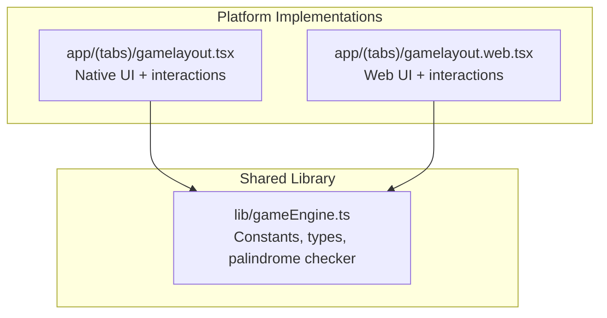
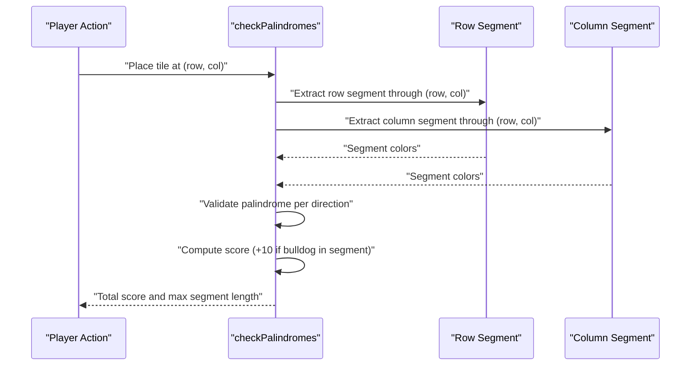
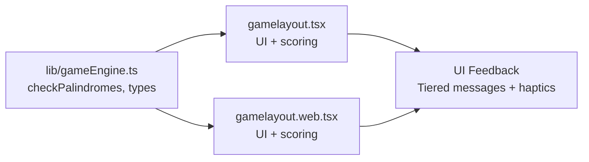

# Palindrome Detection Algorithm

<cite>
**Referenced Files in This Document**
- [gameEngine.ts](file://lib/gameEngine.ts)
- [gamelayout.tsx](file://app/(tabs)/gamelayout.tsx)
- [gamelayout.web.tsx](file://app/(tabs)/gamelayout.web.tsx)
</cite>

## Table of Contents
1. [Introduction](#introduction)
2. [Project Structure](#project-structure)
3. [Core Components](#core-components)
4. [Architecture Overview](#architecture-overview)
5. [Detailed Component Analysis](#detailed-component-analysis)
6. [Dependency Analysis](#dependency-analysis)
7. [Performance Considerations](#performance-considerations)
8. [Troubleshooting Guide](#troubleshooting-guide)
9. [Conclusion](#conclusion)

## Introduction
This document explains the palindrome detection algorithm used in the Palindrome game. It focuses on how the system identifies palindromic sequences along rows and columns that pass through a newly placed tile, validates them, computes scores, and integrates with UI feedback and multiplayer scoring. The implementation is shared between native and web platforms via a central game engine module, with platform-specific UI logic handling user interactions and visual feedback.

## Project Structure
The palindrome detection logic is implemented in a shared library module and consumed by both native and web game layouts:
- Central game engine: defines constants, data structures, and the palindrome-checking function
- Native game layout: handles drag-and-drop interactions, UI feedback, and scoring updates
- Web game layout: mirrors the native logic for browser environments

**Diagram sources**
- [gameEngine.ts](file://lib/gameEngine.ts#L1-L284)
- [gamelayout.tsx](file://app/(tabs)/gamelayout.tsx#L879-L944)
- [gamelayout.web.tsx](file://app/(tabs)/gamelayout.web.tsx#L1132-L1208)

**Section sources**
- [gameEngine.ts](file://lib/gameEngine.ts#L1-L46)
- [gamelayout.tsx](file://app/(tabs)/gamelayout.tsx#L879-L944)
- [gamelayout.web.tsx](file://app/(tabs)/gamelayout.web.tsx#L1132-L1208)

## Core Components
- Grid and state types define the board representation, block counts, score, bulldog positions, and move counters
- Constants specify board size, number of colors, default block counts, minimum palindrome length, and bulldog bonus
- The palindrome checker function operates on a grid snapshot to detect palindromes in row and column through a given position
- The move application function validates placement, updates state, and computes score deltas using the palindrome checker

Key elements:
- Grid dimension: 11×11 cells
- Number of colors: 5 distinct colors
- Minimum palindrome length: 3 tiles
- Bulldog bonus: 10 points when a detected palindrome contains a bulldog token
- Scoring result includes total score and the longest segment length for UI feedback

**Section sources**
- [gameEngine.ts](file://lib/gameEngine.ts#L6-L16)
- [gameEngine.ts](file://lib/gameEngine.ts#L24-L44)
- [gameEngine.ts](file://lib/gameEngine.ts#L106-L161)
- [gameEngine.ts](file://lib/gameEngine.ts#L167-L219)

## Architecture Overview
The palindrome detection pipeline follows a functional pattern:
- A new tile placement triggers a palindrome check across both the row and column passing through the position
- For each line, the algorithm extracts the maximal continuous segment containing the new tile
- The segment is validated as a palindrome using array reversal comparison
- If valid, the score equals the segment length plus a bulldog bonus if any bulldog token lies within the segment
- The result aggregates scores from both directions and optionally reports the longest segment length

**Diagram sources**
- [gameEngine.ts](file://lib/gameEngine.ts#L106-L161)

## Detailed Component Analysis

### checkPalindromes Function
Purpose:
- Detect palindromes in both row and column directions through a placed tile
- Compute total score and report the longest segment length for UI feedback

Core logic:
- Extract two lines: one row and one column passing through the target position
- Expand from the target index to capture the maximal continuous segment of placed tiles
- Validate palindrome by comparing the color sequence to its reverse
- Add a 10-point bulldog bonus if any bulldog token occupies a cell in the segment
- Track the maximum segment length across both directions

Integration points:
- Called by the move application function to compute score deltas
- Used by UI logic to provide immediate feedback and animations

Edge cases handled:
- Minimum length threshold prevents trivial segments from scoring
- Empty cells are represented consistently during line extraction
- Both directions are checked independently; bonuses apply per direction if applicable

Scoring calculation:
- Base score equals segment length
- Bonus adds 10 points if any bulldog token resides in the segment
- Longest segment length is reported for UI tier feedback

**Section sources**
- [gameEngine.ts](file://lib/gameEngine.ts#L106-L161)

### Line Extraction and Palindrome Validation
Process:
- For the row line: iterate across columns at the target row, collecting color values and indices
- For the column line: iterate across rows at the target column, collecting color values and indices
- From the target index, expand left/up and right/down while encountering non-empty cells
- Slice the resulting range to obtain the maximal continuous segment
- Convert colors to a comma-separated string and compare with its reversed form

Validation:
- Uses array-to-string join and reverse comparison to confirm palindrome symmetry
- Ensures minimum length requirement is met before scoring

**Section sources**
- [gameEngine.ts](file://lib/gameEngine.ts#L116-L152)

### Longest Continuous Segment and Minimum Length
Behavior:
- The algorithm finds the longest contiguous segment containing the new tile in each direction
- Only segments meeting or exceeding the minimum length (default 3) are considered
- The maximum segment length across both directions is returned for UI feedback

UI integration:
- Native and web implementations surface feedback tiers based on segment length (e.g., "GOOD!", "GREAT!", "AMAZING!", "LEGENDARY!")

**Section sources**
- [gameEngine.ts](file://lib/gameEngine.ts#L135-L151)
- [gamelayout.tsx](file://app/(tabs)/gamelayout.tsx#L918-L936)
- [gamelayout.web.tsx](file://app/(tabs)/gamelayout.web.tsx#L1180-L1199)

### Bulldog Bonus Integration
Mechanics:
- The presence of a bulldog token within a palindrome segment grants a 10-point bonus
- The check scans the segment for any cell whose coordinates match a bulldog position
- The bonus is added to the base segment score and accumulated across directions

UI feedback:
- Native and web implementations trigger celebratory feedback and sounds upon scoring
- Feedback text and color vary by segment length

**Section sources**
- [gameEngine.ts](file://lib/gameEngine.ts#L143-L146)
- [gamelayout.tsx](file://app/(tabs)/gamelayout.tsx#L908-L916)
- [gamelayout.web.tsx](file://app/(tabs)/gamelayout.web.tsx#L1170-L1178)

### Example Scenarios
Scenario A: Row palindrome with bulldog bonus
- Place a tile forming a 4-length palindrome in a row
- If a bulldog token occupies any cell in that row segment, score equals 4 + 10
- UI displays "GREAT!" feedback

Scenario B: Column palindrome without bonus
- Place a tile forming a 3-length palindrome in a column
- No bulldog token in the column segment
- Score equals 3; UI displays "GOOD!"

Scenario C: Two-direction palindrome
- Place a tile such that both row and column segments are palindromes
- Each direction contributes independently to the total score
- Report the maximum segment length for UI tier

Note: These scenarios illustrate the algorithm's behavior; specific visuals and sounds are handled by the UI layers.

**Section sources**
- [gameEngine.ts](file://lib/gameEngine.ts#L141-L150)
- [gamelayout.tsx](file://app/(tabs)/gamelayout.tsx#L918-L936)
- [gamelayout.web.tsx](file://app/(tabs)/gamelayout.web.tsx#L1180-L1199)

### Algorithm Complexity
- Time complexity: O(n) per direction, where n is the grid size (11), resulting in O(1) overall for fixed-size grids
- Space complexity: O(n) for storing line segments during extraction
- Palindrome validation cost scales with segment length; worst-case linear in segment size

Optimization opportunities:
- Early exit after palindrome validation if bonus detection is needed
- Memoization of segment boundaries when checking multiple positions
- Parallel checks across directions (though overhead may outweigh benefits on small grids)

**Section sources**
- [gameEngine.ts](file://lib/gameEngine.ts#L116-L152)

### UI Integration and Feedback
Both native and web implementations:
- Provide immediate visual and audio feedback upon scoring
- Display tiered messages ("GOOD!", "GREAT!", "AMAZING!", "LEGENDARY!") based on segment length
- Animate feedback and trigger haptic responses for engagement

These behaviors mirror the scoring logic and are coordinated with the shared engine’s reported segment length.

**Section sources**
- [gamelayout.tsx](file://app/(tabs)/gamelayout.tsx#L918-L936)
- [gamelayout.web.tsx](file://app/(tabs)/gamelayout.web.tsx#L1180-L1199)

## Dependency Analysis
The palindrome detection relies on:
- Shared constants and types from the game engine
- UI state for bulldog positions and feedback
- Move application logic to validate placements and compute deltas

**Diagram sources**
- [gameEngine.ts](file://lib/gameEngine.ts#L106-L161)
- [gamelayout.tsx](file://app/(tabs)/gamelayout.tsx#L879-L944)
- [gamelayout.web.tsx](file://app/(tabs)/gamelayout.web.tsx#L1132-L1208)

**Section sources**
- [gameEngine.ts](file://lib/gameEngine.ts#L106-L161)
- [gamelayout.tsx](file://app/(tabs)/gamelayout.tsx#L879-L944)
- [gamelayout.web.tsx](file://app/(tabs)/gamelayout.web.tsx#L1132-L1208)

## Performance Considerations
- Fixed grid size ensures constant-time palindrome checks per direction
- Minimal allocations: single pass per line with slice operations
- Palindrome validation uses string join and reverse comparison; acceptable for small segments
- UI feedback triggers are lightweight and occur only on positive scores

Recommendations:
- Keep segment length bounded by game rules to avoid long palindrome checks
- Consider caching segment boundaries if repeated checks are performed frequently
- Avoid redundant validations by leveraging existing move application flow

[No sources needed since this section provides general guidance]

## Troubleshooting Guide
Common issues and resolutions:
- No score despite a valid palindrome
  - Verify minimum length threshold is met
  - Confirm the new tile is included in the detected segment
  - Check that the segment is truly palindromic after expansion

- Incorrect bulldog bonus
  - Ensure bulldog positions are correctly tracked and match segment coordinates
  - Confirm bonus applies only when a bulldog token occupies a cell within the segment

- UI not reflecting feedback
  - Confirm the UI layer receives the reported segment length and triggers appropriate feedback
  - Verify haptic and sound triggers are enabled in settings

- Performance concerns
  - On larger grids, consider optimizing palindrome validation or caching segment computations

**Section sources**
- [gameEngine.ts](file://lib/gameEngine.ts#L135-L151)
- [gamelayout.tsx](file://app/(tabs)/gamelayout.tsx#L918-L936)
- [gamelayout.web.tsx](file://app/(tabs)/gamelayout.web.tsx#L1180-L1199)

## Conclusion
The palindrome detection algorithm efficiently identifies symmetric sequences along rows and columns through newly placed tiles, enforces a minimum length, and computes scores with optional bulldog bonuses. Its design is robust, portable across platforms, and integrated with rich UI feedback to enhance gameplay. The shared engine ensures consistency between native and web experiences while maintaining simplicity and performance.