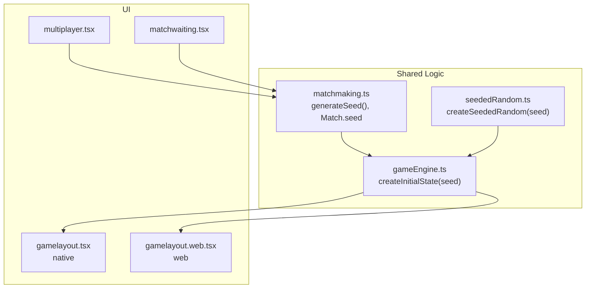
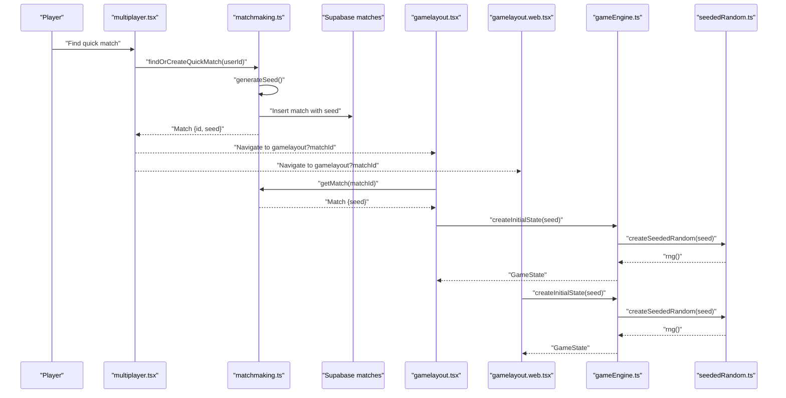
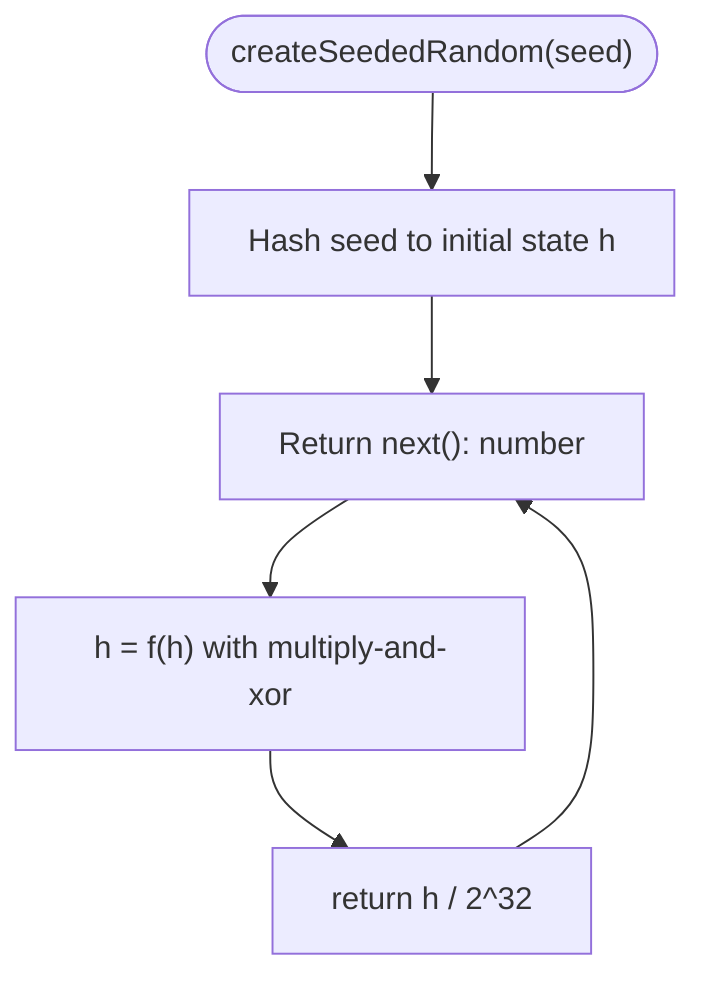
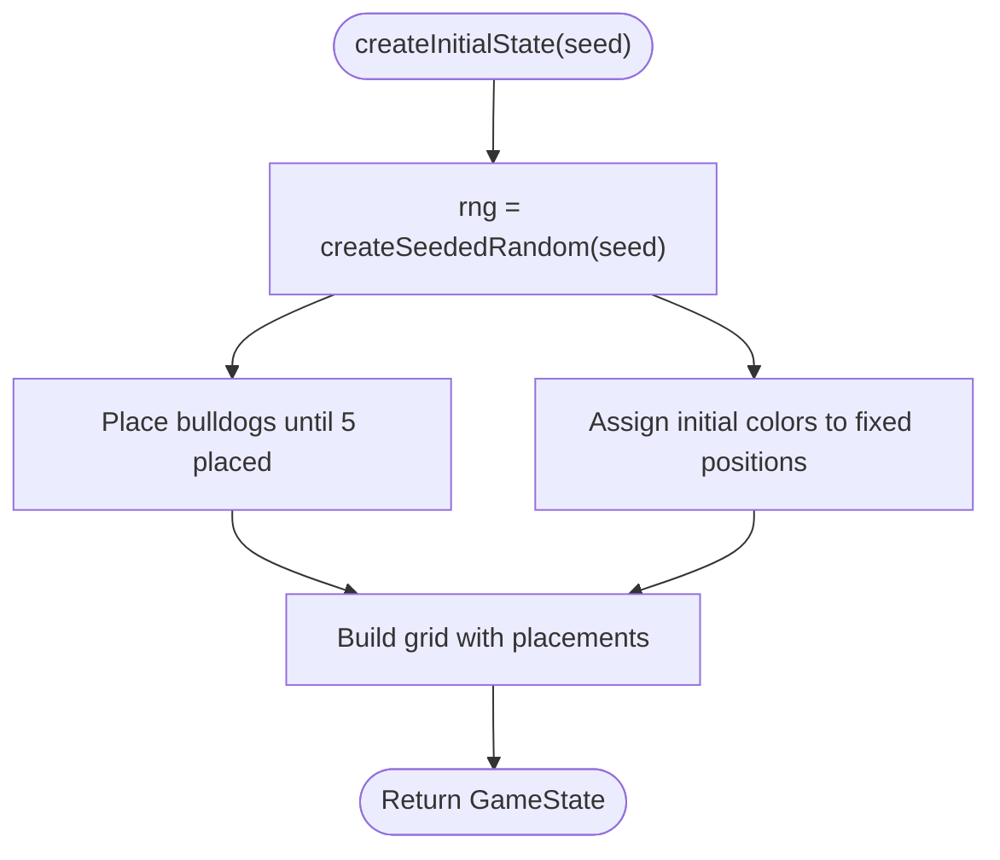
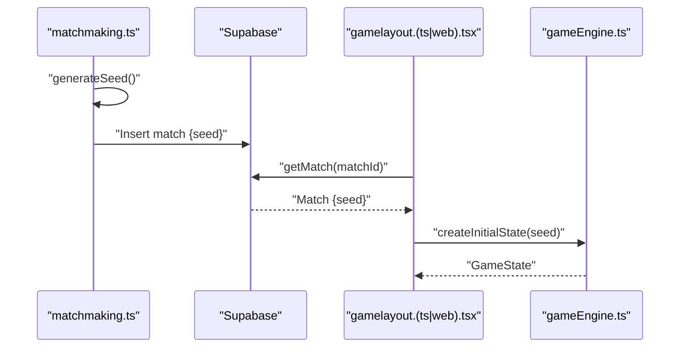
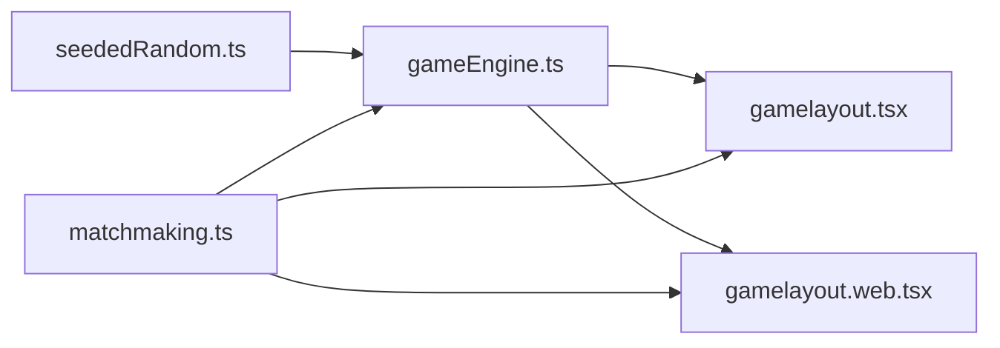

# Random Number Generation

<cite>
**Referenced Files in This Document**
- [seededRandom.ts](file://lib/seededRandom.ts)
- [gameEngine.ts](file://lib/gameEngine.ts)
- [matchmaking.ts](file://lib/matchmaking.ts)
- [gamelayout.tsx](file://app/(tabs)/gamelayout.tsx)
- [gamelayout.web.tsx](file://app/(tabs)/gamelayout.web.tsx)
- [multiplayer.tsx](file://app/(tabs)/multiplayer.tsx)
- [matchwaiting.tsx](file://app/(tabs)/matchwaiting.tsx)
</cite>

## Table of Contents
1. [Introduction](#introduction)
2. [Project Structure](#project-structure)
3. [Core Components](#core-components)
4. [Architecture Overview](#architecture-overview)
5. [Detailed Component Analysis](#detailed-component-analysis)
6. [Dependency Analysis](#dependency-analysis)
7. [Performance Considerations](#performance-considerations)
8. [Troubleshooting Guide](#troubleshooting-guide)
9. [Conclusion](#conclusion)

## Introduction
This document explains the seeded random number generation system used to create deterministic game boards for multiplayer matches. It focuses on the createSeededRandom function, its implementation based on a linear congruential-like generator, and how it integrates with game initialization, seed distribution via matchmaking, and cross-platform rendering. It also covers reproducibility for debugging, cross-platform compatibility, and performance characteristics.

## Project Structure
The seeded RNG sits at the core of shared game logic and is consumed by platform-specific game layouts:
- lib/seededRandom.ts: Provides the deterministic RNG factory from a string seed.
- lib/gameEngine.ts: Uses the seeded RNG to initialize game state deterministically.
- lib/matchmaking.ts: Generates and stores seeds for matches.
- app/(tabs)/gamelayout.(ts|web).tsx: Initializes the game using the match seed.
- app/(tabs)/multiplayer.tsx and matchwaiting.tsx: Drive matchmaking and navigation to the game.

**Diagram sources**
- [seededRandom.ts](file://lib/seededRandom.ts#L9-L20)
- [gameEngine.ts](file://lib/gameEngine.ts#L60-L100)
- [matchmaking.ts](file://lib/matchmaking.ts#L48-L52)
- [gamelayout.tsx](file://app/(tabs)/gamelayout.tsx#L31-L33)
- [gamelayout.web.tsx](file://app/(tabs)/gamelayout.web.tsx#L21-L23)
- [multiplayer.tsx](file://app/(tabs)/multiplayer.tsx#L74-L92)
- [matchwaiting.tsx](file://app/(tabs)/matchwaiting.tsx#L39-L55)

**Section sources**
- [seededRandom.ts](file://lib/seededRandom.ts#L1-L21)
- [gameEngine.ts](file://lib/gameEngine.ts#L1-L100)
- [matchmaking.ts](file://lib/matchmaking.ts#L1-L120)
- [gamelayout.tsx](file://app/(tabs)/gamelayout.tsx#L31-L33)
- [gamelayout.web.tsx](file://app/(tabs)/gamelayout.web.tsx#L21-L23)
- [multiplayer.tsx](file://app/(tabs)/multiplayer.tsx#L74-L92)
- [matchwaiting.tsx](file://app/(tabs)/matchwaiting.tsx#L39-L55)

## Core Components
- Seeded RNG factory: createSeededRandom(seed) returns a function that yields deterministic pseudo-random numbers in [0, 1) based on the provided string seed.
- Game initialization: createInitialState(seed) uses the seeded RNG to place bulldogs and initial colors consistently across platforms and sessions.
- Seed generation and distribution: generateSeed() produces a unique seed string stored in the match record and later used to initialize both players’ games.
- Cross-platform integration: Both native and web game layouts consume createInitialState(seed) to render identical boards.

Key implementation references:
- Seeded RNG: [seededRandom.ts](file://lib/seededRandom.ts#L9-L20)
- Initial state creation: [gameEngine.ts](file://lib/gameEngine.ts#L60-L100)
- Seed generation: [matchmaking.ts](file://lib/matchmaking.ts#L48-L52)
- Game layout integration (native): [gamelayout.tsx](file://app/(tabs)/gamelayout.tsx#L743-L747)
- Game layout integration (web): [gamelayout.web.tsx](file://app/(tabs)/gamelayout.web.tsx#L857-L861)

**Section sources**
- [seededRandom.ts](file://lib/seededRandom.ts#L9-L20)
- [gameEngine.ts](file://lib/gameEngine.ts#L60-L100)
- [matchmaking.ts](file://lib/matchmaking.ts#L48-L52)
- [gamelayout.tsx](file://app/(tabs)/gamelayout.tsx#L743-L747)
- [gamelayout.web.tsx](file://app/(tabs)/gamelayout.web.tsx#L857-L861)

## Architecture Overview
The system ensures deterministic board generation by deriving RNG state from a shared seed. The seed originates from matchmaking, is persisted with the match, and is used to initialize the game state on both clients.

**Diagram sources**
- [multiplayer.tsx](file://app/(tabs)/multiplayer.tsx#L74-L92)
- [matchmaking.ts](file://lib/matchmaking.ts#L58-L66)
- [matchwaiting.tsx](file://app/(tabs)/matchwaiting.tsx#L39-L55)
- [gamelayout.tsx](file://app/(tabs)/gamelayout.tsx#L736-L756)
- [gamelayout.web.tsx](file://app/(tabs)/gamelayout.web.tsx#L850-L871)
- [gameEngine.ts](file://lib/gameEngine.ts#L60-L100)
- [seededRandom.ts](file://lib/seededRandom.ts#L9-L20)

## Detailed Component Analysis

### Seeded Random Number Generator
The createSeededRandom function transforms a string seed into a deterministic RNG state and returns a closure that advances the state and yields a float in [0, 1). It uses:
- A hash of the seed string to initialize internal state.
- A multiply-with-carry and xorshift-like transformation to advance state.
- A final division to normalize to [0, 1).

**Diagram sources**
- [seededRandom.ts](file://lib/seededRandom.ts#L9-L20)

**Section sources**
- [seededRandom.ts](file://lib/seededRandom.ts#L9-L20)

### Game Initialization with Seeds
The createInitialState function uses the seeded RNG to:
- Place bulldog tokens deterministically on the board.
- Assign initial colors to fixed positions deterministically.

**Diagram sources**
- [gameEngine.ts](file://lib/gameEngine.ts#L60-L100)
- [seededRandom.ts](file://lib/seededRandom.ts#L9-L20)

**Section sources**
- [gameEngine.ts](file://lib/gameEngine.ts#L60-L100)

### Seed Distribution and Match Lifecycle
Seeds are generated at match creation and stored with the match record. Clients retrieve the seed upon entering the game and initialize identical boards.

**Diagram sources**
- [matchmaking.ts](file://lib/matchmaking.ts#L48-L52)
- [matchmaking.ts](file://lib/matchmaking.ts#L170-L187)
- [gamelayout.tsx](file://app/(tabs)/gamelayout.tsx#L743-L747)
- [gamelayout.web.tsx](file://app/(tabs)/gamelayout.web.tsx#L857-L861)
- [gameEngine.ts](file://lib/gameEngine.ts#L60-L100)

**Section sources**
- [matchmaking.ts](file://lib/matchmaking.ts#L48-L52)
- [matchmaking.ts](file://lib/matchmaking.ts#L170-L187)
- [gamelayout.tsx](file://app/(tabs)/gamelayout.tsx#L743-L747)
- [gamelayout.web.tsx](file://app/(tabs)/gamelayout.web.tsx#L857-L861)

### Cross-Platform Consistency
Both native and web game layouts call createInitialState(seed), ensuring identical RNG sequences and board generation across platforms. The RNG implementation relies on standard JavaScript numeric operations and does not depend on platform-specific crypto APIs.

**Section sources**
- [gamelayout.tsx](file://app/(tabs)/gamelayout.tsx#L743-L747)
- [gamelayout.web.tsx](file://app/(tabs)/gamelayout.web.tsx#L857-L861)
- [seededRandom.ts](file://lib/seededRandom.ts#L9-L20)

### Reproducibility and Debugging
Because the RNG is seeded deterministically, developers can reproduce game states by using the same seed string. This enables:
- Replaying specific board configurations for bug triage.
- Verifying parity between platforms.
- Testing edge cases by controlling randomness.

**Section sources**
- [seededRandom.ts](file://lib/seededRandom.ts#L1-L4)
- [gameEngine.ts](file://lib/gameEngine.ts#L60-L100)

### Entropy Management
The seed string is generated from cryptographically strong randomness when available, falling back to a time-based and random-based scheme otherwise. While the RNG itself is deterministic given the seed, the seed’s entropy ensures diverse initial board configurations across matches.

**Section sources**
- [matchmaking.ts](file://lib/matchmaking.ts#L48-L52)

## Dependency Analysis
The seeded RNG is a leaf dependency in the game initialization pipeline, with clear upstream and downstream consumers.

**Diagram sources**
- [seededRandom.ts](file://lib/seededRandom.ts#L9-L20)
- [gameEngine.ts](file://lib/gameEngine.ts#L60-L100)
- [gamelayout.tsx](file://app/(tabs)/gamelayout.tsx#L743-L747)
- [gamelayout.web.tsx](file://app/(tabs)/gamelayout.web.tsx#L857-L861)
- [matchmaking.ts](file://lib/matchmaking.ts#L48-L52)

**Section sources**
- [seededRandom.ts](file://lib/seededRandom.ts#L9-L20)
- [gameEngine.ts](file://lib/gameEngine.ts#L60-L100)
- [gamelayout.tsx](file://app/(tabs)/gamelayout.tsx#L743-L747)
- [gamelayout.web.tsx](file://app/(tabs)/gamelayout.web.tsx#L857-L861)
- [matchmaking.ts](file://lib/matchmaking.ts#L48-L52)

## Performance Considerations
- Complexity: The RNG is O(1) per call; game initialization is O(n) in board size and number of bulldogs placed.
- Memory: The RNG maintains a small integer state; memory footprint is minimal.
- Cross-platform: The implementation avoids platform-specific crypto APIs, ensuring consistent performance characteristics across environments.
- Alternatives: For cryptographic-grade randomness or higher-quality statistical properties, consider platform-provided crypto APIs or a dedicated PRNG library. For seeded deterministic behavior, the current approach is efficient and sufficient for game board generation.

[No sources needed since this section provides general guidance]

## Troubleshooting Guide
Common issues and resolutions:
- Non-deterministic behavior: Verify that the same seed string is passed to createInitialState(seed) on both clients and that no other sources of randomness are introduced between seed ingestion and board construction.
- Seed collisions: While unlikely, if two matches share the same seed, they will produce identical boards. The seed generation function uses cryptographically strong randomness when available to minimize collision risk.
- Platform differences: Confirm that both native and web paths call createInitialState(seed) with the same seed retrieved from the match record.

**Section sources**
- [seededRandom.ts](file://lib/seededRandom.ts#L9-L20)
- [gameEngine.ts](file://lib/gameEngine.ts#L60-L100)
- [matchmaking.ts](file://lib/matchmaking.ts#L48-L52)
- [gamelayout.tsx](file://app/(tabs)/gamelayout.tsx#L743-L747)
- [gamelayout.web.tsx](file://app/(tabs)/gamelayout.web.tsx#L857-L861)

## Conclusion
The seeded random number generation system provides deterministic, cross-platform game board creation for multiplayer matches. By hashing the seed string and advancing state with a simple, fast transformation, it ensures identical outcomes across clients while maintaining low overhead. Combined with robust seed generation and distribution via matchmaking, it supports reliable multiplayer experiences, reproducible debugging, and straightforward integration into game initialization flows.