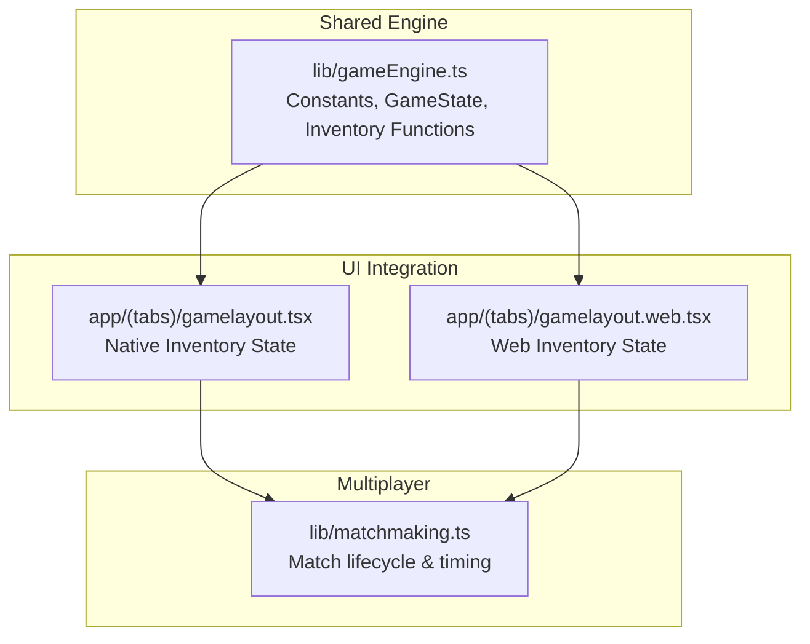
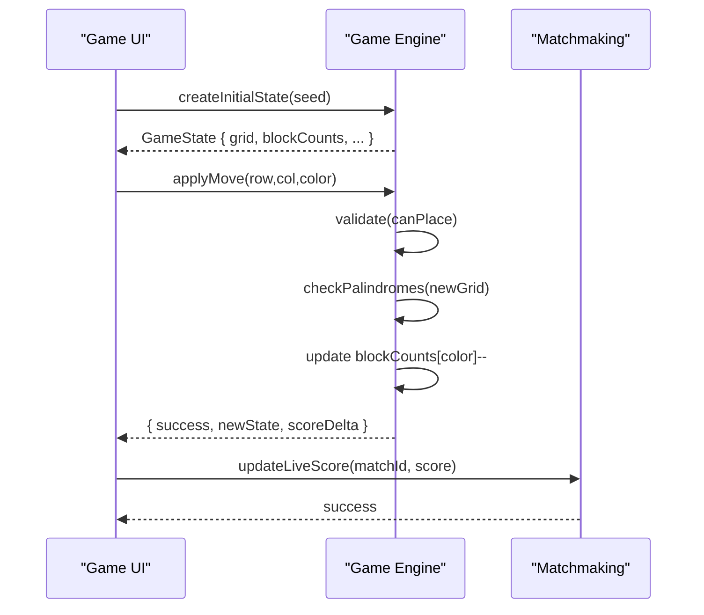
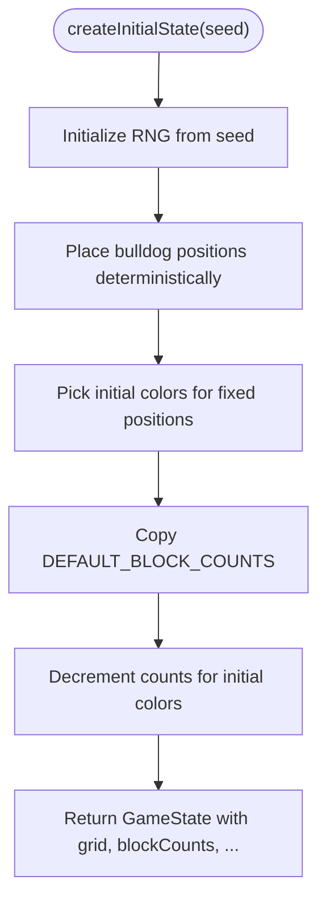
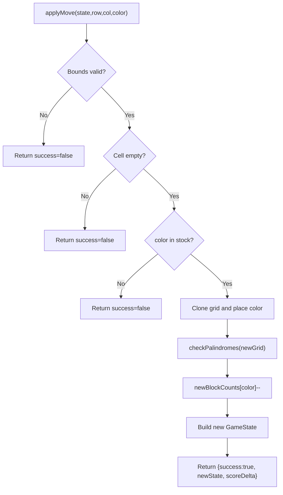
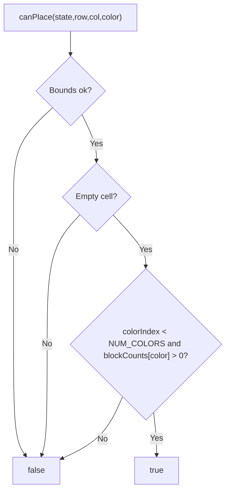
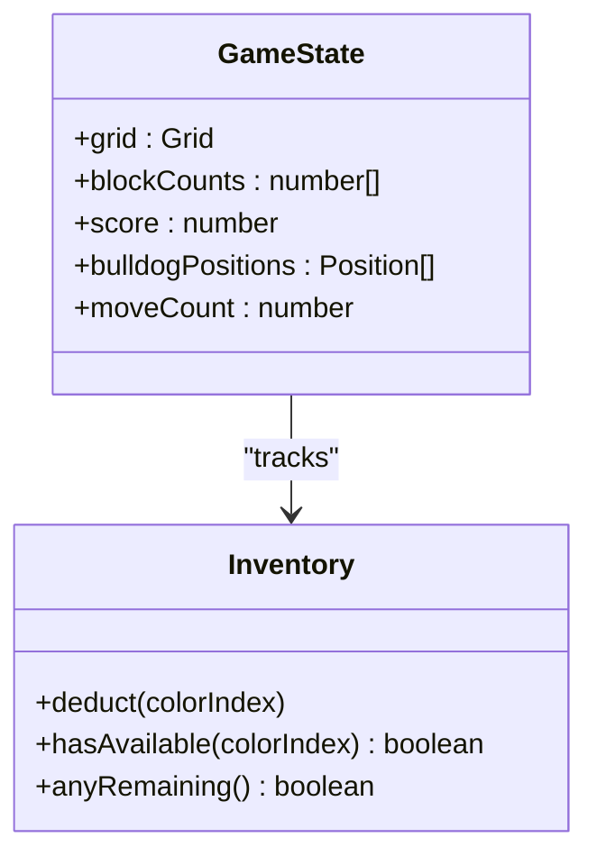
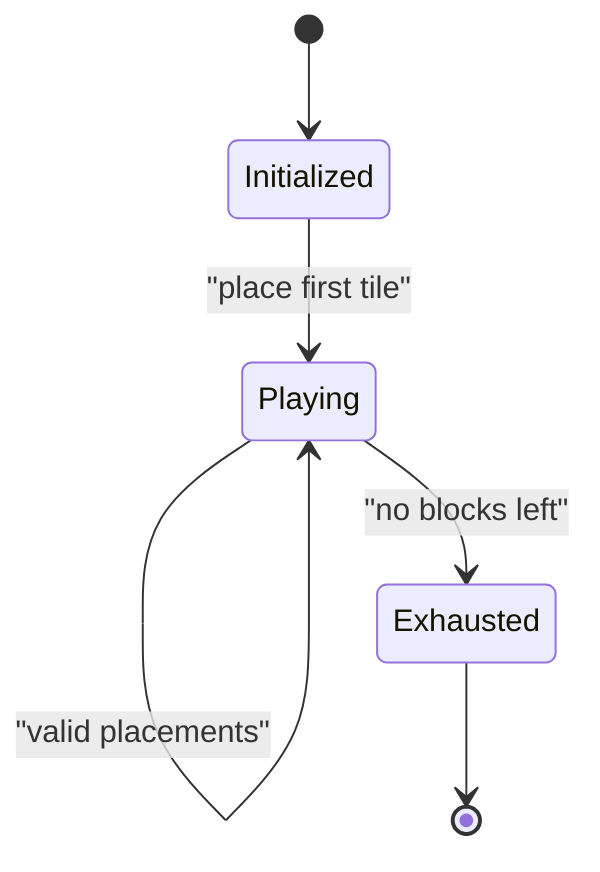
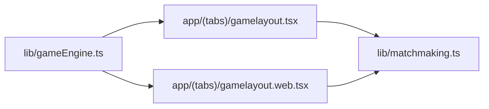

# Inventory Management

<cite>
**Referenced Files in This Document**
- [gameEngine.ts](file://lib/gameEngine.ts)
- [gamelayout.tsx](file://app/(tabs)/gamelayout.tsx)
- [gamelayout.web.tsx](file://app/(tabs)/gamelayout.web.tsx)
- [matchmaking.ts](file://lib/matchmaking.ts)
</cite>

## Table of Contents
1. [Introduction](#introduction)
2. [Project Structure](#project-structure)
3. [Core Components](#core-components)
4. [Architecture Overview](#architecture-overview)
5. [Detailed Component Analysis](#detailed-component-analysis)
6. [Dependency Analysis](#dependency-analysis)
7. [Performance Considerations](#performance-considerations)
8. [Troubleshooting Guide](#troubleshooting-guide)
9. [Conclusion](#conclusion)

## Introduction
This document explains the block inventory system that governs resource management in the Palindrome game. It covers how default block counts per color are initialized, how blocks are consumed when placing tiles, how inventory state is validated before moves, and how inventory integrates with game progression and multiplayer synchronization. It also documents configuration constants, state transitions, and optimization strategies for efficient resource tracking.

## Project Structure
The inventory system spans shared logic and platform-specific UI integration:
- Shared game engine defines constants, state interfaces, and core inventory functions.
- Platform-specific game layouts manage UI state, user interactions, and synchronize inventory with the backend.

**Diagram sources**
- [gameEngine.ts](file://lib/gameEngine.ts#L6-L32)
- [gamelayout.tsx](file://app/(tabs)/gamelayout.tsx#L617-L731)
- [gamelayout.web.tsx](file://app/(tabs)/gamelayout.web.tsx#L806-L840)
- [matchmaking.ts](file://lib/matchmaking.ts#L9-L10)

**Section sources**
- [gameEngine.ts](file://lib/gameEngine.ts#L6-L32)
- [gamelayout.tsx](file://app/(tabs)/gamelayout.tsx#L617-L731)
- [gamelayout.web.tsx](file://app/(tabs)/gamelayout.web.tsx#L806-L840)
- [matchmaking.ts](file://lib/matchmaking.ts#L9-L10)

## Core Components
- Constants and configuration
  - NUM_COLORS: Number of distinct block colors.
  - DEFAULT_BLOCK_COUNTS: Starting inventory per color.
  - GRID_SIZE: Board dimension used for placement validation.
- GameState interface
  - grid: 2D board state.
  - blockCounts: Per-color inventory counts.
  - score: Current score.
  - bulldogPositions: Special positions.
  - moveCount: Total moves for progress tracking.
- Inventory functions
  - createInitialState: Initializes board and inventory deterministically from a seed.
  - applyMove: Validates and executes a move, deducting inventory and computing score delta.
  - canPlace: Validates whether a cell is empty and a color is in stock.
  - hasBlocksLeft: Determines if any blocks remain (game continuation condition).
  - findScoringMove: Helper to find a playable move for hints.

**Section sources**
- [gameEngine.ts](file://lib/gameEngine.ts#L6-L32)
- [gameEngine.ts](file://lib/gameEngine.ts#L60-L100)
- [gameEngine.ts](file://lib/gameEngine.ts#L167-L219)
- [gameEngine.ts](file://lib/gameEngine.ts#L268-L283)
- [gameEngine.ts](file://lib/gameEngine.ts#L254-L256)
- [gameEngine.ts](file://lib/gameEngine.ts#L224-L249)

## Architecture Overview
The inventory system is centralized in the shared game engine and consumed by both native and web UI layers. Multiplayer synchronization relies on deterministic initialization via seeds and real-time updates for live scores.

**Diagram sources**
- [gameEngine.ts](file://lib/gameEngine.ts#L60-L100)
- [gameEngine.ts](file://lib/gameEngine.ts#L167-L219)
- [gamelayout.tsx](file://app/(tabs)/gamelayout.tsx#L742-L747)
- [gamelayout.web.tsx](file://app/(tabs)/gamelayout.web.tsx#L857-L861)
- [matchmaking.ts](file://lib/matchmaking.ts#L253-L266)

## Detailed Component Analysis

### Inventory Initialization in createInitialState
- Deterministic seed-based initialization ensures identical starting conditions across platforms.
- Bulldog positions are placed deterministically on the board.
- Initial colors are placed at fixed positions, reducing inventory for those colors.
- blockCounts is seeded from DEFAULT_BLOCK_COUNTS and decremented for initial colors.

**Diagram sources**
- [gameEngine.ts](file://lib/gameEngine.ts#L60-L100)

**Section sources**
- [gameEngine.ts](file://lib/gameEngine.ts#L60-L100)

### Block Deduction in applyMove
- Validation pipeline checks bounds, occupancy, and color availability.
- A temporary grid is created, then palindromes are checked to compute score delta.
- Inventory is updated by decrementing the chosen color’s count.
- New state is returned with incremented moveCount and updated score.

**Diagram sources**
- [gameEngine.ts](file://lib/gameEngine.ts#L167-L219)

**Section sources**
- [gameEngine.ts](file://lib/gameEngine.ts#L167-L219)

### Inventory Validation in canPlace
- Enforces bounds, emptiness, and stock availability before allowing a placement.
- Prevents invalid moves early, maintaining UI responsiveness and preventing wasted computation.

**Diagram sources**
- [gameEngine.ts](file://lib/gameEngine.ts#L268-L283)

**Section sources**
- [gameEngine.ts](file://lib/gameEngine.ts#L268-L283)

### Color-Based Inventory Tracking
- blockCounts is an array indexed by color (0..NUM_COLORS-1).
- Each placement reduces the corresponding index by 1.
- hasBlocksLeft checks if any color still has inventory, enabling continuation logic.

**Diagram sources**
- [gameEngine.ts](file://lib/gameEngine.ts#L26-L32)
- [gameEngine.ts](file://lib/gameEngine.ts#L254-L256)

**Section sources**
- [gameEngine.ts](file://lib/gameEngine.ts#L26-L32)
- [gameEngine.ts](file://lib/gameEngine.ts#L254-L256)

### Inventory State Transitions and Examples
- Transition 1: Game start
  - From: DEFAULT_BLOCK_COUNTS for all colors.
  - To: After placing initial colors at fixed positions, counts decremented accordingly.
- Transition 2: Successful placement
  - From: blockCounts[i] = N
  - To: blockCounts[i] = N-1 (if N > 0).
- Transition 3: Resource exhaustion
  - From: Any color with count > 0.
  - To: hasBlocksLeft becomes false; game may end depending on time or board state.

**Diagram sources**
- [gameEngine.ts](file://lib/gameEngine.ts#L254-L256)
- [gamelayout.tsx](file://app/(tabs)/gamelayout.tsx#L1052-L1057)
- [gamelayout.web.tsx](file://app/(tabs)/gamelayout.web.tsx#L1122-L1127)

**Section sources**
- [gamelayout.tsx](file://app/(tabs)/gamelayout.tsx#L1052-L1057)
- [gamelayout.web.tsx](file://app/(tabs)/gamelayout.web.tsx#L1122-L1127)

### Color Distribution Mechanics
- Initial color distribution at fixed positions reduces inventory for those colors.
- Subsequent random placement of initial colors ensures balanced early-game distribution across colors.
- This prevents immediate resource scarcity for any single color while preserving strategic depth.

**Section sources**
- [gameEngine.ts](file://lib/gameEngine.ts#L78-L91)
- [gamelayout.tsx](file://app/(tabs)/gamelayout.tsx#L709-L730)
- [gamelayout.web.tsx](file://app/(tabs)/gamelayout.web.tsx#L809-L829)

### Resource Scarcity Scenarios
- Scenario A: Single-color dominance
  - Player repeatedly places the same color, depleting it quickly.
  - Outcome: Reduced options, forcing strategic shifts.
- Scenario B: Balanced early game
  - Initial colors spread across multiple hues.
  - Outcome: Extended gameplay and varied strategies.
- Scenario C: Near-exhaustion
  - Low inventory across most colors.
  - Outcome: Tight decisions and potential game end when no moves are possible.

**Section sources**
- [gameEngine.ts](file://lib/gameEngine.ts#L254-L256)
- [gamelayout.tsx](file://app/(tabs)/gamelayout.tsx#L1052-L1057)
- [gamelayout.web.tsx](file://app/(tabs)/gamelayout.web.tsx#L1122-L1127)

### Configuration Constants
- NUM_COLORS: Defines the number of distinct block colors tracked in inventory.
- DEFAULT_BLOCK_COUNTS: Base inventory per color at game start.
- GRID_SIZE: Impacts placement validation and board state management.

**Section sources**
- [gameEngine.ts](file://lib/gameEngine.ts#L6-L8)
- [gameEngine.ts](file://lib/gameEngine.ts#L60-L100)

### Inventory Persistence Patterns
- Native and Web UI maintain local blockCounts synchronized with GameState.
- Multiplayer uses deterministic seeds to recreate identical initial states across clients.
- Live score updates occur during gameplay; final score submission triggers match completion.

**Section sources**
- [gamelayout.tsx](file://app/(tabs)/gamelayout.tsx#L617-L731)
- [gamelayout.web.tsx](file://app/(tabs)/gamelayout.web.tsx#L806-L840)
- [gamelayout.tsx](file://app/(tabs)/gamelayout.tsx#L742-L747)
- [gamelayout.web.tsx](file://app/(tabs)/gamelayout.web.tsx#L857-L861)
- [matchmaking.ts](file://lib/matchmaking.ts#L253-L266)

### Integration with Game Progression Systems
- First-move countdown and time limits influence when inventory exhaustion leads to match end.
- Hints system leverages inventory-aware validation to propose playable moves.
- Score computation rewards palindrome formation; inventory depletion can end the game when combined with time or board constraints.

**Section sources**
- [gamelayout.tsx](file://app/(tabs)/gamelayout.tsx#L800-L845)
- [gamelayout.web.tsx](file://app/(tabs)/gamelayout.web.tsx#L894-L938)
- [gameEngine.ts](file://lib/gameEngine.ts#L224-L249)

## Dependency Analysis
The inventory system depends on:
- Shared constants and state definitions.
- Validation and scoring logic in the engine.
- UI state management for local inventory and feedback.
- Multiplayer lifecycle for synchronization and timeouts.

**Diagram sources**
- [gameEngine.ts](file://lib/gameEngine.ts#L6-L32)
- [gamelayout.tsx](file://app/(tabs)/gamelayout.tsx#L31-L33)
- [gamelayout.web.tsx](file://app/(tabs)/gamelayout.web.tsx#L21-L23)
- [matchmaking.ts](file://lib/matchmaking.ts#L9-L10)

**Section sources**
- [gameEngine.ts](file://lib/gameEngine.ts#L6-L32)
- [gamelayout.tsx](file://app/(tabs)/gamelayout.tsx#L31-L33)
- [gamelayout.web.tsx](file://app/(tabs)/gamelayout.web.tsx#L21-L23)
- [matchmaking.ts](file://lib/matchmaking.ts#L9-L10)

## Performance Considerations
- Prefer shallow copies for grid and blockCounts to minimize allocations during validation and move execution.
- Use early exits in validation (bounds, occupancy, stock) to avoid unnecessary computations.
- Cache derived state (e.g., blockCountsRef) in UI to reduce prop drilling and re-renders.
- Limit hint search scope by prioritizing shorter lengths first to improve responsiveness.

## Troubleshooting Guide
- Symptom: Cannot place a tile despite having inventory
  - Cause: Cell occupied or color out of stock.
  - Action: Verify canPlace returns true and blockCounts[color] > 0.
- Symptom: Inventory appears inconsistent after multiplayer sync
  - Cause: Mismatched seed or partial state update.
  - Action: Recreate state from seed and confirm blockCounts equality.
- Symptom: Game does not end when inventory is exhausted
  - Cause: Missing timeout or board-full condition.
  - Action: Ensure hasBlocksLeft check and timer logic are active.

**Section sources**
- [gameEngine.ts](file://lib/gameEngine.ts#L178-L190)
- [gameEngine.ts](file://lib/gameEngine.ts#L268-L283)
- [gamelayout.tsx](file://app/(tabs)/gamelayout.tsx#L1052-L1057)
- [gamelayout.web.tsx](file://app/(tabs)/gamelayout.web.tsx#L1122-L1127)

## Conclusion
The inventory system centers on a simple yet robust model: a per-color counter that is decremented upon valid placements. Its deterministic initialization, strict validation, and seamless multiplayer synchronization enable fair and consistent gameplay across platforms. By leveraging early exits, caching, and targeted hint logic, the system remains responsive under real-time constraints.