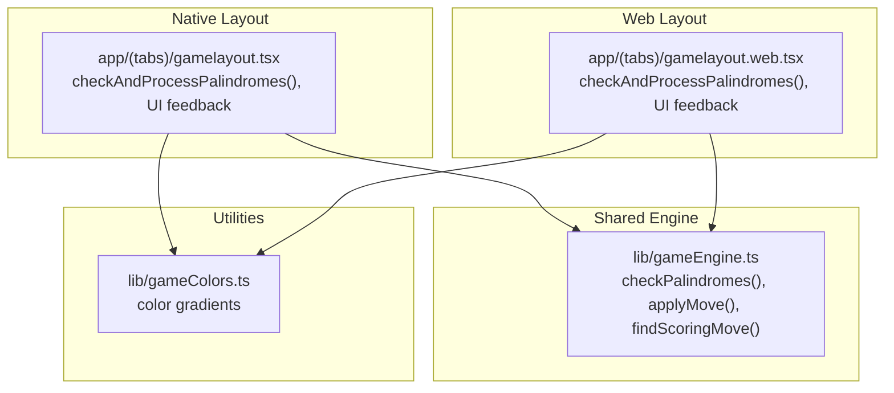
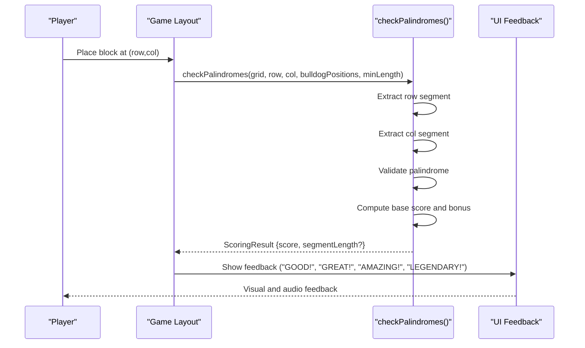
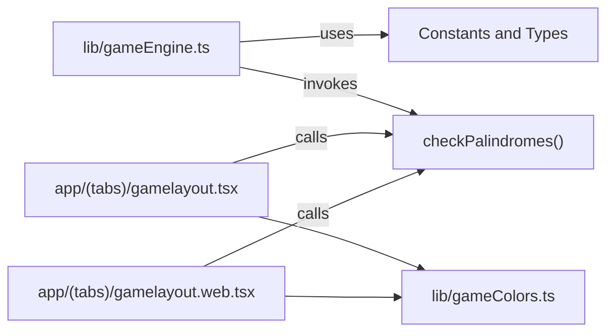

# Scoring Algorithm

<cite>
**Referenced Files in This Document**
- [gameEngine.ts](file://lib/gameEngine.ts)
- [gamelayout.tsx](file://app/(tabs)/gamelayout.tsx)
- [gamelayout.web.tsx](file://app/(tabs)/gamelayout.web.tsx)
- [gameColors.ts](file://lib/gameColors.ts)
</cite>

## Table of Contents
1. [Introduction](#introduction)
2. [Project Structure](#project-structure)
3. [Core Components](#core-components)
4. [Architecture Overview](#architecture-overview)
5. [Detailed Component Analysis](#detailed-component-analysis)
6. [Dependency Analysis](#dependency-analysis)
7. [Performance Considerations](#performance-considerations)
8. [Troubleshooting Guide](#troubleshooting-guide)
9. [Conclusion](#conclusion)

## Introduction
This document explains the scoring algorithm used in the Palindrome game. It covers how palindromes are detected along rows and columns, how segments are extracted and validated, how scores are calculated (including the bulldog bonus), and how UI feedback is determined based on segment length. It also documents the checkPalindromes function’s parameters, return values, and performance characteristics, and addresses edge cases such as minimum length requirements and segment boundary detection.

## Project Structure
The scoring logic is implemented in a shared library module and consumed by both the native and web game layouts. The core scoring function resides in the shared engine, while UI feedback and scoring triggers are handled in the layout components.

**Diagram sources**
- [gameEngine.ts](file://lib/gameEngine.ts#L106-L161)
- [gamelayout.tsx](file://app/(tabs)/gamelayout.tsx#L1132-L1208)
- [gamelayout.web.tsx](file://app/(tabs)/gamelayout.web.tsx#L1132-L1208)
- [gameColors.ts](file://lib/gameColors.ts#L7-L13)

**Section sources**
- [gameEngine.ts](file://lib/gameEngine.ts#L1-L284)
- [gamelayout.tsx](file://app/(tabs)/gamelayout.tsx#L1-L1936)
- [gamelayout.web.tsx](file://app/(tabs)/gamelayout.web.tsx#L1-L2503)
- [gameColors.ts](file://lib/gameColors.ts#L1-L93)

## Core Components
- Shared scoring engine: Implements palindrome detection, segment extraction, validation, and scoring with the bulldog bonus.
- Native game layout: Uses the shared engine and renders UI feedback based on segment length.
- Web game layout: Mirrors the native logic for web clients.
- Color utilities: Provides default color gradients used in the UI.

Key constants and types:
- GRID_SIZE: Board dimension (11x11).
- NUM_COLORS: Number of distinct block colors.
- MIN_PALINDROME_LENGTH: Minimum segment length to score (3).
- BULLDOG_BONUS: Additional points when a segment contains a bulldog tile.
- ScoringResult: Contains total score and optional segmentLength for UI feedback.

**Section sources**
- [gameEngine.ts](file://lib/gameEngine.ts#L6-L10)
- [gameEngine.ts](file://lib/gameEngine.ts#L24-L44)
- [gameEngine.ts](file://lib/gameEngine.ts#L106-L161)

## Architecture Overview
The scoring pipeline operates as follows:
1. A move is placed on the board.
2. The shared engine checks both the row and column passing through the newly placed cell.
3. For each line, the algorithm extracts the maximal contiguous segment bounded by empty cells.
4. The segment is validated as a palindrome.
5. If valid, the base score equals the segment length; if the segment contains any bulldog tiles, an additional bonus is added.
6. The total score is accumulated and optionally reported with the longest segment length for UI feedback.

**Diagram sources**
- [gameEngine.ts](file://lib/gameEngine.ts#L106-L161)
- [gamelayout.tsx](file://app/(tabs)/gamelayout.tsx#L905-L944)
- [gamelayout.web.tsx](file://app/(tabs)/gamelayout.web.tsx#L1168-L1208)

## Detailed Component Analysis

### checkPalindromes Function
Purpose:
- Detect palindromic segments along the row and column passing through a given cell.
- Calculate base segment length scoring and apply the bulldog bonus when applicable.
- Return the total score and the length of the longest scoring segment for UI feedback.

Parameters:
- grid: 2D array representing the board state.
- row, col: coordinates of the newly placed block.
- bulldogPositions: list of positions where bulldog tiles are located.
- minLength: minimum segment length to consider (default is 3).

Processing logic:
- For each line (row and column):
  - Build a line array containing cell colors or a sentinel for empty cells.
  - Expand outward from the target index to capture the maximal contiguous segment bounded by empty cells.
  - If the segment meets the minimum length requirement:
    - Convert colors to a comma-separated string and compare with its reverse to confirm palindrome.
    - Compute base score as segment length.
    - Check if any cell in the segment overlaps with a bulldog position; if so, add the bonus.
    - Accumulate total score and track the maximum segment length encountered.
- Return a ScoringResult with the total score and the longest segment length (if any).

Return value:
- ScoringResult:
  - score: total points earned from all palindromic segments found.
  - segmentLength?: the length of the longest scoring segment, if any.

Edge cases addressed:
- Minimum length threshold ensures only meaningful segments count.
- Empty cells act as boundaries; segments are trimmed to contiguous non-empty regions.
- The function is pure and does not mutate the input grid.

Performance characteristics:
- Time complexity: O(N) per line, where N is the grid size (11), resulting in O(1) overall for each call.
- Space complexity: O(N) for storing the line and segment arrays.

**Section sources**
- [gameEngine.ts](file://lib/gameEngine.ts#L106-L161)

### Segment Extraction and Palindrome Validation
- Row and column scanning:
  - For the row line, iterate over columns; for the column line, iterate over rows.
  - Use a sentinel (-1) to represent empty cells during segment expansion.
- Segment expansion:
  - Starting from the target index, move backward and forward while encountering non-empty cells.
  - Slice the line to form the segment.
- Palindrome check:
  - Convert the segment’s colors to a comma-separated string and compare with its reversed form.
- Scoring:
  - Base score equals segment length.
  - Bonus: add the bulldog bonus if any cell in the segment overlaps with a bulldog position.

UI feedback mapping:
- Length 3: “GOOD!”
- Length 4: “GREAT!”
- Length 5: “AMAZING!”
- Length ≥ 6: “LEGENDARY!”

These mappings appear in both native and web layouts.

**Section sources**
- [gameEngine.ts](file://lib/gameEngine.ts#L116-L152)
- [gamelayout.tsx](file://app/(tabs)/gamelayout.tsx#L918-L936)
- [gamelayout.web.tsx](file://app/(tabs)/gamelayout.web.tsx#L1180-L1199)

### Scoring Calculation Formula
Base segment scoring:
- Each valid palindrome contributes points equal to its length.

Bulldog bonus mechanics:
- If any cell in a scoring segment occupies a bulldog position, add the bonus to that segment’s score.
- The bonus is constant and independent of segment length.

Cumulative scoring:
- The function sums scores across all detected palindromic segments in the row and column.
- The longest segment length is tracked to inform UI feedback.

Examples of scenarios:
- Single 3-length palindrome: score = 3.
- Single 4-length palindrome with a bulldog: score = 4 + bonus.
- Two separate palindromes (e.g., 3 and 4) without overlap: total score = 3 + 4.
- Overlapping segments (e.g., a 5-length palindrome that also contains a bulldog): score = 5 + bonus.

Note: The exact bonus value is defined in the engine constants and used consistently across implementations.

**Section sources**
- [gameEngine.ts](file://lib/gameEngine.ts#L10-L10)
- [gameEngine.ts](file://lib/gameEngine.ts#L142-L149)
- [gamelayout.tsx](file://app/(tabs)/gamelayout.tsx#L907-L916)
- [gamelayout.web.tsx](file://app/(tabs)/gamelayout.web.tsx#L1169-L1178)

### UI Feedback and Segment Length Tracking
- The engine returns segmentLength to indicate the longest scoring segment for feedback purposes.
- The layout components translate segment length into textual and visual feedback:
  - “GOOD!” for 3-length segments.
  - “GREAT!” for 4-length segments.
  - “AMAZING!” for 5-length segments.
  - “LEGENDARY!” for 6-length or longer segments.
- Colors and sounds are triggered upon successful scoring.

**Section sources**
- [gameEngine.ts](file://lib/gameEngine.ts#L34-L38)
- [gamelayout.tsx](file://app/(tabs)/gamelayout.tsx#L918-L936)
- [gamelayout.web.tsx](file://app/(tabs)/gamelayout.web.tsx#L1180-L1199)

### checkPalindromes Function Parameters and Return Values
- Parameters:
  - grid: 2D array of numbers or nulls representing the board.
  - row, col: integer indices of the placed block.
  - bulldogPositions: array of { row, col } pairs indicating bulldog locations.
  - minLength: optional minimum length threshold (default 3).
- Return value:
  - ScoringResult with:
    - score: total points from all palindromic segments.
    - segmentLength?: the length of the longest scoring segment, if any.

**Section sources**
- [gameEngine.ts](file://lib/gameEngine.ts#L106-L112)
- [gameEngine.ts](file://lib/gameEngine.ts#L157-L160)

### Edge Cases and Boundary Detection
- Minimum length requirement:
  - Segments shorter than the minimum threshold are ignored.
- Segment boundaries:
  - Empty cells act as hard boundaries; segments are trimmed to contiguous non-empty regions.
- Overlap handling:
  - Multiple palindromic segments can be detected and scored independently.
- Pure function behavior:
  - The engine does not mutate the input grid; it operates on copies or temporary grids when needed.

**Section sources**
- [gameEngine.ts](file://lib/gameEngine.ts#L135-L136)
- [gameEngine.ts](file://lib/gameEngine.ts#L132-L134)

### Related Functions and Integration Points
- applyMove:
  - Validates placement, updates the grid and block counts, computes score delta via checkPalindromes, and returns the new state.
- findScoringMove:
  - Iterates over empty cells and available colors to find the first move that yields a positive score, enabling hints.

**Section sources**
- [gameEngine.ts](file://lib/gameEngine.ts#L167-L219)
- [gameEngine.ts](file://lib/gameEngine.ts#L224-L249)

## Dependency Analysis
The scoring algorithm depends on:
- Constants: GRID_SIZE, NUM_COLORS, MIN_PALINDROME_LENGTH, BULLDOG_BONUS.
- Types: Grid, GameState, ScoringResult, HintMove.
- Utilities: Color gradients for UI rendering.

**Diagram sources**
- [gameEngine.ts](file://lib/gameEngine.ts#L6-L10)
- [gameEngine.ts](file://lib/gameEngine.ts#L24-L44)
- [gamelayout.tsx](file://app/(tabs)/gamelayout.tsx#L1132-L1208)
- [gamelayout.web.tsx](file://app/(tabs)/gamelayout.web.tsx#L1132-L1208)
- [gameColors.ts](file://lib/gameColors.ts#L7-L13)

**Section sources**
- [gameEngine.ts](file://lib/gameEngine.ts#L1-L284)
- [gamelayout.tsx](file://app/(tabs)/gamelayout.tsx#L1-L1936)
- [gamelayout.web.tsx](file://app/(tabs)/gamelayout.web.tsx#L1-L2503)
- [gameColors.ts](file://lib/gameColors.ts#L1-L93)

## Performance Considerations
- Time complexity:
  - checkPalindromes performs two passes over the row and column, each O(N) where N is the grid size (constant 11). Therefore, the function is effectively O(1).
- Space complexity:
  - Temporary arrays for lines and segments are O(N). Memory usage is constant relative to input size.
- Practical implications:
  - The scoring function is fast enough to be called frequently (e.g., on every move) without noticeable impact.
  - UI feedback can be computed synchronously without throttling.

[No sources needed since this section provides general guidance]

## Troubleshooting Guide
Common issues and resolutions:
- No score despite a valid palindrome:
  - Verify that the minimum length threshold is met and that the palindrome check compares the color sequence with its reverse.
  - Confirm that the target cell is included in the segment and that empty cells are treated as boundaries.
- Bulldog bonus not applied:
  - Ensure that bulldog positions are correctly passed and that the overlap check includes all cells in the segment.
- Incorrect UI feedback:
  - Check that segment length is derived from the longest scoring segment and that the mapping aligns with the documented thresholds.

**Section sources**
- [gameEngine.ts](file://lib/gameEngine.ts#L135-L150)
- [gamelayout.tsx](file://app/(tabs)/gamelayout.tsx#L918-L936)
- [gamelayout.web.tsx](file://app/(tabs)/gamelayout.web.tsx#L1180-L1199)

## Conclusion
The scoring algorithm is a compact, efficient mechanism that detects palindromic segments along rows and columns, validates them, and computes scores with a straightforward base-length formula plus a fixed bulldog bonus. Its design ensures deterministic behavior, clear UI feedback, and robust handling of edge cases such as minimum length and segment boundaries. The shared engine guarantees consistent scoring across native and web platforms, while the layout components provide immediate, contextual feedback to players.