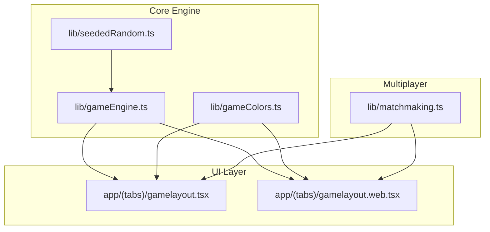
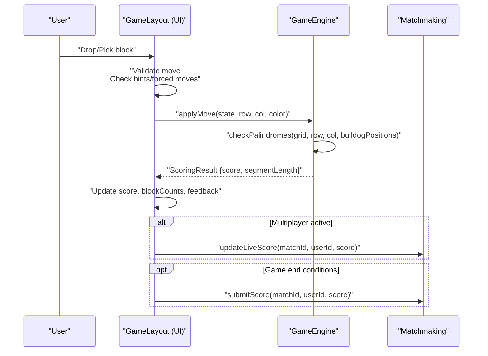
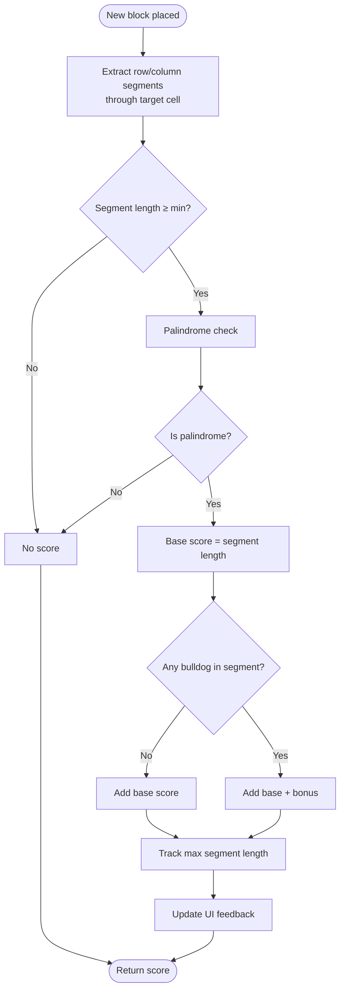
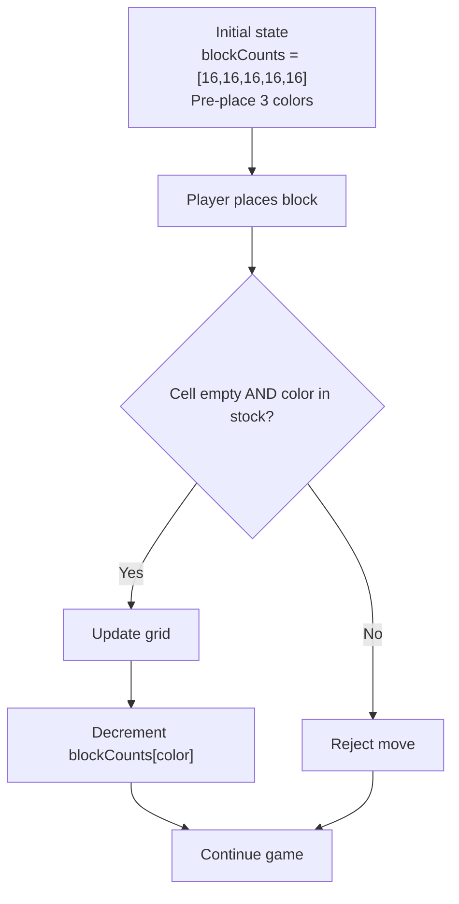
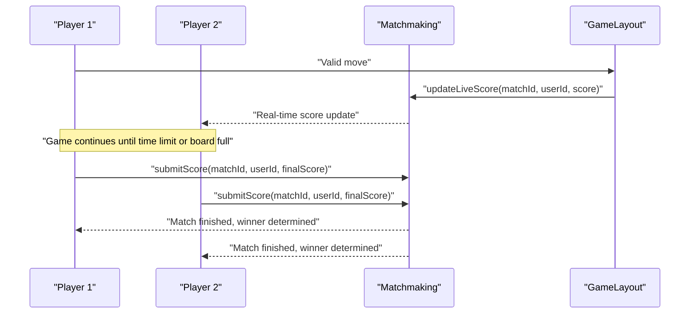
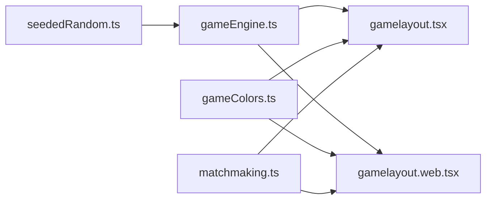

# Scoring and Inventory System

<cite>
**Referenced Files in This Document**
- [gameEngine.ts](file://lib/gameEngine.ts)
- [gamelayout.tsx](file://app/(tabs)/gamelayout.tsx)
- [gamelayout.web.tsx](file://app/(tabs)/gamelayout.web.tsx)
- [matchmaking.ts](file://lib/matchmaking.ts)
- [gameColors.ts](file://lib/gameColors.ts)
- [seededRandom.ts](file://lib/seededRandom.ts)
</cite>

## Table of Contents
1. [Introduction](#introduction)
2. [Project Structure](#project-structure)
3. [Core Components](#core-components)
4. [Architecture Overview](#architecture-overview)
5. [Detailed Component Analysis](#detailed-component-analysis)
6. [Dependency Analysis](#dependency-analysis)
7. [Performance Considerations](#performance-considerations)
8. [Troubleshooting Guide](#troubleshooting-guide)
9. [Conclusion](#conclusion)

## Introduction
This document provides comprehensive technical documentation for the scoring calculation and inventory management system in the Palindrome game. It explains the scoring algorithm (base segment scoring, bulldog bonus calculation, and maximum segment length tracking), the block inventory system (color-based counting, resource management, and depletion mechanics), and how these integrate with the UI and multiplayer systems. It also covers scoring result structures, UI feedback mechanisms, scoring accumulation patterns, optimization techniques, and integration with game progression systems.

## Project Structure
The scoring and inventory system spans several modules:
- Core game logic: shared engine for palindrome detection, scoring, and inventory management
- Platform-specific game layouts: native and web implementations of the game board and user interactions
- Multiplayer integration: real-time score updates and match lifecycle management
- Utility modules: color gradients, deterministic RNG for reproducible game states

**Diagram sources**
- [gameEngine.ts](file://lib/gameEngine.ts#L1-L284)
- [gamelayout.tsx](file://app/(tabs)/gamelayout.tsx#L1-L1936)
- [gamelayout.web.tsx](file://app/(tabs)/gamelayout.web.tsx#L1-L2503)
- [matchmaking.ts](file://lib/matchmaking.ts#L1-L542)
- [seededRandom.ts](file://lib/seededRandom.ts#L1-L21)
- [gameColors.ts](file://lib/gameColors.ts#L1-L93)

**Section sources**
- [gameEngine.ts](file://lib/gameEngine.ts#L1-L284)
- [gamelayout.tsx](file://app/(tabs)/gamelayout.tsx#L1-L1936)
- [gamelayout.web.tsx](file://app/(tabs)/gamelayout.web.tsx#L1-L2503)
- [matchmaking.ts](file://lib/matchmaking.ts#L1-L542)
- [seededRandom.ts](file://lib/seededRandom.ts#L1-L21)
- [gameColors.ts](file://lib/gameColors.ts#L1-L93)

## Core Components
- Game Engine: Provides shared logic for grid initialization, move validation, palindrome detection, scoring computation, and inventory updates.
- Game Layouts: Implement UI interactions, drag-and-drop or pick-and-drop modes, hint system, and real-time feedback.
- Multiplayer Integration: Manages match lifecycle, live score updates, and final score submission.
- Utilities: Deterministic RNG for reproducible game states and color gradient helpers.

Key responsibilities:
- Scoring: Base segment scoring equals segment length; bulldog bonus adds 10 points if any bulldog tile is present in the segment; maximum segment length reported for UI feedback.
- Inventory: Color-based block counts per player; decrement on successful placement; game continues until time expires or blocks are exhausted.
- UI Integration: Visual feedback for segment lengths ("GOOD!", "GREAT!", "AMAZING!", "LEGENDARY!"); haptic and audio cues; hints system.

**Section sources**
- [gameEngine.ts](file://lib/gameEngine.ts#L6-L38)
- [gamelayout.tsx](file://app/(tabs)/gamelayout.tsx#L879-L944)
- [matchmaking.ts](file://lib/matchmaking.ts#L9-L32)

## Architecture Overview
The system follows a layered architecture:
- Engine layer handles core game logic and state transitions.
- UI layer translates user actions into validated moves and updates visuals.
- Multiplayer layer synchronizes state across clients and persists results.

**Diagram sources**
- [gamelayout.tsx](file://app/(tabs)/gamelayout.tsx#L978-L1059)
- [gameEngine.ts](file://lib/gameEngine.ts#L167-L219)
- [matchmaking.ts](file://lib/matchmaking.ts#L253-L266)

## Detailed Component Analysis

### Scoring Algorithm
The scoring algorithm operates on two axes:
- Base segment scoring: equals the length of the palindrome segment (minimum length enforced by configuration).
- Bonus scoring: adds a fixed bulldog bonus if any bulldog tile is present in the segment.
- Maximum segment length tracking: records the longest segment that scored to inform UI feedback.

Implementation details:
- Segment extraction: scans row and column through the newly placed block to find the maximal contiguous segment of non-empty cells.
- Palindrome check: compares the color sequence forward and backward.
- Score computation: sum of all scored segments; maximum segment length tracked for UI.
- UI feedback: displays contextual messages and colors based on segment length.

**Diagram sources**
- [gameEngine.ts](file://lib/gameEngine.ts#L106-L161)
- [gamelayout.tsx](file://app/(tabs)/gamelayout.tsx#L879-L944)

**Section sources**
- [gameEngine.ts](file://lib/gameEngine.ts#L106-L161)
- [gamelayout.tsx](file://app/(tabs)/gamelayout.tsx#L879-L944)

### Inventory Management
Inventory is color-based and managed per-player:
- Initialization: Each color starts with a fixed count; three initial colors are pre-placed and subtracted from inventory.
- Depletion: On each valid placement, the chosen color's count decreases by one.
- Availability checks: Moves are rejected if the target cell is occupied or the color is out of stock.
- Persistence: Inventory state is part of the GameState and synchronized across UI and engine layers.

**Diagram sources**
- [gameEngine.ts](file://lib/gameEngine.ts#L60-L100)
- [gameEngine.ts](file://lib/gameEngine.ts#L167-L219)

**Section sources**
- [gameEngine.ts](file://lib/gameEngine.ts#L60-L100)
- [gameEngine.ts](file://lib/gameEngine.ts#L167-L219)

### Scoring Result Structure and UI Feedback
The scoring result structure carries:
- Total score delta from the move.
- Optional segment length for UI feedback indicating the strength of the palindrome (e.g., 3 = GOOD, 4 = GREAT, 5 = AMAZING, 6+ = LEGENDARY).

UI feedback mechanisms:
- Animated messages with color-coded emphasis.
- Haptic and audio cues for success/error states.
- Hint system highlights promising moves.

**Section sources**
- [gameEngine.ts](file://lib/gameEngine.ts#L34-L38)
- [gamelayout.tsx](file://app/(tabs)/gamelayout.tsx#L918-L936)

### Multiplayer Integration and Score Accumulation
In multiplayer mode:
- Live score updates are sent to the opponent in real-time during gameplay.
- Final score submission occurs when time expires or the board becomes full.
- Match lifecycle includes first-move deadline enforcement and win condition determination.

**Diagram sources**
- [matchmaking.ts](file://lib/matchmaking.ts#L253-L327)
- [gamelayout.tsx](file://app/(tabs)/gamelayout.tsx#L1038-L1057)

**Section sources**
- [matchmaking.ts](file://lib/matchmaking.ts#L253-L327)
- [gamelayout.tsx](file://app/(tabs)/gamelayout.tsx#L800-L845)

### Examples and Scenarios
- Example 1: Placing a block completes a 3-length palindrome with no bulldog → score = 3.
- Example 2: Placing a block completes a 4-length palindrome containing a bulldog → score = 4 + 10 = 14.
- Example 3: Attempting a move that does not score triggers error feedback; after three failed attempts without hints, a hint is consumed to reveal a scoring move.
- Example 4: Inventory depletes as blocks are placed; when all colors reach zero, the game submits the final score automatically.

**Section sources**
- [gamelayout.tsx](file://app/(tabs)/gamelayout.tsx#L994-L1018)
- [gamelayout.tsx](file://app/(tabs)/gamelayout.tsx#L1052-L1057)

## Dependency Analysis
The system exhibits clear separation of concerns:
- Engine depends on seeded RNG for deterministic initialization.
- UI depends on engine for validation and scoring, and on matchmaking for multiplayer synchronization.
- Colors module supports UI theming and accessibility.

**Diagram sources**
- [seededRandom.ts](file://lib/seededRandom.ts#L9-L20)
- [gameEngine.ts](file://lib/gameEngine.ts#L46-L46)
- [gamelayout.tsx](file://app/(tabs)/gamelayout.tsx#L31-L33)
- [gamelayout.web.tsx](file://app/(tabs)/gamelayout.web.tsx#L20-L25)
- [matchmaking.ts](file://lib/matchmaking.ts#L6-L7)
- [gameColors.ts](file://lib/gameColors.ts#L5-L13)

**Section sources**
- [seededRandom.ts](file://lib/seededRandom.ts#L9-L20)
- [gameEngine.ts](file://lib/gameEngine.ts#L46-L46)
- [gamelayout.tsx](file://app/(tabs)/gamelayout.tsx#L31-L33)
- [gamelayout.web.tsx](file://app/(tabs)/gamelayout.web.tsx#L20-L25)
- [matchmaking.ts](file://lib/matchmaking.ts#L6-L7)
- [gameColors.ts](file://lib/gameColors.ts#L5-L13)

## Performance Considerations
- Palindrome detection: Linear scan per row/column segment; complexity O(n) per direction, where n is grid size. With constant grid size, this remains efficient.
- Inventory updates: Constant-time decrement; negligible overhead.
- UI feedback: Minimal DOM updates; animations are throttled via refs and timeouts.
- Multiplayer updates: Debounced real-time updates to avoid excessive network calls.

[No sources needed since this section provides general guidance]

## Troubleshooting Guide
Common issues and resolutions:
- Move rejected: Verify the cell is empty and the color is in stock. Check for forced-move constraints when hints are unavailable.
- No hints available: The system consumes a hint to highlight a scoring move after three consecutive failed attempts.
- Score not updating: Ensure the move is valid and that the segment meets minimum length and palindrome criteria.
- Multiplayer score not syncing: Confirm real-time subscription is active and the user is still in the match.

**Section sources**
- [gamelayout.tsx](file://app/(tabs)/gamelayout.tsx#L982-L1018)
- [gamelayout.tsx](file://app/(tabs)/gamelayout.tsx#L965-L976)
- [matchmaking.ts](file://lib/matchmaking.ts#L204-L247)

## Conclusion
The scoring and inventory system combines a robust, deterministic engine with responsive UI feedback and seamless multiplayer integration. The scoring algorithm rewards longer palindromes and incentivizes bulldog placement with bonuses, while inventory management ensures meaningful resource constraints. Together, these components deliver a balanced, engaging gameplay loop with clear progression signals and smooth multiplayer synchronization.