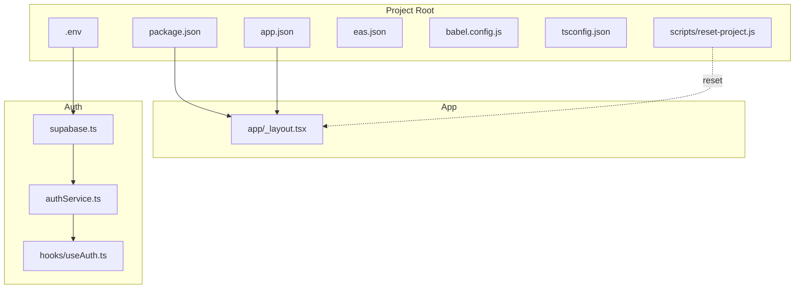
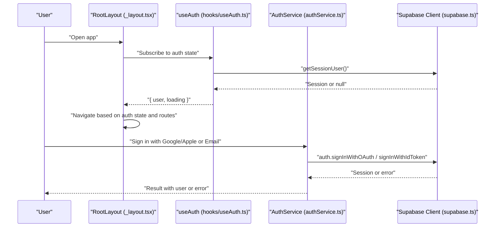
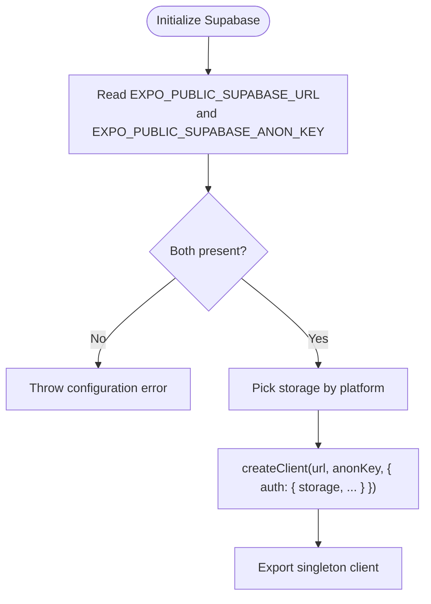
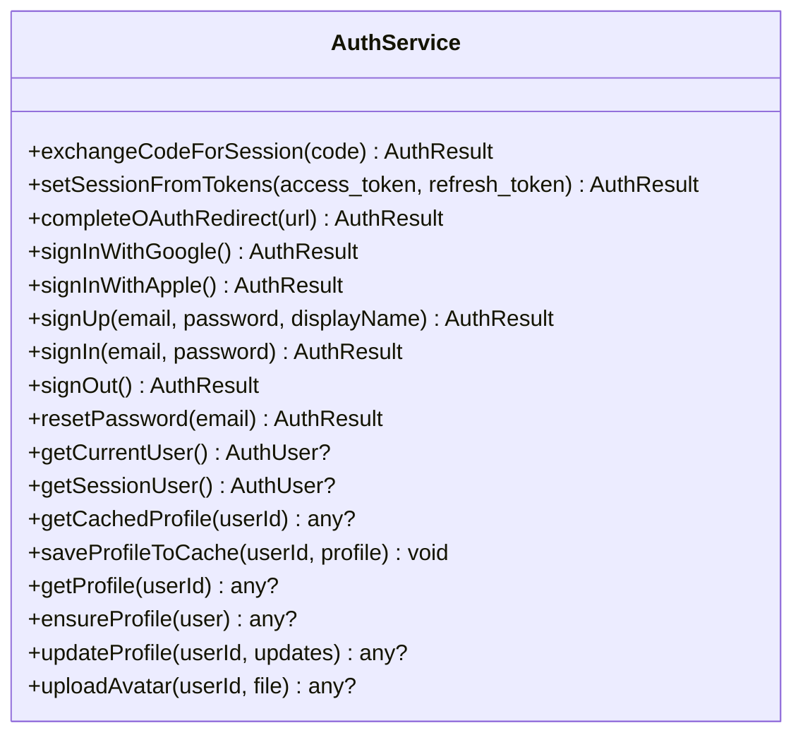
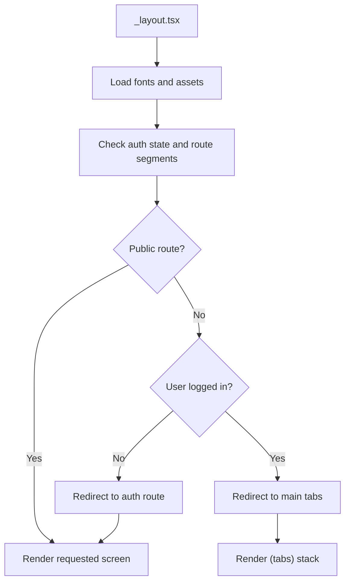
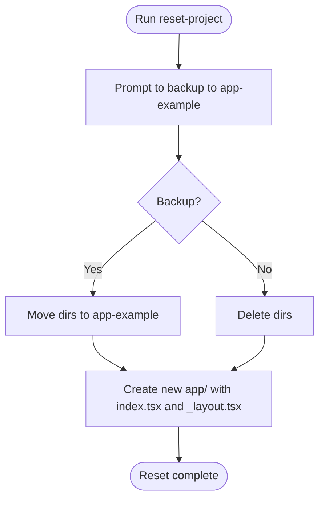
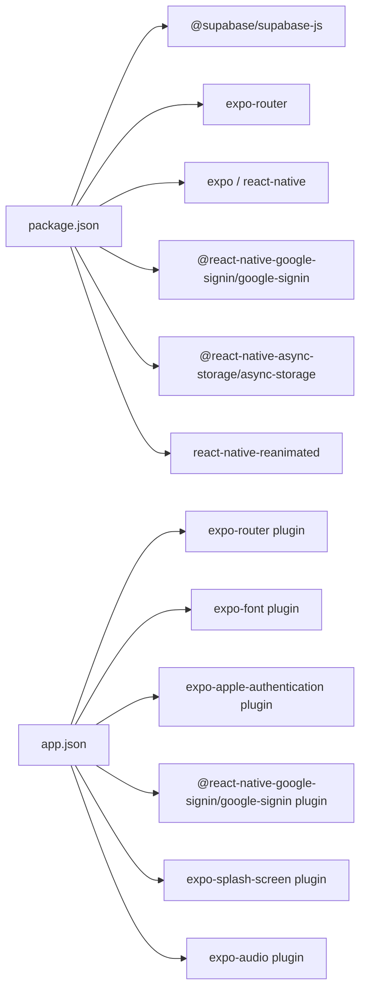

# Getting Started

<cite>
**Referenced Files in This Document**
- [README.md](file://README.md)
- [package.json](file://package.json)
- [app.json](file://app.json)
- [.env](file://.env)
- [scripts/reset-project.js](file://scripts/reset-project.js)
- [babel.config.js](file://babel.config.js)
- [tsconfig.json](file://tsconfig.json)
- [eas.json](file://eas.json)
- [GOOGLE_AUTH_SETUP_GUIDE.md](file://GOOGLE_AUTH_SETUP_GUIDE.md)
- [GET_SHA1_INSTRUCTIONS.md](file://GET_SHA1_INSTRUCTIONS.md)
- [app/_layout.tsx](file://app/_layout.tsx)
- [supabase.ts](file://supabase.ts)
- [authService.ts](file://authService.ts)
- [hooks/useAuth.ts](file://hooks/useAuth.ts)
</cite>

## Table of Contents
1. [Introduction](#introduction)
2. [Project Structure](#project-structure)
3. [Core Components](#core-components)
4. [Architecture Overview](#architecture-overview)
5. [Detailed Component Analysis](#detailed-component-analysis)
6. [Dependency Analysis](#dependency-analysis)
7. [Performance Considerations](#performance-considerations)
8. [Troubleshooting Guide](#troubleshooting-guide)
9. [Conclusion](#conclusion)
10. [Appendices](#appendices)

## Introduction
This guide helps you install and run the Palindrome game development environment locally. It covers installing prerequisites, configuring the environment, preparing development tools for iOS and Android, initializing the project, and understanding the file-based routing system. It also includes platform-specific notes for Google authentication and how to reset the project if needed.

## Project Structure
The project is an Expo Router-based React Native application with shared code for mobile and web. Key areas:
- Application entry and routing live under app/.
- Configuration files define app metadata, plugins, and build settings.
- Environment variables are loaded from .env.
- Scripts automate project reset and build workflows.
- Authentication integrates with Supabase and optional Google/Apple providers.

**Diagram sources**
- [package.json](file://package.json#L1-L68)
- [app.json](file://app.json#L1-L94)
- [.env](file://.env#L1-L14)
- [eas.json](file://eas.json#L1-L25)
- [babel.config.js](file://babel.config.js#L1-L8)
- [tsconfig.json](file://tsconfig.json#L1-L18)
- [scripts/reset-project.js](file://scripts/reset-project.js#L1-L113)
- [app/_layout.tsx](file://app/_layout.tsx#L1-L126)
- [supabase.ts](file://supabase.ts#L1-L75)
- [authService.ts](file://authService.ts#L1-L560)
- [hooks/useAuth.ts](file://hooks/useAuth.ts#L1-L51)

**Section sources**
- [README.md](file://README.md#L1-L59)
- [package.json](file://package.json#L1-L68)
- [app.json](file://app.json#L1-L94)
- [.env](file://.env#L1-L14)
- [eas.json](file://eas.json#L1-L25)
- [babel.config.js](file://babel.config.js#L1-L8)
- [tsconfig.json](file://tsconfig.json#L1-L18)
- [scripts/reset-project.js](file://scripts/reset-project.js#L1-L113)
- [app/_layout.tsx](file://app/_layout.tsx#L1-L126)
- [supabase.ts](file://supabase.ts#L1-L75)
- [authService.ts](file://authService.ts#L1-L560)
- [hooks/useAuth.ts](file://hooks/useAuth.ts#L1-L51)

## Core Components
- Environment configuration: EXPO_PUBLIC_SUPABASE_URL, EXPO_PUBLIC_SUPABASE_ANON_KEY, and related keys are read from .env and used by the Supabase client.
- Routing: Expo Router file-based routing organizes screens under app/(tabs)/... and app/auth/.
- Authentication: Supabase-backed with optional Google and Apple providers; Google Sign-In requires native builds.
- Build and scripts: npm scripts for start, android, ios, web; reset-project.js to scaffold a clean app directory.

**Section sources**
- [.env](file://.env#L8-L12)
- [supabase.ts](file://supabase.ts#L42-L74)
- [app/_layout.tsx](file://app/_layout.tsx#L56-L87)
- [authService.ts](file://authService.ts#L113-L179)
- [package.json](file://package.json#L5-L11)
- [scripts/reset-project.js](file://scripts/reset-project.js#L1-L113)

## Architecture Overview
The app initializes the Supabase client, sets up global theming and fonts, enforces auth-aware routing, and supports multiple platforms (mobile and web). Authentication flows integrate with Supabase and optional native providers.

**Diagram sources**
- [app/_layout.tsx](file://app/_layout.tsx#L56-L87)
- [hooks/useAuth.ts](file://hooks/useAuth.ts#L5-L47)
- [authService.ts](file://authService.ts#L113-L179)
- [supabase.ts](file://supabase.ts#L42-L74)

## Detailed Component Analysis

### Environment and Supabase Client
- The Supabase client is created once and configured with platform-aware storage. It reads EXPO_PUBLIC_SUPABASE_URL and EXPO_PUBLIC_SUPABASE_ANON_KEY (with fallback to EXPO_PUBLIC_SUPABASE_KEY).
- The client enables session persistence and automatic token refresh.

**Diagram sources**
- [supabase.ts](file://supabase.ts#L42-L74)
- [.env](file://.env#L8-L12)

**Section sources**
- [supabase.ts](file://supabase.ts#L42-L74)
- [.env](file://.env#L8-L12)

### Authentication Service
- Supports Google Sign-In on native platforms and web OAuth, Apple Sign-In on web and iOS, and email/password.
- Handles OAuth redirects, token exchange, session restoration, and profile caching.

**Diagram sources**
- [authService.ts](file://authService.ts#L61-L560)

**Section sources**
- [authService.ts](file://authService.ts#L1-L560)

### File-Based Routing
- The app uses Expo Router’s file-based routing. Routes are inferred from files under app/.
- The root layout manages navigation stacks and enforces auth-aware routing.

**Diagram sources**
- [app/_layout.tsx](file://app/_layout.tsx#L56-L87)

**Section sources**
- [app/_layout.tsx](file://app/_layout.tsx#L1-L126)

### Resetting the Project
- The reset script moves or deletes existing directories (app, components, hooks, constants, scripts) and scaffolds a minimal app directory with index.tsx and _layout.tsx.

**Diagram sources**
- [scripts/reset-project.js](file://scripts/reset-project.js#L48-L99)

**Section sources**
- [scripts/reset-project.js](file://scripts/reset-project.js#L1-L113)

## Dependency Analysis
- Runtime dependencies include Expo, React Navigation, Supabase JS, and platform-specific packages.
- Build-time dependencies include TypeScript, ESLint, and Expo module scripts.
- Plugins in app.json enable Router, Fonts, Apple Authentication, Google Sign-In, Splash Screen, and Audio.

**Diagram sources**
- [package.json](file://package.json#L13-L57)
- [app.json](file://app.json#L46-L79)

**Section sources**
- [package.json](file://package.json#L1-L68)
- [app.json](file://app.json#L1-L94)

## Performance Considerations
- Keep dependencies aligned with Expo SDK versions to avoid unnecessary overhead.
- Prefer lazy-loading heavy assets and screens to reduce initial load time.
- Use Expo’s development builds for native performance profiling when needed.

[No sources needed since this section provides general guidance]

## Troubleshooting Guide

### Environment Variables
- Ensure EXPO_PUBLIC_SUPABASE_URL and EXPO_PUBLIC_SUPABASE_ANON_KEY are set in .env. A fallback key is supported.
- Confirm the Supabase client is initialized and not throwing configuration errors.

**Section sources**
- [.env](file://.env#L8-L12)
- [supabase.ts](file://supabase.ts#L51-L55)

### Google Authentication Setup
- Google Sign-In requires native builds and proper SHA-1 fingerprints for Android. Follow the Google Authentication Setup Guide and SHA-1 instructions.
- For web, Google Sign-In works via OAuth redirect; for native, Google Sign-In SDK is used.

**Section sources**
- [GOOGLE_AUTH_SETUP_GUIDE.md](file://GOOGLE_AUTH_SETUP_GUIDE.md#L1-L457)
- [GET_SHA1_INSTRUCTIONS.md](file://GET_SHA1_INSTRUCTIONS.md#L1-L163)
- [authService.ts](file://authService.ts#L113-L179)

### Expo Go Limitations
- Google Sign-In does not work in Expo Go; use development builds or APKs.

**Section sources**
- [GOOGLE_AUTH_SETUP_GUIDE.md](file://GOOGLE_AUTH_SETUP_GUIDE.md#L253-L256)

### Resetting the Project
- Use the reset script to scaffold a clean app directory and optionally back up existing code to app-example.

**Section sources**
- [scripts/reset-project.js](file://scripts/reset-project.js#L1-L113)

## Conclusion
You now have the essentials to install prerequisites, configure the environment, prepare development tools, initialize the project, and run it across iOS, Android, and web. Use the reset script to reinitialize the app directory, and refer to the included guides for platform-specific authentication and troubleshooting.

[No sources needed since this section summarizes without analyzing specific files]

## Appendices

### Installation and Setup Steps
- Install Node.js and npm.
- Install Expo CLI globally.
- Clone or download the repository.
- Install dependencies.
- Configure environment variables in .env.
- Start the development server and choose a target (Android emulator, iOS simulator, or Expo Go).
- For native Google Sign-In, build a development client or APK.

**Section sources**
- [README.md](file://README.md#L7-L34)
- [package.json](file://package.json#L5-L11)
- [.env](file://.env#L8-L12)

### Platform-Specific Notes
- iOS: Ensure bundle identifier and Apple Authentication settings in app.json are correct.
- Android: Ensure SHA-1 fingerprints are registered in Google Cloud Console and Firebase; place google-services.json in the correct location.

**Section sources**
- [app.json](file://app.json#L11-L34)
- [GOOGLE_AUTH_SETUP_GUIDE.md](file://GOOGLE_AUTH_SETUP_GUIDE.md#L83-L118)

### Understanding File-Based Routing
- Routes are derived from files under app/. The root layout controls navigation stacks and applies global theming and fonts.

**Section sources**
- [README.md](file://README.md#L34-L34)
- [app/_layout.tsx](file://app/_layout.tsx#L56-L54)