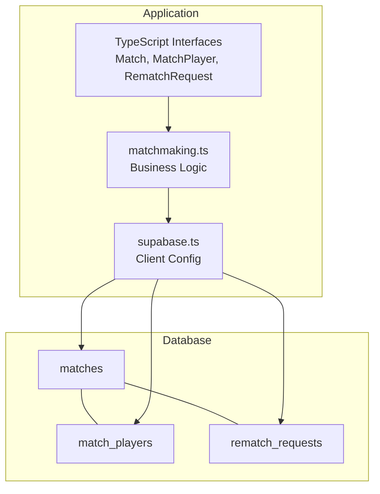
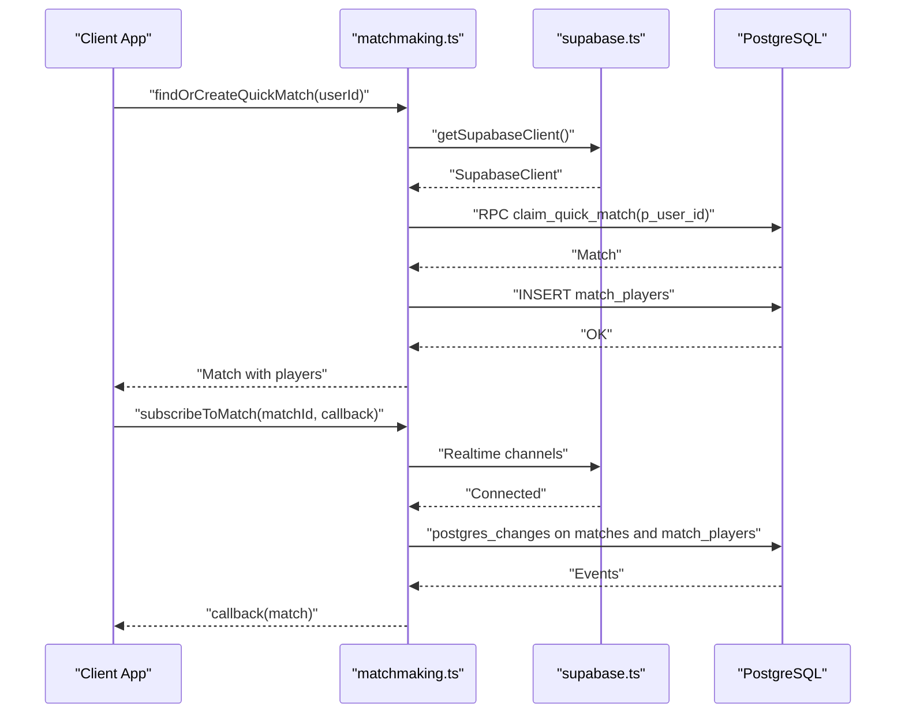
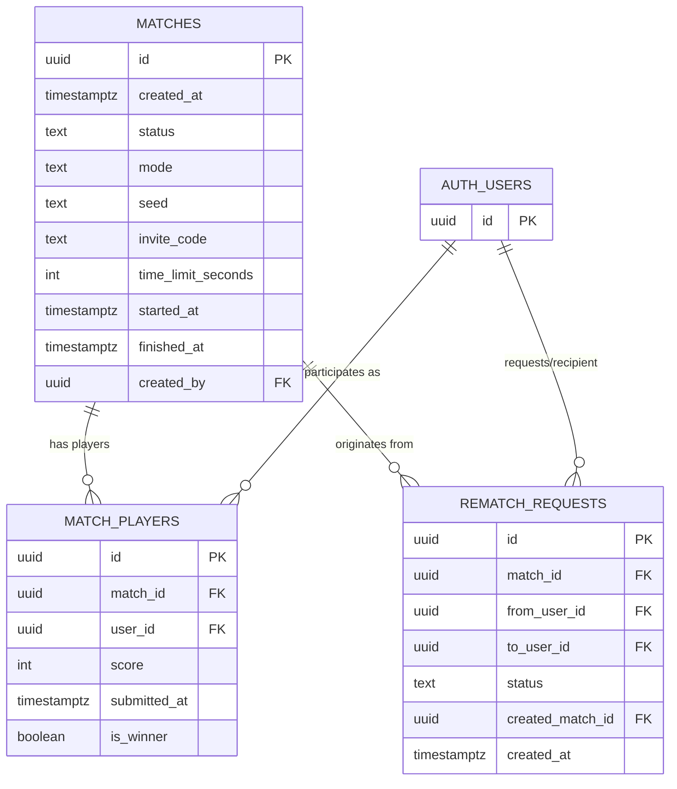
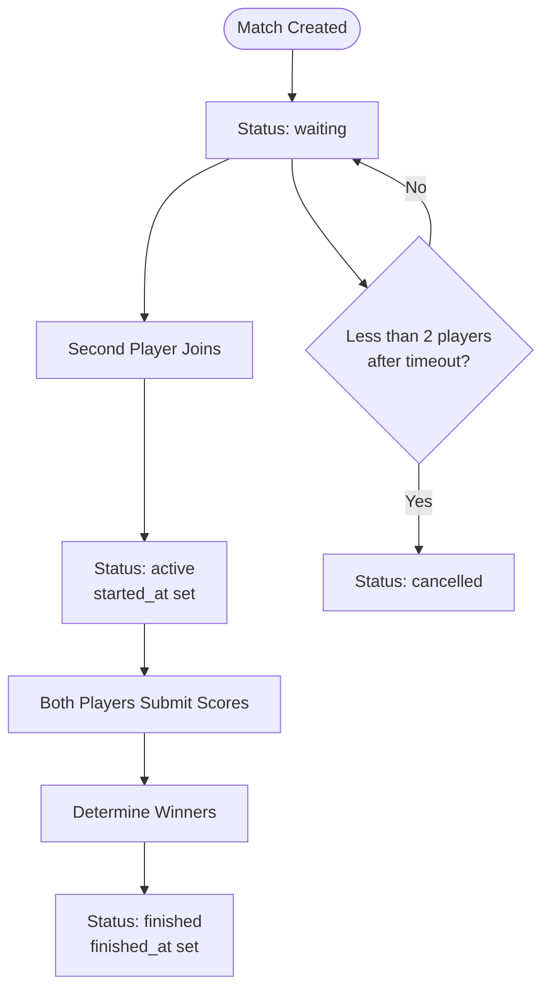
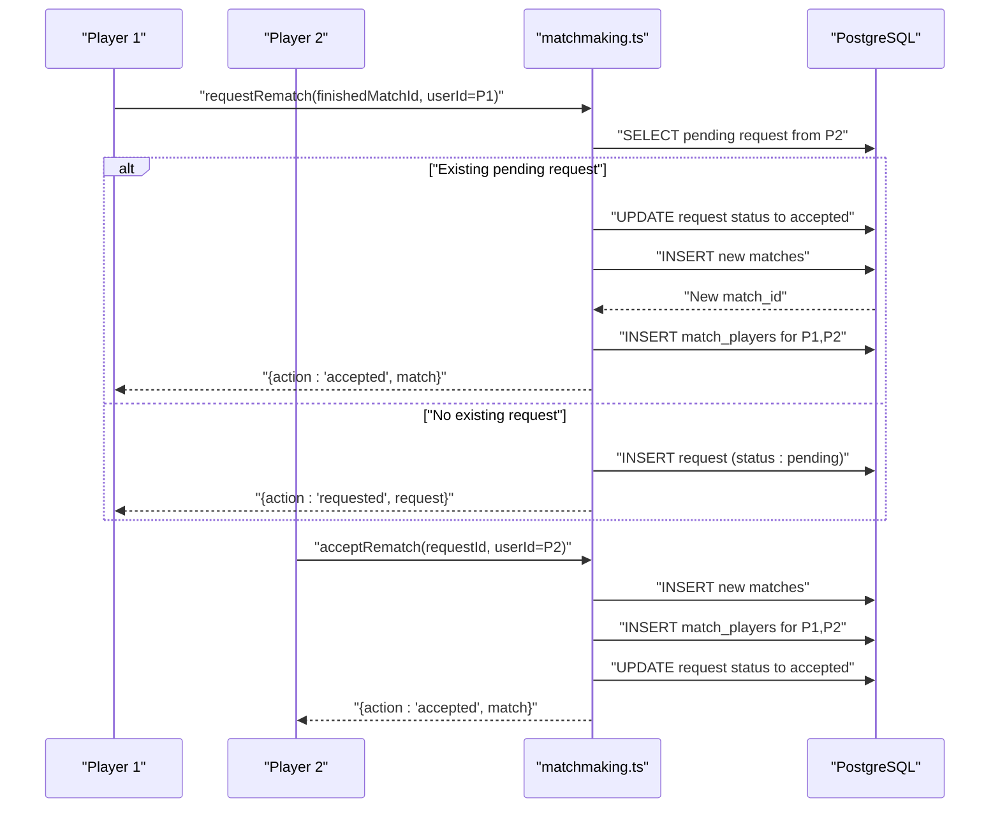
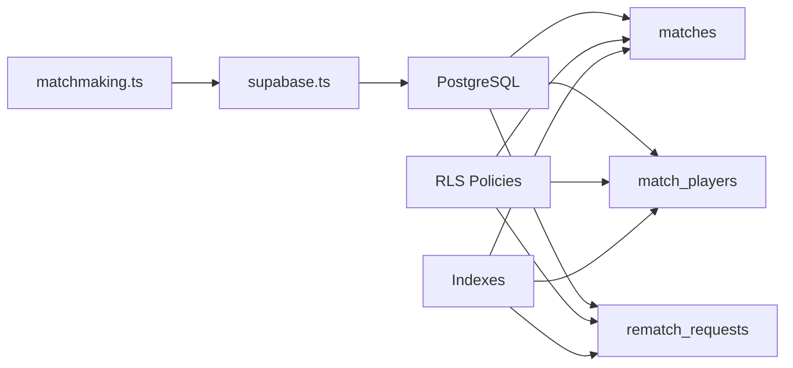

# Match Data Models

<cite>
**Referenced Files in This Document**
- [20250205000000_multiplayer_tables.sql](file://supabase/migrations/20250205000000_multiplayer_tables.sql)
- [20250205100000_fix_match_players_rls_recursion.sql](file://supabase/migrations/20250205100000_fix_match_players_rls_recursion.sql)
- [20250205200000_fix_matches_insert_rls.sql](file://supabase/migrations/20250205200000_fix_matches_insert_rls.sql)
- [20250205300000_allow_join_by_invite_code.sql](file://supabase/migrations/20250205300000_allow_join_by_invite_code.sql)
- [20250205400000_abandoned_match_cancel.sql](file://supabase/migrations/20250205400000_abandoned_match_cancel.sql)
- [20250205500000_rematch_requests.sql](file://supabase/migrations/20250205500000_rematch_requests.sql)
- [20250206000000_atomic_quick_match.sql](file://supabase/migrations/20250206000000_atomic_quick_match.sql)
- [matchmaking.ts](file://lib/matchmaking.ts)
- [supabase.ts](file://supabase.ts)
</cite>

## Table of Contents
1. [Introduction](#introduction)
2. [Project Structure](#project-structure)
3. [Core Components](#core-components)
4. [Architecture Overview](#architecture-overview)
5. [Detailed Component Analysis](#detailed-component-analysis)
6. [Dependency Analysis](#dependency-analysis)
7. [Performance Considerations](#performance-considerations)
8. [Troubleshooting Guide](#troubleshooting-guide)
9. [Conclusion](#conclusion)

## Introduction
This document provides comprehensive data model documentation for the multiplayer system entities. It covers the Match and MatchPlayer interfaces, the RematchRequest interface, database table relationships, constraints, indexing strategies, validation rules, and lifecycle management. It also includes entity relationship diagrams and operational guidance for real-time updates, soft deletion considerations, and audit trail approaches for match history tracking.

## Project Structure
The multiplayer data model is defined by PostgreSQL tables and enforced by Row Level Security (RLS) policies. TypeScript interfaces mirror the database schema and encapsulate business logic for match creation, joining, scoring, and rematch requests. Supabase client configuration enables secure, authenticated access to the database and real-time subscriptions.

**Diagram sources**
- [20250205000000_multiplayer_tables.sql](file://supabase/migrations/20250205000000_multiplayer_tables.sql#L3-L31)
- [20250205500000_rematch_requests.sql](file://supabase/migrations/20250205500000_rematch_requests.sql#L4-L17)
- [matchmaking.ts](file://lib/matchmaking.ts#L12-L361)
- [supabase.ts](file://supabase.ts#L42-L74)

**Section sources**
- [20250205000000_multiplayer_tables.sql](file://supabase/migrations/20250205000000_multiplayer_tables.sql#L1-L84)
- [20250205500000_rematch_requests.sql](file://supabase/migrations/20250205500000_rematch_requests.sql#L1-L37)
- [matchmaking.ts](file://lib/matchmaking.ts#L1-L542)
- [supabase.ts](file://supabase.ts#L1-L75)

## Core Components
This section documents the three core data models and their properties, constraints, and behaviors.

### Match Interface
The Match interface defines the core attributes of a match, including lifecycle timestamps, status transitions, and metadata.

- Properties
  - id: Unique identifier for the match
  - created_at: Timestamp when the match was created
  - status: Enumerated status with allowed values: waiting, active, finished, cancelled
  - mode: Game mode (e.g., race)
  - seed: Random seed for deterministic game generation
  - invite_code: Optional unique code enabling private matches
  - time_limit_seconds: Duration allocated for the match
  - started_at: Timestamp when the match became active
  - finished_at: Timestamp when the match ended
  - match_players: Optional collection of associated players

- Status Lifecycle
  - waiting: Initial state; second player may join or match may be cancelled
  - active: Match has two participants and is in progress
  - finished: Match concluded with final scores and winners
  - cancelled: Match abandoned and never completed

- Defaults and Constraints
  - status defaults to waiting
  - mode defaults to race
  - time_limit_seconds defaults to 180 seconds
  - invite_code is unique when present
  - Check constraint enforces status enumeration

- Business Logic Constraints
  - Private matches use invite_code; quick matches do not
  - Abandoned matches transition to cancelled after a grace period
  - Only authenticated users can create matches; creators gain read access

**Section sources**
- [matchmaking.ts](file://lib/matchmaking.ts#L21-L32)
- [20250205000000_multiplayer_tables.sql](file://supabase/migrations/20250205000000_multiplayer_tables.sql#L3-L13)
- [20250205400000_abandoned_match_cancel.sql](file://supabase/migrations/20250205400000_abandoned_match_cancel.sql#L4-L10)
- [20250205200000_fix_matches_insert_rls.sql](file://supabase/migrations/20250205200000_fix_matches_insert_rls.sql#L4-L28)
- [20250205300000_allow_join_by_invite_code.sql](file://supabase/migrations/20250205300000_allow_join_by_invite_code.sql#L6-L13)

### MatchPlayer Interface
The MatchPlayer interface captures per-user participation data, scoring, and outcome.

- Properties
  - id: Unique identifier for the player association
  - match_id: Foreign key linking to the match
  - user_id: Identifier of the participating user
  - score: Numeric score submitted by the user
  - submitted_at: Timestamp when the score was finalized
  - is_winner: Boolean indicating match winner status

- Validation Rules
  - Unique constraint on (match_id, user_id) ensures one participant per match
  - Users can only update their own row; updates restricted to score and submission timestamps
  - Live score updates are allowed only when a user has not yet submitted

- Lifecycle Behaviors
  - Creation occurs when a user joins a match
  - Scores are finalized upon submission; winners determined when both users submit
  - Players can leave a waiting match by deleting their row

**Section sources**
- [matchmaking.ts](file://lib/matchmaking.ts#L12-L19)
- [20250205000000_multiplayer_tables.sql](file://supabase/migrations/20250205000000_multiplayer_tables.sql#L15-L23)
- [20250205000000_multiplayer_tables.sql](file://supabase/migrations/20250205000000_multiplayer_tables.sql#L73-L81)

### RematchRequest Interface
The RematchRequest interface manages post-match replay requests between opponents.

- Properties
  - id: Unique identifier for the request
  - match_id: Foreign key to the original finished match
  - from_user_id: User requesting a rematch
  - to_user_id: Target opponent receiving the request
  - status: Enumerated status with allowed values: pending, accepted, declined
  - created_match_id: Optional ID of the newly created match if accepted
  - created_at: Timestamp when the request was created

- Validation Rules
  - Unique constraint on (match_id, from_user_id, to_user_id) prevents duplicate requests
  - Only the target user can update the request (accept/decline)
  - Requests are visible only to involved parties

- Business Logic
  - If both users click rematch before seeing the popup, the system merges into a new match
  - Accepting a request creates a new match with both users and marks the request accepted
  - Declining a request sets the status to declined

**Section sources**
- [matchmaking.ts](file://lib/matchmaking.ts#L353-L361)
- [20250205500000_rematch_requests.sql](file://supabase/migrations/20250205500000_rematch_requests.sql#L4-L16)
- [20250205500000_rematch_requests.sql](file://supabase/migrations/20250205500000_rematch_requests.sql#L19-L34)

## Architecture Overview
The multiplayer system integrates database constraints, RLS policies, and application logic to enforce data integrity and secure access. Real-time subscriptions keep clients synchronized with match and player updates.

**Diagram sources**
- [matchmaking.ts](file://lib/matchmaking.ts#L58-L66)
- [matchmaking.ts](file://lib/matchmaking.ts#L204-L247)
- [supabase.ts](file://supabase.ts#L42-L74)

**Section sources**
- [matchmaking.ts](file://lib/matchmaking.ts#L1-L542)
- [supabase.ts](file://supabase.ts#L1-L75)

## Detailed Component Analysis

### Entity Relationship Model
The following ER diagram shows the relationships among matches, match_players, and rematch_requests, along with key constraints and indexes.

**Diagram sources**
- [20250205000000_multiplayer_tables.sql](file://supabase/migrations/20250205000000_multiplayer_tables.sql#L3-L23)
- [20250205500000_rematch_requests.sql](file://supabase/migrations/20250205500000_rematch_requests.sql#L4-L12)
- [20250205000000_multiplayer_tables.sql](file://supabase/migrations/20250205000000_multiplayer_tables.sql#L17-L18)
- [20250205500000_rematch_requests.sql](file://supabase/migrations/20250205500000_rematch_requests.sql#L6-L8)

### Match Lifecycle Management
This flowchart outlines the lifecycle of a match from creation to completion, including cancellation for abandoned matches.

**Diagram sources**
- [20250205400000_abandoned_match_cancel.sql](file://supabase/migrations/20250205400000_abandoned_match_cancel.sql#L18-L30)
- [20250205000000_multiplayer_tables.sql](file://supabase/migrations/20250205000000_multiplayer_tables.sql#L6-L12)
- [matchmaking.ts](file://lib/matchmaking.ts#L304-L326)

### Rematch Request Flow
The sequence below illustrates how rematch requests are created, accepted, and resolved into a new match.

**Diagram sources**
- [matchmaking.ts](file://lib/matchmaking.ts#L366-L404)
- [matchmaking.ts](file://lib/matchmaking.ts#L409-L449)
- [20250205500000_rematch_requests.sql](file://supabase/migrations/20250205500000_rematch_requests.sql#L6-L11)

## Dependency Analysis
The following diagram highlights dependencies among database tables, policies, and application logic.

**Diagram sources**
- [matchmaking.ts](file://lib/matchmaking.ts#L1-L542)
- [supabase.ts](file://supabase.ts#L1-L75)
- [20250205000000_multiplayer_tables.sql](file://supabase/migrations/20250205000000_multiplayer_tables.sql#L25-L28)
- [20250205500000_rematch_requests.sql](file://supabase/migrations/20250205500000_rematch_requests.sql#L14-L15)

**Section sources**
- [matchmaking.ts](file://lib/matchmaking.ts#L1-L542)
- [supabase.ts](file://supabase.ts#L1-L75)
- [20250205000000_multiplayer_tables.sql](file://supabase/migrations/20250205000000_multiplayer_tables.sql#L1-L84)
- [20250205500000_rematch_requests.sql](file://supabase/migrations/20250205500000_rematch_requests.sql#L1-L37)

## Performance Considerations
- Indexes
  - match_players: match_id and user_id for efficient lookups by match and user
  - matches: composite indexes on (status, invite_code is null) and (invite_code) to optimize queries for quick and invite-based matchmaking
  - rematch_requests: composite indexes on (match_id, from_user_id, to_user_id) and (to_user_id, status) where status equals pending to accelerate request retrieval
- Real-time Subscriptions
  - Use targeted filters on match_id and match_id/status to minimize event volume
  - Combine Realtime with periodic polling for reliability in environments with unreliable connections
- Atomic Operations
  - Quick match uses a stored procedure to avoid race conditions when multiple clients attempt to join simultaneously

**Section sources**
- [20250205000000_multiplayer_tables.sql](file://supabase/migrations/20250205000000_multiplayer_tables.sql#L25-L28)
- [20250205500000_rematch_requests.sql](file://supabase/migrations/20250205500000_rematch_requests.sql#L14-L15)
- [20250206000000_atomic_quick_match.sql](file://supabase/migrations/20250206000000_atomic_quick_match.sql#L1-L200)

## Troubleshooting Guide
- Authentication and Authorization
  - Ensure users are authenticated; RLS policies restrict access to participants or creators
  - Verify that created_by is set appropriately for match creators to satisfy read policies
- Invite Code Issues
  - Invite codes are case-insensitive and trimmed; confirm normalization and uniqueness checks
  - Only waiting matches with invite_code are eligible for joining
- Abandoned Matches
  - Matches transitioning to cancelled indicate insufficient participants within the timeout window
- Rematch Requests
  - Pending requests are visible only to involved users; verify to_user_id filtering
  - Accepted requests link to a newly created match via created_match_id
- Real-time Updates
  - If Realtime events are missing, rely on polling fallback for rematch requests
- Audit Trail
  - Track match history via match.created_at and match_players.submitted_at
  - Soft deletion is not implemented; consider adding deleted_at fields and RLS policies if archival is required

**Section sources**
- [20250205200000_fix_matches_insert_rls.sql](file://supabase/migrations/20250205200000_fix_matches_insert_rls.sql#L14-L28)
- [20250205300000_allow_join_by_invite_code.sql](file://supabase/migrations/20250205300000_allow_join_by_invite_code.sql#L6-L13)
- [20250205400000_abandoned_match_cancel.sql](file://supabase/migrations/20250205400000_abandoned_match_cancel.sql#L18-L30)
- [matchmaking.ts](file://lib/matchmaking.ts#L466-L511)

## Conclusion
The multiplayer data model establishes a robust foundation for asynchronous racing matches with secure access control, efficient indexing, and real-time synchronization. The Match, MatchPlayer, and RematchRequest interfaces align closely with database constraints, ensuring predictable behavior across match creation, participation, scoring, and replay requests. For long-term history tracking, consider implementing soft deletion and audit logs while preserving referential integrity.