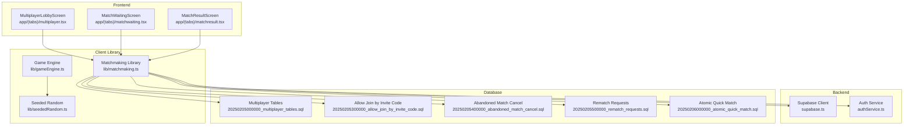
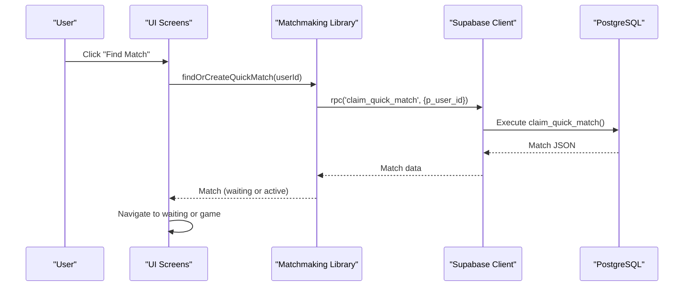
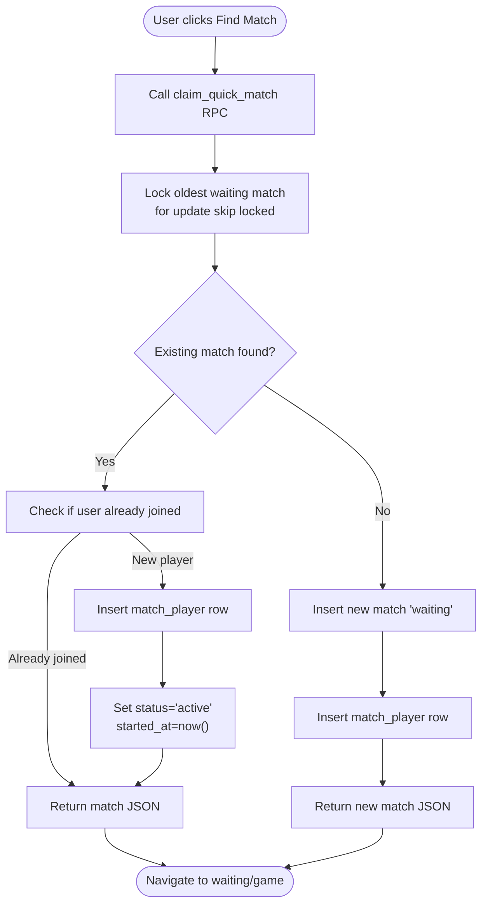
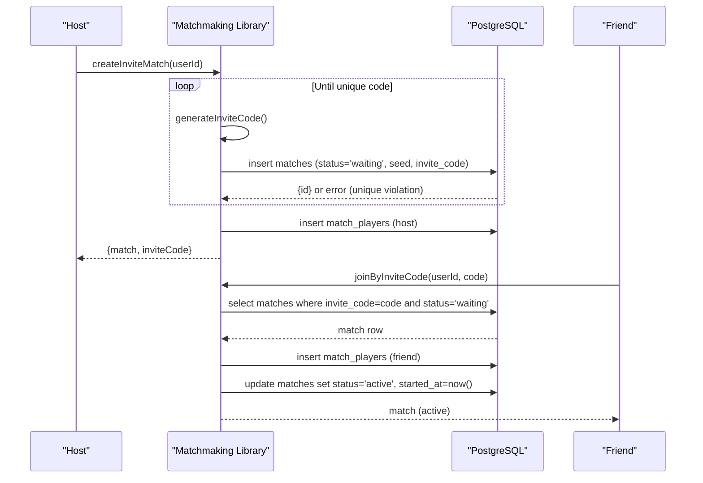
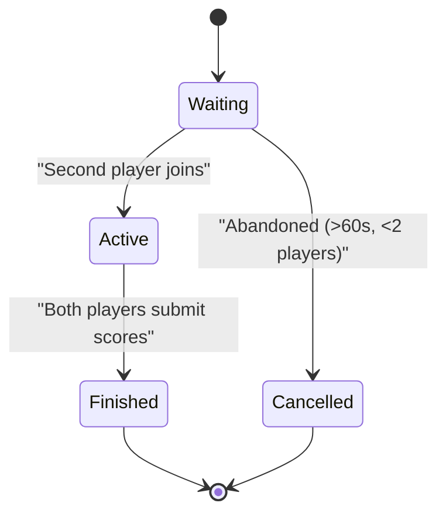
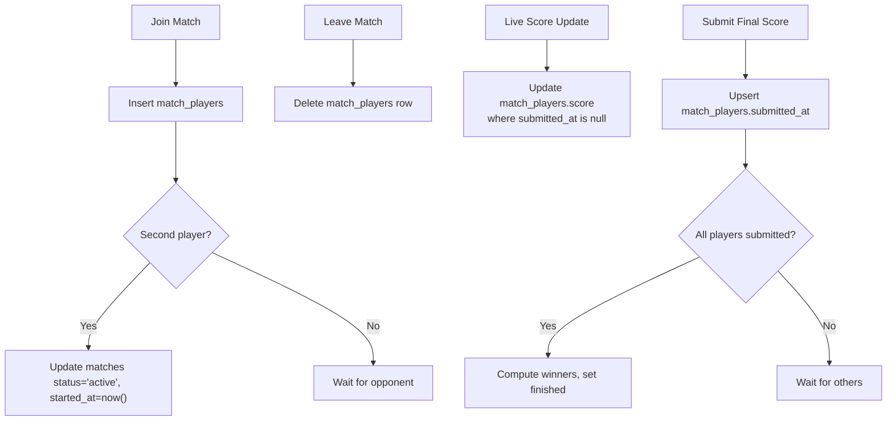
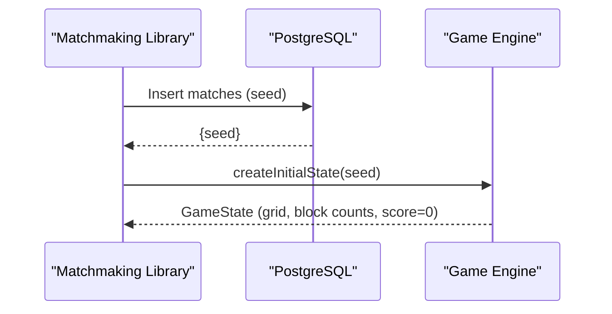
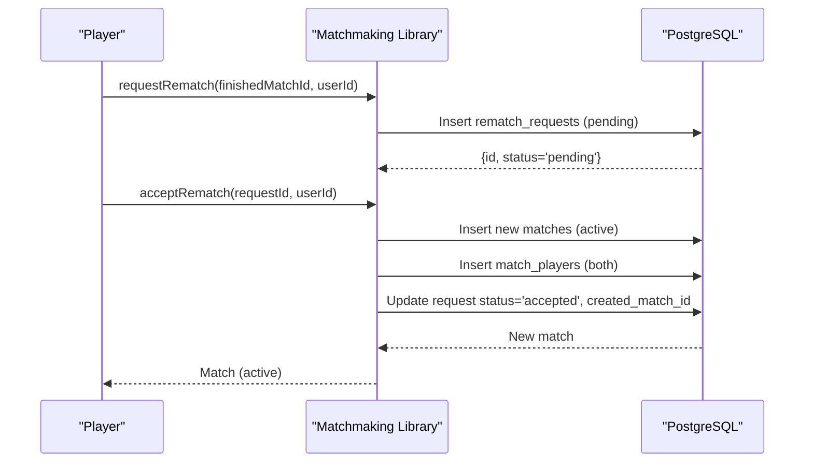
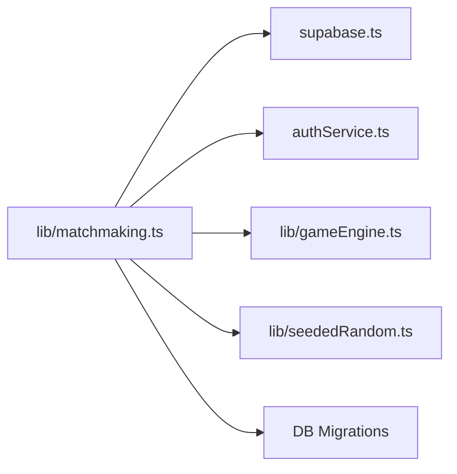

# Matchmaking Service

<cite>
**Referenced Files in This Document**
- [lib/matchmaking.ts](file://lib/matchmaking.ts)
- [supabase/migrations/20250206000000_atomic_quick_match.sql](file://supabase/migrations/20250206000000_atomic_quick_match.sql)
- [supabase/migrations/20250205000000_multiplayer_tables.sql](file://supabase/migrations/20250205000000_multiplayer_tables.sql)
- [supabase/migrations/20250205300000_allow_join_by_invite_code.sql](file://supabase/migrations/20250205300000_allow_join_by_invite_code.sql)
- [supabase/migrations/20250205400000_abandoned_match_cancel.sql](file://supabase/migrations/20250205400000_abandoned_match_cancel.sql)
- [supabase/migrations/20250205500000_rematch_requests.sql](file://supabase/migrations/20250205500000_rematch_requests.sql)
- [app/(tabs)/multiplayer.tsx](file://app/(tabs)/multiplayer.tsx)
- [app/(tabs)/matchwaiting.tsx](file://app/(tabs)/matchwaiting.tsx)
- [app/(tabs)/matchresult.tsx](file://app/(tabs)/matchresult.tsx)
- [lib/gameEngine.ts](file://lib/gameEngine.ts)
- [lib/seededRandom.ts](file://lib/seededRandom.ts)
- [supabase.ts](file://supabase.ts)
- [authService.ts](file://authService.ts)
</cite>

## Table of Contents
1. [Introduction](#introduction)
2. [Project Structure](#project-structure)
3. [Core Components](#core-components)
4. [Architecture Overview](#architecture-overview)
5. [Detailed Component Analysis](#detailed-component-analysis)
6. [Dependency Analysis](#dependency-analysis)
7. [Performance Considerations](#performance-considerations)
8. [Troubleshooting Guide](#troubleshooting-guide)
9. [Conclusion](#conclusion)

## Introduction
This document describes the matchmaking service implementation for the Async Race multiplayer mode. It covers:
- Quick match creation and joining using atomic operations and PostgreSQL functions
- Invite-based private matches with unique 6-character invite codes and collision handling
- Full match lifecycle from creation through active gameplay to completion
- The claim_quick_match RPC function for race-condition prevention and atomic claiming
- Match status management (waiting, active, finished, cancelled) and state transitions
- Player management operations, seed generation for deterministic game initialization, and time limit configuration
- Practical workflows, error handling strategies, and performance considerations for concurrent match requests

## Project Structure
The matchmaking system spans frontend UI components, a client library for Supabase interactions, and database migrations that define the schema and atomic operations.

**Diagram sources**
- [app/(tabs)/multiplayer.tsx](file://app/(tabs)/multiplayer.tsx#L1-L342)
- [app/(tabs)/matchwaiting.tsx](file://app/(tabs)/matchwaiting.tsx#L1-L210)
- [app/(tabs)/matchresult.tsx](file://app/(tabs)/matchresult.tsx#L1-L338)
- [lib/matchmaking.ts](file://lib/matchmaking.ts#L1-L542)
- [lib/seededRandom.ts](file://lib/seededRandom.ts#L1-L21)
- [lib/gameEngine.ts](file://lib/gameEngine.ts#L1-L284)
- [supabase.ts](file://supabase.ts#L1-L75)
- [authService.ts](file://authService.ts#L1-L560)
- [supabase/migrations/20250205000000_multiplayer_tables.sql](file://supabase/migrations/20250205000000_multiplayer_tables.sql#L1-L84)
- [supabase/migrations/20250205300000_allow_join_by_invite_code.sql](file://supabase/migrations/20250205300000_allow_join_by_invite_code.sql#L1-L14)
- [supabase/migrations/20250205400000_abandoned_match_cancel.sql](file://supabase/migrations/20250205400000_abandoned_match_cancel.sql#L1-L31)
- [supabase/migrations/20250205500000_rematch_requests.sql](file://supabase/migrations/20250205500000_rematch_requests.sql#L1-L37)
- [supabase/migrations/20250206000000_atomic_quick_match.sql](file://supabase/migrations/20250206000000_atomic_quick_match.sql#L1-L45)

**Section sources**
- [lib/matchmaking.ts](file://lib/matchmaking.ts#L1-L542)
- [supabase/migrations/20250205000000_multiplayer_tables.sql](file://supabase/migrations/20250205000000_multiplayer_tables.sql#L1-L84)
- [supabase/migrations/20250205300000_allow_join_by_invite_code.sql](file://supabase/migrations/20250205300000_allow_join_by_invite_code.sql#L1-L14)
- [supabase/migrations/20250205400000_abandoned_match_cancel.sql](file://supabase/migrations/20250205400000_abandoned_match_cancel.sql#L1-L31)
- [supabase/migrations/20250205500000_rematch_requests.sql](file://supabase/migrations/20250205500000_rematch_requests.sql#L1-L37)
- [supabase/migrations/20250206000000_atomic_quick_match.sql](file://supabase/migrations/20250206000000_atomic_quick_match.sql#L1-L45)
- [app/(tabs)/multiplayer.tsx](file://app/(tabs)/multiplayer.tsx#L1-L342)
- [app/(tabs)/matchwaiting.tsx](file://app/(tabs)/matchwaiting.tsx#L1-L210)
- [app/(tabs)/matchresult.tsx](file://app/(tabs)/matchresult.tsx#L1-L338)
- [lib/gameEngine.ts](file://lib/gameEngine.ts#L1-L284)
- [lib/seededRandom.ts](file://lib/seededRandom.ts#L1-L21)
- [supabase.ts](file://supabase.ts#L1-L75)
- [authService.ts](file://authService.ts#L1-L560)

## Core Components
- Matchmaking library: Provides match creation, joining, status management, live score updates, and rematch requests.
- Supabase client: Centralized Supabase client initialization and configuration.
- Database migrations: Define tables, RLS policies, indexes, and atomic operations.
- UI screens: Multiplayer lobby, waiting room, and result screens integrate with the matchmaking library.
- Game engine and seeded random: Provide deterministic board initialization for multiplayer fairness.

Key exports and responsibilities:
- Match and MatchPlayer interfaces define the data model.
- Functions for quick match, invite match, joining by code, live score updates, final score submission, match cancellation, and rematch requests.
- Realtime subscriptions for live updates.
- Seed generation and deterministic RNG for shared game initialization.

**Section sources**
- [lib/matchmaking.ts](file://lib/matchmaking.ts#L12-L542)
- [supabase.ts](file://supabase.ts#L42-L75)
- [supabase/migrations/20250205000000_multiplayer_tables.sql](file://supabase/migrations/20250205000000_multiplayer_tables.sql#L3-L84)
- [app/(tabs)/multiplayer.tsx](file://app/(tabs)/multiplayer.tsx#L1-L342)
- [app/(tabs)/matchwaiting.tsx](file://app/(tabs)/matchwaiting.tsx#L1-L210)
- [app/(tabs)/matchresult.tsx](file://app/(tabs)/matchresult.tsx#L1-L338)
- [lib/gameEngine.ts](file://lib/gameEngine.ts#L60-L100)
- [lib/seededRandom.ts](file://lib/seededRandom.ts#L9-L20)

## Architecture Overview
The matchmaking architecture combines a client-side library with Supabase for persistence and real-time updates, and PostgreSQL functions for atomic operations.

**Diagram sources**
- [app/(tabs)/multiplayer.tsx](file://app/(tabs)/multiplayer.tsx#L74-L92)
- [lib/matchmaking.ts](file://lib/matchmaking.ts#L58-L66)
- [supabase/migrations/20250206000000_atomic_quick_match.sql](file://supabase/migrations/20250206000000_atomic_quick_match.sql#L3-L42)
- [supabase.ts](file://supabase.ts#L42-L75)

## Detailed Component Analysis

### Quick Match Creation and Atomic Claiming
- The quick match flow uses a PostgreSQL function to atomically claim an existing waiting match or create a new one.
- Race condition prevention: The function locks the oldest waiting match row, checks for duplicates, inserts the player, and updates status in a single transaction.
- Frontend triggers the RPC and navigates based on the returned status.

**Diagram sources**
- [lib/matchmaking.ts](file://lib/matchmaking.ts#L58-L66)
- [supabase/migrations/20250206000000_atomic_quick_match.sql](file://supabase/migrations/20250206000000_atomic_quick_match.sql#L3-L42)

**Section sources**
- [lib/matchmaking.ts](file://lib/matchmaking.ts#L58-L66)
- [supabase/migrations/20250206000000_atomic_quick_match.sql](file://supabase/migrations/20250206000000_atomic_quick_match.sql#L3-L42)

### Invite-Based Private Matches
- Invite code generation uses a 6-character alphabet excluding ambiguous characters, with collision handling via retries.
- Invite code uniqueness is enforced at the database level.
- Joining by code requires the match to be in 'waiting' status and not yet full.

**Diagram sources**
- [lib/matchmaking.ts](file://lib/matchmaking.ts#L71-L114)
- [lib/matchmaking.ts](file://lib/matchmaking.ts#L119-L168)
- [supabase/migrations/20250205000000_multiplayer_tables.sql](file://supabase/migrations/20250205000000_multiplayer_tables.sql#L9-L13)
- [supabase/migrations/20250205300000_allow_join_by_invite_code.sql](file://supabase/migrations/20250205300000_allow_join_by_invite_code.sql#L6-L13)

**Section sources**
- [lib/matchmaking.ts](file://lib/matchmaking.ts#L34-L46)
- [lib/matchmaking.ts](file://lib/matchmaking.ts#L71-L114)
- [lib/matchmaking.ts](file://lib/matchmaking.ts#L119-L168)
- [supabase/migrations/20250205000000_multiplayer_tables.sql](file://supabase/migrations/20250205000000_multiplayer_tables.sql#L9-L13)
- [supabase/migrations/20250205300000_allow_join_by_invite_code.sql](file://supabase/migrations/20250205300000_allow_join_by_invite_code.sql#L6-L13)

### Match Lifecycle and Status Management
- Status transitions: waiting → active → finished; waiting → cancelled (abandoned).
- Abandonment policy: Matches remain 'waiting' for up to 60 seconds with fewer than 2 players; then automatically marked 'cancelled'.
- UI reacts to status changes via realtime subscriptions and polling fallback.

**Diagram sources**
- [supabase/migrations/20250205400000_abandoned_match_cancel.sql](file://supabase/migrations/20250205400000_abandoned_match_cancel.sql#L4-L10)
- [lib/matchmaking.ts](file://lib/matchmaking.ts#L329-L338)
- [app/(tabs)/matchwaiting.tsx](file://app/(tabs)/matchwaiting.tsx#L47-L74)

**Section sources**
- [supabase/migrations/20250205400000_abandoned_match_cancel.sql](file://supabase/migrations/20250205400000_abandoned_match_cancel.sql#L1-L31)
- [lib/matchmaking.ts](file://lib/matchmaking.ts#L329-L338)
- [app/(tabs)/matchwaiting.tsx](file://app/(tabs)/matchwaiting.tsx#L47-L74)

### Player Management Operations
- Joining: Insert match_players row; if second player, mark match active.
- Leaving: Delete match_players row; used to cancel while waiting.
- Live score updates: Update match_players.score while submitted_at is null.
- Final score submission: Set submitted_at and compute winners when both players submit.

**Diagram sources**
- [lib/matchmaking.ts](file://lib/matchmaking.ts#L119-L168)
- [lib/matchmaking.ts](file://lib/matchmaking.ts#L343-L351)
- [lib/matchmaking.ts](file://lib/matchmaking.ts#L253-L266)
- [lib/matchmaking.ts](file://lib/matchmaking.ts#L271-L327)

**Section sources**
- [lib/matchmaking.ts](file://lib/matchmaking.ts#L119-L168)
- [lib/matchmaking.ts](file://lib/matchmaking.ts#L343-L351)
- [lib/matchmaking.ts](file://lib/matchmaking.ts#L253-L266)
- [lib/matchmaking.ts](file://lib/matchmaking.ts#L271-L327)

### Seed Generation and Deterministic Initialization
- Seeds are UUID-like strings generated per match to ensure identical boards for both players.
- Seeded random generator produces deterministic sequences from the seed.
- Game engine initializes the grid and bulldog positions deterministically.

**Diagram sources**
- [lib/matchmaking.ts](file://lib/matchmaking.ts#L48-L52)
- [lib/seededRandom.ts](file://lib/seededRandom.ts#L9-L20)
- [lib/gameEngine.ts](file://lib/gameEngine.ts#L60-L100)

**Section sources**
- [lib/matchmaking.ts](file://lib/matchmaking.ts#L48-L52)
- [lib/seededRandom.ts](file://lib/seededRandom.ts#L9-L20)
- [lib/gameEngine.ts](file://lib/gameEngine.ts#L60-L100)

### Rematch Requests
- One-click rematch: Creates a pending request; if opponent also clicks, merges into a new active match.
- Realtime + polling subscription ensures reliable UX.

**Diagram sources**
- [lib/matchmaking.ts](file://lib/matchmaking.ts#L366-L404)
- [lib/matchmaking.ts](file://lib/matchmaking.ts#L409-L450)
- [supabase/migrations/20250205500000_rematch_requests.sql](file://supabase/migrations/20250205500000_rematch_requests.sql#L4-L15)

**Section sources**
- [lib/matchmaking.ts](file://lib/matchmaking.ts#L366-L404)
- [lib/matchmaking.ts](file://lib/matchmaking.ts#L409-L450)
- [supabase/migrations/20250205500000_rematch_requests.sql](file://supabase/migrations/20250205500000_rematch_requests.sql#L1-L37)

### Realtime Subscriptions and UI Integration
- Match subscriptions: Listen to matches and match_players changes for live updates.
- Rematch subscriptions: Combine Realtime with periodic polling for reliability.
- UI screens react to state changes and navigate accordingly.

**Section sources**
- [lib/matchmaking.ts](file://lib/matchmaking.ts#L204-L247)
- [lib/matchmaking.ts](file://lib/matchmaking.ts#L470-L511)
- [app/(tabs)/matchwaiting.tsx](file://app/(tabs)/matchwaiting.tsx#L47-L74)
- [app/(tabs)/matchresult.tsx](file://app/(tabs)/matchresult.tsx#L69-L91)

## Dependency Analysis
The matchmaking library depends on:
- Supabase client for database operations and authentication
- Auth service for session and profile operations
- Game engine and seeded random for deterministic initialization

**Diagram sources**
- [lib/matchmaking.ts](file://lib/matchmaking.ts#L6-L8)
- [supabase.ts](file://supabase.ts#L42-L75)
- [authService.ts](file://authService.ts#L1-L560)
- [lib/gameEngine.ts](file://lib/gameEngine.ts#L1-L284)
- [lib/seededRandom.ts](file://lib/seededRandom.ts#L1-L21)

**Section sources**
- [lib/matchmaking.ts](file://lib/matchmaking.ts#L6-L8)
- [supabase.ts](file://supabase.ts#L42-L75)
- [authService.ts](file://authService.ts#L1-L560)
- [lib/gameEngine.ts](file://lib/gameEngine.ts#L1-L284)
- [lib/seededRandom.ts](file://lib/seededRandom.ts#L1-L21)

## Performance Considerations
- Atomic quick match: The PostgreSQL function prevents race conditions and reduces contention by locking only the target row.
- Indexes: Separate indexes on status and invite_code optimize lookups for quick match and invite-based join.
- Realtime + polling: Subscriptions provide near-real-time updates with polling as a fallback to ensure reliability.
- Collision handling: Invite code generation retries up to a bounded number of attempts to minimize collisions.
- Abandonment cleanup: Scheduled job cancels stale matches to keep the pool healthy.

[No sources needed since this section provides general guidance]

## Troubleshooting Guide
Common issues and strategies:
- Duplicate invite code: Retry generation with bounded attempts; ensure uniqueness constraint is respected.
- Invalid or expired invite code: Validate length and existence; handle errors gracefully in UI.
- Race conditions in quick match: The RPC handles locking and duplicate checks; ensure clients retry on transient failures.
- Abandoned matches: Matches are automatically cancelled after 60 seconds if not completed; inform users accordingly.
- Authentication errors: Verify session state and clear invalid sessions if refresh tokens are missing or revoked.
- Realtime disconnections: UI falls back to polling; monitor subscription channels and reconnect as needed.

**Section sources**
- [lib/matchmaking.ts](file://lib/matchmaking.ts#L71-L114)
- [lib/matchmaking.ts](file://lib/matchmaking.ts#L119-L168)
- [supabase/migrations/20250206000000_atomic_quick_match.sql](file://supabase/migrations/20250206000000_atomic_quick_match.sql#L18-L31)
- [supabase/migrations/20250205400000_abandoned_match_cancel.sql](file://supabase/migrations/20250205400000_abandoned_match_cancel.sql#L20-L30)
- [authService.ts](file://authService.ts#L338-L382)
- [lib/matchmaking.ts](file://lib/matchmaking.ts#L204-L247)

## Conclusion
The matchmaking service provides a robust, race-free, and scalable foundation for Async Race multiplayer:
- Atomic operations ensure fair and consistent quick match creation and joining.
- Invite-based private matches offer social play with collision handling.
- Clear status management and abandonment policies keep the system healthy.
- Realtime subscriptions and deterministic initialization deliver a smooth, fair gaming experience.
- The modular design separates concerns between UI, client logic, and database operations, enabling maintainability and extensibility.