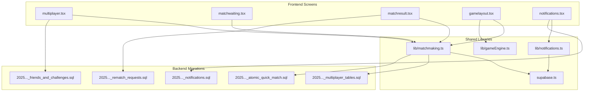
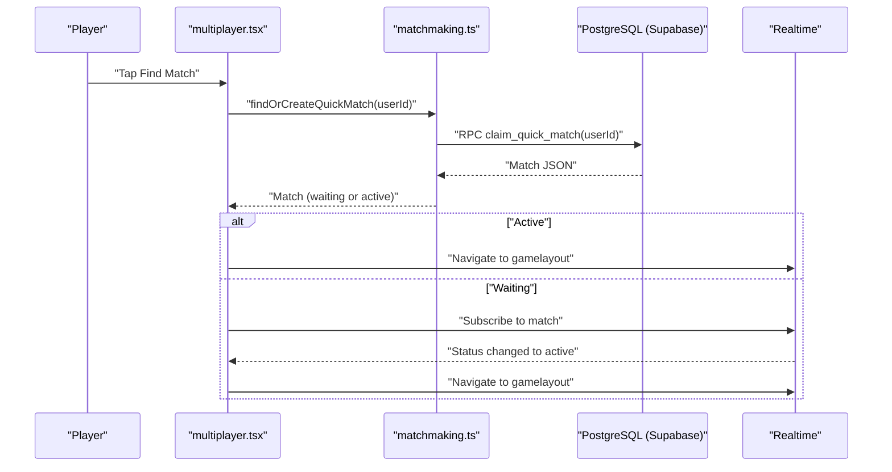
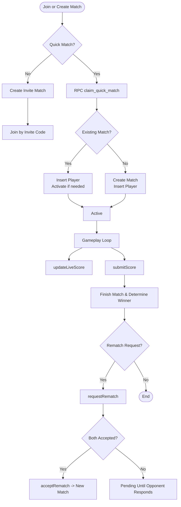
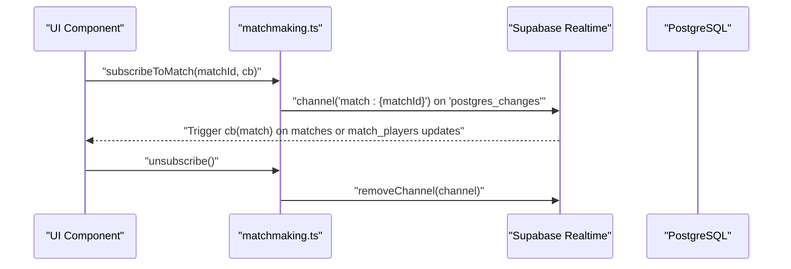
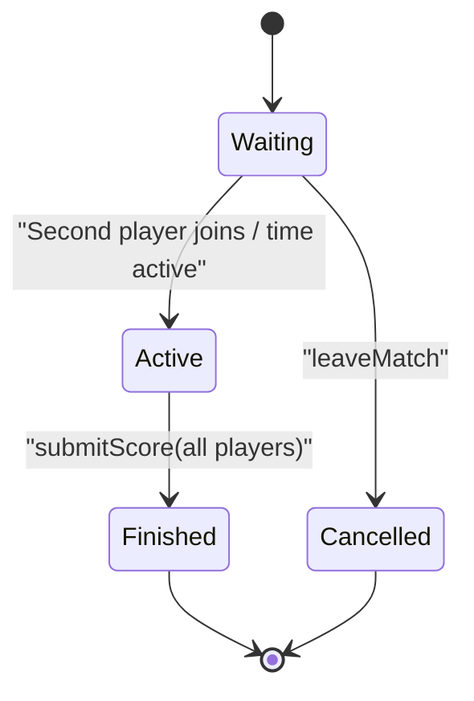
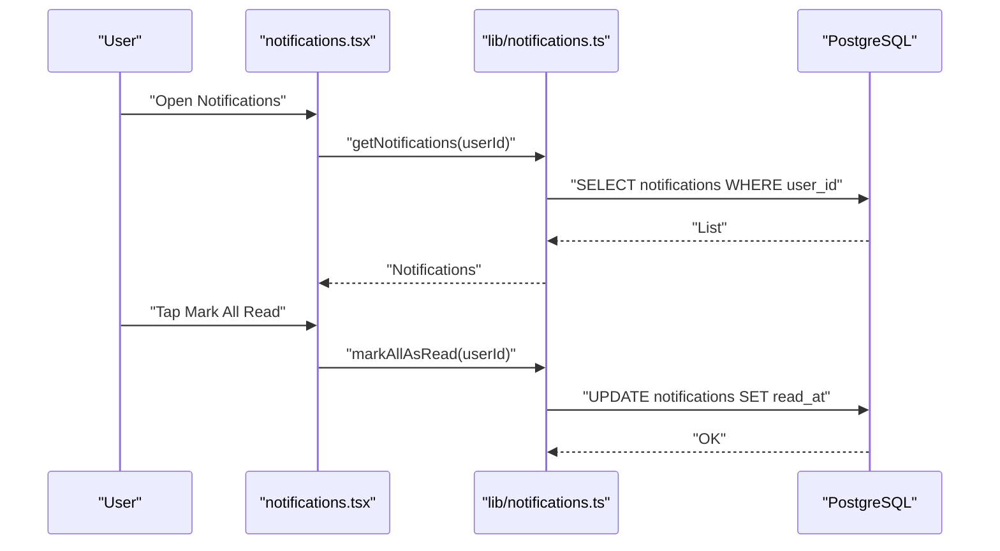
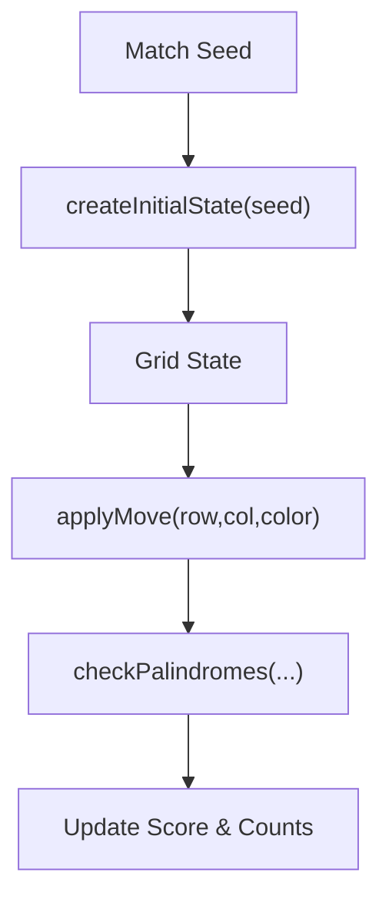
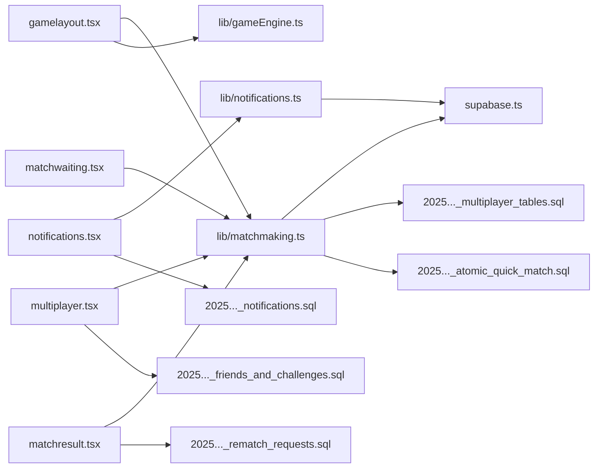
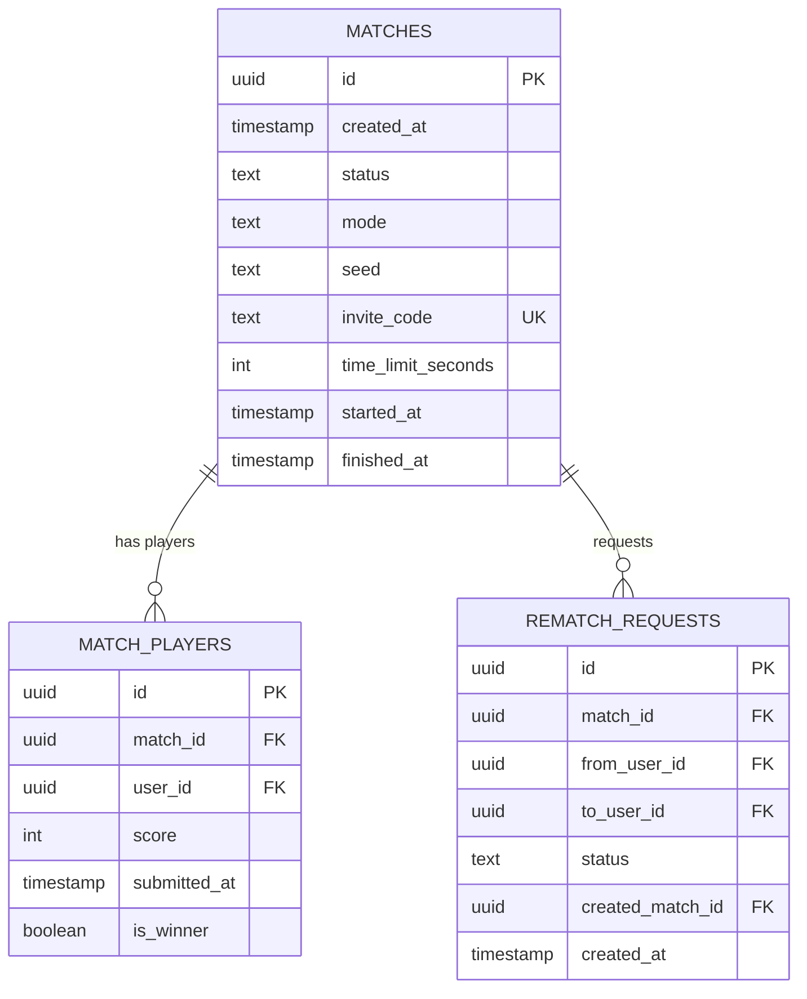

# Multiplayer System

<cite>
**Referenced Files in This Document**
- [matchmaking.ts](file://lib/matchmaking.ts)
- [notifications.ts](file://lib/notifications.ts)
- [supabase.ts](file://supabase.ts)
- [multiplayer.tsx](file://app/(tabs)/multiplayer.tsx)
- [matchwaiting.tsx](file://app/(tabs)/matchwaiting.tsx)
- [matchresult.tsx](file://app/(tabs)/matchresult.tsx)
- [gamelayout.tsx](file://app/(tabs)/gamelayout.tsx)
- [notifications.tsx](file://app/(tabs)/notifications.tsx)
- [useAuth.ts](file://hooks/useAuth.ts)
- [20250205000000_multiplayer_tables.sql](file://supabase/migrations/20250205000000_multiplayer_tables.sql)
- [20250206000000_atomic_quick_match.sql](file://supabase/migrations/20250206000000_atomic_quick_match.sql)
- [20250205500000_rematch_requests.sql](file://supabase/migrations/20250205500000_rematch_requests.sql)
- [20250206100000_friends_and_challenges.sql](file://supabase/migrations/20250206100000_friends_and_challenges.sql)
- [20250206110000_notifications.sql](file://supabase/migrations/20250206110000_notifications.sql)
- [gameEngine.ts](file://lib/gameEngine.ts)
</cite>

## Table of Contents
1. [Introduction](#introduction)
2. [Project Structure](#project-structure)
3. [Core Components](#core-components)
4. [Architecture Overview](#architecture-overview)
5. [Detailed Component Analysis](#detailed-component-analysis)
6. [Dependency Analysis](#dependency-analysis)
7. [Performance Considerations](#performance-considerations)
8. [Troubleshooting Guide](#troubleshooting-guide)
9. [Conclusion](#conclusion)
10. [Appendices](#appendices)

## Introduction
This document explains the Palindrome multiplayer system for real-time gaming. It covers matchmaking (quick match and invite-based private games), Supabase Realtime integration for live score synchronization and match state updates, match lifecycle management, notification system for invitations and social interactions, atomic operations for match creation and player management, and network reliability strategies for distributed game state.

## Project Structure
The multiplayer system spans frontend screens, shared libraries, and backend database schemas:
- Frontend screens orchestrate matchmaking UX and gameplay.
- Shared libraries encapsulate Supabase client initialization, matchmaking logic, and notifications.
- Backend migrations define atomic operations and RLS policies for safety and correctness.

**Diagram sources**
- [multiplayer.tsx](file://app/(tabs)/multiplayer.tsx#L1-L342)
- [matchwaiting.tsx](file://app/(tabs)/matchwaiting.tsx#L1-L210)
- [matchresult.tsx](file://app/(tabs)/matchresult.tsx#L1-L338)
- [gamelayout.tsx](file://app/(tabs)/gamelayout.tsx#L1-L1936)
- [notifications.tsx](file://app/(tabs)/notifications.tsx#L1-L252)
- [matchmaking.ts](file://lib/matchmaking.ts#L1-L542)
- [notifications.ts](file://lib/notifications.ts#L1-L110)
- [supabase.ts](file://supabase.ts#L1-L75)
- [gameEngine.ts](file://lib/gameEngine.ts#L1-L284)
- [20250205000000_multiplayer_tables.sql](file://supabase/migrations/20250205000000_multiplayer_tables.sql#L1-L84)
- [20250206000000_atomic_quick_match.sql](file://supabase/migrations/20250206000000_atomic_quick_match.sql#L1-L45)
- [20250205500000_rematch_requests.sql](file://supabase/migrations/20250205500000_rematch_requests.sql#L1-L37)
- [20250206100000_friends_and_challenges.sql](file://supabase/migrations/20250206100000_friends_and_challenges.sql#L1-L50)
- [20250206110000_notifications.sql](file://supabase/migrations/20250206110000_notifications.sql#L1-L28)

**Section sources**
- [multiplayer.tsx](file://app/(tabs)/multiplayer.tsx#L1-L342)
- [matchmaking.ts](file://lib/matchmaking.ts#L1-L542)
- [supabase.ts](file://supabase.ts#L1-L75)
- [20250205000000_multiplayer_tables.sql](file://supabase/migrations/20250205000000_multiplayer_tables.sql#L1-L84)

## Core Components
- Supabase client initialization with platform-aware storage and persisted auth sessions.
- Matchmaking service: quick match creation, invite-based private games, live score updates, match lifecycle, and rematch requests.
- Realtime subscriptions for immediate UI updates and polling fallbacks for reliability.
- Notifications service for friend requests, challenges, and app updates.
- Game engine utilities for deterministic board generation and scoring logic.

Key responsibilities:
- matchmaking.ts: Atomic quick match, invite match creation/join, live score updates, match state transitions, rematch requests.
- supabase.ts: Singleton client creation with auth persistence and storage abstraction.
- gamelayout.tsx: Real-time score synchronization, timers, first-move forfeit, and result routing.
- notifications.ts: CRUD operations for user notifications.
- gameEngine.ts: Deterministic board initialization and scoring.

**Section sources**
- [matchmaking.ts](file://lib/matchmaking.ts#L1-L542)
- [supabase.ts](file://supabase.ts#L1-L75)
- [gamelayout.tsx](file://app/(tabs)/gamelayout.tsx#L1-L1936)
- [notifications.ts](file://lib/notifications.ts#L1-L110)
- [gameEngine.ts](file://lib/gameEngine.ts#L1-L284)

## Architecture Overview
The multiplayer architecture integrates frontend screens with Supabase Realtime and PostgreSQL:
- Frontend screens call matchmaking functions to create or join matches.
- Supabase Realtime publishes changes to matches and match_players, which the frontend subscribes to.
- During gameplay, live scores are pushed to opponents in real time; final scores finalize the match.
- Notifications inform users about friend requests, challenges, and rematch outcomes.

**Diagram sources**
- [multiplayer.tsx](file://app/(tabs)/multiplayer.tsx#L74-L92)
- [matchmaking.ts](file://lib/matchmaking.ts#L58-L66)
- [20250206000000_atomic_quick_match.sql](file://supabase/migrations/20250206000000_atomic_quick_match.sql#L1-L45)

**Section sources**
- [multiplayer.tsx](file://app/(tabs)/multiplayer.tsx#L1-L342)
- [matchmaking.ts](file://lib/matchmaking.ts#L1-L542)
- [20250206000000_atomic_quick_match.sql](file://supabase/migrations/20250206000000_atomic_quick_match.sql#L1-L45)

## Detailed Component Analysis

### Matchmaking Service
Implements quick match, invite-based private games, live score updates, match lifecycle, and rematch requests.

- Quick match:
  - Uses an atomic PostgreSQL function to claim an existing waiting match or create a new one.
  - Prevents race conditions by locking rows and inserting players atomically.
- Invite-based private games:
  - Generates unique invite codes and seeds; inserts match and first player.
  - Joins by invite code with duplicate code handling and automatic activation when second player joins.
- Live score synchronization:
  - updateLiveScore pushes score changes to Realtime for opponent visibility.
  - submitScore finalizes scores and triggers winner determination and match finish.
- Lifecycle management:
  - leaveMatch removes a player from a waiting match.
  - finishMatch marks abandoned matches as finished.
- Rematch requests:
  - requestRematch checks for mutual click-to-merge or creates a pending request.
  - acceptRematch creates a new match and marks request accepted.
  - declineRematch rejects a pending request.
  - subscribeToRematchRequests uses Realtime with polling fallback.

**Diagram sources**
- [matchmaking.ts](file://lib/matchmaking.ts#L58-L114)
- [matchmaking.ts](file://lib/matchmaking.ts#L119-L168)
- [matchmaking.ts](file://lib/matchmaking.ts#L253-L327)
- [matchmaking.ts](file://lib/matchmaking.ts#L366-L450)
- [20250206000000_atomic_quick_match.sql](file://supabase/migrations/20250206000000_atomic_quick_match.sql#L1-L45)

**Section sources**
- [matchmaking.ts](file://lib/matchmaking.ts#L1-L542)
- [20250206000000_atomic_quick_match.sql](file://supabase/migrations/20250206000000_atomic_quick_match.sql#L1-L45)

### Supabase Realtime Integration
- Channels:
  - subscribeToMatch listens to changes on matches and match_players for a given matchId.
  - subscribeToRematchRequests listens to rematch_requests for a finished match and user.
- Reliability:
  - Realtime channels are paired with periodic polling to ensure updates arrive even under unreliable networks.
- Data model:
  - matches and match_players are secured with RLS policies; Realtime publication enabled for these tables.

**Diagram sources**
- [matchmaking.ts](file://lib/matchmaking.ts#L204-L247)
- [20250205000000_multiplayer_tables.sql](file://supabase/migrations/20250205000000_multiplayer_tables.sql#L83-L84)

**Section sources**
- [matchmaking.ts](file://lib/matchmaking.ts#L204-L247)
- [20250205000000_multiplayer_tables.sql](file://supabase/migrations/20250205000000_multiplayer_tables.sql#L83-L84)

### Match Lifecycle Management
- Creation:
  - Quick match: atomic RPC claims or creates.
  - Invite match: creates match with invite code and first player.
- Waiting:
  - matchwaiting.tsx subscribes to match and polls until active or cancelled.
- Active:
  - gamelayout.tsx initializes game state from match seed and synchronizes scores.
- Completion:
  - submitScore finalizes scores; winner determined; match marked finished.
- Cancellation:
  - leaveMatch removes player from waiting match.

**Diagram sources**
- [matchwaiting.tsx](file://app/(tabs)/matchwaiting.tsx#L33-L74)
- [gamelayout.tsx](file://app/(tabs)/gamelayout.tsx#L760-L779)
- [matchmaking.ts](file://lib/matchmaking.ts#L332-L338)

**Section sources**
- [matchwaiting.tsx](file://app/(tabs)/matchwaiting.tsx#L1-L210)
- [gamelayout.tsx](file://app/(tabs)/gamelayout.tsx#L1-L1936)
- [matchmaking.ts](file://lib/matchmaking.ts#L332-L351)

### Notification System
- Types: friend_request, challenge, app_update.
- Operations: list, unread count, mark as read, mark all as read, create notification.
- Screens: notifications.tsx displays notifications and supports marking as read and bulk actions.

**Diagram sources**
- [notifications.tsx](file://app/(tabs)/notifications.tsx#L50-L114)
- [notifications.ts](file://lib/notifications.ts#L24-L83)
- [20250206110000_notifications.sql](file://supabase/migrations/20250206110000_notifications.sql#L1-L28)

**Section sources**
- [notifications.tsx](file://app/(tabs)/notifications.tsx#L1-L252)
- [notifications.ts](file://lib/notifications.ts#L1-L110)
- [20250206110000_notifications.sql](file://supabase/migrations/20250206110000_notifications.sql#L1-L28)

### Game Engine Integration
- Deterministic board initialization using a seed ensures identical boards for both players.
- Scoring logic validates palindromes in rows/columns and applies bulldog bonuses.
- Game layout uses these utilities to initialize state and compute feedback.

**Diagram sources**
- [gamelayout.tsx](file://app/(tabs)/gamelayout.tsx#L734-L758)
- [gameEngine.ts](file://lib/gameEngine.ts#L60-L100)
- [gameEngine.ts](file://lib/gameEngine.ts#L167-L219)

**Section sources**
- [gamelayout.tsx](file://app/(tabs)/gamelayout.tsx#L734-L758)
- [gameEngine.ts](file://lib/gameEngine.ts#L1-L284)

## Dependency Analysis
- Frontend screens depend on matchmaking and notifications libraries.
- Matchmaking depends on Supabase client and PostgreSQL migrations.
- Realtime relies on Supabase publication settings for matches, match_players, and rematch_requests.
- Auth hooks integrate with Supabase auth state.

**Diagram sources**
- [gamelayout.tsx](file://app/(tabs)/gamelayout.tsx#L1-L1936)
- [multiplayer.tsx](file://app/(tabs)/multiplayer.tsx#L1-L342)
- [matchwaiting.tsx](file://app/(tabs)/matchwaiting.tsx#L1-L210)
- [matchresult.tsx](file://app/(tabs)/matchresult.tsx#L1-L338)
- [notifications.tsx](file://app/(tabs)/notifications.tsx#L1-L252)
- [matchmaking.ts](file://lib/matchmaking.ts#L1-L542)
- [notifications.ts](file://lib/notifications.ts#L1-L110)
- [supabase.ts](file://supabase.ts#L1-L75)
- [20250205000000_multiplayer_tables.sql](file://supabase/migrations/20250205000000_multiplayer_tables.sql#L1-L84)
- [20250206000000_atomic_quick_match.sql](file://supabase/migrations/20250206000000_atomic_quick_match.sql#L1-L45)
- [20250205500000_rematch_requests.sql](file://supabase/migrations/20250205500000_rematch_requests.sql#L1-L37)
- [20250206100000_friends_and_challenges.sql](file://supabase/migrations/20250206100000_friends_and_challenges.sql#L1-L50)
- [20250206110000_notifications.sql](file://supabase/migrations/20250206110000_notifications.sql#L1-L28)

**Section sources**
- [useAuth.ts](file://hooks/useAuth.ts#L1-L51)
- [supabase.ts](file://supabase.ts#L1-L75)

## Performance Considerations
- Atomic quick match:
  - Uses a PostgreSQL function with row-level locking to avoid race conditions and reduce contention.
- Realtime plus polling:
  - Realtime provides instant updates; polling ensures eventual consistency if Realtime fails.
- Efficient queries:
  - Indexes on matches (status, invite_code) and match_players (match_id, user_id) optimize lookups.
- Client caching:
  - Supabase client persists auth sessions and uses platform-appropriate storage to minimize re-auth overhead.

[No sources needed since this section provides general guidance]

## Troubleshooting Guide
Common issues and remedies:
- Quick match race condition:
  - Resolved by atomic RPC; ensure the function executes without errors.
- Invite code collisions:
  - The service retries generating a unique code up to a bounded number of attempts.
- Realtime subscription not firing:
  - Verify publication includes matches, match_players, and rematch_requests; fallback polling is active.
- Final score not recorded:
  - Ensure submitScore is called when time expires or blocks are exhausted; winner determination occurs after both players submit.
- Notifications not appearing:
  - Confirm notifications table is enabled for Realtime and user has proper RLS access.

**Section sources**
- [matchmaking.ts](file://lib/matchmaking.ts#L79-L114)
- [matchmaking.ts](file://lib/matchmaking.ts#L271-L327)
- [20250205000000_multiplayer_tables.sql](file://supabase/migrations/20250205000000_multiplayer_tables.sql#L83-L84)
- [20250206110000_notifications.sql](file://supabase/migrations/20250206110000_notifications.sql#L1-L28)

## Conclusion
The Palindrome multiplayer system combines atomic database operations, Supabase Realtime, and robust frontend flows to deliver responsive, reliable real-time matches. Quick match creation prevents races, invite-based private games support social play, and live score synchronization keeps both players informed. The notification system and rematch requests round out the social and replay mechanics. With polling fallbacks and RLS policies, the system balances performance and correctness across distributed state management.

[No sources needed since this section summarizes without analyzing specific files]

## Appendices

### Data Model Overview

**Diagram sources**
- [20250205000000_multiplayer_tables.sql](file://supabase/migrations/20250205000000_multiplayer_tables.sql#L3-L28)
- [20250205500000_rematch_requests.sql](file://supabase/migrations/20250205500000_rematch_requests.sql#L4-L16)