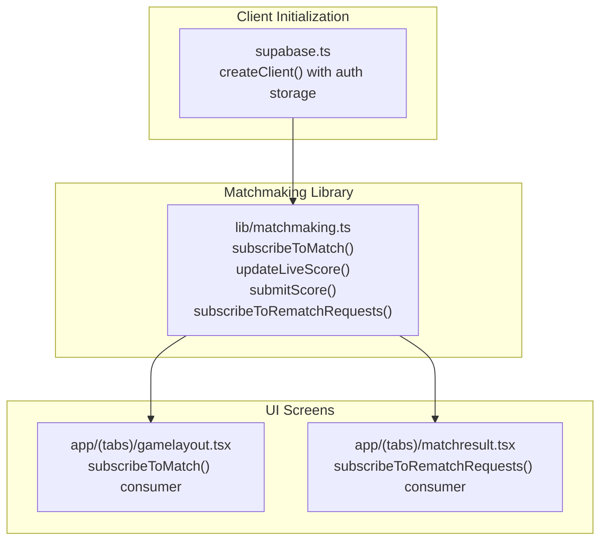
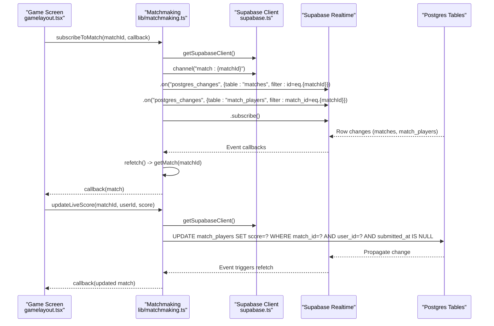
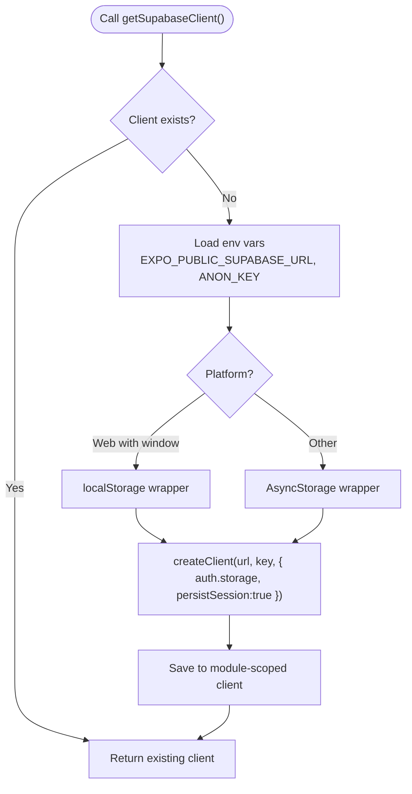
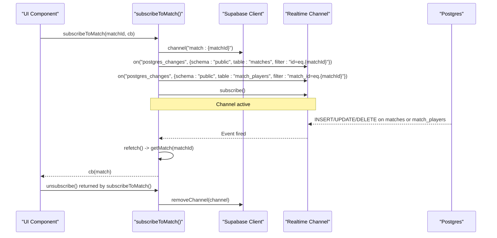
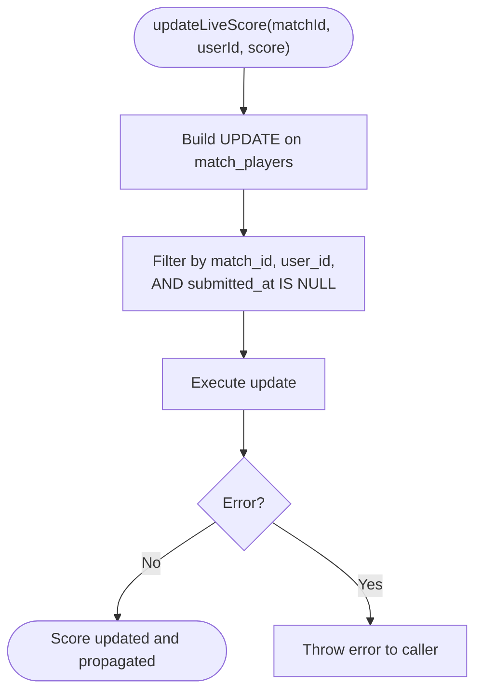
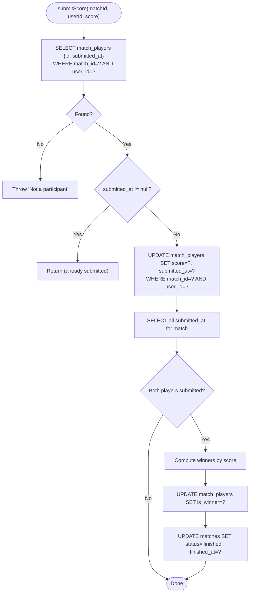
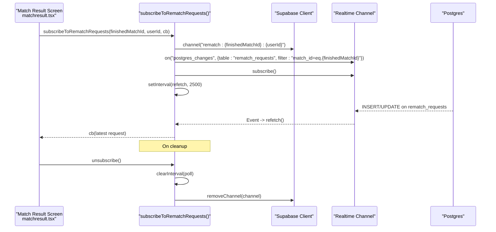
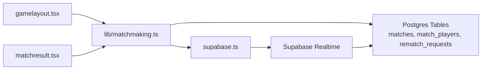

# Real-time Communication

<cite>
**Referenced Files in This Document**
- [supabase.ts](file://supabase.ts)
- [matchmaking.ts](file://lib/matchmaking.ts)
- [gamelayout.tsx](file://app/(tabs)/gamelayout.tsx)
- [matchresult.tsx](file://app/(tabs)/matchresult.tsx)
- [20250205000000_multiplayer_tables.sql](file://supabase/migrations/20250205000000_multiplayer_tables.sql)
- [MULTIPLAYER_ROADMAP.md](file://MULTIPLAYER_ROADMAP.md)
</cite>

## Table of Contents
1. [Introduction](#introduction)
2. [Project Structure](#project-structure)
3. [Core Components](#core-components)
4. [Architecture Overview](#architecture-overview)
5. [Detailed Component Analysis](#detailed-component-analysis)
6. [Dependency Analysis](#dependency-analysis)
7. [Performance Considerations](#performance-considerations)
8. [Troubleshooting Guide](#troubleshooting-guide)
9. [Conclusion](#conclusion)

## Introduction
This document explains the real-time communication system built on Supabase Realtime for the multiplayer game. It covers how the application subscribes to changes in match and match_players tables, synchronizes live scores during gameplay, performs atomic score updates, cleans up subscriptions to avoid memory leaks, and implements a reliable fallback polling mechanism for rematch requests. It also provides practical guidance for setting up subscriptions, handling connection lifecycle events, and ensuring real-time data consistency under network interruptions.

## Project Structure
The real-time system spans three main areas:
- Supabase client initialization and persistence storage abstraction
- Matchmaking library that defines subscriptions, atomic score updates, and rematch flows
- UI screens that subscribe to real-time updates and manage lifecycle cleanup

**Diagram sources**
- [supabase.ts](file://supabase.ts#L42-L74)
- [matchmaking.ts](file://lib/matchmaking.ts#L204-L247)
- [matchmaking.ts](file://lib/matchmaking.ts#L470-L511)
- [gamelayout.tsx](file://app/(tabs)/gamelayout.tsx#L760-L779)
- [matchresult.tsx](file://app/(tabs)/matchresult.tsx#L69-L91)

**Section sources**
- [supabase.ts](file://supabase.ts#L1-L75)
- [matchmaking.ts](file://lib/matchmaking.ts#L1-L542)
- [gamelayout.tsx](file://app/(tabs)/gamelayout.tsx#L1-L800)
- [matchresult.tsx](file://app/(tabs)/matchresult.tsx#L1-L338)

## Core Components
- Supabase client factory with platform-aware storage for auth session persistence
- Match subscription for live updates to match and match_players
- Live score update with atomic condition (submitted_at is null)
- Final score submission and automatic match completion
- Rematch request subscription with Realtime plus polling fallback

**Section sources**
- [supabase.ts](file://supabase.ts#L42-L74)
- [matchmaking.ts](file://lib/matchmaking.ts#L204-L247)
- [matchmaking.ts](file://lib/matchmaking.ts#L253-L266)
- [matchmaking.ts](file://lib/matchmaking.ts#L271-L327)
- [matchmaking.ts](file://lib/matchmaking.ts#L470-L511)

## Architecture Overview
The real-time architecture combines Supabase Realtime channels with periodic polling for resilience. The UI subscribes to channels and receives immediate updates when database rows change. To guard against missed events or flaky connections, polling periodically refreshes state.

**Diagram sources**
- [gamelayout.tsx](file://app/(tabs)/gamelayout.tsx#L760-L779)
- [matchmaking.ts](file://lib/matchmaking.ts#L204-L247)
- [matchmaking.ts](file://lib/matchmaking.ts#L253-L266)

## Detailed Component Analysis

### Supabase Client Initialization
- Creates a singleton Supabase client with platform-specific storage for auth sessions
- Supports both native AsyncStorage and browser localStorage with a memory fallback
- Enables persistent auth sessions and auto-refresh

**Diagram sources**
- [supabase.ts](file://supabase.ts#L42-L74)

**Section sources**
- [supabase.ts](file://supabase.ts#L1-L75)

### Match Subscription and Event Filtering
- Subscribes to both matches and match_players tables for a given matchId
- Filters events by match_id for match_players and id for matches
- On any matching event, refetches the full match state and invokes the callback

**Diagram sources**
- [matchmaking.ts](file://lib/matchmaking.ts#L204-L247)

**Section sources**
- [matchmaking.ts](file://lib/matchmaking.ts#L204-L247)

### Live Score Synchronization During Gameplay
- updateLiveScore updates the current user’s score in match_players
- Atomic condition prevents overwriting a score that was already submitted
- Realtime immediately propagates the change to the opponent’s UI

**Diagram sources**
- [matchmaking.ts](file://lib/matchmaking.ts#L253-L266)

**Section sources**
- [matchmaking.ts](file://lib/matchmaking.ts#L253-L266)

### Atomic Final Score Submission and Match Completion
- submitScore validates participation and checks if already submitted
- Updates score and sets submitted_at atomically
- After both players submit, computes winners and marks match finished

**Diagram sources**
- [matchmaking.ts](file://lib/matchmaking.ts#L271-L327)

**Section sources**
- [matchmaking.ts](file://lib/matchmaking.ts#L271-L327)

### Rematch Request Subscription with Polling Fallback
- Subscribes to rematch_requests for a finished match
- Uses Realtime to receive updates immediately
- Adds periodic polling (every 2–3 seconds) to ensure reliability
- Cleans up both the channel and the polling interval on unsubscription

**Diagram sources**
- [matchresult.tsx](file://app/(tabs)/matchresult.tsx#L69-L91)
- [matchmaking.ts](file://lib/matchmaking.ts#L470-L511)

**Section sources**
- [matchresult.tsx](file://app/(tabs)/matchresult.tsx#L69-L91)
- [matchmaking.ts](file://lib/matchmaking.ts#L470-L511)

### UI Integration Examples
- Game screen subscribes to match updates and updates opponent display in real-time
- Result screen subscribes to rematch requests with Realtime + polling and handles navigation on acceptance

**Section sources**
- [gamelayout.tsx](file://app/(tabs)/gamelayout.tsx#L760-L779)
- [matchresult.tsx](file://app/(tabs)/matchresult.tsx#L69-L91)

## Dependency Analysis
- UI components depend on the matchmaking library for real-time subscriptions and data operations
- The matchmaking library depends on the Supabase client for database and Realtime interactions
- Supabase Realtime relies on Postgres table changes and configured filters

**Diagram sources**
- [gamelayout.tsx](file://app/(tabs)/gamelayout.tsx#L760-L779)
- [matchresult.tsx](file://app/(tabs)/matchresult.tsx#L69-L91)
- [matchmaking.ts](file://lib/matchmaking.ts#L204-L247)
- [matchmaking.ts](file://lib/matchmaking.ts#L470-L511)
- [supabase.ts](file://supabase.ts#L42-L74)

**Section sources**
- [gamelayout.tsx](file://app/(tabs)/gamelayout.tsx#L760-L779)
- [matchresult.tsx](file://app/(tabs)/matchresult.tsx#L69-L91)
- [matchmaking.ts](file://lib/matchmaking.ts#L204-L247)
- [matchmaking.ts](file://lib/matchmaking.ts#L470-L511)
- [supabase.ts](file://supabase.ts#L42-L74)

## Performance Considerations
- Channel granularity: Subscriptions are scoped per matchId and per finished match for rematch requests, minimizing unnecessary traffic
- Event filtering: Filters reduce event volume to only relevant rows
- Polling cadence: Rematch polling runs every 2–3 seconds to balance responsiveness and bandwidth
- Refetch strategy: On each event, the library refetches the full match state to ensure UI consistency; keep match payloads small by selecting only necessary fields
- Concurrency: Multiple concurrent subscriptions are supported; ensure each UI screen manages its own unsubscribe lifecycle to avoid leaks

[No sources needed since this section provides general guidance]

## Troubleshooting Guide
- Realtime not firing:
  - Verify that the relevant tables are enabled for Realtime in the Supabase dashboard
  - Confirm that filters and channel names match expectations
- Opponent score not updating:
  - Ensure updateLiveScore is called with the correct matchId and userId
  - Confirm that submitted_at is still null when live updates are attempted
- Rematch request not visible:
  - Check that subscribeToRematchRequests is called with the finished match ID and current user ID
  - Confirm that polling is active and cleaned up properly on unmount
- Memory leaks:
  - Always call the returned unsubscribe function from subscribeToMatch and subscribeToRematchRequests
  - Ensure intervals are cleared and channels removed in component cleanup

**Section sources**
- [matchmaking.ts](file://lib/matchmaking.ts#L204-L247)
- [matchmaking.ts](file://lib/matchmaking.ts#L253-L266)
- [matchmaking.ts](file://lib/matchmaking.ts#L470-L511)
- [MULTIPLAYER_ROADMAP.md](file://MULTIPLAYER_ROADMAP.md#L9-L18)

## Conclusion
The real-time system leverages Supabase Realtime for immediate updates and a polling fallback for reliability. Subscriptions are scoped and filtered to minimize overhead, while atomic operations ensure data consistency. Proper lifecycle management prevents leaks and keeps the app responsive. The roadmap highlights ongoing improvements to race conditions and concurrent matchmaking, further strengthening the system’s robustness.