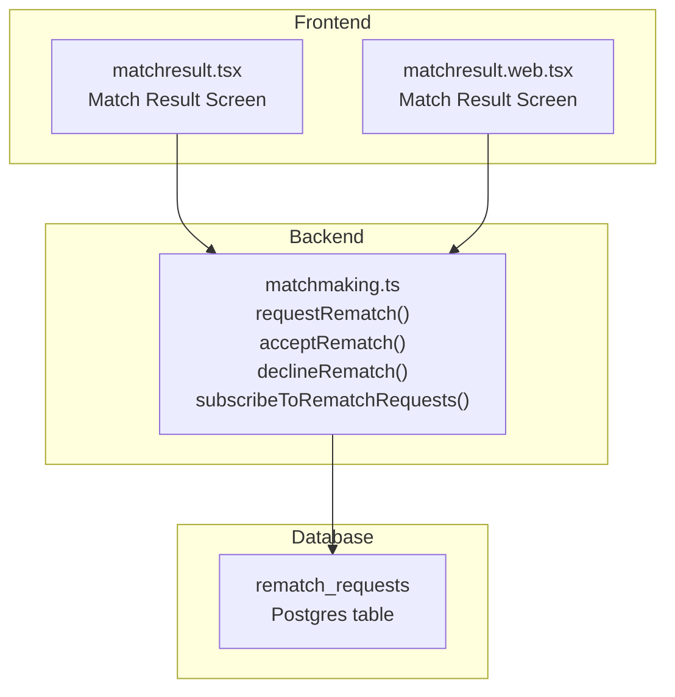
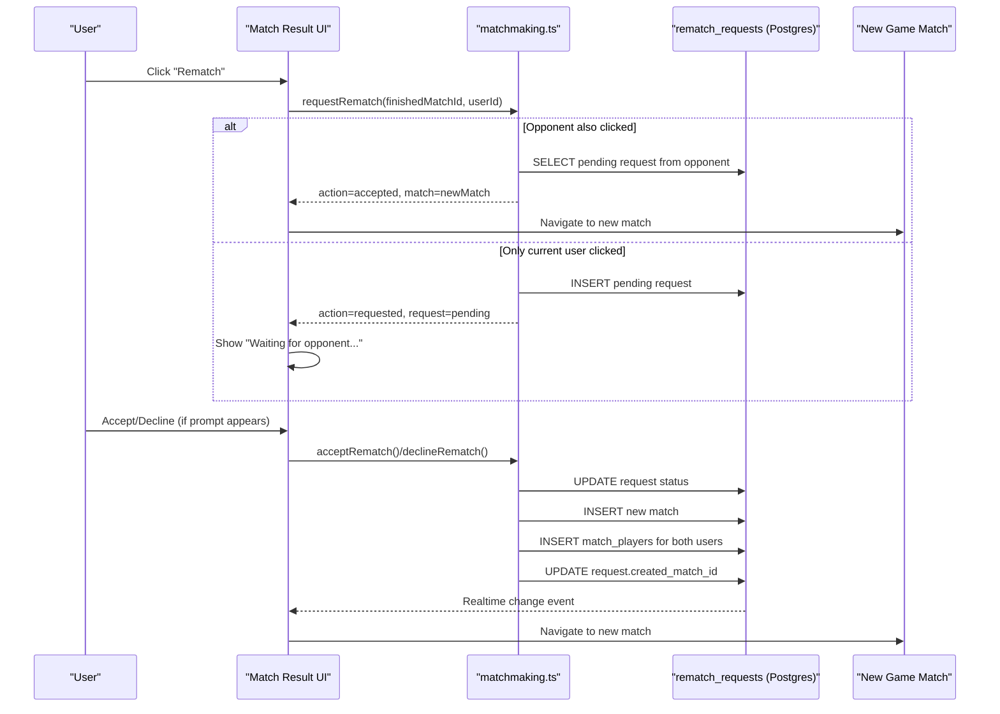
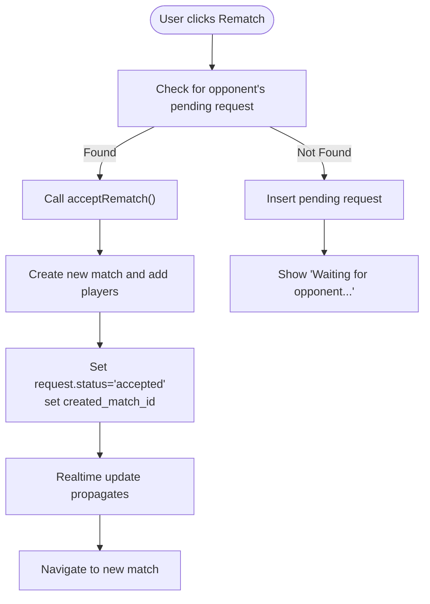
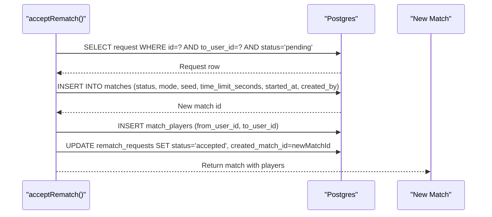
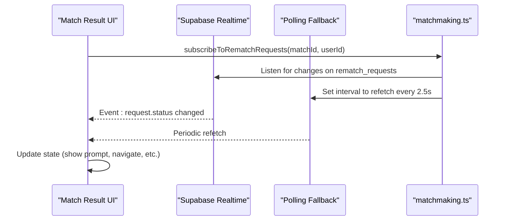
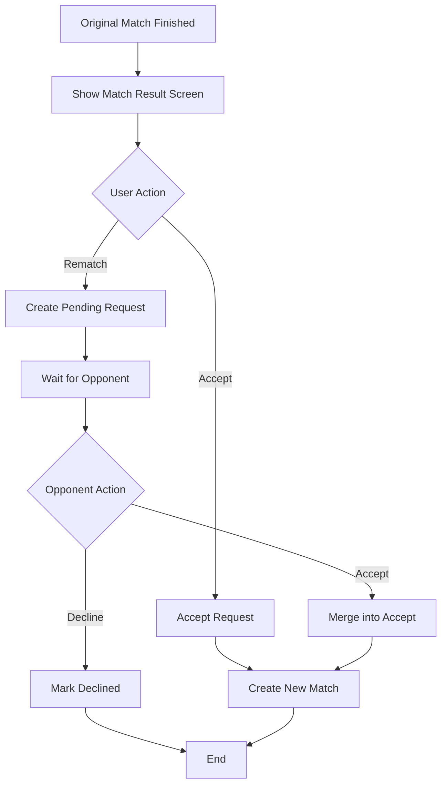
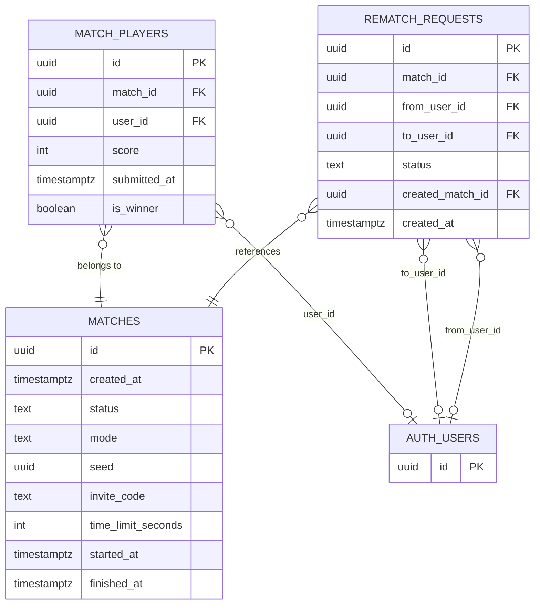

# Rematch System

<cite>
**Referenced Files in This Document**
- [rematch_requests.sql](file://supabase/migrations/20250205500000_rematch_requests.sql)
- [matchmaking.ts](file://lib/matchmaking.ts)
- [matchresult.tsx](file://app/(tabs)/matchresult.tsx)
- [matchresult.web.tsx](file://app/(tabs)/matchresult.web.tsx)
- [notifications.sql](file://supabase/migrations/20250206110000_notifications.sql)
- [notifications.ts](file://lib/notifications.ts)
- [MULTIPLAYER_ROADMAP.md](file://MULTIPLAYER_ROADMAP.md)
</cite>

## Table of Contents
1. [Introduction](#introduction)
2. [Project Structure](#project-structure)
3. [Core Components](#core-components)
4. [Architecture Overview](#architecture-overview)
5. [Detailed Component Analysis](#detailed-component-analysis)
6. [Dependency Analysis](#dependency-analysis)
7. [Performance Considerations](#performance-considerations)
8. [Troubleshooting Guide](#troubleshooting-guide)
9. [Conclusion](#conclusion)

## Introduction
This document explains the rematch system that enables post-match replay functionality. It covers the complete lifecycle from initiating a rematch to automatically creating a new match when accepted, including the dual-click scenario where both players click simultaneously. It also documents the rematch_requests table structure, status management, real-time notifications, UI integration, and the relationship between original match completion and new match creation.

## Project Structure
The rematch system spans three layers:
- Database schema: Supabase Postgres table and policies for rematch_requests
- Backend logic: TypeScript functions in matchmaking.ts that encapsulate request creation, acceptance, and subscription
- Frontend UI: React components in matchresult.tsx and matchresult.web.tsx that render prompts, handle user actions, and react to real-time updates

**Diagram sources**
- [rematch_requests.sql](file://supabase/migrations/20250205500000_rematch_requests.sql#L4-L12)
- [matchmaking.ts](file://lib/matchmaking.ts#L366-L511)
- [matchresult.tsx](file://app/(tabs)/matchresult.tsx#L69-L91)
- [matchresult.web.tsx](file://app/(tabs)/matchresult.web.tsx#L63-L85)

**Section sources**
- [rematch_requests.sql](file://supabase/migrations/20250205500000_rematch_requests.sql#L1-L37)
- [matchmaking.ts](file://lib/matchmaking.ts#L366-L511)
- [matchresult.tsx](file://app/(tabs)/matchresult.tsx#L26-L144)
- [matchresult.web.tsx](file://app/(tabs)/matchresult.web.tsx#L20-L137)

## Core Components
- rematch_requests table: Stores per-match rematch requests with status and links to the newly created match
- requestRematch(): Creates a request or merges with an existing pending request from the opponent
- acceptRematch(): Creates a new match and adds both players when a request is accepted
- declineRematch(): Marks a request as declined
- subscribeToRematchRequests(): Real-time subscription with polling fallback for reliable updates
- Match Result UI: Renders prompts, handles user actions, and navigates to the new match

**Section sources**
- [rematch_requests.sql](file://supabase/migrations/20250205500000_rematch_requests.sql#L4-L12)
- [matchmaking.ts](file://lib/matchmaking.ts#L366-L464)
- [matchmaking.ts](file://lib/matchmaking.ts#L470-L511)
- [matchresult.tsx](file://app/(tabs)/matchresult.tsx#L69-L144)
- [matchresult.web.tsx](file://app/(tabs)/matchresult.web.tsx#L63-L137)

## Architecture Overview
The rematch flow integrates frontend UI, backend logic, and database events. When a match finishes, the UI subscribes to rematch_requests for that match. Initiating a rematch either creates a pending request or detects a simultaneous request from the opponent and accepts it immediately. Accepting a request triggers the creation of a new match and updates the request’s status and created_match_id.

**Diagram sources**
- [matchmaking.ts](file://lib/matchmaking.ts#L366-L464)
- [matchmaking.ts](file://lib/matchmaking.ts#L470-L511)
- [matchresult.tsx](file://app/(tabs)/matchresult.tsx#L97-L143)
- [matchresult.web.tsx](file://app/(tabs)/matchresult.web.tsx#L91-L137)

## Detailed Component Analysis

### Rematch Requests Table
The rematch_requests table captures the intent to replay a completed match and tracks the outcome of that intent.

- Columns and constraints:
  - id: UUID primary key
  - match_id: References matches(id), cascade delete ensures cleanup when a match is removed
  - from_user_id, to_user_id: References auth.users(id), cascade delete maintains referential integrity
  - status: Enumerated value restricted to pending, accepted, declined via check constraint
  - created_match_id: Optional reference to the newly created match (on accept)
  - created_at: Timestamp for ordering and diagnostics

- Indexes:
  - Composite index on (match_id, from_user_id, to_user_id) supports lookup by match and pairing
  - Partial index on (to_user_id, status) where status = 'pending' optimizes queries for active prompts

- Row-level security:
  - Users can read requests where they participated (from_user_id or to_user_id equals auth.uid())
  - Users can insert requests where from_user_id equals auth.uid()
  - Users can update requests where to_user_id equals auth.uid. (i.e., accept/decline)

- Realtime:
  - Supabase replication publication should include rematch_requests for live updates

**Section sources**
- [rematch_requests.sql](file://supabase/migrations/20250205500000_rematch_requests.sql#L4-L12)
- [rematch_requests.sql](file://supabase/migrations/20250205500000_rematch_requests.sql#L14-L15)
- [rematch_requests.sql](file://supabase/migrations/20250205500000_rematch_requests.sql#L17-L36)

### Dual-Click Scenario (Both Players Simultaneously)
The system detects when both players click “Rematch” at nearly the same time and merges into a single accepted request, immediately creating a new match.

- Detection:
  - requestRematch() first checks for an existing pending request from the opponent for the same finished match
  - If found, it calls acceptRematch() directly, avoiding duplicate requests

- Acceptance:
  - acceptRematch() validates the request is still pending and belongs to the acting user
  - Creates a new match with mode race, random seed, and time limit
  - Adds both players to match_players
  - Updates the original request to accepted and sets created_match_id

**Diagram sources**
- [matchmaking.ts](file://lib/matchmaking.ts#L366-L404)
- [matchmaking.ts](file://lib/matchmaking.ts#L409-L450)

**Section sources**
- [matchmaking.ts](file://lib/matchmaking.ts#L366-L404)
- [matchmaking.ts](file://lib/matchmaking.ts#L409-L450)

### Automatic Match Creation on Acceptance
When a request is accepted, the system performs:
- Validation: Ensures the request exists, is pending, and belongs to the acting user
- New match creation: Inserts a new record into matches with appropriate defaults
- Player enrollment: Inserts both users into match_players
- Request finalization: Updates the request to accepted and records the new match id

**Diagram sources**
- [matchmaking.ts](file://lib/matchmaking.ts#L409-L450)

**Section sources**
- [matchmaking.ts](file://lib/matchmaking.ts#L409-L450)

### Request Lifecycle and Status Management
- Pending: Initial state when a user requests a rematch
- Accepted: Set when acceptRematch() completes successfully
- Declined: Set when declineRematch() is called by the target user

Status transitions are enforced by:
- requestRematch(): Only inserts pending requests
- acceptRematch(): Requires status pending and to_user_id match
- declineRematch(): Requires status pending and to_user_id match

**Section sources**
- [matchmaking.ts](file://lib/matchmaking.ts#L366-L464)

### Request Expiration and Cleanup
- Expiration: There is no explicit expiration mechanism for rematch_requests in the current implementation. Requests remain in the database indefinitely until updated to accepted or declined.
- Cleanup: No automated cleanup routine is present. The table relies on manual updates and cascade deletes when related matches are removed.

Note: The roadmap mentions debugging and reliability improvements for rematch subscriptions and race conditions, but does not specify explicit request expiration or cleanup.

**Section sources**
- [matchmaking.ts](file://lib/matchmaking.ts#L366-L464)
- [MULTIPLAYER_ROADMAP.md](file://MULTIPLAYER_ROADMAP.md#L9-L17)

### Real-Time Subscription and UI Integration
- Subscription:
  - subscribeToRematchRequests() establishes a Supabase Realtime channel filtered by match_id
  - Includes a polling fallback that periodically refetches recent requests to ensure reliability
  - Returns an unsubscribe function to clean up resources

- UI behavior:
  - On receiving a pending request for the current user, the UI displays a prompt with Accept/Decline actions
  - On receiving a declined request, the UI shows a notification and navigates back after a delay
  - On receiving an accepted request with created_match_id, the UI navigates to the new match

**Diagram sources**
- [matchmaking.ts](file://lib/matchmaking.ts#L470-L511)
- [matchresult.tsx](file://app/(tabs)/matchresult.tsx#L69-L91)
- [matchresult.web.tsx](file://app/(tabs)/matchresult.web.tsx#L63-L85)

**Section sources**
- [matchmaking.ts](file://lib/matchmaking.ts#L470-L511)
- [matchresult.tsx](file://app/(tabs)/matchresult.tsx#L69-L91)
- [matchresult.web.tsx](file://app/(tabs)/matchresult.web.tsx#L63-L85)

### Relationship Between Original Match Completion and New Match Creation
- Original match completion:
  - Matches are marked finished when both players submit scores or when time expires
  - The match result screen is shown to both players

- New match creation:
  - Triggered only by accepting a rematch request
  - The new match inherits key attributes (mode, time limit) and starts immediately

**Diagram sources**
- [matchmaking.ts](file://lib/matchmaking.ts#L322-L338)
- [matchmaking.ts](file://lib/matchmaking.ts#L366-L464)
- [matchresult.tsx](file://app/(tabs)/matchresult.tsx#L97-L143)

**Section sources**
- [matchmaking.ts](file://lib/matchmaking.ts#L322-L338)
- [matchmaking.ts](file://lib/matchmaking.ts#L366-L464)

### Example Workflows

#### Single Click Workflow
- User A clicks Rematch after match completion
- System inserts a pending request
- User B receives a real-time prompt and can Accept or Decline
- If accepted, a new match is created and both users are enrolled

#### Dual-Click Workflow
- Both users click Rematch nearly simultaneously
- requestRematch() detects the opponent’s pending request and calls acceptRematch() immediately
- A new match is created and both users are enrolled without showing a prompt

#### Declined Workflow
- User A requests a rematch
- User B declines
- The UI shows a declined notification and navigates back to the lobby after a short delay

**Section sources**
- [matchmaking.ts](file://lib/matchmaking.ts#L366-L464)
- [matchresult.tsx](file://app/(tabs)/matchresult.tsx#L97-L143)
- [matchresult.web.tsx](file://app/(tabs)/matchresult.web.tsx#L91-L137)

## Dependency Analysis
The rematch system depends on:
- Supabase Postgres for storing rematch_requests and enforcing RLS
- Supabase Realtime for live updates to the UI
- match_players and matches tables for linking users to matches and managing match state
- auth.users for identity and RLS enforcement

**Diagram sources**
- [rematch_requests.sql](file://supabase/migrations/20250205500000_rematch_requests.sql#L4-L12)
- [matchmaking.ts](file://lib/matchmaking.ts#L170-L187)

**Section sources**
- [rematch_requests.sql](file://supabase/migrations/20250205500000_rematch_requests.sql#L4-L12)
- [matchmaking.ts](file://lib/matchmaking.ts#L170-L187)

## Performance Considerations
- Realtime + Polling: The subscription uses both Supabase Realtime and periodic polling to ensure updates arrive even if Realtime is unreliable
- Indexes: Composite and partial indexes optimize lookups for match-specific requests and pending prompts
- Atomicity: While the core rematch flow is robust, the roadmap highlights ongoing work to improve atomicity in concurrent matchmaking scenarios

**Section sources**
- [matchmaking.ts](file://lib/matchmaking.ts#L470-L511)
- [rematch_requests.sql](file://supabase/migrations/20250205500000_rematch_requests.sql#L14-L15)
- [MULTIPLAYER_ROADMAP.md](file://MULTIPLAYER_ROADMAP.md#L13-L17)

## Troubleshooting Guide
- Realtime not firing:
  - Verify that the rematch_requests table is included in the Supabase realtime publication
  - Confirm the subscription filters match the current matchId and userId
- Race condition on dual click:
  - The system merges requests when both users click quickly; ensure acceptRematch() is invoked when an existing pending request is detected
- Navigation issues:
  - After acceptance, the UI navigates to the new match using created_match_id; confirm the request was updated and the UI subscribed to changes
- Declined requests:
  - The UI shows a declined notification and returns to the lobby; ensure the subscription detects status changes and invokes the appropriate handler

**Section sources**
- [matchmaking.ts](file://lib/matchmaking.ts#L470-L511)
- [matchresult.tsx](file://app/(tabs)/matchresult.tsx#L69-L91)
- [matchresult.web.tsx](file://app/(tabs)/matchresult.web.tsx#L63-L85)

## Conclusion
The rematch system provides a robust foundation for post-match replays. It supports both single and dual-click initiation, manages request lifecycles with clear status transitions, and leverages Supabase Realtime with a polling fallback for reliable UI updates. New matches are created atomically upon acceptance, and the UI integrates seamlessly with these events. Future enhancements may include request expiration and automated cleanup, as noted in the roadmap.