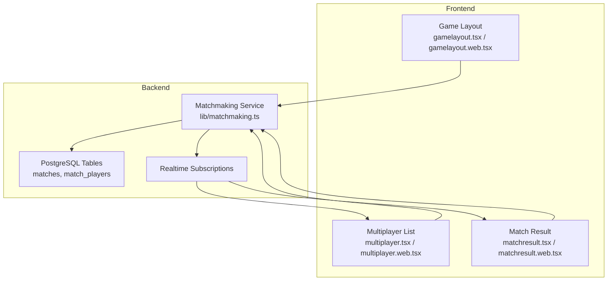
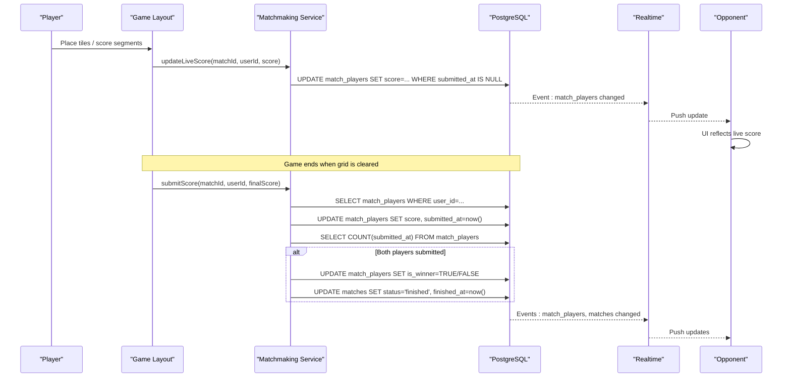
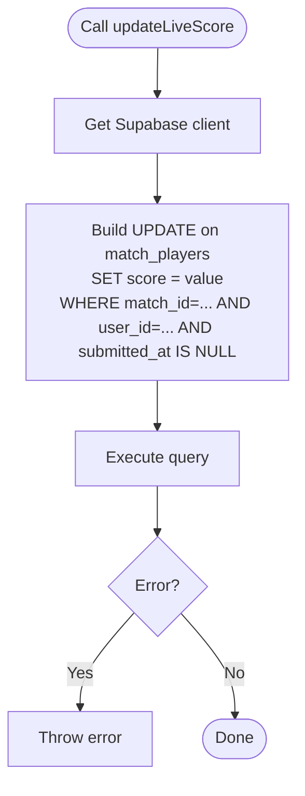
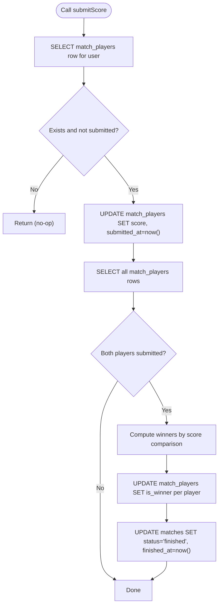
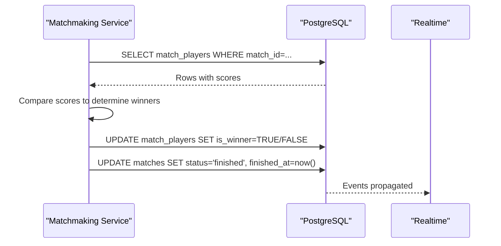
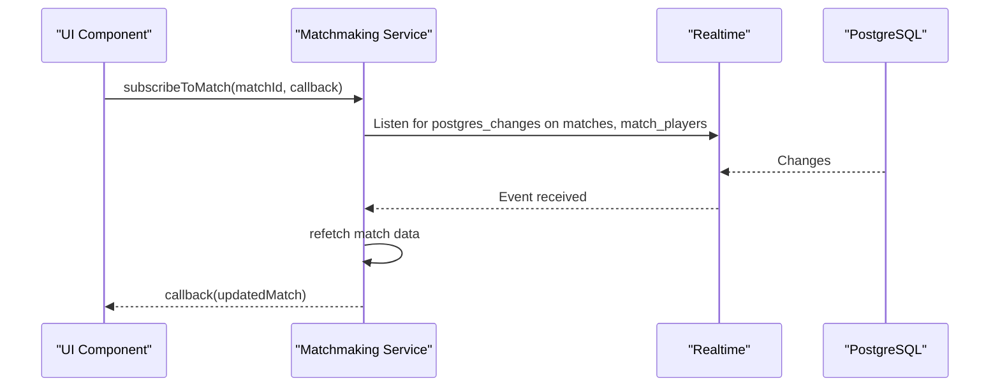
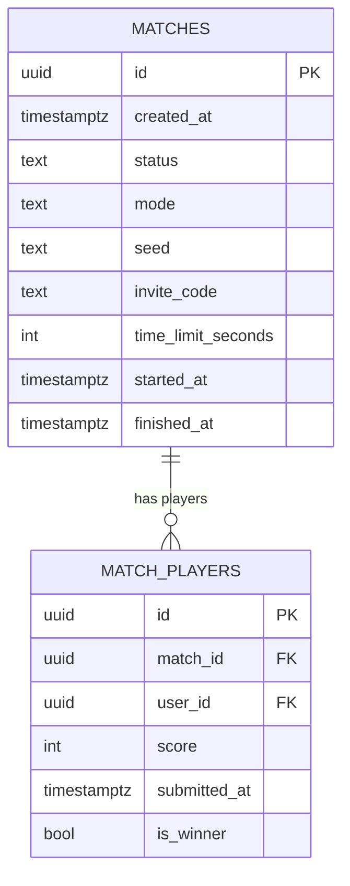
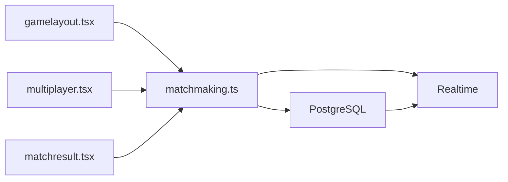

# Score Management

<cite>
**Referenced Files in This Document**
- [matchmaking.ts](file://lib/matchmaking.ts)
- [multiplayer.tsx](file://app/(tabs)/multiplayer.tsx)
- [multiplayer.web.tsx](file://app/(tabs)/multiplayer.web.tsx)
- [matchresult.tsx](file://app/(tabs)/matchresult.tsx)
- [matchresult.web.tsx](file://app/(tabs)/matchresult.web.tsx)
- [gamelayout.tsx](file://app/(tabs)/gamelayout.tsx)
- [gamelayout.web.tsx](file://app/(tabs)/gamelayout.web.tsx)
- [20250205000000_multiplayer_tables.sql](file://supabase/migrations/20250205000000_multiplayer_tables.sql)
- [20250205400000_abandoned_match_cancel.sql](file://supabase/migrations/20250205400000_abandoned_match_cancel.sql)
- [20250206000000_atomic_quick_match.sql](file://supabase/migrations/20250206000000_atomic_quick_match.sql)
</cite>

## Table of Contents
1. [Introduction](#introduction)
2. [Project Structure](#project-structure)
3. [Core Components](#core-components)
4. [Architecture Overview](#architecture-overview)
5. [Detailed Component Analysis](#detailed-component-analysis)
6. [Dependency Analysis](#dependency-analysis)
7. [Performance Considerations](#performance-considerations)
8. [Troubleshooting Guide](#troubleshooting-guide)
9. [Conclusion](#conclusion)

## Introduction
This document explains the scoring system for multiplayer matches, focusing on:
- Live score updates during gameplay
- Final score submission and duplicate prevention
- Automatic winner determination and match completion
- Real-time synchronization and data consistency
- Edge cases such as abandoned matches and timeouts

## Project Structure
The scoring system spans frontend game logic and backend data persistence:
- Frontend triggers live and final score updates
- Backend persists scores, enforces constraints, and computes match outcomes
- Realtime channels propagate updates to opponents

**Diagram sources**
- [gamelayout.tsx](file://app/(tabs)/gamelayout.tsx#L32-L33)
- [gamelayout.web.tsx](file://app/(tabs)/gamelayout.web.tsx#L22-L23)
- [multiplayer.tsx](file://app/(tabs)/multiplayer.tsx#L102-L120)
- [multiplayer.web.tsx](file://app/(tabs)/multiplayer.web.tsx#L115-L133)
- [matchresult.tsx](file://app/(tabs)/matchresult.tsx#L26-L67)
- [matchresult.web.tsx](file://app/(tabs)/matchresult.web.tsx#L20-L61)
- [matchmaking.ts](file://lib/matchmaking.ts#L204-L247)
- [20250205000000_multiplayer_tables.sql](file://supabase/migrations/20250205000000_multiplayer_tables.sql#L3-L31)

**Section sources**
- [gamelayout.tsx](file://app/(tabs)/gamelayout.tsx#L32-L33)
- [gamelayout.web.tsx](file://app/(tabs)/gamelayout.web.tsx#L22-L23)
- [multiplayer.tsx](file://app/(tabs)/multiplayer.tsx#L102-L120)
- [multiplayer.web.tsx](file://app/(tabs)/multiplayer.web.tsx#L115-L133)
- [matchresult.tsx](file://app/(tabs)/matchresult.tsx#L26-L67)
- [matchresult.web.tsx](file://app/(tabs)/matchresult.web.tsx#L20-L61)
- [matchmaking.ts](file://lib/matchmaking.ts#L204-L247)
- [20250205000000_multiplayer_tables.sql](file://supabase/migrations/20250205000000_multiplayer_tables.sql#L3-L31)

## Core Components
- Live score updates: updateLiveScore writes the current score to match_players when the player has not yet submitted
- Final score submission: submitScore validates participation, prevents duplicate submissions, and upon both players submitting, determines winners and finishes the match
- Realtime synchronization: subscribeToMatch listens for changes to matches and match_players, keeping UIs in sync
- Winner determination: automatic comparison of scores when both players submit
- Match completion: sets match status to finished and records finished_at

**Section sources**
- [matchmaking.ts](file://lib/matchmaking.ts#L253-L266)
- [matchmaking.ts](file://lib/matchmaking.ts#L271-L327)
- [matchmaking.ts](file://lib/matchmaking.ts#L204-L247)

## Architecture Overview
The scoring lifecycle connects game events to backend persistence and realtime propagation.

**Diagram sources**
- [gamelayout.tsx](file://app/(tabs)/gamelayout.tsx#L1038-L1057)
- [gamelayout.web.tsx](file://app/(tabs)/gamelayout.web.tsx#L1099-L1127)
- [matchmaking.ts](file://lib/matchmaking.ts#L253-L266)
- [matchmaking.ts](file://lib/matchmaking.ts#L271-L327)
- [20250205000000_multiplayer_tables.sql](file://supabase/migrations/20250205000000_multiplayer_tables.sql#L15-L23)

## Detailed Component Analysis

### Live Score Updates (updateLiveScore)
Purpose:
- Allow real-time score synchronization during gameplay
- Only applies when the player has not submitted yet

Behavior:
- Updates the current user’s score in match_players
- Enforces that submitted_at is null using a database filter
- Throws on error to surface failures

**Diagram sources**
- [matchmaking.ts](file://lib/matchmaking.ts#L253-L266)

**Section sources**
- [matchmaking.ts](file://lib/matchmaking.ts#L253-L266)
- [gamelayout.tsx](file://app/(tabs)/gamelayout.tsx#L1038-L1042)
- [gamelayout.web.tsx](file://app/(tabs)/gamelayout.web.tsx#L1099-L1102)

### Final Score Submission (submitScore)
Purpose:
- Persist the final score when the game ends
- Prevent duplicate submissions
- Automatically finish the match when both players submit

Key steps:
- Verify the user participates in the match
- Skip if already submitted
- Write score and submitted_at timestamp
- After writing, check if both players submitted
- If yes, compute winners and finish the match

**Diagram sources**
- [matchmaking.ts](file://lib/matchmaking.ts#L271-L327)
- [20250205000000_multiplayer_tables.sql](file://supabase/migrations/20250205000000_multiplayer_tables.sql#L15-L23)

**Section sources**
- [matchmaking.ts](file://lib/matchmaking.ts#L271-L327)
- [gamelayout.tsx](file://app/(tabs)/gamelayout.tsx#L1052-L1057)
- [gamelayout.web.tsx](file://app/(tabs)/gamelayout.web.tsx#L1122-L1127)

### Automatic Winner Determination and Match Completion
Logic:
- When both players submit, the system selects the two players with scores
- Compares their scores to decide winners
- Sets is_winner for each player accordingly
- Marks the match as finished with finished_at timestamp

**Diagram sources**
- [matchmaking.ts](file://lib/matchmaking.ts#L304-L326)
- [20250205000000_multiplayer_tables.sql](file://supabase/migrations/20250205000000_multiplayer_tables.sql#L15-L23)

**Section sources**
- [matchmaking.ts](file://lib/matchmaking.ts#L304-L326)

### Real-Time Synchronization (subscribeToMatch)
Purpose:
- Keep the UI synchronized with live score updates and match state changes

Behavior:
- Subscribes to Realtime events for matches and match_players
- On change, refetches match data and invokes the callback

**Diagram sources**
- [matchmaking.ts](file://lib/matchmaking.ts#L204-L247)

**Section sources**
- [matchmaking.ts](file://lib/matchmaking.ts#L204-L247)
- [multiplayer.tsx](file://app/(tabs)/multiplayer.tsx#L102-L120)
- [multiplayer.web.tsx](file://app/(tabs)/multiplayer.web.tsx#L115-L133)
- [matchresult.tsx](file://app/(tabs)/matchresult.tsx#L26-L67)
- [matchresult.web.tsx](file://app/(tabs)/matchresult.web.tsx#L20-L61)

### Data Model and Constraints
Tables and policies:
- matches: tracks match lifecycle and status
- match_players: stores per-player score, submission state, and winner flag
- Row-level security policies restrict access to participants
- Unique constraint ensures one player per match

**Diagram sources**
- [20250205000000_multiplayer_tables.sql](file://supabase/migrations/20250205000000_multiplayer_tables.sql#L3-L31)

**Section sources**
- [20250205000000_multiplayer_tables.sql](file://supabase/migrations/20250205000000_multiplayer_tables.sql#L3-L31)

## Dependency Analysis
- Frontend depends on matchmaking service for score operations
- Matchmaking service depends on Supabase client and database tables
- Realtime bridges database changes to UI components
- Database constraints and policies enforce data integrity

**Diagram sources**
- [gamelayout.tsx](file://app/(tabs)/gamelayout.tsx#L32-L33)
- [multiplayer.tsx](file://app/(tabs)/multiplayer.tsx#L102-L120)
- [matchresult.tsx](file://app/(tabs)/matchresult.tsx#L26-L67)
- [matchmaking.ts](file://lib/matchmaking.ts#L204-L247)
- [20250205000000_multiplayer_tables.sql](file://supabase/migrations/20250205000000_multiplayer_tables.sql#L3-L31)

**Section sources**
- [gamelayout.tsx](file://app/(tabs)/gamelayout.tsx#L32-L33)
- [multiplayer.tsx](file://app/(tabs)/multiplayer.tsx#L102-L120)
- [matchresult.tsx](file://app/(tabs)/matchresult.tsx#L26-L67)
- [matchmaking.ts](file://lib/matchmaking.ts#L204-L247)
- [20250205000000_multiplayer_tables.sql](file://supabase/migrations/20250205000000_multiplayer_tables.sql#L3-L31)

## Performance Considerations
- Live updates are lightweight: single-row UPDATE with equality filters
- Final submission performs minimal reads and writes; winner computation is O(1) per player
- Realtime subscriptions reduce polling overhead and keep UI responsive
- Database indexes on match_id and user_id optimize lookups

[No sources needed since this section provides general guidance]

## Troubleshooting Guide
Common issues and resolutions:
- Duplicate submission prevention
  - submitScore checks submitted_at and returns early if already submitted
  - Ensure callers guard against repeated submissions
- Invalid participant
  - submitScore throws if the user is not part of the match
  - Verify match ownership before calling submitScore
- Abandoned matches
  - Matches with status 'waiting' and fewer than 2 players are auto-cancelled after a timeout
  - Such matches will not accept further score updates
- Player timeout
  - While there is no explicit per-player timeout in the scoring logic, abandoned match cancellation can end matches prematurely
- Realtime delays
  - subscribeToMatch uses Realtime plus periodic polling for reliability; expect near-real-time updates

**Section sources**
- [matchmaking.ts](file://lib/matchmaking.ts#L271-L327)
- [20250205400000_abandoned_match_cancel.sql](file://supabase/migrations/20250205400000_abandoned_match_cancel.sql#L18-L30)
- [matchmaking.ts](file://lib/matchmaking.ts#L204-L247)

## Conclusion
The scoring system combines efficient frontend-driven live updates with robust backend persistence and real-time propagation. It prevents duplicate submissions, automatically determines winners when both players submit, and marks matches as finished. Database constraints and policies maintain data integrity, while Realtime ensures synchronized UI updates for both players.