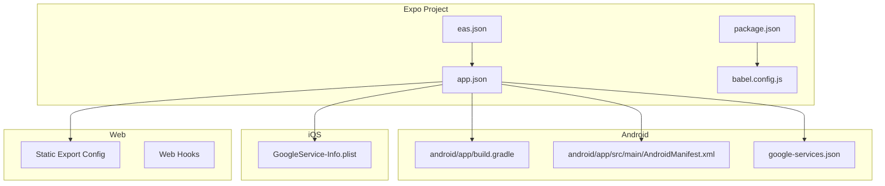
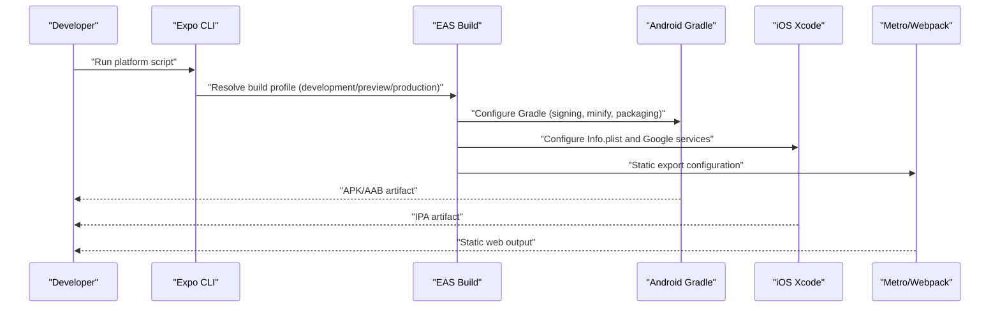
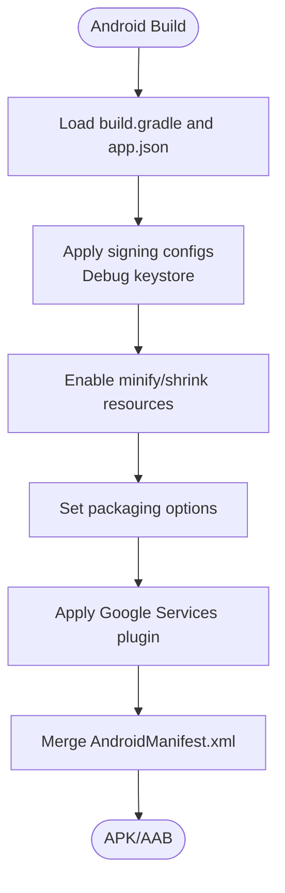
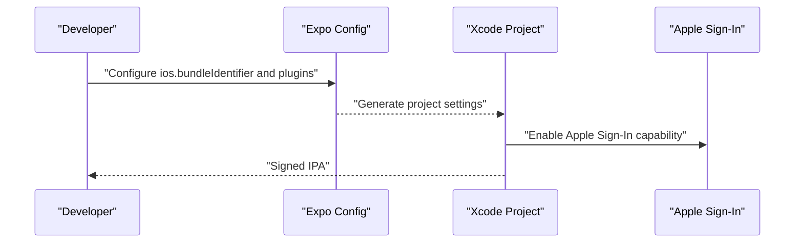
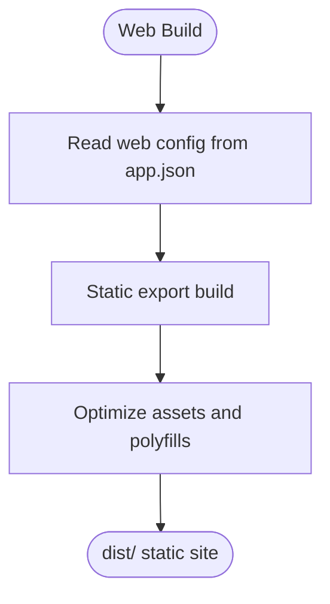
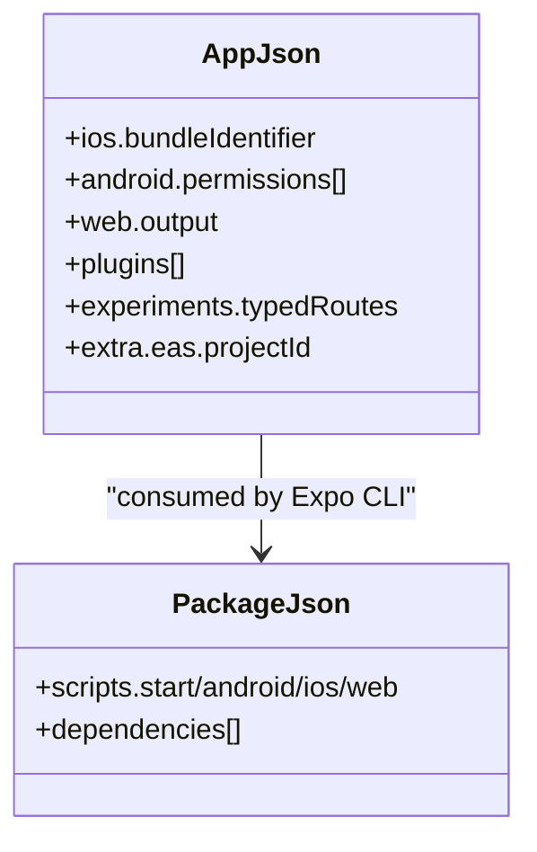
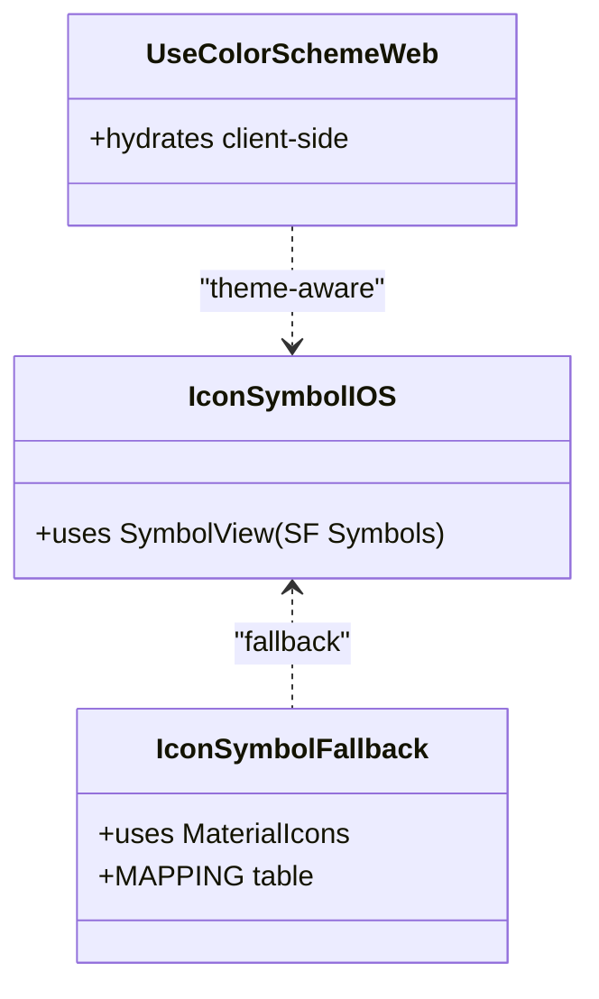
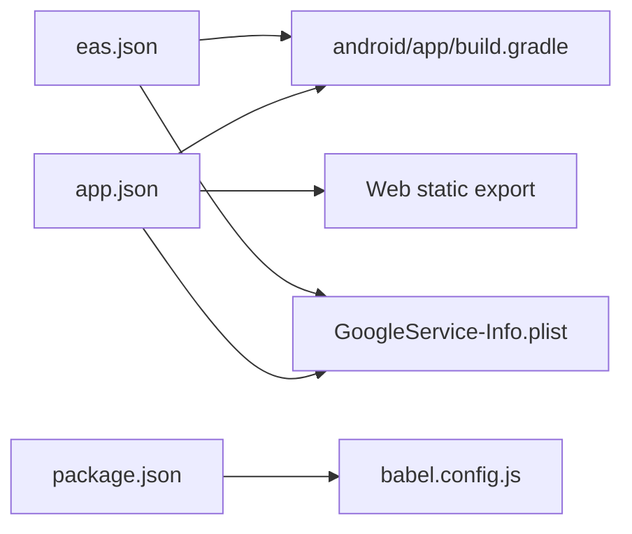

# Platform-Specific Features

<cite>
**Referenced Files in This Document**
- [app.json](file://app.json)
- [package.json](file://package.json)
- [android/app/build.gradle](file://android/app/build.gradle)
- [android/app/src/main/AndroidManifest.xml](file://android/app/src/main/AndroidManifest.xml)
- [eas.json](file://eas.json)
- [GoogleService-Info.plist](file://GoogleService-Info.plist)
- [google-services.json](file://google-services.json)
- [babel.config.js](file://babel.config.js)
- [components/ui/icon-symbol.ios.tsx](file://components/ui/icon-symbol.ios.tsx)
- [components/ui/icon-symbol.tsx](file://components/ui/icon-symbol.tsx)
- [hooks/use-color-scheme.web.ts](file://hooks/use-color-scheme.web.ts)
- [hooks/use-color-scheme.ts](file://hooks/use-color-scheme.ts)
- [.github/workflows/build-apk.yml](file://.github/workflows/build-apk.yml)
- [screens/loadscreen.native.js](file://screens/loadscreen.native.js)
- [screens/loadscreen.web.js](file://screens/loadscreen.web.js)
- [app/(tabs)/index.web.tsx](file://app/(tabs)/index.web.tsx)
- [app/(tabs)/main.web.tsx](file://app/(tabs)/main.web.tsx)
- [app/(tabs)/friends.web.tsx](file://app/(tabs)/friends.web.tsx)
- [app/(tabs)/multiplayer.web.tsx](file://app/(tabs)/multiplayer.web.tsx)
- [app/(tabs)/matchwaiting.web.tsx](file://app/(tabs)/matchwaiting.web.tsx)
- [app/(tabs)/matchresult.web.tsx](file://app/(tabs)/matchresult.web.tsx)
- [app/(tabs)/notifications.web.tsx](file://app/(tabs)/notifications.web.tsx)
- [app/(tabs)/profile.web.tsx](file://app/(tabs)/profile.web.tsx)
- [app/(tabs)/addfriend.web.tsx](file://app/(tabs)/addfriend.web.tsx)
- [app/(tabs)/signup.web.tsx](file://app/(tabs)/signup.web.tsx)
</cite>

## Table of Contents
1. [Introduction](#introduction)
2. [Project Structure](#project-structure)
3. [Core Components](#core-components)
4. [Architecture Overview](#architecture-overview)
5. [Detailed Component Analysis](#detailed-component-analysis)
6. [Dependency Analysis](#dependency-analysis)
7. [Performance Considerations](#performance-considerations)
8. [Troubleshooting Guide](#troubleshooting-guide)
9. [Conclusion](#conclusion)
10. [Appendices](#appendices)

## Introduction
This document explains platform-specific features for Palindrome across Android, iOS, Web, and Expo/EAS build systems. It covers Gradle configuration and signing on Android, iOS configuration and Apple Sign-In, web platform static export and PWA characteristics, Expo configuration and native module integration, responsive design patterns, platform-specific interactions, performance considerations, debugging techniques, testing strategies, and deployment processes.

## Project Structure
The repository is an Expo-based React Native project with platform-specific folders and configuration files:
- Android: Gradle build, manifest, signing, and Firebase/Google Services configuration
- iOS: Info and Google Services configuration via plist
- Web: Static export configuration and web-specific UI hooks
- Expo/EAS: app.json configuration, EAS build profiles, and scripts

**Diagram sources**
- [app.json](file://app.json#L1-L94)
- [package.json](file://package.json#L1-L68)
- [babel.config.js](file://babel.config.js#L1-L8)
- [eas.json](file://eas.json#L1-L25)
- [android/app/build.gradle](file://android/app/build.gradle#L1-L184)
- [android/app/src/main/AndroidManifest.xml](file://android/app/src/main/AndroidManifest.xml#L1-L33)
- [google-services.json](file://google-services.json#L1-L54)
- [GoogleService-Info.plist](file://GoogleService-Info.plist#L1-L32)

**Section sources**
- [app.json](file://app.json#L1-L94)
- [package.json](file://package.json#L1-L68)
- [android/app/build.gradle](file://android/app/build.gradle#L1-L184)
- [android/app/src/main/AndroidManifest.xml](file://android/app/src/main/AndroidManifest.xml#L1-L33)
- [eas.json](file://eas.json#L1-L25)
- [google-services.json](file://google-services.json#L1-L54)
- [GoogleService-Info.plist](file://GoogleService-Info.plist#L1-L32)
- [babel.config.js](file://babel.config.js#L1-L8)

## Core Components
- Expo configuration defines platform capabilities, plugins, and build experiments
- Android Gradle config manages signing, minification, packaging options, and Google services
- iOS configuration integrates Google services and Apple Sign-In
- Web static export and web-specific hooks adapt UI for browsers
- EAS build profiles automate development, preview, and production builds

**Section sources**
- [app.json](file://app.json#L1-L94)
- [android/app/build.gradle](file://android/app/build.gradle#L100-L133)
- [android/app/src/main/AndroidManifest.xml](file://android/app/src/main/AndroidManifest.xml#L1-L33)
- [GoogleService-Info.plist](file://GoogleService-Info.plist#L1-L32)
- [eas.json](file://eas.json#L1-L25)

## Architecture Overview
The platform pipeline integrates Expo configuration with platform-specific build and runtime environments. The following diagram maps configuration to build artifacts and runtime behavior.

**Diagram sources**
- [app.json](file://app.json#L1-L94)
- [eas.json](file://eas.json#L1-L25)
- [android/app/build.gradle](file://android/app/build.gradle#L100-L133)
- [android/app/src/main/AndroidManifest.xml](file://android/app/src/main/AndroidManifest.xml#L1-L33)
- [GoogleService-Info.plist](file://GoogleService-Info.plist#L1-L32)

## Detailed Component Analysis

### Android Integration
- Gradle configuration
  - Signing: debug signing configured; release uses debug keystore by default
  - Minification and resource shrinking controlled by Gradle properties
  - Packaging options configurable via Gradle properties
  - Hermes/JSC selection handled dynamically
  - Google Services plugin applied for Firebase integration
- Manifest and permissions
  - Permissions include internet, audio recording, modify audio settings, system alert window, vibration, and storage
  - Queries declare HTTPS browsing intent support
  - Activity configuration sets singleTask launch mode, orientation, and deep link scheme
- Expo plugins and build properties
  - NDK version, Kotlin version, and packaging pick-first rules configured
  - Audio plugin included for media playback
- EAS and CI
  - Preview build configured for APK distribution
  - GitHub Actions workflow present for automated APK builds

**Diagram sources**
- [android/app/build.gradle](file://android/app/build.gradle#L100-L133)
- [android/app/src/main/AndroidManifest.xml](file://android/app/src/main/AndroidManifest.xml#L1-L33)
- [app.json](file://app.json#L62-L77)

**Section sources**
- [android/app/build.gradle](file://android/app/build.gradle#L100-L133)
- [android/app/build.gradle](file://android/app/build.gradle#L155-L182)
- [android/app/src/main/AndroidManifest.xml](file://android/app/src/main/AndroidManifest.xml#L1-L33)
- [app.json](file://app.json#L62-L77)
- [eas.json](file://eas.json#L15-L17)
- [.github/workflows/build-apk.yml](file://.github/workflows/build-apk.yml)

### iOS Integration
- Bundle identifier and Google services
  - iOS bundle identifier configured
  - GoogleService-Info.plist integrated for Firebase services
- Authentication
  - Apple Sign-In enabled in app.json
- Build and plugins
  - Expo Router, Font, Apple Authentication, Google Sign-In, Splash Screen, Build Properties, and Audio plugins configured
- Permissions and entitlements
  - No explicit permissions listed in app.json; consult Xcode project settings for entitlements if needed

**Diagram sources**
- [app.json](file://app.json#L11-L19)
- [GoogleService-Info.plist](file://GoogleService-Info.plist#L1-L32)

**Section sources**
- [app.json](file://app.json#L11-L19)
- [GoogleService-Info.plist](file://GoogleService-Info.plist#L1-L32)

### Web Platform Implementation
- Static export and PWA
  - Web output configured as static export
  - Favicon and theme/background colors defined
- Browser compatibility and UI adaptations
  - Web-specific color scheme hook hydrates on client for SSR/static rendering
  - Web-specific tab pages exist alongside native counterparts
- Build and toolchain
  - Babel preset for Expo and Reanimated plugin configured

**Diagram sources**
- [app.json](file://app.json#L35-L40)
- [hooks/use-color-scheme.web.ts](file://hooks/use-color-scheme.web.ts#L1-L22)
- [babel.config.js](file://babel.config.js#L1-L8)

**Section sources**
- [app.json](file://app.json#L35-L40)
- [hooks/use-color-scheme.web.ts](file://hooks/use-color-scheme.web.ts#L1-L22)
- [babel.config.js](file://babel.config.js#L1-L8)
- [screens/loadscreen.web.js](file://screens/loadscreen.web.js)

### Expo Configuration and Native Modules
- Plugins and experiments
  - Router, font loader, Apple authentication, Google Sign-In, splash screen, build properties, and audio plugins
  - New architecture enabled and typed routes experiment enabled
- Environment and EAS project ID
  - Extra EAS project ID configured for EAS Build
- Scripts
  - Standard Expo scripts for start, android, ios, and web targets

**Diagram sources**
- [app.json](file://app.json#L1-L94)
- [package.json](file://package.json#L1-L68)

**Section sources**
- [app.json](file://app.json#L46-L82)
- [package.json](file://package.json#L5-L12)

### Platform-Specific UI Adaptations
- Native icons
  - iOS uses SF Symbols via expo-symbols; Android and web fallback to Material Icons with a manual mapping table
- Color scheme hydration
  - Web uses a hydration-aware color scheme hook to avoid SSR mismatches
- Responsive tabs
  - Web-specific tab pages exist under app/(tabs)/ with .web.tsx suffixes

**Diagram sources**
- [components/ui/icon-symbol.ios.tsx](file://components/ui/icon-symbol.ios.tsx#L1-L33)
- [components/ui/icon-symbol.tsx](file://components/ui/icon-symbol.tsx#L16-L21)
- [hooks/use-color-scheme.web.ts](file://hooks/use-color-scheme.web.ts#L1-L22)

**Section sources**
- [components/ui/icon-symbol.ios.tsx](file://components/ui/icon-symbol.ios.tsx#L1-L33)
- [components/ui/icon-symbol.tsx](file://components/ui/icon-symbol.tsx#L16-L21)
- [hooks/use-color-scheme.web.ts](file://hooks/use-color-scheme.web.ts#L1-L22)
- [hooks/use-color-scheme.ts](file://hooks/use-color-scheme.ts#L1-L8)

### Touch vs. Mouse Interactions and Responsive Patterns
- Gesture and interaction
  - react-native-gesture-handler and react-native-reanimated present; ensure proper initialization for gesture reliability
- Web responsiveness
  - Web-specific tab pages indicate platform-specific layouts
- Orientation and display
  - Android configured for portrait orientation; iOS supports tablet

**Section sources**
- [package.json](file://package.json#L46-L56)
- [android/app/src/main/AndroidManifest.xml](file://android/app/src/main/AndroidManifest.xml#L20)
- [app.json](file://app.json#L11-L13)

### Platform-Specific Performance Considerations
- Android
  - Enable minification and resource shrinking for release builds
  - Use Hermes for improved JS performance when enabled
  - Optimize packaging options to reduce binary size
- iOS
  - Ensure Apple Sign-In and Google services are optimized for minimal overhead
- Web
  - Static export reduces server complexity; leverage polyfills and asset optimization

**Section sources**
- [android/app/build.gradle](file://android/app/build.gradle#L112-L122)
- [android/app/build.gradle](file://android/app/build.gradle#L177-L181)
- [app.json](file://app.json#L46-L79)

### Platform-Specific Debugging and Testing Strategies
- Android
  - Use debug signing for development; verify manifest entries and permissions
  - Test on physical devices for audio and gesture behavior
- iOS
  - Validate Apple Sign-In flow and Google services integration
- Web
  - Verify hydration behavior and static export correctness
- EAS and CI
  - Use EAS build profiles for repeatable builds; GitHub Actions workflow automates APK builds

**Section sources**
- [android/app/build.gradle](file://android/app/build.gradle#L100-L123)
- [android/app/src/main/AndroidManifest.xml](file://android/app/src/main/AndroidManifest.xml#L1-L33)
- [eas.json](file://eas.json#L6-L19)
- [.github/workflows/build-apk.yml](file://.github/workflows/build-apk.yml)

### Deployment Considerations
- Android
  - Generate release keystore for production; update signing configs accordingly
  - Publish APK/AAB via Play Console after EAS build
- iOS
  - Archive and submit IPA via Xcode Organizer or Transporter
  - Ensure Google services and Apple Sign-In are configured for distribution
- Web
  - Deploy static output to hosting provider supporting static sites
  - Verify PWA metadata and service worker behavior if applicable

**Section sources**
- [android/app/build.gradle](file://android/app/build.gradle#L112-L123)
- [app.json](file://app.json#L35-L40)
- [eas.json](file://eas.json#L1-L25)

## Dependency Analysis
The platform configuration depends on Expo-managed Gradle and Xcode settings, with explicit plugin and build property controls.

**Diagram sources**
- [app.json](file://app.json#L1-L94)
- [package.json](file://package.json#L1-L68)
- [babel.config.js](file://babel.config.js#L1-L8)
- [eas.json](file://eas.json#L1-L25)
- [android/app/build.gradle](file://android/app/build.gradle#L1-L184)
- [GoogleService-Info.plist](file://GoogleService-Info.plist#L1-L32)

**Section sources**
- [app.json](file://app.json#L1-L94)
- [package.json](file://package.json#L1-L68)
- [babel.config.js](file://babel.config.js#L1-L8)
- [eas.json](file://eas.json#L1-L25)
- [android/app/build.gradle](file://android/app/build.gradle#L1-L184)
- [GoogleService-Info.plist](file://GoogleService-Info.plist#L1-L32)

## Performance Considerations
- Android
  - Enable minify and shrink resources for release builds
  - Choose Hermes or JSC based on performance goals
  - Optimize packaging options to reduce APK size
- iOS
  - Keep Google services and authentication lightweight
- Web
  - Favor static export for fast delivery; minimize polyfills and assets

[No sources needed since this section provides general guidance]

## Troubleshooting Guide
- Android signing and release
  - Ensure a proper release keystore is configured for production builds
- iOS Apple Sign-In
  - Confirm capability and entitlements are enabled in Xcode
- Web hydration mismatch
  - Use the hydration-aware color scheme hook for SSR/static rendering
- EAS build failures
  - Review build profiles and environment variables in EAS JSON

**Section sources**
- [android/app/build.gradle](file://android/app/build.gradle#L112-L123)
- [hooks/use-color-scheme.web.ts](file://hooks/use-color-scheme.web.ts#L1-L22)
- [eas.json](file://eas.json#L10-L19)

## Conclusion
Palindrome’s platform-specific features are driven by Expo configuration and platform build settings. Android focuses on Gradle signing and minification, iOS integrates Apple Sign-In and Google services, and the web leverages static export with hydration-aware UI. EAS profiles streamline development and production builds across platforms.

[No sources needed since this section summarizes without analyzing specific files]

## Appendices
- Web-specific tab pages demonstrate platform-specific UI adaptations
- Native loading screens differ by platform for optimal UX

**Section sources**
- [screens/loadscreen.native.js](file://screens/loadscreen.native.js)
- [screens/loadscreen.web.js](file://screens/loadscreen.web.js)
- [app/(tabs)/index.web.tsx](file://app/(tabs)/index.web.tsx)
- [app/(tabs)/main.web.tsx](file://app/(tabs)/main.web.tsx)
- [app/(tabs)/friends.web.tsx](file://app/(tabs)/friends.web.tsx)
- [app/(tabs)/multiplayer.web.tsx](file://app/(tabs)/multiplayer.web.tsx)
- [app/(tabs)/matchwaiting.web.tsx](file://app/(tabs)/matchwaiting.web.tsx)
- [app/(tabs)/matchresult.web.tsx](file://app/(tabs)/matchresult.web.tsx)
- [app/(tabs)/notifications.web.tsx](file://app/(tabs)/notifications.web.tsx)
- [app/(tabs)/profile.web.tsx](file://app/(tabs)/profile.web.tsx)
- [app/(tabs)/addfriend.web.tsx](file://app/(tabs)/addfriend.web.tsx)
- [app/(tabs)/signup.web.tsx](file://app/(tabs)/signup.web.tsx)