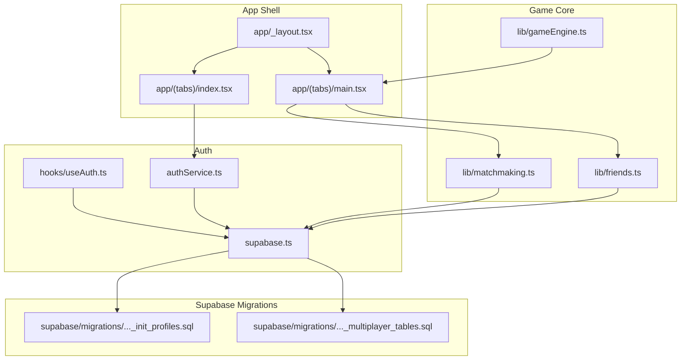
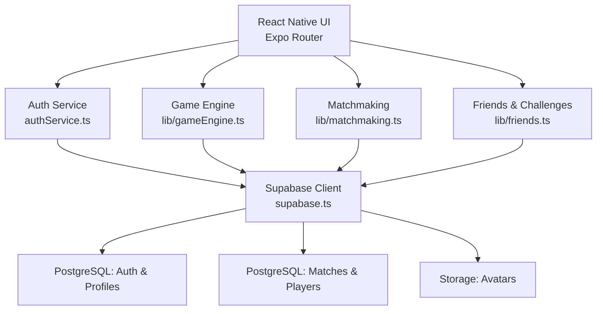
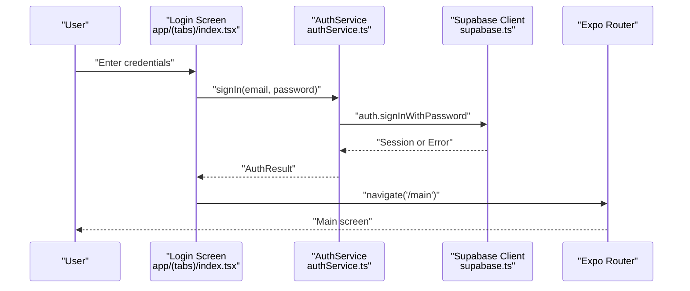
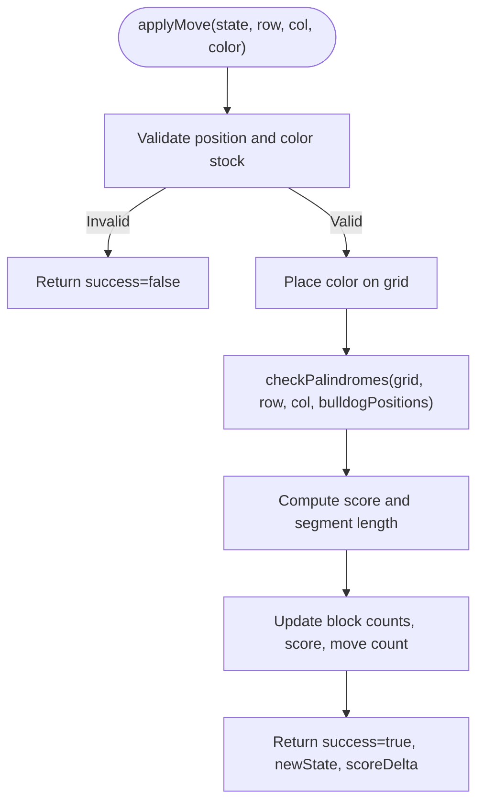
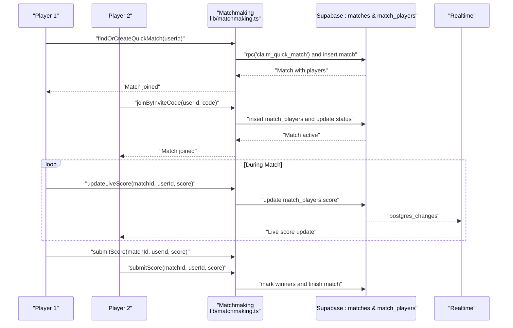
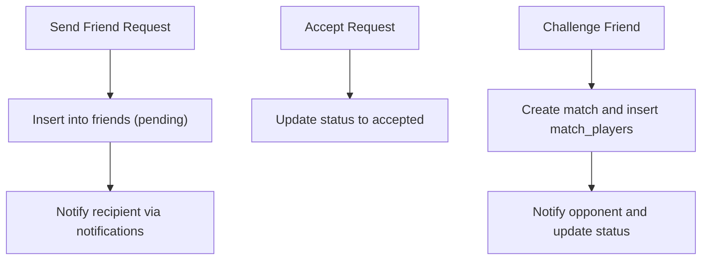
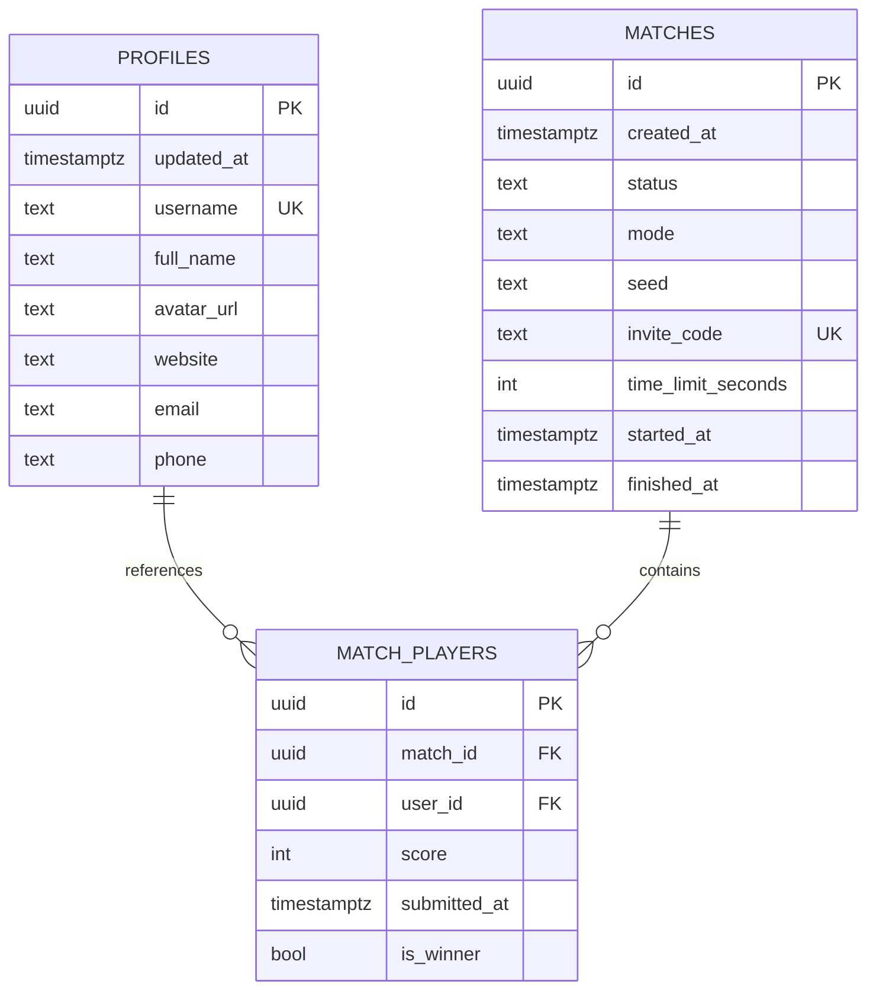
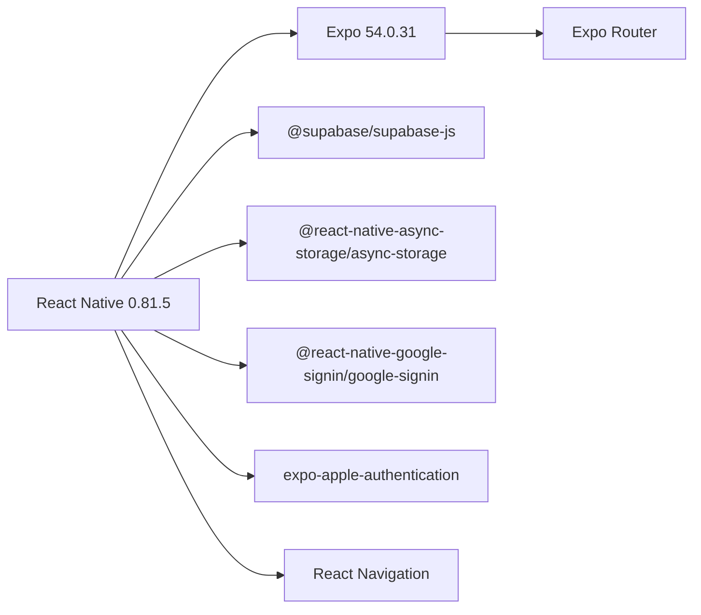

# Project Overview

<cite>
**Referenced Files in This Document**
- [README.md](file://README.md)
- [package.json](file://package.json)
- [app.json](file://app.json)
- [supabase.ts](file://supabase.ts)
- [authService.ts](file://authService.ts)
- [hooks/useAuth.ts](file://hooks/useAuth.ts)
- [lib/gameEngine.ts](file://lib/gameEngine.ts)
- [lib/matchmaking.ts](file://lib/matchmaking.ts)
- [lib/friends.ts](file://lib/friends.ts)
- [app/_layout.tsx](file://app/_layout.tsx)
- [app/(tabs)/index.tsx](file://app/(tabs)/index.tsx)
- [app/(tabs)/main.tsx](file://app/(tabs)/main.tsx)
- [supabase/migrations/20240127000000_init_profiles.sql](file://supabase/migrations/20240127000000_init_profiles.sql)
- [supabase/migrations/20250205000000_multiplayer_tables.sql](file://supabase/migrations/20250205000000_multiplayer_tables.sql)
- [utils/authErrors.ts](file://utils/authErrors.ts)
</cite>

## Table of Contents
1. [Introduction](#introduction)
2. [Project Structure](#project-structure)
3. [Core Components](#core-components)
4. [Architecture Overview](#architecture-overview)
5. [Detailed Component Analysis](#detailed-component-analysis)
6. [Dependency Analysis](#dependency-analysis)
7. [Performance Considerations](#performance-considerations)
8. [Troubleshooting Guide](#troubleshooting-guide)
9. [Conclusion](#conclusion)

## Introduction
Palindrome is a cross-platform word-based puzzle game centered on creating palindromic sequences on a grid. It supports single-player gameplay, real-time multiplayer matches, friend system integration, and robust authentication. Built with React Native 0.81.5 and Expo 54.0.31, the project leverages Supabase for authentication, real-time data synchronization, and storage, enabling a modern, scalable architecture that works seamlessly across iOS, Android, and Web.

The game emphasizes cognitive engagement and language skills by challenging players to form palindromic color sequences under timed conditions, with features like hints, live score updates, and rematch requests enhancing the competitive and social experience.

## Project Structure
At a high level, the project follows a file-based routing structure with a clear separation of concerns:
- Application shell and routing: app/_layout.tsx orchestrates global layout, theming, and navigation.
- Authentication and user sessions: hooks/useAuth.ts integrates with Supabase and authService.ts to manage sign-in/sign-up, OAuth providers, and profile lifecycle.
- Game logic: lib/gameEngine.ts encapsulates deterministic grid initialization, move validation, palindrome detection, and scoring.
- Multiplayer and social features: lib/matchmaking.ts handles quick match, invite-based matches, real-time updates, and rematch requests; lib/friends.ts manages friend requests, challenges, and head-to-head statistics.
- Supabase integration: supabase.ts centralizes client initialization, persistence, and environment configuration.
- UI entry points: app/(tabs)/index.tsx and app/(tabs)/main.tsx provide login and main menu experiences.

**Diagram sources**
- [app/_layout.tsx](file://app/_layout.tsx#L56-L119)
- [app/(tabs)/index.tsx](file://app/(tabs)/index.tsx#L23-L358)
- [app/(tabs)/main.tsx](file://app/(tabs)/main.tsx#L224-L661)
- [hooks/useAuth.ts](file://hooks/useAuth.ts#L5-L50)
- [authService.ts](file://authService.ts#L61-L560)
- [supabase.ts](file://supabase.ts#L42-L75)
- [lib/gameEngine.ts](file://lib/gameEngine.ts#L60-L100)
- [lib/matchmaking.ts](file://lib/matchmaking.ts#L58-L66)
- [lib/friends.ts](file://lib/friends.ts#L40-L67)
- [supabase/migrations/20240127000000_init_profiles.sql](file://supabase/migrations/20240127000000_init_profiles.sql#L1-L61)
- [supabase/migrations/20250205000000_multiplayer_tables.sql](file://supabase/migrations/20250205000000_multiplayer_tables.sql#L1-L84)

**Section sources**
- [README.md](file://README.md#L1-L59)
- [package.json](file://package.json#L1-L68)
- [app.json](file://app.json#L1-L94)
- [app/_layout.tsx](file://app/_layout.tsx#L56-L119)

## Core Components
- Authentication and Session Management
  - Centralized client initialization and persistence in supabase.ts.
  - Cross-platform OAuth flows (Google, Apple) and magic link/passwordless in authService.ts.
  - Reactive auth state binding in hooks/useAuth.ts.
- Game Engine
  - Deterministic grid initialization, move validation, palindrome detection, and scoring in lib/gameEngine.ts.
- Multiplayer System
  - Quick match, invite-based matches, real-time updates, and rematch requests in lib/matchmaking.ts.
- Social Features
  - Friend requests, challenges, and head-to-head stats in lib/friends.ts.
- UI and Navigation
  - Global layout, theming, routing, and entry points in app/_layout.tsx, app/(tabs)/index.tsx, and app/(tabs)/main.tsx.
- Supabase Backend
  - Profiles, avatars, and multiplayer tables with RLS policies in supabase/migrations/...sql.

**Section sources**
- [supabase.ts](file://supabase.ts#L42-L75)
- [authService.ts](file://authService.ts#L61-L560)
- [hooks/useAuth.ts](file://hooks/useAuth.ts#L5-L50)
- [lib/gameEngine.ts](file://lib/gameEngine.ts#L60-L100)
- [lib/matchmaking.ts](file://lib/matchmaking.ts#L58-L66)
- [lib/friends.ts](file://lib/friends.ts#L40-L67)
- [app/_layout.tsx](file://app/_layout.tsx#L56-L119)
- [app/(tabs)/index.tsx](file://app/(tabs)/index.tsx#L23-L358)
- [app/(tabs)/main.tsx](file://app/(tabs)/main.tsx#L224-L661)
- [supabase/migrations/20240127000000_init_profiles.sql](file://supabase/migrations/20240127000000_init_profiles.sql#L1-L61)
- [supabase/migrations/20250205000000_multiplayer_tables.sql](file://supabase/migrations/20250205000000_multiplayer_tables.sql#L1-L84)

## Architecture Overview
The application adopts a layered architecture:
- Presentation Layer: React Native UI with Expo Router for navigation and file-based routing.
- Domain Layer: Game logic and multiplayer orchestration in TypeScript modules.
- Data Access Layer: Supabase client configured for persistence, auth, and real-time.
- Backend Layer: Supabase Auth, Postgres tables, and RLS policies; Supabase Storage for avatars.

**Diagram sources**
- [app/_layout.tsx](file://app/_layout.tsx#L56-L119)
- [authService.ts](file://authService.ts#L61-L560)
- [lib/gameEngine.ts](file://lib/gameEngine.ts#L60-L100)
- [lib/matchmaking.ts](file://lib/matchmaking.ts#L58-L66)
- [lib/friends.ts](file://lib/friends.ts#L40-L67)
- [supabase.ts](file://supabase.ts#L42-L75)

## Detailed Component Analysis

### Authentication and Session Management
- Supabase Client Initialization
  - Environment-driven configuration and platform-aware storage abstraction for sessions and tokens.
- OAuth Providers
  - Google Sign-In (native) and Apple Sign-In (native/web) with redirect handling and token exchange.
- Session Lifecycle
  - Local session retrieval, user caching, and reactive auth state via Supabase auth listeners.

**Diagram sources**
- [app/(tabs)/index.tsx](file://app/(tabs)/index.tsx#L33-L54)
- [authService.ts](file://authService.ts#L304-L314)
- [supabase.ts](file://supabase.ts#L42-L75)
- [hooks/useAuth.ts](file://hooks/useAuth.ts#L23-L41)

**Section sources**
- [supabase.ts](file://supabase.ts#L42-L75)
- [authService.ts](file://authService.ts#L113-L179)
- [authService.ts](file://authService.ts#L181-L274)
- [authService.ts](file://authService.ts#L304-L314)
- [hooks/useAuth.ts](file://hooks/useAuth.ts#L5-L50)
- [utils/authErrors.ts](file://utils/authErrors.ts#L1-L13)

### Game Engine and Palindrome Mechanics
- Deterministic Board Initialization
  - Seeded RNG ensures identical starting conditions for multiplayer fairness.
- Move Validation and Scoring
  - Validates placement, checks rows/columns for palindromes, computes score deltas, and tracks bulldog bonuses.
- Hint System
  - Finds the first scoring move to assist players.

**Diagram sources**
- [lib/gameEngine.ts](file://lib/gameEngine.ts#L167-L219)
- [lib/gameEngine.ts](file://lib/gameEngine.ts#L106-L161)

**Section sources**
- [lib/gameEngine.ts](file://lib/gameEngine.ts#L60-L100)
- [lib/gameEngine.ts](file://lib/gameEngine.ts#L106-L161)
- [lib/gameEngine.ts](file://lib/gameEngine.ts#L167-L219)
- [lib/gameEngine.ts](file://lib/gameEngine.ts#L224-L249)

### Multiplayer System: Real-Time Matches
- Quick Match and Invite-Based Matches
  - Atomic claim of waiting matches and creation of private matches with invite codes.
- Real-Time Updates
  - Subscribes to Supabase Realtime channels for live score updates and match state changes.
- Rematch Requests
  - Two-player rematch flow with request acceptance and automatic match creation.

**Diagram sources**
- [lib/matchmaking.ts](file://lib/matchmaking.ts#L58-L66)
- [lib/matchmaking.ts](file://lib/matchmaking.ts#L119-L168)
- [lib/matchmaking.ts](file://lib/matchmaking.ts#L204-L247)
- [lib/matchmaking.ts](file://lib/matchmaking.ts#L253-L266)
- [lib/matchmaking.ts](file://lib/matchmaking.ts#L271-L327)

**Section sources**
- [lib/matchmaking.ts](file://lib/matchmaking.ts#L58-L66)
- [lib/matchmaking.ts](file://lib/matchmaking.ts#L119-L168)
- [lib/matchmaking.ts](file://lib/matchmaking.ts#L204-L247)
- [lib/matchmaking.ts](file://lib/matchmaking.ts#L253-L266)
- [lib/matchmaking.ts](file://lib/matchmaking.ts#L271-L327)

### Social Features: Friends and Challenges
- Friend Requests
  - Send, accept, and decline friend requests; notifications dispatched upon sending.
- Head-to-Head Statistics
  - Computes total matches and win counts against specific opponents.
- Challenges
  - Challenge friends to matches and accept/reject incoming challenges.

**Diagram sources**
- [lib/friends.ts](file://lib/friends.ts#L40-L67)
- [lib/friends.ts](file://lib/friends.ts#L72-L84)
- [lib/friends.ts](file://lib/friends.ts#L167-L220)
- [lib/friends.ts](file://lib/friends.ts#L337-L379)

**Section sources**
- [lib/friends.ts](file://lib/friends.ts#L40-L67)
- [lib/friends.ts](file://lib/friends.ts#L72-L84)
- [lib/friends.ts](file://lib/friends.ts#L167-L220)
- [lib/friends.ts](file://lib/friends.ts#L337-L379)

### Supabase Backend Schema and Policies
- Profiles and Avatars
  - Profiles table with RLS policies allowing self-management; storage bucket for avatars.
- Multiplayer Tables
  - Matches and match_players with RLS ensuring players only access their own data; indexes for performance.

**Diagram sources**
- [supabase/migrations/20240127000000_init_profiles.sql](file://supabase/migrations/20240127000000_init_profiles.sql#L1-L61)
- [supabase/migrations/20250205000000_multiplayer_tables.sql](file://supabase/migrations/20250205000000_multiplayer_tables.sql#L3-L28)

**Section sources**
- [supabase/migrations/20240127000000_init_profiles.sql](file://supabase/migrations/20240127000000_init_profiles.sql#L1-L61)
- [supabase/migrations/20250205000000_multiplayer_tables.sql](file://supabase/migrations/20250205000000_multiplayer_tables.sql#L1-L84)

## Dependency Analysis
- Technology Stack
  - React Native 0.81.5 and Expo 54.0.31 for cross-platform runtime and tooling.
  - Supabase client for authentication, database, and storage.
  - Expo ecosystem packages for navigation, routing, UI, and platform integrations.
- Coupling and Cohesion
  - Supabase client is centralized in supabase.ts, minimizing duplication and ensuring consistent auth/session handling.
  - Game logic and multiplayer features are cohesive modules with explicit interfaces, reducing cross-module coupling.
- External Dependencies
  - Google Sign-In SDK for native Google OAuth.
  - Apple Authentication for Apple Sign-In on web and native.
  - Supabase Realtime for live updates.

**Diagram sources**
- [package.json](file://package.json#L13-L56)
- [app.json](file://app.json#L46-L79)

**Section sources**
- [package.json](file://package.json#L13-L56)
- [app.json](file://app.json#L46-L79)

## Performance Considerations
- Deterministic Game Logic
  - Seeded RNG ensures consistent outcomes across platforms, simplifying testing and multiplayer fairness.
- Efficient Move Validation
  - Palindrome checks scan only relevant rows and columns; early exits minimize computation.
- Real-Time Updates
  - Supabase Realtime reduces polling overhead; batching updates prevents UI thrash.
- Asset Delivery
  - Supabase Storage serves avatars efficiently; consider CDN caching for frequently accessed assets.
- Navigation and Rendering
  - Expo Router’s file-based routing and lazy loading reduce bundle sizes and improve startup performance.

## Troubleshooting Guide
- Authentication Issues
  - Verify environment variables for Supabase URL and keys; ensure OAuth client IDs are configured per platform.
  - Use friendly error messages mapped from errorCode for clearer user feedback.
- Session and Profile Sync
  - Confirm auth state listener is active and profile creation/upsert occurs on sign-up.
- Multiplayer Connectivity
  - Ensure Realtime channels are enabled for matches and match_players; verify invite code uniqueness and match status transitions.
- Platform-Specific Setup
  - iOS requires Apple Sign-In configuration; Android requires Google Play Services availability for Google Sign-In.

**Section sources**
- [README.md](file://README.md#L13-L25)
- [utils/authErrors.ts](file://utils/authErrors.ts#L1-L13)
- [hooks/useAuth.ts](file://hooks/useAuth.ts#L23-L41)
- [supabase/migrations/20250205000000_multiplayer_tables.sql](file://supabase/migrations/20250205000000_multiplayer_tables.sql#L83-L84)

## Conclusion
Palindrome delivers a polished, cross-platform word puzzle experience with strong foundations in React Native and Supabase. Its modular architecture—authentication, game engine, multiplayer, and social features—enables scalability and maintainability. The combination of deterministic gameplay, real-time competition, and social connectivity makes it both engaging and educational, supporting language skills and cognitive development through playful interaction.