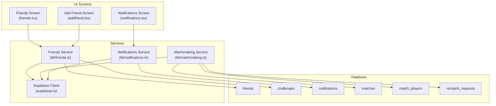
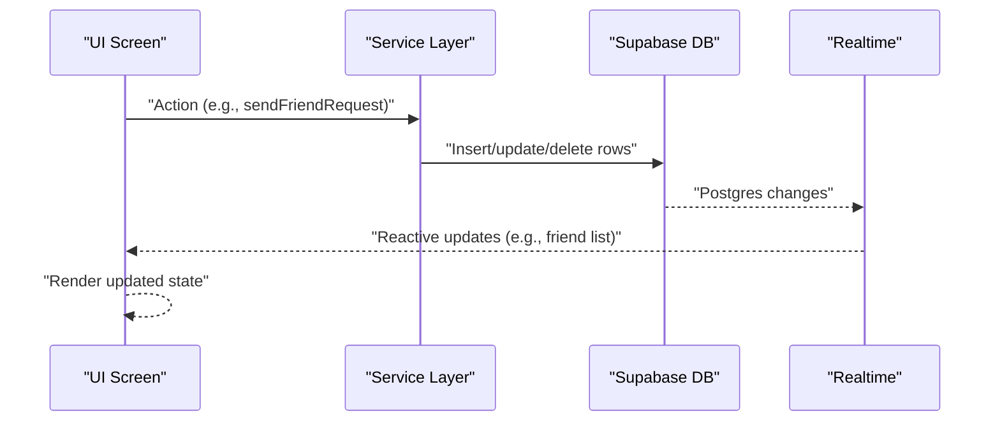
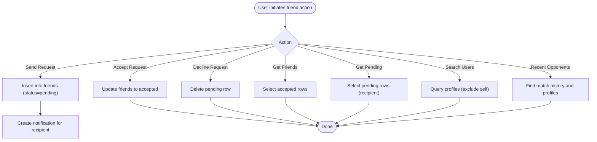
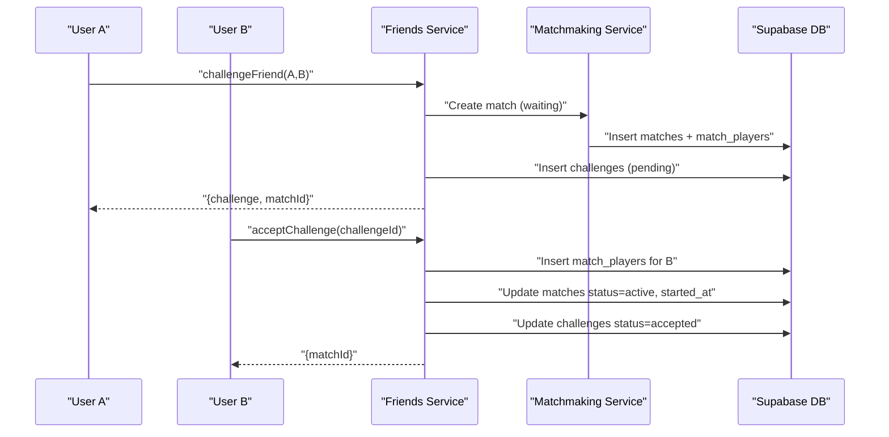
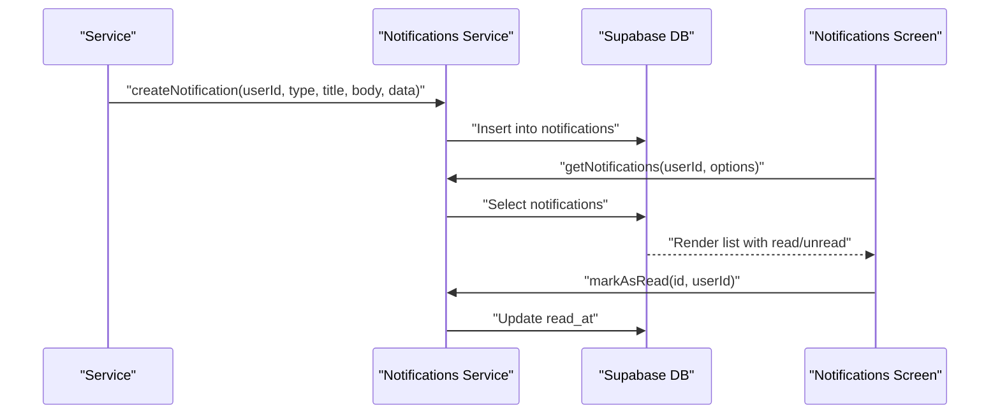
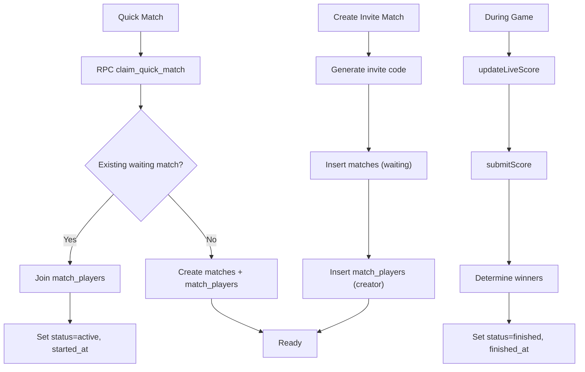
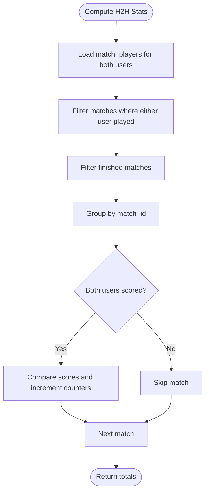
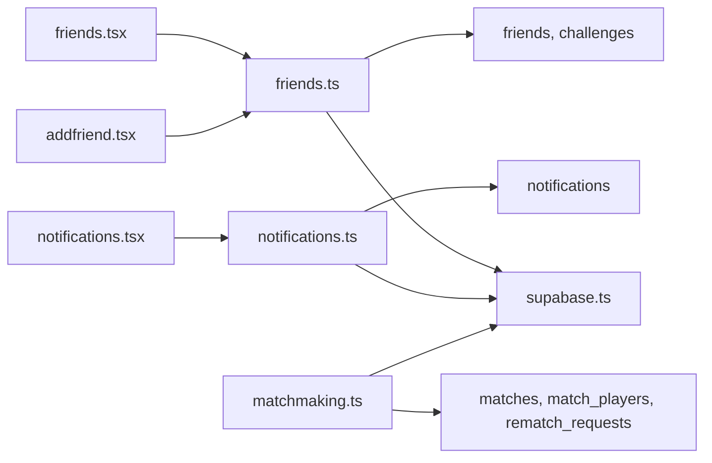
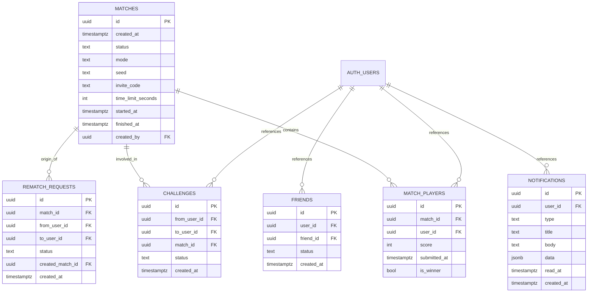

# Social Features

<cite>
**Referenced Files in This Document**
- [friends.ts](file://lib/friends.ts)
- [notifications.ts](file://lib/notifications.ts)
- [matchmaking.ts](file://lib/matchmaking.ts)
- [friends.tsx](file://app/(tabs)/friends.tsx)
- [addfriend.tsx](file://app/(tabs)/addfriend.tsx)
- [notifications.tsx](file://app/(tabs)/notifications.tsx)
- [supabase.ts](file://supabase.ts)
- [20250205000000_multiplayer_tables.sql](file://supabase/migrations/20250205000000_multiplayer_tables.sql)
- [20250205100000_fix_match_players_rls_recursion.sql](file://supabase/migrations/20250205100000_fix_match_players_rls_recursion.sql)
- [20250205200000_fix_matches_insert_rls.sql](file://supabase/migrations/20250205200000_fix_matches_insert_rls.sql)
- [20250205300000_allow_join_by_invite_code.sql](file://supabase/migrations/20250205300000_allow_join_by_invite_code.sql)
- [20250205400000_abandoned_match_cancel.sql](file://supabase/migrations/20250205400000_abandoned_match_cancel.sql)
- [20250205500000_rematch_requests.sql](file://supabase/migrations/20250205500000_rematch_requests.sql)
- [20250206000000_atomic_quick_match.sql](file://supabase/migrations/20250206000000_atomic_quick_match.sql)
- [20250206100000_friends_and_challenges.sql](file://supabase/migrations/20250206100000_friends_and_challenges.sql)
- [20250206110000_notifications.sql](file://supabase/migrations/20250206110000_notifications.sql)
</cite>

## Table of Contents
1. [Introduction](#introduction)
2. [Project Structure](#project-structure)
3. [Core Components](#core-components)
4. [Architecture Overview](#architecture-overview)
5. [Detailed Component Analysis](#detailed-component-analysis)
6. [Dependency Analysis](#dependency-analysis)
7. [Performance Considerations](#performance-considerations)
8. [Troubleshooting Guide](#troubleshooting-guide)
9. [Conclusion](#conclusion)
10. [Appendices](#appendices)

## Introduction
This document explains the Palindrome social features: friend management, head-to-head challenges, and the notification system. It covers the implementation of friend requests, acceptance workflows, friend lists, and competitive statistics. It also documents the challenge system for inviting friends to matches, scheduling matches, and tracking competition outcomes. The notification architecture is described with real-time updates, user preferences, and delivery mechanisms. The database schema for social relationships, challenges, and notifications is included, along with integration points to game mechanics such as friend leaderboard displays and competitive statistics. Privacy controls, social graph management, and scalability considerations are addressed.

## Project Structure
The social features span three layers:
- UI screens: friend discovery, friend list, and notifications
- Services: friend and challenge orchestration, notifications, and matchmaking
- Database: Supabase tables and policies for friends, challenges, notifications, and multiplayer

**Diagram sources**
- [friends.tsx](file://app/(tabs)/friends.tsx#L48-L106)
- [addfriend.tsx](file://app/(tabs)/addfriend.tsx#L30-L65)
- [notifications.tsx](file://app/(tabs)/notifications.tsx#L50-L76)
- [friends.ts](file://lib/friends.ts#L37-L380)
- [notifications.ts](file://lib/notifications.ts#L21-L110)
- [matchmaking.ts](file://lib/matchmaking.ts#L54-L542)
- [supabase.ts](file://supabase.ts#L42-L74)
- [20250206100000_friends_and_challenges.sql](file://supabase/migrations/20250206100000_friends_and_challenges.sql#L3-L49)
- [20250206110000_notifications.sql](file://supabase/migrations/20250206110000_notifications.sql#L3-L27)
- [20250205000000_multiplayer_tables.sql](file://supabase/migrations/20250205000000_multiplayer_tables.sql#L3-L83)
- [20250205500000_rematch_requests.sql](file://supabase/migrations/20250205500000_rematch_requests.sql#L4-L36)

**Section sources**
- [friends.tsx](file://app/(tabs)/friends.tsx#L48-L106)
- [addfriend.tsx](file://app/(tabs)/addfriend.tsx#L30-L65)
- [notifications.tsx](file://app/(tabs)/notifications.tsx#L50-L76)
- [friends.ts](file://lib/friends.ts#L37-L380)
- [notifications.ts](file://lib/notifications.ts#L21-L110)
- [matchmaking.ts](file://lib/matchmaking.ts#L54-L542)
- [supabase.ts](file://supabase.ts#L42-L74)

## Core Components
- Friends Service: manages friend requests, acceptance/decline, friend lists, pending requests, friend status checks, user search, recent opponents, and head-to-head statistics.
- Notifications Service: retrieves notifications, counts unread items, marks as read, and creates notifications triggered by social actions.
- Matchmaking Service: supports quick match, invite-based matches, real-time subscriptions, score submission, and rematch requests.
- UI Screens: render friend lists, pending requests, challenges, notifications, and integrate with services for actions.

Key responsibilities:
- Friend management: send, accept, decline friend requests; list accepted friends; show pending requests; search users; show recent opponents.
- Challenge system: challenge friends to a new match; accept/decline challenges; schedule matches; track outcomes.
- Notifications: deliver friend request and challenge notifications; support read/unread state; link to relevant screens.
- Game integration: compute head-to-head stats for friend leaderboard display; connect match lifecycle to social features.

**Section sources**
- [friends.ts](file://lib/friends.ts#L37-L380)
- [notifications.ts](file://lib/notifications.ts#L21-L110)
- [matchmaking.ts](file://lib/matchmaking.ts#L54-L542)
- [friends.tsx](file://app/(tabs)/friends.tsx#L48-L106)
- [addfriend.tsx](file://app/(tabs)/addfriend.tsx#L30-L65)
- [notifications.tsx](file://app/(tabs)/notifications.tsx#L50-L76)

## Architecture Overview
The social features rely on Supabase for persistence and Row Level Security (RLS), with services encapsulating business logic and UI screens orchestrating user interactions. Realtime subscriptions keep match state synchronized for live score updates and rematch requests.

**Diagram sources**
- [friends.ts](file://lib/friends.ts#L37-L380)
- [notifications.ts](file://lib/notifications.ts#L21-L110)
- [matchmaking.ts](file://lib/matchmaking.ts#L204-L247)
- [20250205000000_multiplayer_tables.sql](file://supabase/migrations/20250205000000_multiplayer_tables.sql#L30-L83)

## Detailed Component Analysis

### Friend Management
- Friend requests: send a pending request; notification is created for the recipient.
- Accept/decline: recipient can accept or decline; acceptance activates the friendship.
- Pending requests: recipient screen lists incoming requests.
- Friend list: only accepted friendships are shown.
- Status checks: determine if users are friends, pending, or received.
- User search: search profiles by username/full name/email; exclude self.
- Recent opponents: discover players from past matches.

**Diagram sources**
- [friends.ts](file://lib/friends.ts#L37-L380)
- [20250206100000_friends_and_challenges.sql](file://supabase/migrations/20250206100000_friends_and_challenges.sql#L3-L49)

**Section sources**
- [friends.ts](file://lib/friends.ts#L37-L380)
- [friends.tsx](file://app/(tabs)/friends.tsx#L156-L182)
- [addfriend.tsx](file://app/(tabs)/addfriend.tsx#L90-L106)

### Challenge System
- Challenge a friend: creates a new match (race mode, waiting status), inserts match_players for the challenger, and creates a challenge record (pending).
- Accept challenge: adds the challenged user to match_players, sets match status to active and started, and marks challenge accepted.
- Decline challenge: marks challenge as declined.
- Pending challenges: recipient screen lists pending challenges.
- Integration with matchmaking: uses shared match infrastructure (matches, match_players).

**Diagram sources**
- [friends.ts](file://lib/friends.ts#L167-L220)
- [friends.ts](file://lib/friends.ts#L225-L250)
- [matchmaking.ts](file://lib/matchmaking.ts#L71-L114)
- [20250206100000_friends_and_challenges.sql](file://supabase/migrations/20250206100000_friends_and_challenges.sql#L28-L39)

**Section sources**
- [friends.ts](file://lib/friends.ts#L167-L264)
- [friends.tsx](file://app/(tabs)/friends.tsx#L184-L224)
- [matchmaking.ts](file://lib/matchmaking.ts#L71-L168)

### Notifications System
- Types: friend_request, challenge, app_update.
- Retrieval: list notifications ordered by creation time; optional unread-only filter.
- Read state: mark individual or all as read; unread count supported.
- Creation: services create notifications for friend requests and challenges; best-effort delivery.
- UI: notifications screen renders unread indicators, icons per type, and navigation to relevant screens.

**Diagram sources**
- [notifications.ts](file://lib/notifications.ts#L85-L110)
- [notifications.tsx](file://app/(tabs)/notifications.tsx#L50-L99)
- [20250206110000_notifications.sql](file://supabase/migrations/20250206110000_notifications.sql#L3-L27)

**Section sources**
- [notifications.ts](file://lib/notifications.ts#L21-L110)
- [notifications.tsx](file://app/(tabs)/notifications.tsx#L50-L112)

### Matchmaking and Competition Tracking
- Quick match: atomic claim via RPC to avoid races; joins existing waiting match or creates a new one.
- Invite-based matches: generates unique 6-character codes; participants join by code.
- Realtime: subscribes to matches and match_players to reflect live score updates and state changes.
- Score submission: updates live score during gameplay and finalizes upon submission; determines winners and finishes match.
- Rematch requests: handles request creation, acceptance (creating a new match), and decline; supports both players clicking “Rematch” simultaneously.

**Diagram sources**
- [matchmaking.ts](file://lib/matchmaking.ts#L58-L114)
- [matchmaking.ts](file://lib/matchmaking.ts#L204-L327)
- [20250206000000_atomic_quick_match.sql](file://supabase/migrations/20250206000000_atomic_quick_match.sql#L3-L44)
- [20250205500000_rematch_requests.sql](file://supabase/migrations/20250205500000_rematch_requests.sql#L4-L36)

**Section sources**
- [matchmaking.ts](file://lib/matchmaking.ts#L54-L542)

### Head-to-Head Statistics and Leaderboards
- Compute head-to-head stats: total matches, wins, and losses against a specific friend by scanning match_players and filtering finished matches.
- UI integration: friends screen enriches friend rows with display name, avatar, and H2H stats for leaderboard-like display.

**Diagram sources**
- [friends.ts](file://lib/friends.ts#L337-L379)
- [friends.tsx](file://app/(tabs)/friends.tsx#L81-L95)

**Section sources**
- [friends.ts](file://lib/friends.ts#L334-L379)
- [friends.tsx](file://app/(tabs)/friends.tsx#L81-L95)

## Dependency Analysis
- UI depends on services for data and actions.
- Services depend on Supabase client for database operations.
- Database enforces privacy via RLS policies and indexes for performance.
- Realtime subscriptions bridge database changes to UI updates.

**Diagram sources**
- [friends.tsx](file://app/(tabs)/friends.tsx#L1-L20)
- [addfriend.tsx](file://app/(tabs)/addfriend.tsx#L1-L19)
- [notifications.tsx](file://app/(tabs)/notifications.tsx#L1-L11)
- [friends.ts](file://lib/friends.ts#L6-L8)
- [notifications.ts](file://lib/notifications.ts#L6)
- [matchmaking.ts](file://lib/matchmaking.ts#L6)
- [supabase.ts](file://supabase.ts#L42-L74)
- [20250206100000_friends_and_challenges.sql](file://supabase/migrations/20250206100000_friends_and_challenges.sql#L3-L49)
- [20250206110000_notifications.sql](file://supabase/migrations/20250206110000_notifications.sql#L3-L27)
- [20250205000000_multiplayer_tables.sql](file://supabase/migrations/20250205000000_multiplayer_tables.sql#L3-L83)
- [20250205500000_rematch_requests.sql](file://supabase/migrations/20250205500000_rematch_requests.sql#L4-L36)

**Section sources**
- [friends.tsx](file://app/(tabs)/friends.tsx#L1-L20)
- [addfriend.tsx](file://app/(tabs)/addfriend.tsx#L1-L19)
- [notifications.tsx](file://app/(tabs)/notifications.tsx#L1-L11)
- [friends.ts](file://lib/friends.ts#L6-L8)
- [notifications.ts](file://lib/notifications.ts#L6)
- [matchmaking.ts](file://lib/matchmaking.ts#L6)
- [supabase.ts](file://supabase.ts#L42-L74)

## Performance Considerations
- Database indexing: indexes on friends (user, friend, status), challenges (to_user, match), notifications (user, created_at), matches (status, invite_code), match_players (match_id, user_id), and rematch_requests (match_id, to_user).
- RLS optimization: security definer functions and relaxed SELECT policies for matches to avoid recursion and improve read performance.
- Realtime subscriptions: efficient change feeds for matches and match_players; polling fallback for rematch requests.
- Atomic operations: RPC for quick match ensures thread-safe joining or creation.
- Background jobs: scheduled cancellation of abandoned matches to reclaim resources.

[No sources needed since this section provides general guidance]

## Troubleshooting Guide
Common issues and remedies:
- Friend request errors: duplicates or self-friendship; service throws descriptive errors; UI alerts the user.
- Challenge invalid/expired: ensure challenge is pending and belongs to the current user; otherwise reject gracefully.
- Notification read failures: marking as read is best-effort; UI reflects state optimistically.
- Match join failures: invalid or expired invite code; ensure code length and waiting status.
- Rematch request conflicts: if both players click “Rematch,” the system merges into one accepted request and creates a new match.

**Section sources**
- [friends.ts](file://lib/friends.ts#L45-L54)
- [friends.ts](file://lib/friends.ts#L237)
- [notifications.ts](file://lib/notifications.ts#L62-L70)
- [matchmaking.ts](file://lib/matchmaking.ts#L123-L139)
- [matchmaking.ts](file://lib/matchmaking.ts#L387-L389)

## Conclusion
The Palindrome social features are built around clean service boundaries, robust database policies, and reactive UI updates. Friend management, challenges, and notifications integrate tightly with the multiplayer engine to deliver a cohesive competitive experience. Privacy is enforced via RLS, and performance is optimized through indexing, atomic operations, and real-time subscriptions.

[No sources needed since this section summarizes without analyzing specific files]

## Appendices

### Database Schema

**Diagram sources**
- [20250206100000_friends_and_challenges.sql](file://supabase/migrations/20250206100000_friends_and_challenges.sql#L3-L49)
- [20250206110000_notifications.sql](file://supabase/migrations/20250206110000_notifications.sql#L3-L27)
- [20250205000000_multiplayer_tables.sql](file://supabase/migrations/20250205000000_multiplayer_tables.sql#L3-L83)
- [20250205500000_rematch_requests.sql](file://supabase/migrations/20250205500000_rematch_requests.sql#L4-L36)

### Privacy Controls and Social Graph Management
- Row Level Security: policies restrict reads/writes to authenticated users’ own data and relevant relationships.
- Friend graph: bidirectional relationship stored with status; pending/accepted states govern visibility.
- Challenge graph: links challenges to matches and users; only recipients can act on pending challenges.
- Notification isolation: users can only manage their own notifications.

**Section sources**
- [20250206100000_friends_and_challenges.sql](file://supabase/migrations/20250206100000_friends_and_challenges.sql#L17-L49)
- [20250206110000_notifications.sql](file://supabase/migrations/20250206110000_notifications.sql#L18-L27)
- [20250205000000_multiplayer_tables.sql](file://supabase/migrations/20250205000000_multiplayer_tables.sql#L30-L81)

### Scaling Considerations
- Indexes on foreign keys and frequently filtered columns (status, user_id, created_at).
- Policies optimized with security definer functions to avoid recursive RLS triggers.
- Realtime subscriptions for low-latency updates; polling fallback for reliability.
- Scheduled jobs to clean up abandoned matches.
- Atomic RPC for quick match to prevent race conditions under load.

**Section sources**
- [20250205100000_fix_match_players_rls_recursion.sql](file://supabase/migrations/20250205100000_fix_match_players_rls_recursion.sql#L4-L34)
- [20250205300000_allow_join_by_invite_code.sql](file://supabase/migrations/20250205300000_allow_join_by_invite_code.sql#L6-L13)
- [20250205400000_abandoned_match_cancel.sql](file://supabase/migrations/20250205400000_abandoned_match_cancel.sql#L20-L30)
- [20250206000000_atomic_quick_match.sql](file://supabase/migrations/20250206000000_atomic_quick_match.sql#L3-L44)