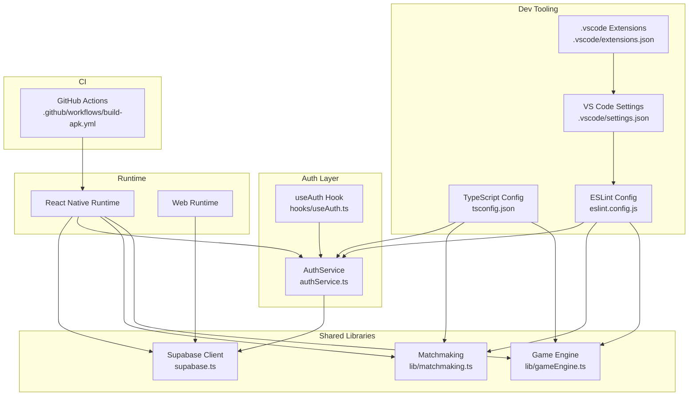
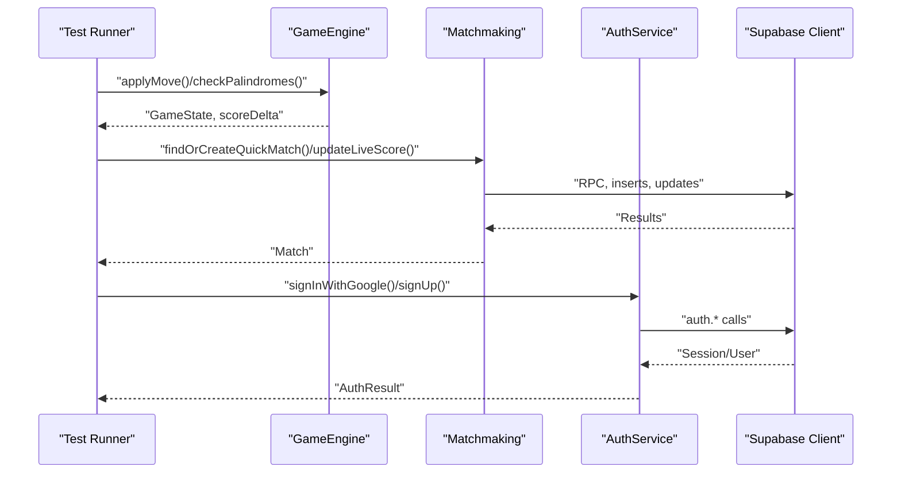
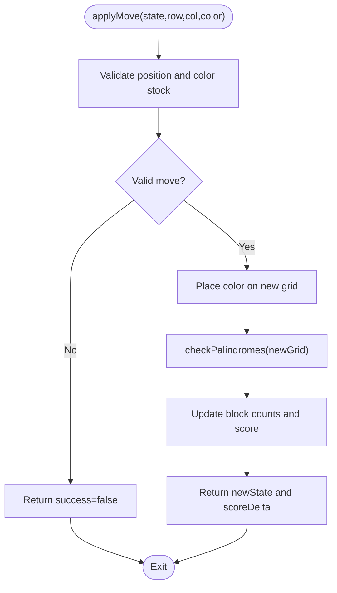
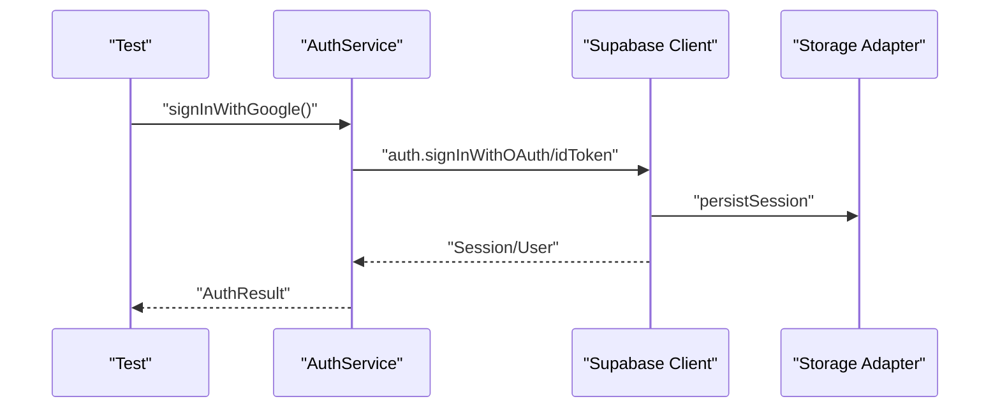
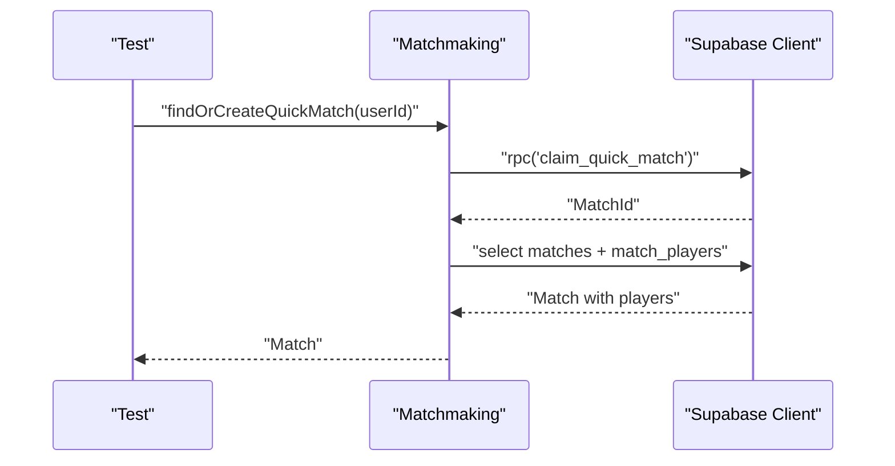
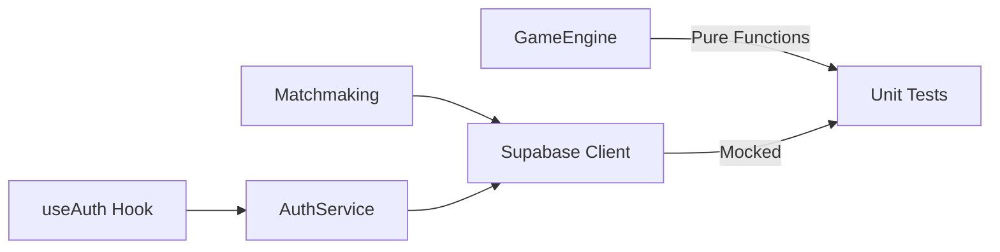

# Testing Strategy

<cite>
**Referenced Files in This Document**
- [package.json](file://package.json)
- [tsconfig.json](file://tsconfig.json)
- [eslint.config.js](file://eslint.config.js)
- [.github/workflows/build-apk.yml](file://.github/workflows/build-apk.yml)
- [.vscode/settings.json](file://.vscode/settings.json)
- [.vscode/extensions.json](file://.vscode/extensions.json)
- [supabase.ts](file://supabase.ts)
- [authService.ts](file://authService.ts)
- [hooks/useAuth.ts](file://hooks/useAuth.ts)
- [lib/gameEngine.ts](file://lib/gameEngine.ts)
- [lib/matchmaking.ts](file://lib/matchmaking.ts)
</cite>

## Table of Contents
1. [Introduction](#introduction)
2. [Project Structure](#project-structure)
3. [Core Components](#core-components)
4. [Architecture Overview](#architecture-overview)
5. [Detailed Component Analysis](#detailed-component-analysis)
6. [Dependency Analysis](#dependency-analysis)
7. [Performance Considerations](#performance-considerations)
8. [Troubleshooting Guide](#troubleshooting-guide)
9. [Conclusion](#conclusion)
10. [Appendices](#appendices)

## Introduction
This document defines a comprehensive testing strategy for the Palindrome application. It covers unit testing for game logic, integration testing for authentication and multiplayer features, and component testing for UI elements. It also documents TypeScript configuration for type safety in tests, ESLint rules for code quality, and VS Code integration for development workflow. Mock strategies for Supabase integration, testing patterns for asynchronous operations, cross-platform compatibility, performance testing, accessibility testing, CI/CD pipeline, automated execution, and debugging practices are included.

## Project Structure
Palindrome is a React Native + Expo project with shared logic across platforms. Authentication and Supabase integration are centralized, while game logic and matchmaking are implemented as pure functions and services. The repository includes CI configuration for Android builds and basic developer tooling via VS Code.

**Diagram sources**
- [supabase.ts](file://supabase.ts#L1-L75)
- [authService.ts](file://authService.ts#L1-L560)
- [hooks/useAuth.ts](file://hooks/useAuth.ts#L1-L51)
- [lib/gameEngine.ts](file://lib/gameEngine.ts#L1-L284)
- [lib/matchmaking.ts](file://lib/matchmaking.ts#L1-L542)
- [tsconfig.json](file://tsconfig.json#L1-L18)
- [eslint.config.js](file://eslint.config.js#L1-L11)
- [.vscode/settings.json](file://.vscode/settings.json#L1-L8)
- [.vscode/extensions.json](file://.vscode/extensions.json#L1-L2)
- [.github/workflows/build-apk.yml](file://.github/workflows/build-apk.yml#L1-L75)

**Section sources**
- [package.json](file://package.json#L1-L68)
- [tsconfig.json](file://tsconfig.json#L1-L18)
- [eslint.config.js](file://eslint.config.js#L1-L11)
- [.vscode/settings.json](file://.vscode/settings.json#L1-L8)
- [.vscode/extensions.json](file://.vscode/extensions.json#L1-L2)
- [.github/workflows/build-apk.yml](file://.github/workflows/build-apk.yml#L1-L75)

## Core Components
- Game Engine: Deterministic logic for board initialization, move validation, palindrome detection, scoring, and hints. Pure functions enable straightforward unit testing.
- Matchmaking: Asynchronous operations for quick/private matches, invite code generation, real-time subscriptions, live score updates, and rematch requests.
- Authentication: Cross-platform OAuth and direct sign-in/sign-up flows, session management, profile caching, and avatar uploads.
- Supabase Client: Environment-driven client creation with platform-specific storage adapters for sessions and persistence.

Key testing targets:
- Unit: GameEngine functions, matchmaking service functions, and AuthService methods.
- Integration: Supabase client initialization, auth state changes, real-time channels, and database operations.
- Component: React Native and web UI components using platform-specific variants.

**Section sources**
- [lib/gameEngine.ts](file://lib/gameEngine.ts#L1-L284)
- [lib/matchmaking.ts](file://lib/matchmaking.ts#L1-L542)
- [authService.ts](file://authService.ts#L1-L560)
- [supabase.ts](file://supabase.ts#L1-L75)

## Architecture Overview
The testing architecture separates concerns:
- Unit tests validate pure logic and deterministic outcomes.
- Integration tests validate Supabase interactions and auth flows.
- Component tests validate UI behavior across platforms.

**Diagram sources**
- [lib/gameEngine.ts](file://lib/gameEngine.ts#L167-L219)
- [lib/matchmaking.ts](file://lib/matchmaking.ts#L58-L66)
- [authService.ts](file://authService.ts#L113-L179)
- [supabase.ts](file://supabase.ts#L42-L74)

## Detailed Component Analysis

### Game Engine Testing
Approach:
- Unit tests for createInitialState, applyMove, checkPalindromes, findScoringMove, and helpers.
- Use seeded randomness to ensure deterministic outcomes across runs.
- Validate boundary conditions (grid edges, blocked positions, bulldog bonuses).

Mocking strategy:
- No external dependencies; pure functions. Tests can call functions directly.

Patterns:
- Parameterized tests for various seeds and moves.
- Assertions on resulting grid, block counts, score, and move count.

**Diagram sources**
- [lib/gameEngine.ts](file://lib/gameEngine.ts#L167-L219)
- [lib/gameEngine.ts](file://lib/gameEngine.ts#L106-L161)

**Section sources**
- [lib/gameEngine.ts](file://lib/gameEngine.ts#L60-L100)
- [lib/gameEngine.ts](file://lib/gameEngine.ts#L106-L161)
- [lib/gameEngine.ts](file://lib/gameEngine.ts#L167-L219)
- [lib/gameEngine.ts](file://lib/gameEngine.ts#L224-L249)

### Authentication and Supabase Integration Testing
Approach:
- Unit tests for AuthService methods (signInWithGoogle, signInWithApple, signUp, signIn, signOut, resetPassword, completeOAuthRedirect).
- Integration tests for Supabase client initialization, auth state change callbacks, and session persistence.
- Mock Supabase client to isolate logic under test.

Mocking strategy:
- Replace getSupabaseClient() with a test double that returns a mocked Supabase client.
- Stub auth.* methods and storage adapters to simulate success/failure scenarios.
- For web/native differences, inject platform-specific storage and browser APIs.

Patterns:
- Test OAuth redirect parsing and token exchange.
- Simulate network failures and invalid tokens.
- Verify profile caching and profile ensure/update flows.

**Diagram sources**
- [authService.ts](file://authService.ts#L113-L179)
- [supabase.ts](file://supabase.ts#L42-L74)

**Section sources**
- [authService.ts](file://authService.ts#L61-L111)
- [authService.ts](file://authService.ts#L113-L274)
- [authService.ts](file://authService.ts#L338-L382)
- [supabase.ts](file://supabase.ts#L42-L74)
- [hooks/useAuth.ts](file://hooks/useAuth.ts#L9-L47)

### Matchmaking and Multiplayer Testing
Approach:
- Unit tests for invite code generation, seed generation, and match retrieval helpers.
- Integration tests for RPC calls, real-time subscriptions, live score updates, and rematch requests.
- Use Supabase test doubles to simulate database state transitions.

Mocking strategy:
- Mock Supabase client RPC and table operations.
- Simulate real-time events by invoking subscription callbacks.

Patterns:
- Atomic operations via RPC must be tested for race conditions.
- Real-time channels should trigger callbacks deterministically in tests.
- Validate state transitions: waiting → active → finished/cancelled.

**Diagram sources**
- [lib/matchmaking.ts](file://lib/matchmaking.ts#L58-L66)
- [lib/matchmaking.ts](file://lib/matchmaking.ts#L170-L187)

**Section sources**
- [lib/matchmaking.ts](file://lib/matchmaking.ts#L36-L52)
- [lib/matchmaking.ts](file://lib/matchmaking.ts#L58-L66)
- [lib/matchmaking.ts](file://lib/matchmaking.ts#L204-L247)
- [lib/matchmaking.ts](file://lib/matchmaking.ts#L253-L266)
- [lib/matchmaking.ts](file://lib/matchmaking.ts#L366-L404)

### UI Component Testing
Approach:
- Test platform-specific components and their behavior across native and web.
- Validate rendering, user interactions, and navigation flows.
- Use React Native Testing Library or equivalent for component-level assertions.

Patterns:
- Snapshot tests for static views.
- Event simulation for buttons, inputs, and navigations.
- Accessibility checks for content descriptions and focus order.

[No sources needed since this section provides general guidance]

## Dependency Analysis
Testing dependencies and coupling:
- GameEngine is self-contained and highly testable.
- Matchmaking depends on Supabase client and real-time channels; requires mocking.
- AuthService depends on Supabase client and platform-specific libraries; requires mocking and environment variable stubs.
- Supabase client encapsulates platform-specific storage; central place for mocking.

**Diagram sources**
- [lib/gameEngine.ts](file://lib/gameEngine.ts#L1-L284)
- [lib/matchmaking.ts](file://lib/matchmaking.ts#L1-L542)
- [authService.ts](file://authService.ts#L1-L560)
- [supabase.ts](file://supabase.ts#L1-L75)
- [hooks/useAuth.ts](file://hooks/useAuth.ts#L1-L51)

**Section sources**
- [lib/gameEngine.ts](file://lib/gameEngine.ts#L1-L284)
- [lib/matchmaking.ts](file://lib/matchmaking.ts#L1-L542)
- [authService.ts](file://authService.ts#L1-L560)
- [supabase.ts](file://supabase.ts#L1-L75)
- [hooks/useAuth.ts](file://hooks/useAuth.ts#L1-L51)

## Performance Considerations
- Unit tests: Keep deterministic seeds and avoid heavy I/O; measure execution time for hot paths.
- Integration tests: Use lightweight Supabase test doubles; minimize real-time channel churn.
- Cross-platform: Run platform-specific suites separately to reduce flakiness.
- CI: Parallelize test jobs per platform and feature area.

[No sources needed since this section provides general guidance]

## Troubleshooting Guide
Common issues and resolutions:
- Missing environment variables for Supabase in tests:
  - Provide EXPO_PUBLIC_SUPABASE_URL and EXPO_PUBLIC_SUPABASE_ANON_KEY in test environment.
- Mocking Supabase client:
  - Ensure getSupabaseClient() returns a test double with auth.*, from(), rpc(), and channel() stubs.
- Auth state change callbacks:
  - Unsubscribe listeners after tests to prevent leaks.
- Real-time channels:
  - Remove channels and cancel polling in teardown.
- Debugging test failures:
  - Add logging around critical paths; use deterministic seeds for reproducibility.

**Section sources**
- [supabase.ts](file://supabase.ts#L42-L74)
- [authService.ts](file://authService.ts#L361-L382)
- [lib/matchmaking.ts](file://lib/matchmaking.ts#L244-L247)
- [lib/matchmaking.ts](file://lib/matchmaking.ts#L507-L511)

## Conclusion
This testing strategy emphasizes deterministic unit tests for game logic, robust integration tests for authentication and multiplayer features, and practical component tests for UI. TypeScript and ESLint configurations support type safety and code quality. The CI pipeline builds Android artifacts; extend it with dedicated test jobs for unit, integration, and component suites. Adopt the outlined mocking and testing patterns to ensure reliable, maintainable tests across platforms.

[No sources needed since this section summarizes without analyzing specific files]

## Appendices

### TypeScript Configuration for Tests
- Enable strict mode for enhanced type safety.
- Include test files via tsconfig include patterns.
- Use @types/react for React testing environments.

**Section sources**
- [tsconfig.json](file://tsconfig.json#L1-L18)
- [package.json](file://package.json#L58-L67)

### ESLint Rules for Quality
- Flat config extends Expo’s recommended rules.
- Ignore generated or distribution folders in linting.

**Section sources**
- [eslint.config.js](file://eslint.config.js#L1-L11)

### VS Code Integration
- Auto-fix and organize imports on save.
- Recommended Expo extension for development workflow.

**Section sources**
- [.vscode/settings.json](file://.vscode/settings.json#L1-L8)
- [.vscode/extensions.json](file://.vscode/extensions.json#L1-L2)

### Continuous Integration Pipeline
- Android APK build job installs dependencies, sets environment variables, prebuilds, decodes keystore if available, and builds release APK.
- Extend with separate jobs for unit/integration/component tests.

**Section sources**
- [.github/workflows/build-apk.yml](file://.github/workflows/build-apk.yml#L1-L75)