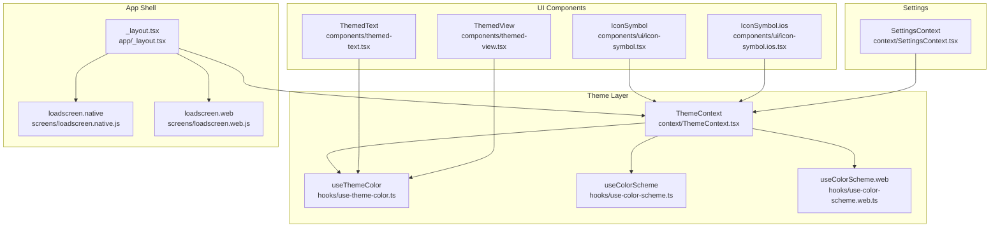
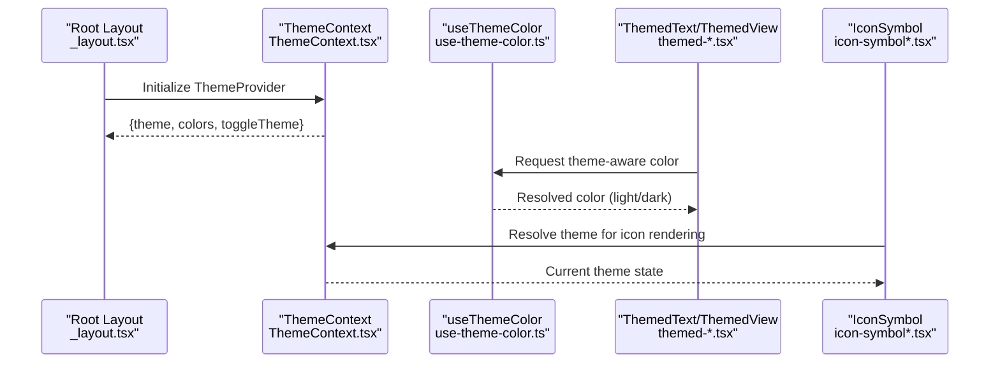
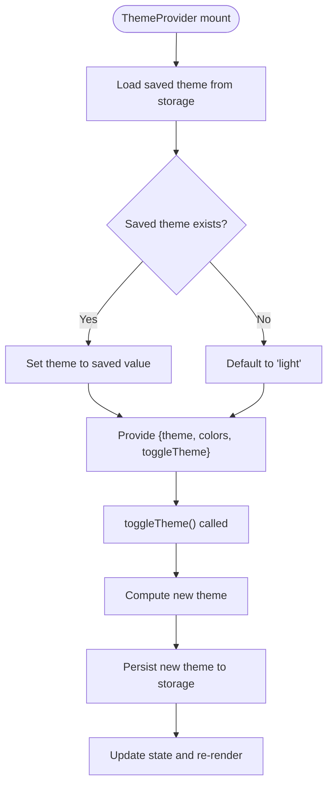
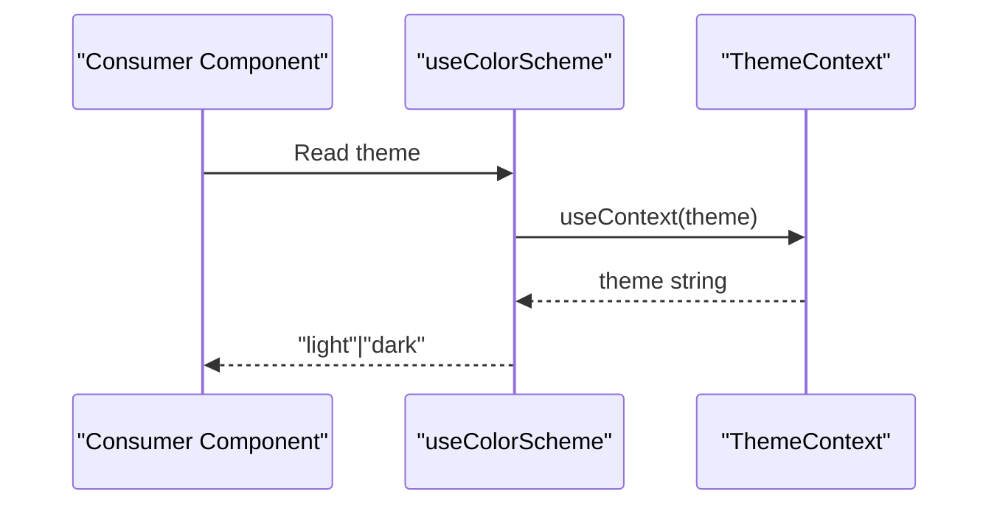
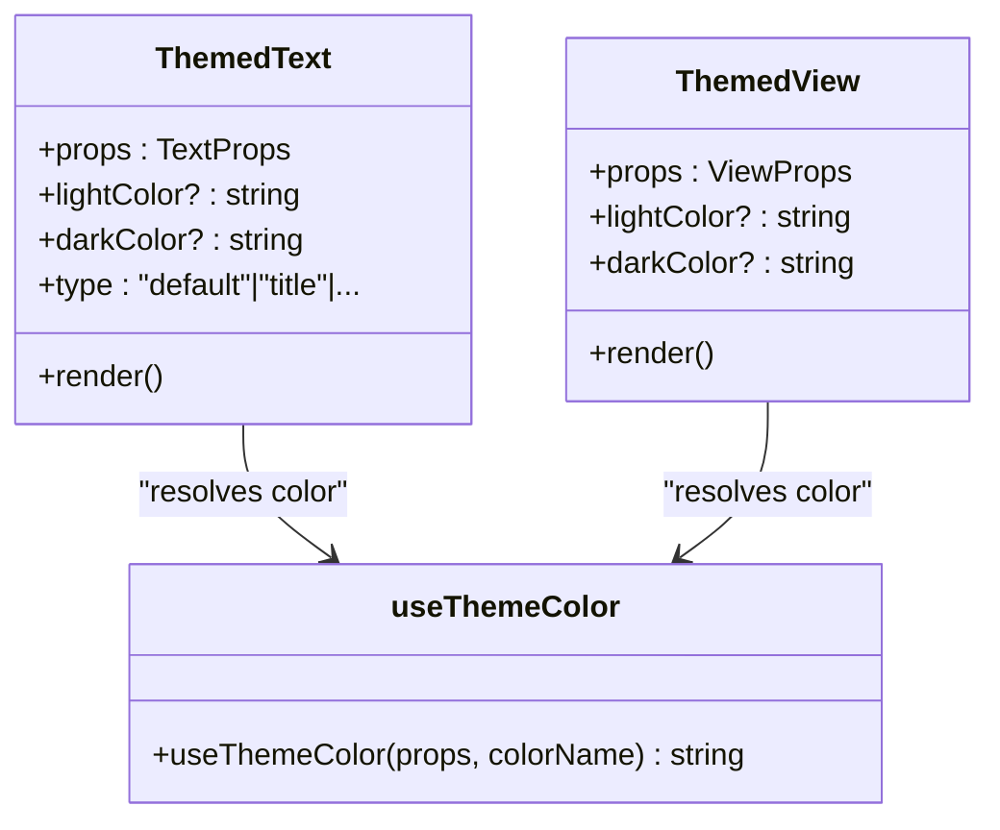
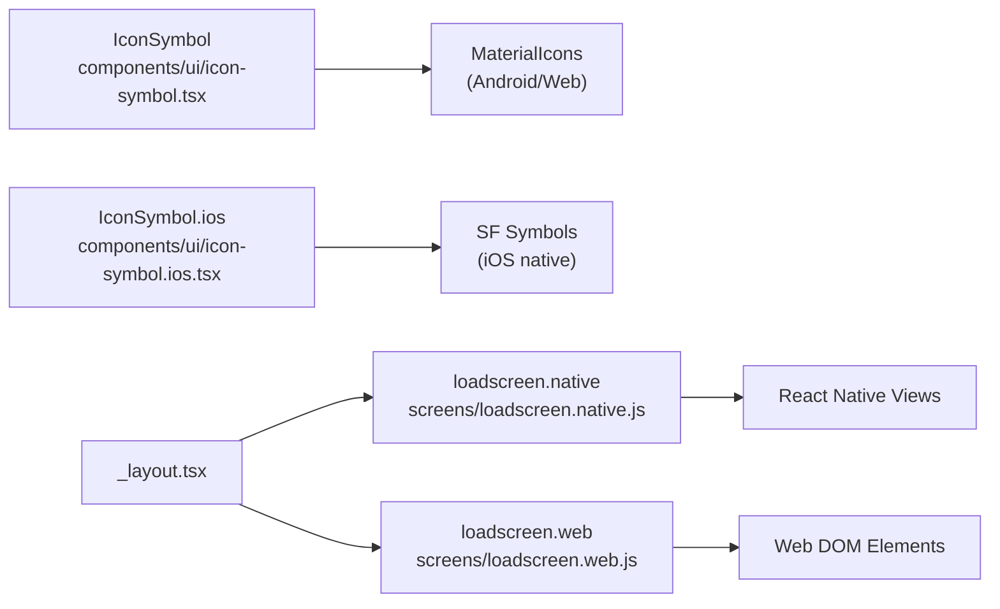
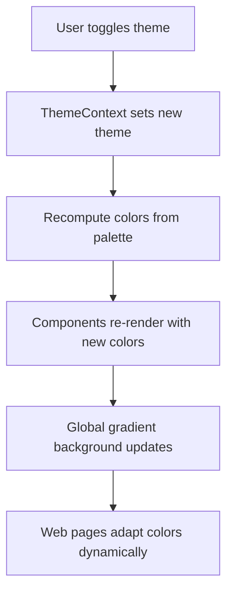
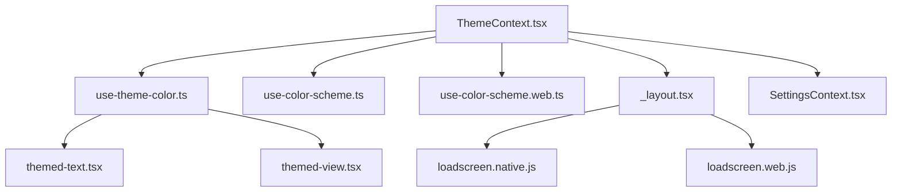

# Theme and UI System

<cite>
**Referenced Files in This Document**
- [ThemeContext.tsx](file://context/ThemeContext.tsx)
- [theme.ts](file://constants/theme.ts)
- [use-theme-color.ts](file://hooks/use-theme-color.ts)
- [use-color-scheme.ts](file://hooks/use-color-scheme.ts)
- [use-color-scheme.web.ts](file://hooks/use-color-scheme.web.ts)
- [themed-text.tsx](file://components/themed-text.tsx)
- [themed-view.tsx](file://components/themed-view.tsx)
- [icon-symbol.tsx](file://components/ui/icon-symbol.tsx)
- [icon-symbol.ios.tsx](file://components/ui/icon-symbol.ios.tsx)
- [_layout.tsx](file://app/_layout.tsx)
- [loadscreen.native.js](file://screens/loadscreen.native.js)
- [loadscreen.web.js](file://screens/loadscreen.web.js)
- [SettingsContext.tsx](file://context/SettingsContext.tsx)
- [index.web.tsx](file://app/(tabs)/index.web.tsx)
</cite>

## Table of Contents
1. [Introduction](#introduction)
2. [Project Structure](#project-structure)
3. [Core Components](#core-components)
4. [Architecture Overview](#architecture-overview)
5. [Detailed Component Analysis](#detailed-component-analysis)
6. [Dependency Analysis](#dependency-analysis)
7. [Performance Considerations](#performance-considerations)
8. [Troubleshooting Guide](#troubleshooting-guide)
9. [Conclusion](#conclusion)
10. [Appendices](#appendices)

## Introduction
This document describes the theme and UI system of the Palindrome cross-platform interface. It covers the ThemeContext implementation for color scheme management and theme switching, the component library architecture with reusable UI components and styling patterns, the dark/light theme implementation, accessibility features, and cross-platform UI consistency across iOS, Android, and Web. It also documents the color system definition, typography hierarchy, component composition patterns, integration with React Native Paper, custom component development, and platform-specific UI adaptations including touch interactions, navigation patterns, and performance optimizations.

## Project Structure
The theme and UI system is organized around a central ThemeContext provider that supplies theme-aware colors and a toggle function. Supporting hooks and components enable consistent theming across views and texts. Platform-specific implementations ensure appropriate UI behavior and visuals on iOS, Android, and Web. Additional contexts manage user settings such as sound, haptics, color-blind modes, and interaction preferences.

**Diagram sources**
- [ThemeContext.tsx](file://context/ThemeContext.tsx#L1-L124)
- [use-theme-color.ts](file://hooks/use-theme-color.ts#L1-L32)
- [use-color-scheme.ts](file://hooks/use-color-scheme.ts#L1-L8)
- [use-color-scheme.web.ts](file://hooks/use-color-scheme.web.ts#L1-L22)
- [themed-text.tsx](file://components/themed-text.tsx#L1-L61)
- [themed-view.tsx](file://components/themed-view.tsx#L1-L15)
- [icon-symbol.tsx](file://components/ui/icon-symbol.tsx#L1-L42)
- [icon-symbol.ios.tsx](file://components/ui/icon-symbol.ios.tsx#L1-L33)
- [_layout.tsx](file://app/_layout.tsx#L1-L126)
- [loadscreen.native.js](file://screens/loadscreen.native.js#L1-L112)
- [loadscreen.web.js](file://screens/loadscreen.web.js#L1-L153)
- [SettingsContext.tsx](file://context/SettingsContext.tsx#L1-L187)

**Section sources**
- [ThemeContext.tsx](file://context/ThemeContext.tsx#L1-L124)
- [_layout.tsx](file://app/_layout.tsx#L1-L126)

## Core Components
- ThemeContext: Provides theme state (light/dark), computed colors, and a toggle function. Persists the selected theme to persistent storage and exposes a hook for consuming components.
- useThemeColor: Returns a theme-aware color for a given color name, with optional overrides via props.
- useColorScheme: Returns the current theme string ("light" or "dark") with platform-aware hydration on Web.
- ThemedText and ThemedView: Reusable UI primitives that apply theme-aware colors to text and backgrounds respectively.
- IconSymbol: Cross-platform icon component that uses native SF Symbols on iOS and Material Icons on Android/web for consistent appearance and performance.
- SettingsContext: Manages user settings such as sound, haptics, color-blind mode, interaction mode, and custom game block gradients.

**Section sources**
- [ThemeContext.tsx](file://context/ThemeContext.tsx#L1-L124)
- [use-theme-color.ts](file://hooks/use-theme-color.ts#L1-L32)
- [use-color-scheme.ts](file://hooks/use-color-scheme.ts#L1-L8)
- [use-color-scheme.web.ts](file://hooks/use-color-scheme.web.ts#L1-L22)
- [themed-text.tsx](file://components/themed-text.tsx#L1-L61)
- [themed-view.tsx](file://components/themed-view.tsx#L1-L15)
- [icon-symbol.tsx](file://components/ui/icon-symbol.tsx#L1-L42)
- [icon-symbol.ios.tsx](file://components/ui/icon-symbol.ios.tsx#L1-L33)
- [SettingsContext.tsx](file://context/SettingsContext.tsx#L1-L187)

## Architecture Overview
The theme system centers on ThemeContext, which is initialized at the root layout level. Components consume theme colors via useThemeColor and render theme-aware UI primitives. Platform-specific splash screens and icon rendering ensure consistent visuals and performance. SettingsContext complements the theme system by allowing user customization of gameplay-related UI affordances.

**Diagram sources**
- [_layout.tsx](file://app/_layout.tsx#L108-L119)
- [ThemeContext.tsx](file://context/ThemeContext.tsx#L74-L108)
- [use-theme-color.ts](file://hooks/use-theme-color.ts#L19-L31)
- [themed-text.tsx](file://components/themed-text.tsx#L11-L34)
- [themed-view.tsx](file://components/themed-view.tsx#L10-L14)
- [icon-symbol.tsx](file://components/ui/icon-symbol.tsx#L28-L41)
- [icon-symbol.ios.tsx](file://components/ui/icon-symbol.ios.tsx#L4-L32)

## Detailed Component Analysis

### ThemeContext Implementation
ThemeContext defines two color palettes (light and dark) and exposes:
- theme: current theme selection
- colors: resolved palette for the active theme
- toggleTheme: switches between themes and persists the choice

Persistence is handled via asynchronous storage. The provider initializes theme state from persisted storage and updates on toggle.

**Diagram sources**
- [ThemeContext.tsx](file://context/ThemeContext.tsx#L74-L108)

**Section sources**
- [ThemeContext.tsx](file://context/ThemeContext.tsx#L1-L124)

### Color Scheme Management and Theme Switching
- useColorScheme returns the current theme string. On Web, it hydrates client-side to avoid SSR mismatches.
- useThemeColor resolves a color based on the current theme and optional prop overrides, enabling per-component color customization while respecting global theme.

**Diagram sources**
- [use-color-scheme.ts](file://hooks/use-color-scheme.ts#L4-L7)
- [ThemeContext.tsx](file://context/ThemeContext.tsx#L110-L116)

**Section sources**
- [use-color-scheme.ts](file://hooks/use-color-scheme.ts#L1-L8)
- [use-color-scheme.web.ts](file://hooks/use-color-scheme.web.ts#L1-L22)
- [use-theme-color.ts](file://hooks/use-theme-color.ts#L1-L32)

### Component Library Architecture
Reusable UI primitives:
- ThemedText: Applies theme-aware color and pre-defined type styles (default, title, subtitle, link).
- ThemedView: Applies theme-aware background color.

These components encapsulate color logic and promote consistency across the app.

**Diagram sources**
- [themed-text.tsx](file://components/themed-text.tsx#L5-L34)
- [themed-view.tsx](file://components/themed-view.tsx#L5-L14)
- [use-theme-color.ts](file://hooks/use-theme-color.ts#L19-L31)

**Section sources**
- [themed-text.tsx](file://components/themed-text.tsx#L1-L61)
- [themed-view.tsx](file://components/themed-view.tsx#L1-L15)

### Platform-Specific Adaptations
- iOS: Uses native SF Symbols for icons via a dedicated module to ensure optimal rendering and performance.
- Android/Web: Falls back to Material Icons mapped from SF Symbols names for consistent appearance.
- Splash Screens: Platform-specific implementations handle image loading and timing differently to optimize perceived performance and reliability.
- Web Font Loading: Explicit font injection for Web to ensure consistent typography during initial render.

**Diagram sources**
- [icon-symbol.tsx](file://components/ui/icon-symbol.tsx#L28-L41)
- [icon-symbol.ios.tsx](file://components/ui/icon-symbol.ios.tsx#L4-L32)
- [loadscreen.native.js](file://screens/loadscreen.native.js#L9-L55)
- [loadscreen.web.js](file://screens/loadscreen.web.js#L3-L57)
- [_layout.tsx](file://app/_layout.tsx#L28-L34)

**Section sources**
- [icon-symbol.tsx](file://components/ui/icon-symbol.tsx#L1-L42)
- [icon-symbol.ios.tsx](file://components/ui/icon-symbol.ios.tsx#L1-L33)
- [loadscreen.native.js](file://screens/loadscreen.native.js#L1-L112)
- [loadscreen.web.js](file://screens/loadscreen.web.js#L1-L153)
- [_layout.tsx](file://app/_layout.tsx#L28-L34)

### Dark/Light Theme Implementation
- ThemeContext maintains separate color palettes for light and dark modes, including semantic roles such as background, text, card, accent, borders, and action colors.
- The root layout applies a global gradient background that aligns with the active theme.
- Web login page demonstrates dynamic theming of backgrounds, borders, shadows, and text colors using theme-aware values.

**Diagram sources**
- [ThemeContext.tsx](file://context/ThemeContext.tsx#L91-L101)
- [_layout.tsx](file://app/_layout.tsx#L36-L54)
- [index.web.tsx](file://app/(tabs)/index.web.tsx#L144-L168)

**Section sources**
- [ThemeContext.tsx](file://context/ThemeContext.tsx#L30-L66)
- [_layout.tsx](file://app/_layout.tsx#L36-L54)
- [index.web.tsx](file://app/(tabs)/index.web.tsx#L144-L168)

### Accessibility Features
- Color contrast: ThemeContext palettes define sufficient contrast for text and interactive elements in both light and dark modes.
- Color-blind friendly modes: SettingsContext supports color-blind modes and interaction modes to improve inclusivity.
- Semantic color roles: Components rely on semantic color names (e.g., primary, secondary, error) to maintain accessible mappings across themes.

**Section sources**
- [SettingsContext.tsx](file://context/SettingsContext.tsx#L5-L22)

### Typography Hierarchy
- Platform-aware fonts: Constants define platform-specific font families for iOS, default, and Web environments.
- Web font loading: The root layout injects Web fonts to ensure consistent typography rendering.
- Component typography: ThemedText provides predefined type scales for default, title, subtitle, and link styles.

**Section sources**
- [theme.ts](file://constants/theme.ts#L30-L53)
- [_layout.tsx](file://app/_layout.tsx#L63-L70)
- [themed-text.tsx](file://components/themed-text.tsx#L36-L60)

### Component Composition Patterns
- Props-first theming: useThemeColor accepts per-component overrides via props, enabling fine-grained control while preserving global theme consistency.
- Primitive-based UI: ThemedText and ThemedView compose higher-order components, promoting reuse and reducing duplication.
- Gradient backgrounds: The root layout applies a global gradient that complements theme palettes.

**Section sources**
- [use-theme-color.ts](file://hooks/use-theme-color.ts#L19-L31)
- [themed-text.tsx](file://components/themed-text.tsx#L11-L34)
- [themed-view.tsx](file://components/themed-view.tsx#L10-L14)
- [_layout.tsx](file://app/_layout.tsx#L36-L54)

### Integration with React Native Paper and Custom Components
- ThemeContext provides a centralized color system suitable for integration with UI libraries. Components can be adapted to accept theme-aware props and resolve colors via useThemeColor.
- Custom components (e.g., IconSymbol) demonstrate cross-platform iconography with native performance characteristics on each platform.

**Section sources**
- [ThemeContext.tsx](file://context/ThemeContext.tsx#L68-L101)
- [icon-symbol.tsx](file://components/ui/icon-symbol.tsx#L28-L41)
- [icon-symbol.ios.tsx](file://components/ui/icon-symbol.ios.tsx#L4-L32)

## Dependency Analysis
ThemeContext is the central dependency for color resolution. Hooks depend on ThemeContext, and UI components depend on hooks. Platform-specific splash screens and icons are decoupled but coordinate with the theme system via shared color values.

**Diagram sources**
- [ThemeContext.tsx](file://context/ThemeContext.tsx#L1-L124)
- [use-theme-color.ts](file://hooks/use-theme-color.ts#L1-L32)
- [use-color-scheme.ts](file://hooks/use-color-scheme.ts#L1-L8)
- [use-color-scheme.web.ts](file://hooks/use-color-scheme.web.ts#L1-L22)
- [themed-text.tsx](file://components/themed-text.tsx#L1-L61)
- [themed-view.tsx](file://components/themed-view.tsx#L1-L15)
- [_layout.tsx](file://app/_layout.tsx#L1-L126)
- [loadscreen.native.js](file://screens/loadscreen.native.js#L1-L112)
- [loadscreen.web.js](file://screens/loadscreen.web.js#L1-L153)
- [SettingsContext.tsx](file://context/SettingsContext.tsx#L1-L187)

**Section sources**
- [ThemeContext.tsx](file://context/ThemeContext.tsx#L1-L124)
- [use-theme-color.ts](file://hooks/use-theme-color.ts#L1-L32)
- [themed-text.tsx](file://components/themed-text.tsx#L1-L61)
- [themed-view.tsx](file://components/themed-view.tsx#L1-L15)
- [_layout.tsx](file://app/_layout.tsx#L1-L126)

## Performance Considerations
- Persistent theme loading occurs once at startup to avoid repeated IO operations.
- useColorScheme.web hydrates client-side to prevent SSR mismatches and ensure accurate theme detection.
- Platform-specific splash screens optimize image loading and fallback strategies to reduce perceived loading time.
- Web font injection minimizes layout shifts by ensuring fonts are available before rendering critical content.

[No sources needed since this section provides general guidance]

## Troubleshooting Guide
- Theme not persisting: Verify AsyncStorage keys and error handling in ThemeContext. Confirm that toggleTheme writes the new theme and that loadTheme reads the saved value.
- Incorrect theme on Web: Ensure useColorScheme.web hydration completes before rendering theme-dependent components.
- Icons not displaying: Confirm platform-specific icon components are used (IconSymbol.ios vs IconSymbol) and that MaterialIcons mapping is correct.
- Typography issues on Web: Verify font injection and asset paths for Web fonts.

**Section sources**
- [ThemeContext.tsx](file://context/ThemeContext.tsx#L77-L98)
- [use-color-scheme.web.ts](file://hooks/use-color-scheme.web.ts#L7-L21)
- [icon-symbol.tsx](file://components/ui/icon-symbol.tsx#L28-L41)
- [icon-symbol.ios.tsx](file://components/ui/icon-symbol.ios.tsx#L4-L32)
- [_layout.tsx](file://app/_layout.tsx#L112-L114)

## Conclusion
The Palindrome theme and UI system provides a robust, cross-platform foundation for consistent theming, typography, and component composition. ThemeContext centralizes color management and persistence, while hooks and primitives enable easy, theme-aware UI construction. Platform-specific adaptations ensure native-feeling experiences on iOS, Android, and Web, with thoughtful performance and accessibility considerations.

[No sources needed since this section summarizes without analyzing specific files]

## Appendices

### Color System Definition
- Semantic roles: background, text, card, accent, border, secondaryText, gradient, primary, secondary, success, warning, error, inputBackground, buttonText, buttonPrimary.
- Palettes: distinct light and dark palettes designed for readability and brand alignment.

**Section sources**
- [ThemeContext.tsx](file://context/ThemeContext.tsx#L6-L66)

### Typography Hierarchy
- Platform-specific families: iOS, default, and Web font stacks.
- Predefined text styles: default, title, subtitle, link with consistent sizing and weights.

**Section sources**
- [theme.ts](file://constants/theme.ts#L30-L53)
- [themed-text.tsx](file://components/themed-text.tsx#L36-L60)

### Settings and Accessibility
- SettingsContext manages sound, haptics, color-blind mode, interaction mode, and custom game colors, complementing the theme system with user customization.

**Section sources**
- [SettingsContext.tsx](file://context/SettingsContext.tsx#L1-L187)