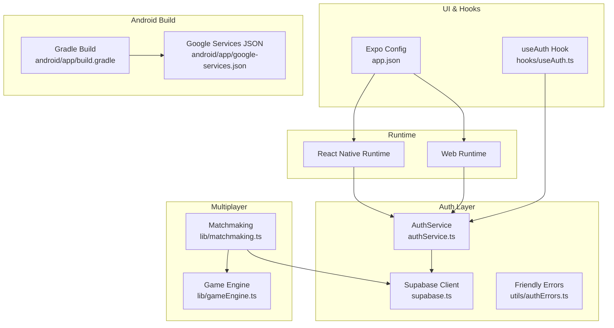
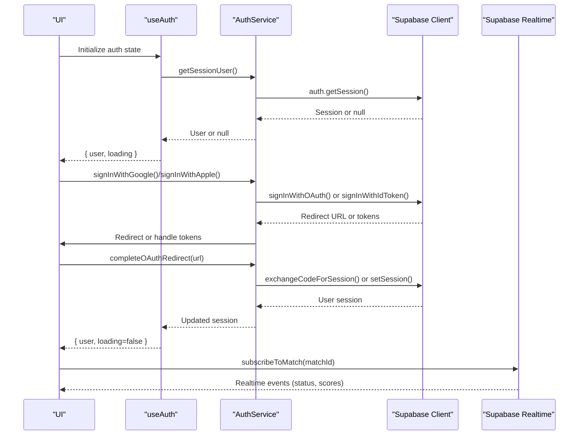
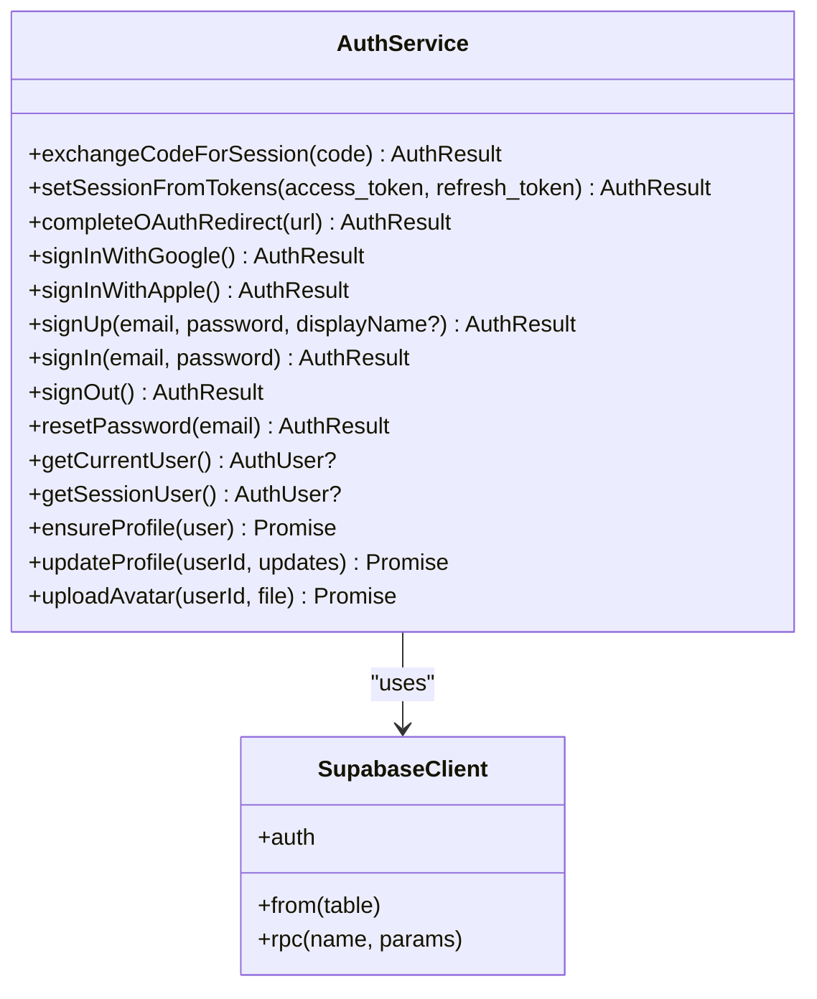
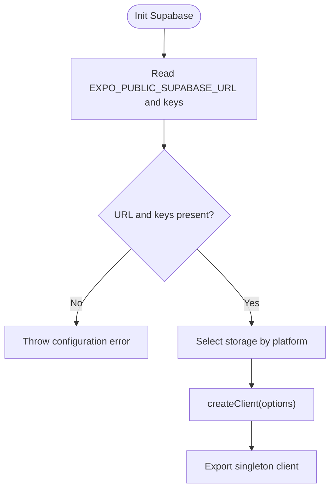
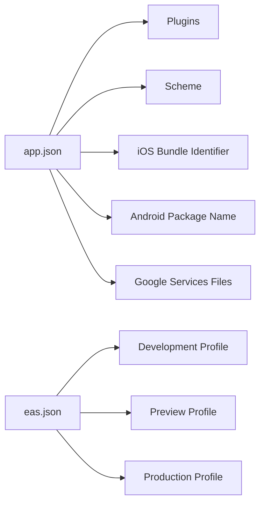
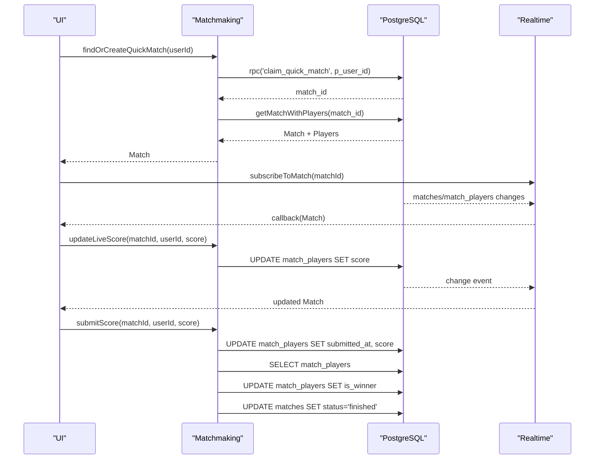
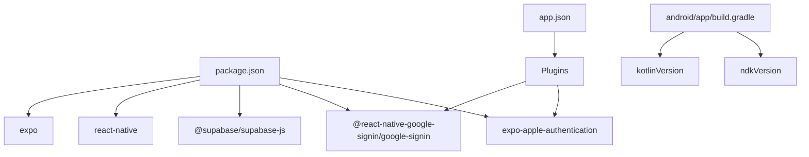

# Troubleshooting and FAQ

<cite>
**Referenced Files in This Document**
- [README.md](file://README.md)
- [GOOGLE_AUTH_SETUP_GUIDE.md](file://GOOGLE_AUTH_SETUP_GUIDE.md)
- [QUICK_START_CHECKLIST.md](file://QUICK_START_CHECKLIST.md)
- [app.json](file://app.json)
- [package.json](file://package.json)
- [eas.json](file://eas.json)
- [android/app/build.gradle](file://android/app/build.gradle)
- [android/app/google-services.json](file://android/app/google-services.json)
- [supabase.ts](file://supabase.ts)
- [authService.ts](file://authService.ts)
- [hooks/useAuth.ts](file://hooks/useAuth.ts)
- [utils/authErrors.ts](file://utils/authErrors.ts)
- [lib/matchmaking.ts](file://lib/matchmaking.ts)
- [lib/gameEngine.ts](file://lib/gameEngine.ts)
</cite>

## Table of Contents
1. [Introduction](#introduction)
2. [Project Structure](#project-structure)
3. [Core Components](#core-components)
4. [Architecture Overview](#architecture-overview)
5. [Detailed Component Analysis](#detailed-component-analysis)
6. [Dependency Analysis](#dependency-analysis)
7. [Performance Considerations](#performance-considerations)
8. [Troubleshooting Guide](#troubleshooting-guide)
9. [FAQ](#faq)
10. [Conclusion](#conclusion)
11. [Appendices](#appendices)

## Introduction
This document provides comprehensive troubleshooting and FAQ guidance for the Palindrome project’s development and deployment lifecycle. It focuses on environment setup, dependency resolution, platform-specific build issues, authentication configuration (especially Google Sign-In), Supabase connectivity, multiplayer synchronization, React Native debugging, performance profiling, memory leak detection, deployment pitfalls, and production monitoring. It also answers frequent questions about project structure, feature implementation, and contribution guidelines.

## Project Structure
The project is an Expo-based cross-platform React Native application with shared logic for web and native targets. Authentication integrates with Supabase and supports Google and Apple providers. Multiplayer functionality is implemented with Supabase Realtime and PostgreSQL-backed match logic. Android builds rely on Gradle and require Google Services configuration.

**Diagram sources**
- [authService.ts](file://authService.ts#L1-L560)
- [supabase.ts](file://supabase.ts#L1-L75)
- [hooks/useAuth.ts](file://hooks/useAuth.ts#L1-L51)
- [lib/matchmaking.ts](file://lib/matchmaking.ts#L1-L542)
- [lib/gameEngine.ts](file://lib/gameEngine.ts#L1-L284)
- [app.json](file://app.json#L1-L94)
- [android/app/build.gradle](file://android/app/build.gradle#L1-L184)
- [android/app/google-services.json](file://android/app/google-services.json#L1-L54)

**Section sources**
- [README.md](file://README.md#L1-L59)
- [app.json](file://app.json#L1-L94)
- [package.json](file://package.json#L1-L68)

## Core Components
- Supabase client initialization with environment-driven configuration and platform-aware storage.
- Authentication service orchestrating Google and Apple OAuth flows, session management, and profile provisioning.
- Expo configuration enabling plugins, schemes, and platform identifiers.
- Matchmaking and Realtime subscriptions for multiplayer synchronization.
- Game engine logic shared across platforms for deterministic gameplay.

**Section sources**
- [supabase.ts](file://supabase.ts#L1-L75)
- [authService.ts](file://authService.ts#L1-L560)
- [app.json](file://app.json#L1-L94)
- [lib/matchmaking.ts](file://lib/matchmaking.ts#L1-L542)
- [lib/gameEngine.ts](file://lib/gameEngine.ts#L1-L284)

## Architecture Overview
High-level flow for authentication and multiplayer:

**Diagram sources**
- [hooks/useAuth.ts](file://hooks/useAuth.ts#L1-L51)
- [authService.ts](file://authService.ts#L113-L179)
- [supabase.ts](file://supabase.ts#L42-L74)
- [lib/matchmaking.ts](file://lib/matchmaking.ts#L204-L247)

## Detailed Component Analysis

### Authentication Service
Key responsibilities:
- Configure Google Sign-In client ID for native platforms.
- Web OAuth with Google/Apple via Supabase.
- Native Google Sign-In using Google Sign-In SDK and ID token exchange.
- Apple Sign-In with platform differences (web vs. iOS).
- Session retrieval, refresh, and cleanup on invalid tokens.
- Profile ensure/upsert and caching.

Common issues and resolutions:
- Missing or incorrect web client ID leads to “No ID token found” or redirect failures.
- Google Sign-In not enabled in Firebase or mismatched SHA-1 fingerprints cause failures.
- Apple Sign-In cancellation or missing identity token handled gracefully.
- Invalid refresh token clears session to avoid stale state.

**Diagram sources**
- [authService.ts](file://authService.ts#L61-L560)
- [supabase.ts](file://supabase.ts#L42-L74)

**Section sources**
- [authService.ts](file://authService.ts#L1-L560)
- [utils/authErrors.ts](file://utils/authErrors.ts#L1-L13)

### Supabase Client Initialization
- Reads environment variables for Supabase URL and keys.
- Provides platform-aware storage (AsyncStorage on native, localStorage on web, memory fallback).
- Enables session persistence, auto-refresh, and URL session detection toggles.

**Diagram sources**
- [supabase.ts](file://supabase.ts#L42-L74)

**Section sources**
- [supabase.ts](file://supabase.ts#L1-L75)

### Expo Configuration and Plugins
- Scheme, bundle identifiers, and Google Services files configured for iOS and Android.
- Plugins include router, font, Apple authentication, Google Sign-In, splash screen, build properties, and audio.
- EAS build profiles define development, preview, and production environments.

**Diagram sources**
- [app.json](file://app.json#L1-L94)
- [eas.json](file://eas.json#L1-L25)

**Section sources**
- [app.json](file://app.json#L1-L94)
- [eas.json](file://eas.json#L1-L25)

### Multiplayer Matchmaking and Realtime
- Atomic quick match via RPC to avoid race conditions.
- Invite-based matches with unique codes and player joins.
- Realtime channels for match and match_players changes with polling fallback.
- Live score updates and final score submission with winner determination.

**Diagram sources**
- [lib/matchmaking.ts](file://lib/matchmaking.ts#L58-L327)
- [lib/matchmaking.ts](file://lib/matchmaking.ts#L204-L247)

**Section sources**
- [lib/matchmaking.ts](file://lib/matchmaking.ts#L1-L542)

### Game Engine
- Deterministic grid initialization using seeded random.
- Move validation and scoring computation with palindrome detection.
- Hint generation and block availability checks.

**Section sources**
- [lib/gameEngine.ts](file://lib/gameEngine.ts#L1-L284)

## Dependency Analysis
- Expo and React Native versions pinned in package.json.
- Supabase client and authentication providers included.
- Google Sign-In SDK and Apple Authentication plugins configured in app.json.
- Android Gradle and Kotlin versions configured centrally.

**Diagram sources**
- [package.json](file://package.json#L1-L68)
- [app.json](file://app.json#L46-L78)
- [android/app/build.gradle](file://android/app/build.gradle#L84-L99)

**Section sources**
- [package.json](file://package.json#L1-L68)
- [app.json](file://app.json#L46-L78)
- [android/app/build.gradle](file://android/app/build.gradle#L84-L99)

## Performance Considerations
- Minimize unnecessary re-renders by leveraging stable references and memoization around Supabase queries and Realtime subscriptions.
- Use optimistic UI updates for live score and profile edits; reconcile with server state via callbacks.
- Avoid heavy synchronous computations on the UI thread; offload to web workers or native modules if needed.
- Monitor network requests and batch database writes where possible.
- Keep assets optimized; leverage Expo’s asset bundling and compression.

[No sources needed since this section provides general guidance]

## Troubleshooting Guide

### Environment Setup Problems
- Missing environment variables:
  - Ensure EXPO_PUBLIC_SUPABASE_URL and EXPO_PUBLIC_SUPABASE_ANON_KEY (or EXPO_PUBLIC_SUPABASE_KEY) are set.
  - Confirm environment variables are loaded by the runtime.
- Node/npm/yarn installation:
  - Reinstall dependencies if linking or native code generation fails.
- Prebuild failures:
  - Run clean prebuild to regenerate native projects after configuration changes.

**Section sources**
- [supabase.ts](file://supabase.ts#L45-L55)
- [README.md](file://README.md#L13-L25)
- [GOOGLE_AUTH_SETUP_GUIDE.md](file://GOOGLE_AUTH_SETUP_GUIDE.md#L236-L248)

### Dependency Conflicts
- Version mismatches between Expo, React Native, and plugins:
  - Align versions with those declared in package.json.
- Android packaging conflicts:
  - Review packagingOptions and pickFirsts in Gradle configuration.
- Kotlin/NDK versions:
  - Ensure versions match those configured in app.json and build.gradle.

**Section sources**
- [package.json](file://package.json#L13-L56)
- [app.json](file://app.json#L62-L77)
- [android/app/build.gradle](file://android/app/build.gradle#L124-L153)

### Platform-Specific Build Errors
- Android debug/release signing:
  - Use debug keystore for debug; configure release keystore for production builds.
- Google Services configuration:
  - Place google-services.json in both project root and android/app/.
  - Ensure package name matches the app.json configuration.
- SHA-1 fingerprint issues:
  - Regenerate SHA-1 using provided scripts and add to Google Cloud Console and Firebase.

**Section sources**
- [android/app/build.gradle](file://android/app/build.gradle#L100-L123)
- [android/app/google-services.json](file://android/app/google-services.json#L1-L54)
- [app.json](file://app.json#L20-L34)
- [GOOGLE_AUTH_SETUP_GUIDE.md](file://GOOGLE_AUTH_SETUP_GUIDE.md#L95-L118)

### Authentication Configuration Issues
- Google Sign-In not working in Expo Go:
  - Expected behavior; build a development or production APK.
- “No ID token found”:
  - Verify EXPO_PUBLIC_GOOGLE_WEB_CLIENT_ID and Supabase Google provider settings.
- “Sign in cancelled”:
  - Check OAuth consent screen configuration and redirect URLs.
- SHA-1 mismatch:
  - Ensure the keystore used for signing matches the registered SHA-1.

**Section sources**
- [GOOGLE_AUTH_SETUP_GUIDE.md](file://GOOGLE_AUTH_SETUP_GUIDE.md#L381-L419)
- [authService.ts](file://authService.ts#L113-L179)

### Supabase Connectivity Problems
- Missing configuration:
  - Throws explicit error if URL or keys are missing.
- Network or CORS issues:
  - Verify domain allowlists and redirect URLs in Supabase.
- Session invalidation:
  - Invalid refresh token triggers automatic sign-out and cleanup.

**Section sources**
- [supabase.ts](file://supabase.ts#L45-L55)
- [supabase.ts](file://supabase.ts#L348-L350)

### Multiplayer Synchronization Failures
- Realtime subscription drops:
  - Polling fallback is implemented; ensure subscription is properly unsubscribed on unmount.
- Race conditions in quick match:
  - RPC-based claim prevents simultaneous joins.
- Invite code collisions:
  - Retry logic generates a new code on conflict.

**Section sources**
- [lib/matchmaking.ts](file://lib/matchmaking.ts#L204-L247)
- [lib/matchmaking.ts](file://lib/matchmaking.ts#L58-L66)
- [lib/matchmaking.ts](file://lib/matchmaking.ts#L79-L114)

### React Native Debugging Techniques
- Flipper and React DevTools:
  - Use Flipper for native inspection; enable React DevTools in Expo DevTools.
- Logging and error boundaries:
  - Centralize error handling in AuthService and display friendly messages.
- Memory leaks:
  - Unsubscribe Realtime channels and cancel timers in useEffect cleanup.
  - Avoid retaining large objects in global state.

**Section sources**
- [hooks/useAuth.ts](file://hooks/useAuth.ts#L43-L47)
- [lib/matchmaking.ts](file://lib/matchmaking.ts#L474-L511)
- [utils/authErrors.ts](file://utils/authErrors.ts#L1-L13)

### Performance Profiling and Memory Leak Detection
- Use React DevTools Profiler to identify expensive renders.
- Monitor network requests and database queries.
- Detect memory leaks by observing retained references and avoiding closures that capture large objects.

[No sources needed since this section provides general guidance]

### Deployment Issues
- Build failures:
  - Clean Gradle cache, delete .gradle folder, and rerun prebuild.
- App Store submission:
  - Ensure correct bundle identifiers, icons, and permissions in app.json.
  - Use EAS Build for reproducible builds.
- Production monitoring:
  - Integrate crash reporting and analytics; monitor Supabase logs and Realtime health.

**Section sources**
- [GOOGLE_AUTH_SETUP_GUIDE.md](file://GOOGLE_AUTH_SETUP_GUIDE.md#L405-L412)
- [eas.json](file://eas.json#L1-L25)
- [app.json](file://app.json#L11-L34)

### Step-by-Step Guides

#### Authentication Setup (Google Sign-In)
1. Create Google Cloud Console project and enable APIs.
2. Create OAuth 2.0 credentials (Web and Android).
3. Obtain SHA-1 fingerprint and add to Google Cloud Console and Firebase.
4. Enable Google Sign-In in Firebase and download google-services.json.
5. Configure Supabase Google provider with Client ID and Secret.
6. Set EXPO_PUBLIC_GOOGLE_WEB_CLIENT_ID in .env.
7. Run npx expo prebuild --clean.
8. Build and test on web and Android.

**Section sources**
- [GOOGLE_AUTH_SETUP_GUIDE.md](file://GOOGLE_AUTH_SETUP_GUIDE.md#L28-L118)
- [GOOGLE_AUTH_SETUP_GUIDE.md](file://GOOGLE_AUTH_SETUP_GUIDE.md#L121-L167)
- [GOOGLE_AUTH_SETUP_GUIDE.md](file://GOOGLE_AUTH_SETUP_GUIDE.md#L170-L198)
- [GOOGLE_AUTH_SETUP_GUIDE.md](file://GOOGLE_AUTH_SETUP_GUIDE.md#L201-L248)
- [GOOGLE_AUTH_SETUP_GUIDE.md](file://GOOGLE_AUTH_SETUP_GUIDE.md#L251-L336)

#### Cross-Platform Compatibility
- Align platform identifiers in app.json (iOS bundle, Android package).
- Ensure Google Services files are present in both project root and android/app/.
- Use platform checks in code for provider-specific flows.

**Section sources**
- [app.json](file://app.json#L11-L34)
- [android/app/google-services.json](file://android/app/google-services.json#L1-L54)

#### Performance Optimization Tips
- Use memoization and stable references for Supabase queries.
- Batch updates and minimize Realtime subscriptions.
- Optimize assets and enable compression.

[No sources needed since this section provides general guidance]

## FAQ
- How do I set up Google Sign-In?
  - Follow the Google Authentication Setup Guide and Quick Start Checklist.
- Why does Google Sign-In not work in Expo Go?
  - It requires native code; build a development or production APK.
- How do I fix “No ID token found”?
  - Verify web client ID in .env and Supabase configuration.
- How do I resolve SHA-1 fingerprint issues?
  - Regenerate SHA-1 using provided scripts and update Google Cloud Console and Firebase.
- How do I configure Apple Sign-In?
  - Enable Apple provider in Supabase and configure app.json for iOS bundle identifier.
- How do I test multiplayer?
  - Use Realtime subscriptions and ensure both players submit scores to trigger end-of-match logic.
- How do I deploy to stores?
  - Use EAS Build and ensure correct identifiers and signing configurations.

**Section sources**
- [GOOGLE_AUTH_SETUP_GUIDE.md](file://GOOGLE_AUTH_SETUP_GUIDE.md#L381-L419)
- [QUICK_START_CHECKLIST.md](file://QUICK_START_CHECKLIST.md#L71-L83)
- [app.json](file://app.json#L11-L34)
- [eas.json](file://eas.json#L1-L25)

## Conclusion
This guide consolidates actionable troubleshooting steps, configuration references, and best practices for building, authenticating, and deploying the Palindrome application. Use the referenced files as authoritative sources for environment variables, plugin configurations, and service integrations. For platform-specific issues, consult the Android Gradle and Google Services configuration files.

[No sources needed since this section summarizes without analyzing specific files]

## Appendices

### Appendix A: Environment Variables Reference
- EXPO_PUBLIC_SUPABASE_URL: Supabase project URL.
- EXPO_PUBLIC_SUPABASE_ANON_KEY or EXPO_PUBLIC_SUPABASE_KEY: Supabase anonymous/public key.
- EXPO_PUBLIC_GOOGLE_WEB_CLIENT_ID: Google OAuth Web Client ID for web/native flows.

**Section sources**
- [supabase.ts](file://supabase.ts#L45-L49)
- [GOOGLE_AUTH_SETUP_GUIDE.md](file://GOOGLE_AUTH_SETUP_GUIDE.md#L205-L211)

### Appendix B: Common Error Messages and Fixes
- Invalid credentials: Verify email/password or provider configuration.
- Email not confirmed: Trigger resend and confirm email.
- User already exists: Prompt user to sign in or reset password.
- Weak password: Enforce password policy.
- Too many emails: Respect rate limits and retry later.

**Section sources**
- [utils/authErrors.ts](file://utils/authErrors.ts#L1-L13)